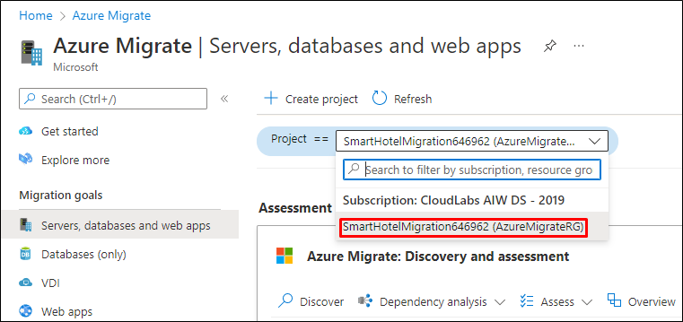

# Module 1: Migrating Windows & SQL Server workloads

Duration: 60 minutes

In this exercise, you will use Azure Migrate: Server Assessment to assess the on-premises environment. This will include selecting Azure Migrate tools, deploying the Azure Migrate appliance into the on-premises environment, creating a migration assessment, and using the Azure Migrate dependency visualization.

### Exercise 1: Discovery, Assess, and Plan: Evaluate your current environment

1. If you are not logged in already, click on Azure portal shortcut that is available on the desktop and log in with below Azure credentials.
    * Azure Username/Email: <inject key="AzureAdUserEmail"></inject> 
    * Azure Password: <inject key="AzureAdUserPassword"></inject>

2. Go to **Start** button in the VM, search for **Hyper-V Manager** there and select it. 

   > You can also open the **Hyper-v manager** by clicking on the icon that is present in the taskbar. 

     

3. In Hyper-V Manager, select **SMARTHOST<inject key="DeploymentID" enableCopy="false" />**. You should now see the AzureMigrateAppliance VM and four VMs that comprise the on-premises SmartHotel application.

     

### Exercise 2: Set up your environment on Azure to migrate servers 

1. Click on **Show Portal Menu (1)** bar and select **All services (2)** in the portal's left navigation.
 
    

2. In the search bar, search for **Azure Migrate** and select it from the suggestions to open the Azure Migrate Overview blade, as shown below. 
 
    

3. From the **Get started** tab, select the **Discover, assess and migrate** button located beneath the **Servers, databases and web apps** heading.

    

4. On the **Servers, databases and web apps** screen, select **Create project**.

    
    
5. On the **Create project** screen, select your subscription and create a new resource group named **AzureMigrateRG**. Enter **SmartHotelMigration** as the Project name, and choose a Geography close to you to store the migration assessment data. Then select **Create**.

    

7. Now, you should see the **Azure Migrate: Discovery and assessment** and **Migration and modernization** panels for the current migration project, as shown below.

    .png)

     - Click on **Project** and select existing project named **SmartHotelMigration<inject key="DeploymentID" enableCopy="false" />** and then choose the project from the list.

        
