# Lab 05: Run workloads anywhere with Azure cloud services.

In this Guided Lab you will use Azure Migrate: Discovery and assessment tool that describes how to onboard on-premises Hyper-V VMs to Azure Arc for Azure Management.

Azure Arc allows you to manage your hybrid IT estate with a single pane of glass by extending the Azure management experience to your on-premises servers that are not ideal candidates for migration. 

### Task 1: Onboard On-prem servers to Azure Arc enabled server

In this exercise, you will deploy and configure the Azure Connected Machine agent on a Windows machine hosted outside of Azure, to ensure that it can be managed through Azure Arc-enabled servers.

1. If you are not logged in already, click on Azure portal shortcut that is available on the desktop and log in with below Azure credentials.
    * Azure Username/Email: <inject key="AzureAdUserEmail"></inject> 
    * Azure Password: <inject key="AzureAdUserPassword"></inject>

1. In the **search resources, services and docs bar**, type **Azure arc** and select it from suggestions, as shown below:
   
    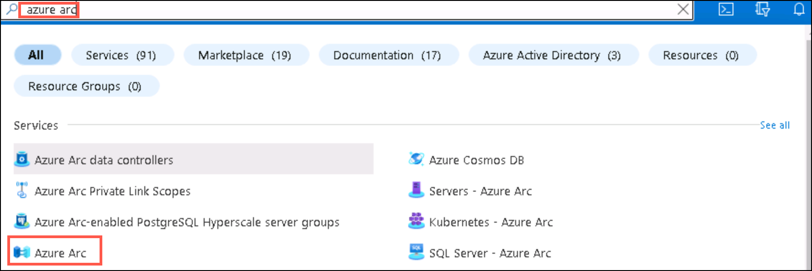
   
1. On the **Azure Arc** page, select **Machines (1)** under **Infrastructure** and then click on **+Add (2)**.
    
    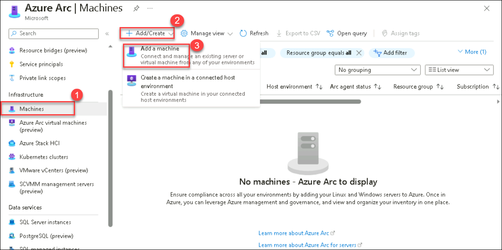
    
1. In the **Add servers with Azure Arc** page, click **Generate script** under **Add a single server**.

    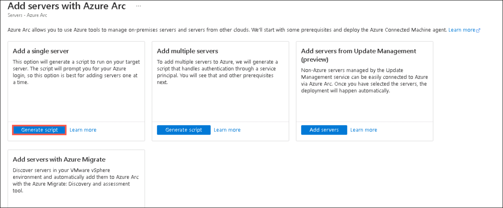
    
1. Under **Basics** tab, fill the following details:
     
   - Subscription: **Select your subscription**
    
   - Resource group: **SmartHotelRG (1)**
  
   - Region: Select **<inject key="Region" enableCopy="false" />**
   
   - Operating system: **Windows (3)**
   
   - Leave other values as default and Click on **Next (4)**

    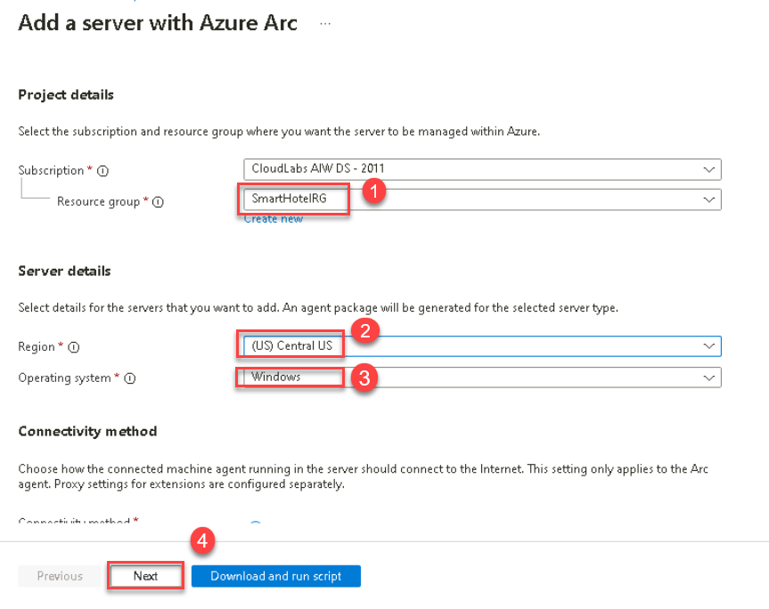

1. Under **Tags** tab, leave the values as default and click on **Next**.

1. Under **Download and run script** tab, **copy (1)** the entire script and paste it in a notepad as it will be used in the further steps and then click on **Close (2)**.

    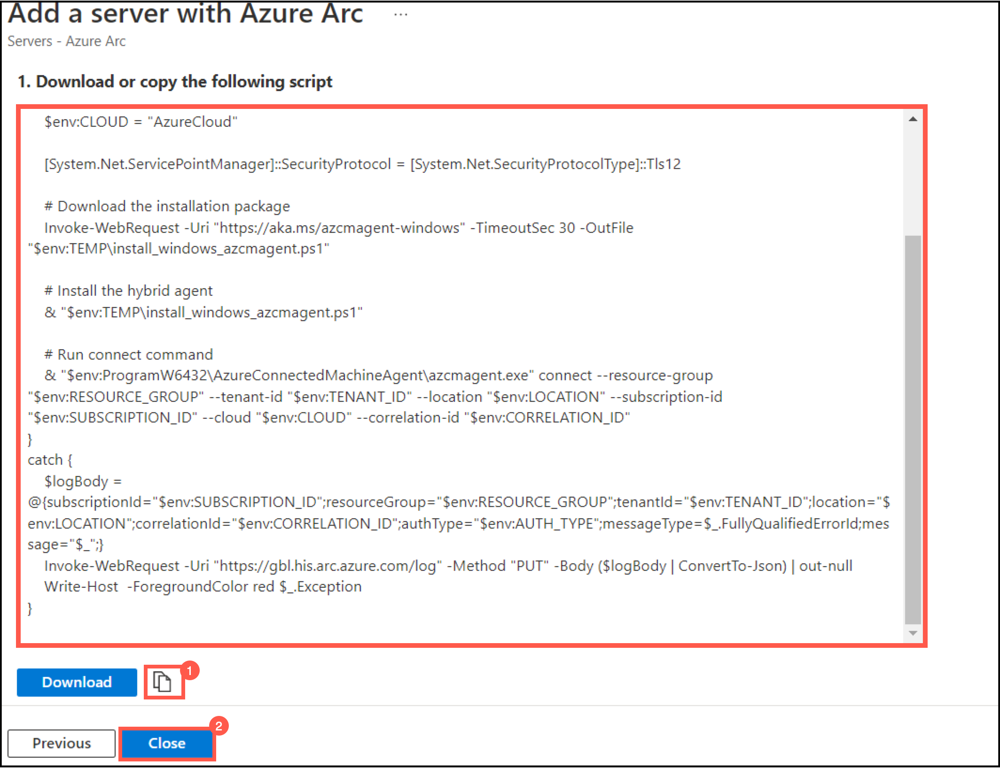
    
1. Go to **Start (1)** button in the VM, search for **Hyper-V Manager (2)** there and select it. 

    

   > **Note:** You can also open the **Hyper-V manager** by clicking on the icon that is present in the taskbar. 
    
1. In Hyper-V Manager, select **HOSTVMS<inject key="DeploymentID" enableCopy="false" />**. 
  
    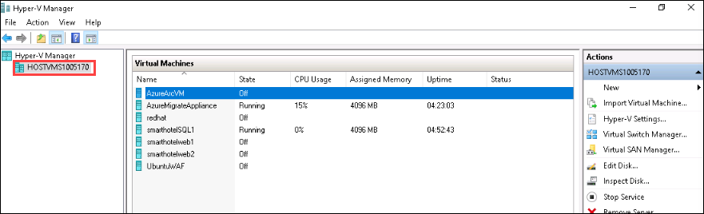
    
1. In Hyper-V Manager, select the **AzureArcVM (1)** VM, then select **Start (2)** on the right if not already running.

    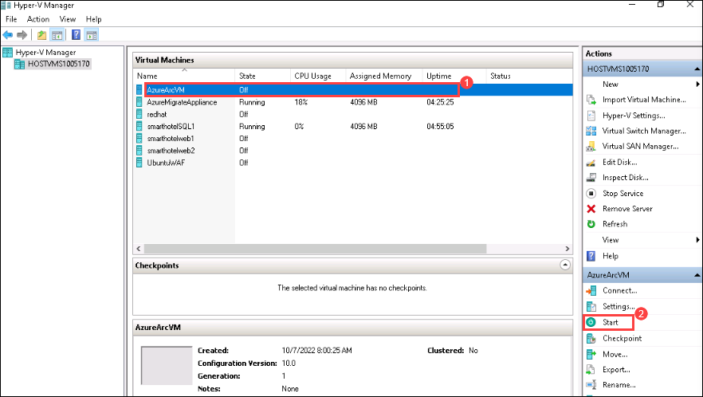    
    
1. In Hyper-V Manager, select the **AzureArcVM (1)** VM, then select **Connect (2)** on the right.

    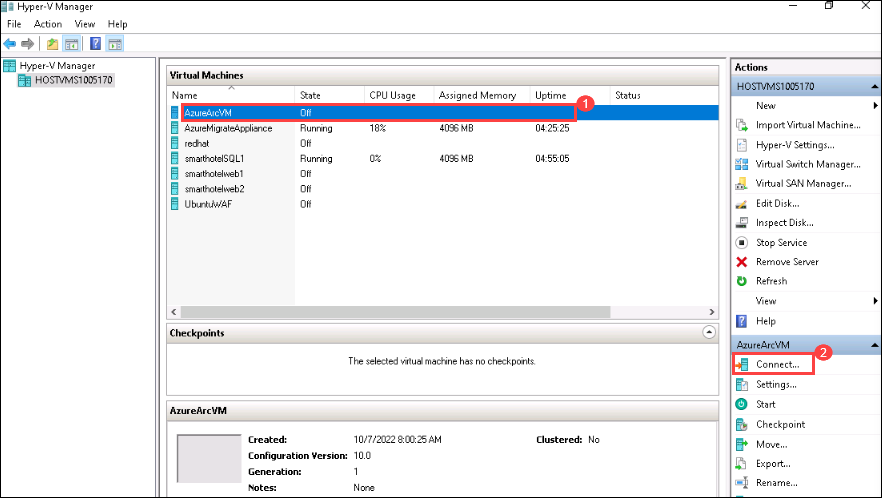  
    
1. Under Connect to AzureArcVM, click on **Connect** and then log into the VM with the **Administrator password**: **<inject key="SmartHotel Admin Password" />** (the login screen may pick up your local keyboard mapping, use the 'eyeball' icon to check).
 
    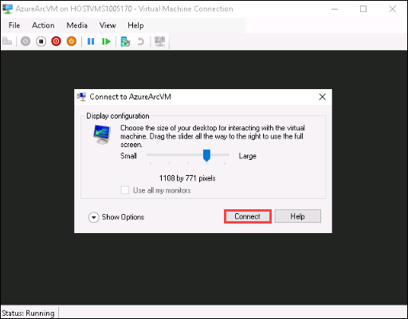
    
1. From the **Start (1)** menu of the AzureArcVM, search for **Windows Powershell (2)** and open it **(3)**.

    
      
1. In powershell, run the whole script that you copied in the notepad earlier in step 8.

1. After running the script, packages will be installed and then you will be directed to a pop-up browser page to login into your azure account for authentication purpose. Use the below Azure credentials:

    * Azure Username/Email: <inject key="AzureAdUserEmail"></inject> 
    * Azure Password: <inject key="AzureAdUserPassword"></inject> 

   > **Note:** Move back to the powershell pane and now you have connected your AzureArcVM to Azure successfully.
    
    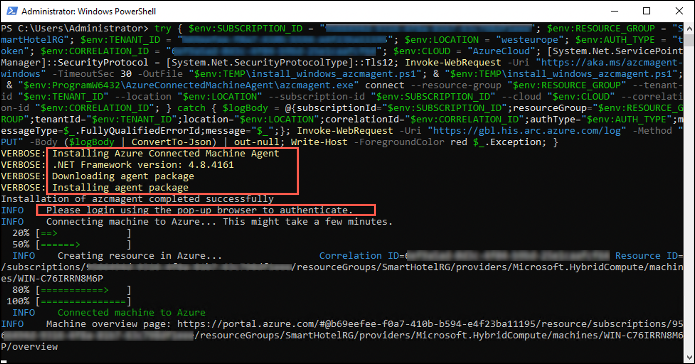
     
 1. Close the AzureArcVM and navigate to Azure portal and go back to the **Azure Arc** page, select **Machines (1)** under **Infrastructure** and now verify that a server is connected successfully **(2)**.

    **Note:** The name of the newly server added could be different. You might have to refresh to see the new server.
    
    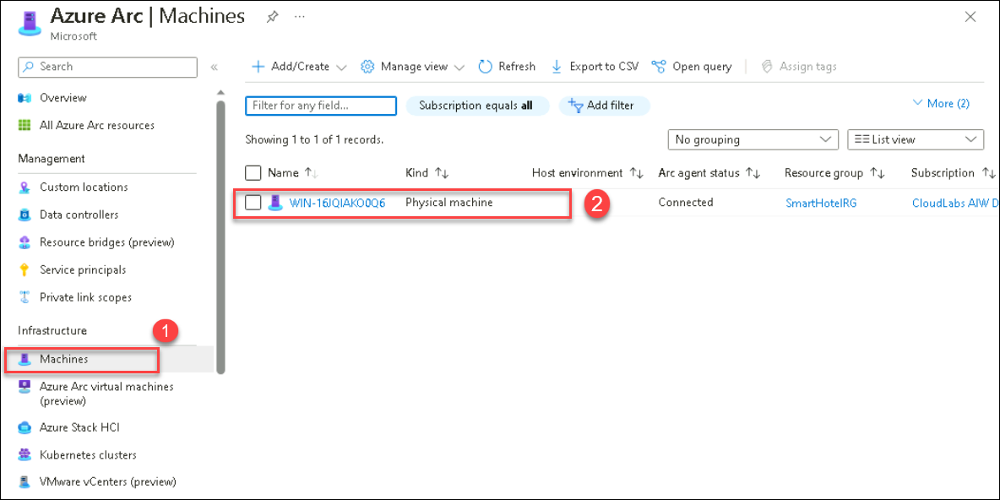
     

     > **Congratulations** on completing the task! Now, it's time to validate it. Here are the steps:
     > - Navigate to the Lab Validation Page, from the upper right corner in the lab guide section.
     > - Hit the Validate button for the corresponding task. If you receive a success message, you can proceed to the next task. 
     > - If not, carefully read the error message and retry the step, following the instructions in the lab guide.
     > - If you need any assistance, please contact us at labs-support@spektrasystems.com. We are available 24/7 to help
    
**Summary:** In this exercise, you explored on how to deploy and configure the Azure Connected Machine agent on a Windows machine hosted outside of Azure. You learnt  about creating Azure Arc-enabled servers so that it can manage the Windows machine.
