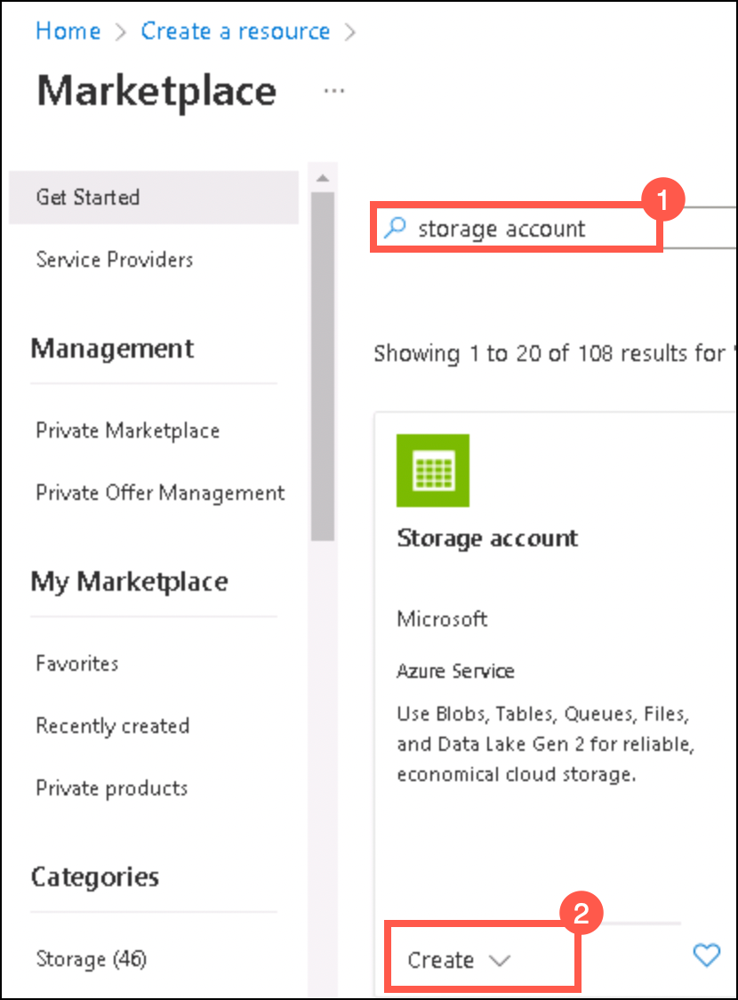
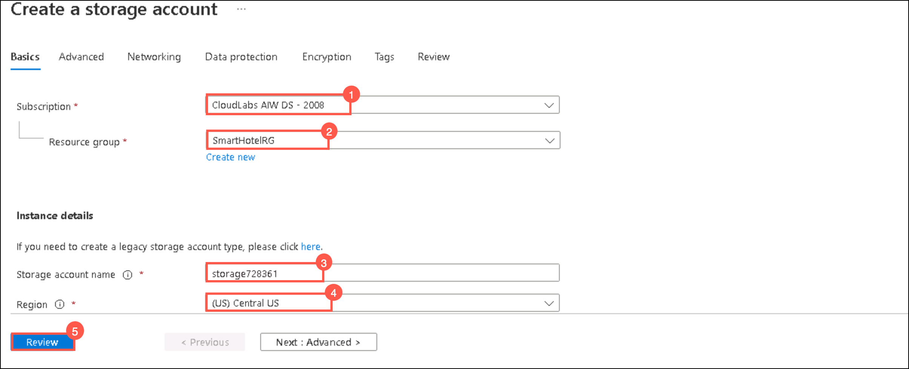
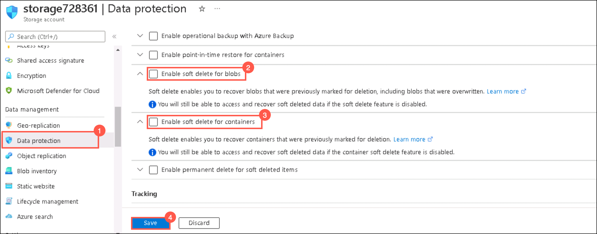
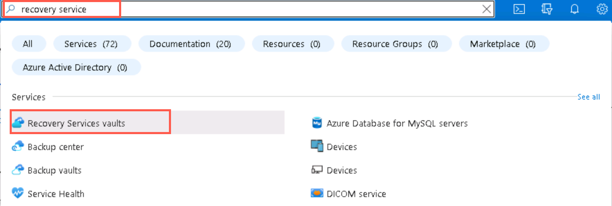

### HOL3: Exercise 2: Configure ASR for on-premises infrastructure

### Task 1: Create a storage account

1. If you are not logged in already, click on Azure portal shortcut that is available on the desktop and log in with below Azure credentials.
    * Azure Username/Email: <inject key="AzureAdUserEmail"></inject> 
    * Azure Password: <inject key="AzureAdUserPassword"></inject>

1. Click on **Show Portal Menu (1)** bar and select **All services (2)** in the portal's left navigation.
 
    
    
1. Click on **+Create a resource** and then search for **storage account** and click **Create**.   
    
    
    
1. Under **Create a storage account** tab, fill the following details and click **Create**:
     
   - Subscription: **Select your subscription (1)**
    
   - Resource group: **SmartHotelRG (2)**
   
   - Storage account name: **storage<inject key="DeploymentID" enableCopy="false" /> (3)**
  
   - Region: **Same as your resource group (4)*
   
   - Leave other values as default and Click **Review (5)**    
    
     
     
1.  Go to the storage account that you created and select **Data Protection (1)** under **Data Management**.

1.  Make sure to uncheck **Enable soft delete for blobs (2)** and **Enable soft delete for containers (3)** and then click **Save (4)**.  

     

### Task 2: Configure ASR to on-premise infrastructure

1. In the **search resources, services and docs bar**, type **Recovery service vaults** and select it from suggestions, as shown below:
   
    
    
1.   
