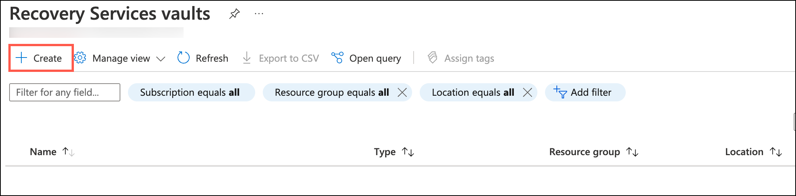
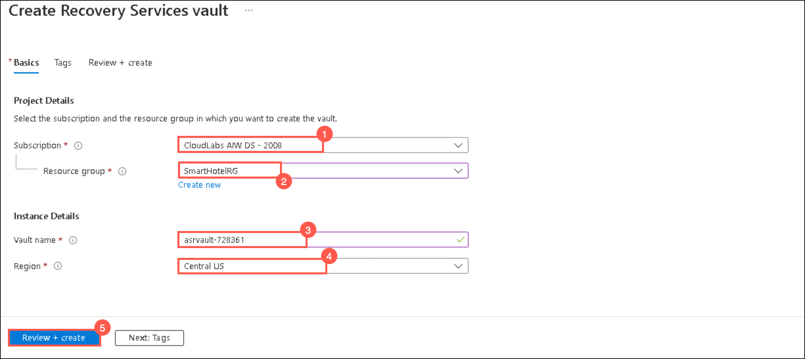
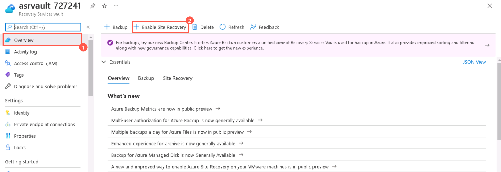
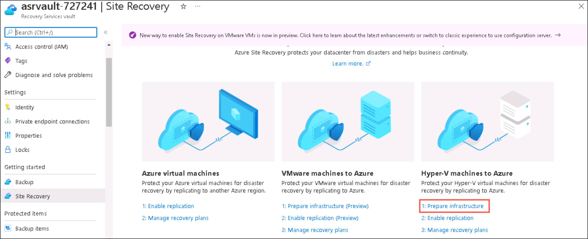
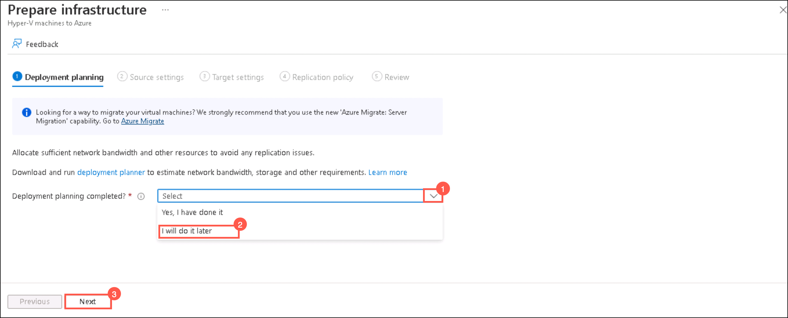
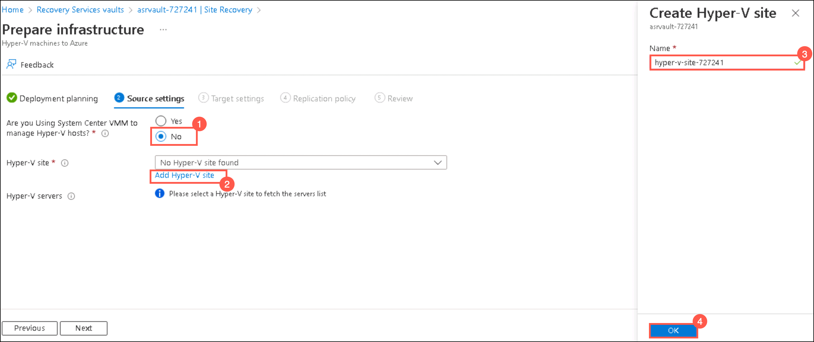
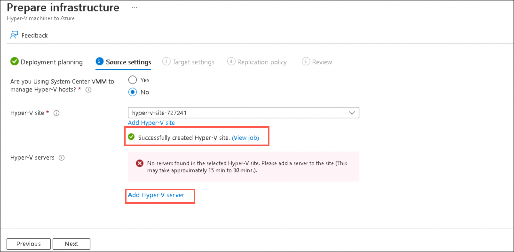
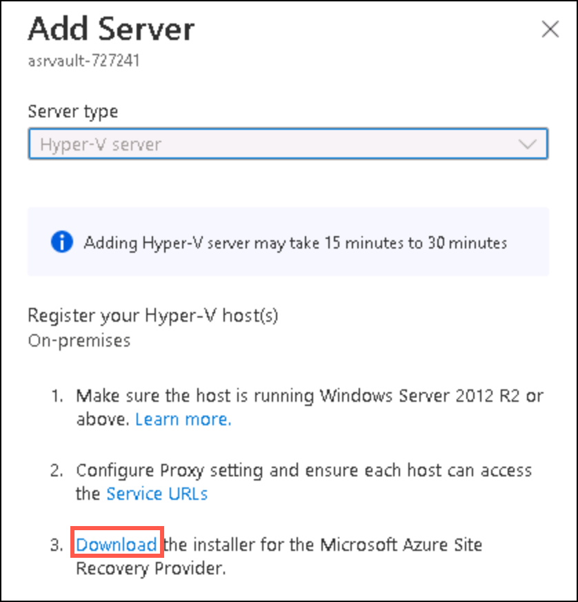
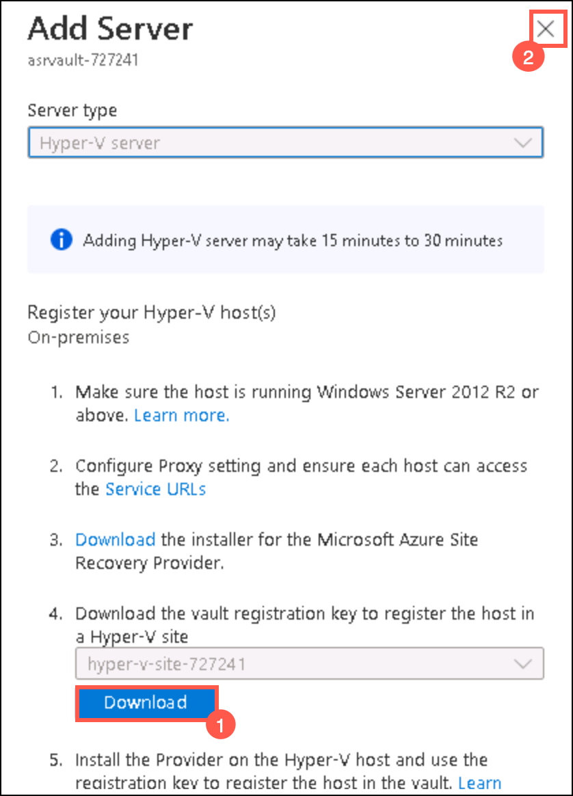
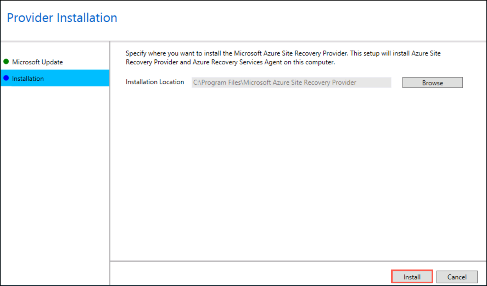

### HOL3: Exercise 2: Configure ASR for on-premises infrastructure

### Task 1: Create a storage account

1. If you are not logged in already, click on Azure portal shortcut that is available on the desktop and log in with below Azure credentials.
    * Azure Username/Email: <inject key="AzureAdUserEmail"></inject> 
    * Azure Password: <inject key="AzureAdUserPassword"></inject>

1. Click on **Show Portal Menu (1)** bar and select **All services (2)** in the portal's left navigation.
 
    
    
1. Click on **+Create a resource** and then search for **storage account** and click **Create**.   
    
    
    
1. Under **Create a storage account** tab, fill the following details and click **Create**:
     
   - Subscription: **Select your subscription (1)**
    
   - Resource group: **SmartHotelRG (2)**
   
   - Storage account name: **storage<inject key="DeploymentID" enableCopy="false" /> (3)**
  
   - Region: **Same as your resource group (4)**
   
   - Leave other values as default and Click **Review (5)**    
    
     
     
1.  Go to the storage account that you created and select **Data Protection (1)** under **Data Management**.

1.  Make sure to uncheck **Enable soft delete for blobs (2)** and **Enable soft delete for containers (3)** and then click **Save (4)**.  

     

### Task 2: Configure ASR to on-premise infrastructure

1. In the **search resources, services and docs bar**, type **Recovery service vaults** and select it from suggestions, as shown below:
   
    
    
1. Under Recovery service vaults, click **+Create**.  

    
    
1. Under **Basics tab** of create a recovery service vault, fill the following details and ckick **Create**: 

   - Subscription: **Select your subscription (1)**
    
   - Resource group: **SmartHotelRG (2)**
   
   - Vault name: **asrvault-<inject key="DeploymentID" enableCopy="false" /> (3)**
  
   - Region: **Same as your resource group (4)**
   
   - Leave other values as default and Click **Review+Create (5)**  
  
    
    
1. On the **Overview page** of recovery service vault that you created, select **+Enable Site Recovery**.

       
    
1. Under Site Recovery page, select **Prepare Infrastructure** under **Hyper-V machines to Azure**.
    
      

1. Under **Deployment planning** tab, for Deployment planning completed?: select **I will do it later** from the drop down arrow list.
  
      
    
1. Under **Source settings** tab, fill the following details:   
   
   - Are you using system Centre VMM to manage Hyper-V hosts?: **No (1)**
   
   - In Hyper-V site, click **Add Hyper-V site (2)** and then under Create Hyper-V site, enter **Hyper-v-site-<inject key="DeploymentID" enableCopy="false" /> (3)** as name and click **Ok (4)**.

      
 
1. After successfully adding the Hyper–V site, click **Add Hyper-V servers**. 

     
   
1. Under Add Server page, Click on the **Download** the installer for the Microsoft Azure Site Recovery provider.  
    
   
 
1. Under Add Server page, select the **blue Download button (1)** and download the registration key file and then close the **Add server** panel using **X (2)** button.

    
    
1. Open the **AzureSiteRecoveryProvider.exe** installer you downloaded a moment ago. On the **Microsoft Update** tab, select **Off** and select **Next**. Accept the default installation location and select **Install**.

    
   
1. When the installation has completed select **Register**. Browse to the location of the key file you downloaded. When the key is loaded select **Next**.

   
   
1. Select **Connect directly to Azure Site Recovery without a proxy server** and select **Next**. The registration of the Hyper-V host with Azure Site Recovery will begin.

   
   
1. Wait for registration to complete (this may take several minutes). Then select **Finish**.

   

1. Return to your Recovery service vault overview page in the Azure Portal, and select **Site Recovery Infrastructure** under **Manage** on the left side of the panel.

   

   
   
 
