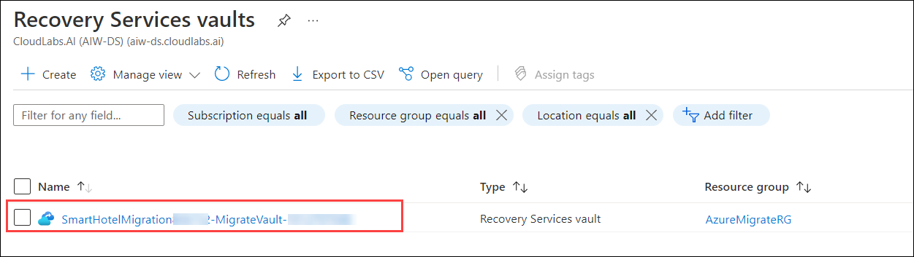
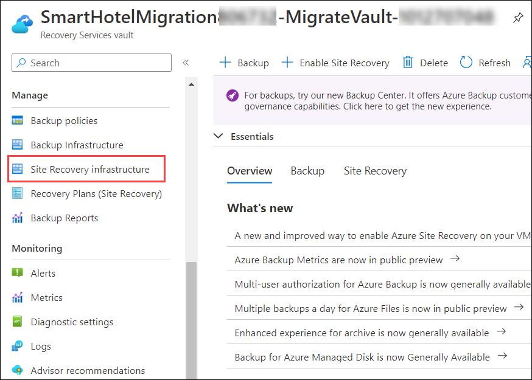
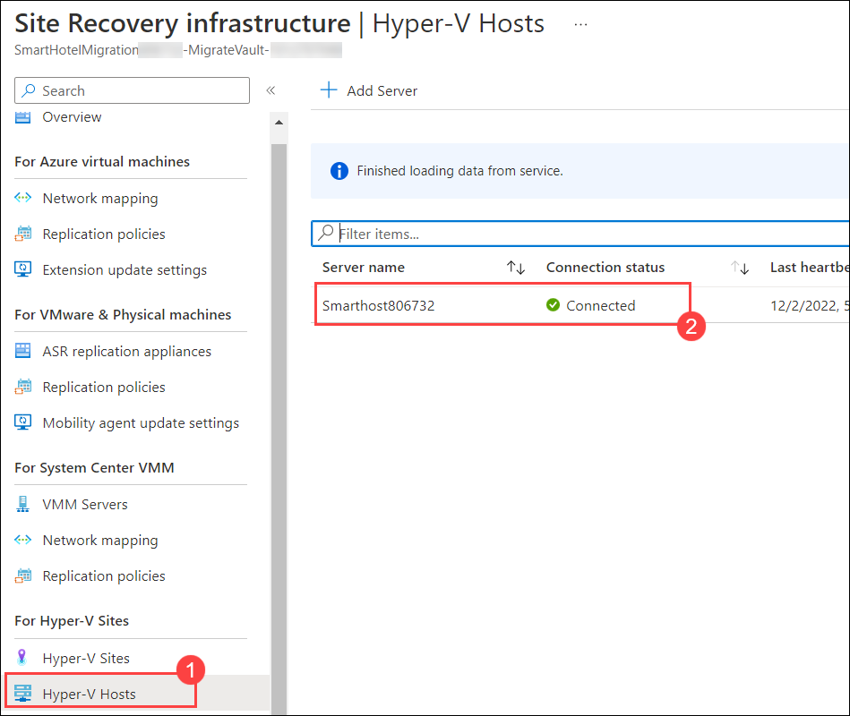
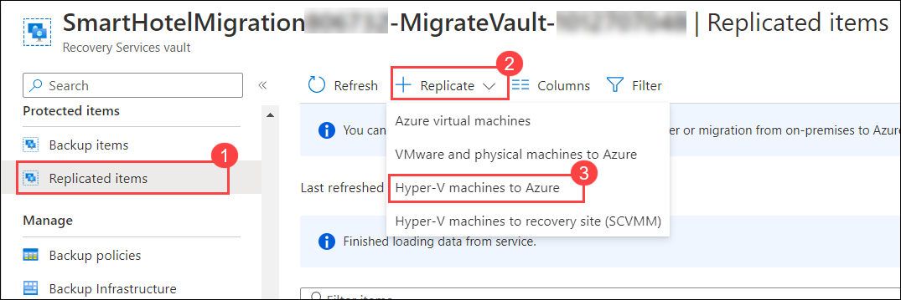
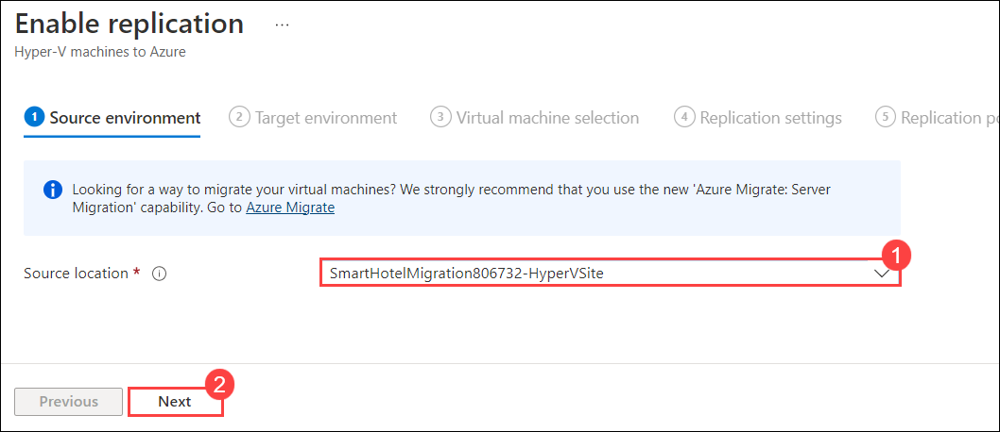
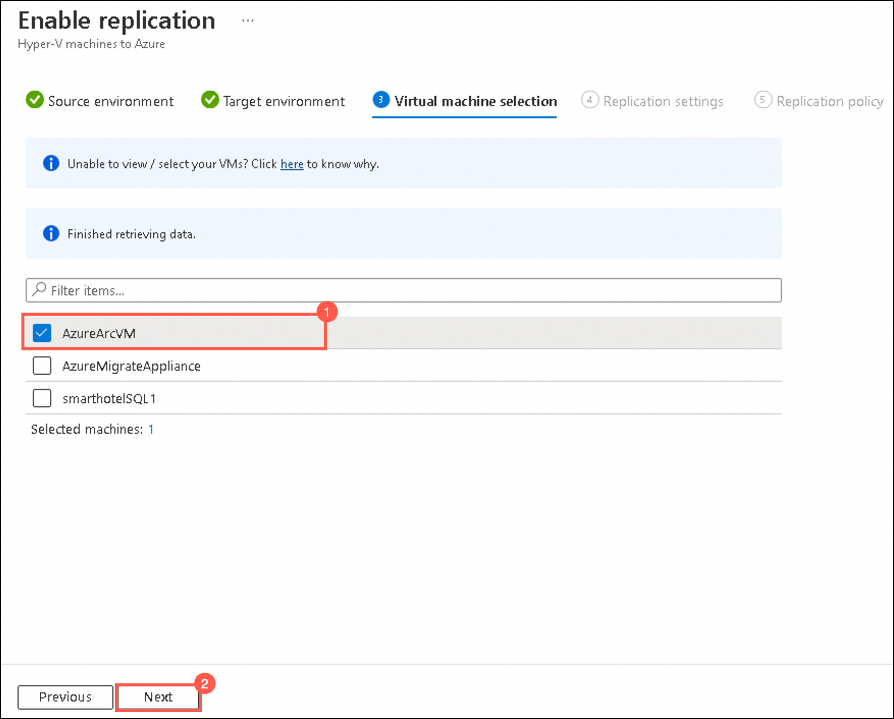
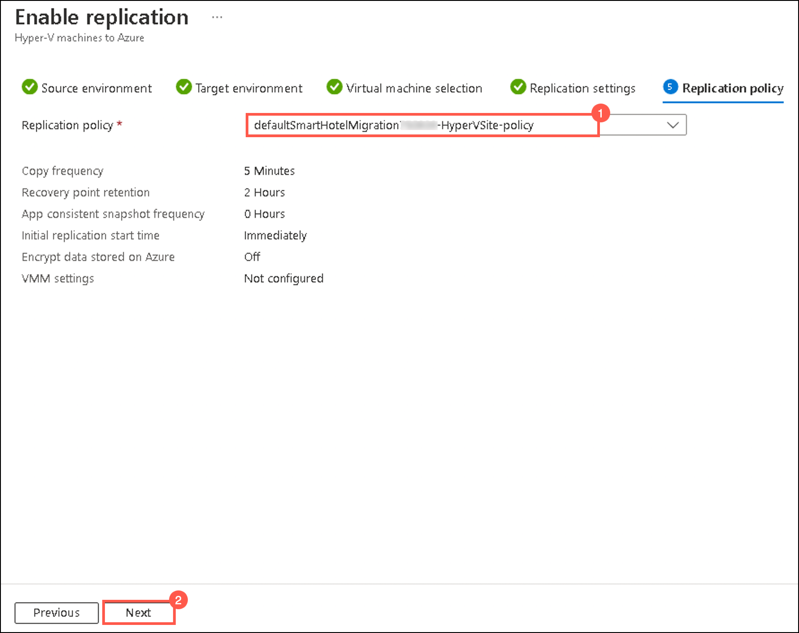
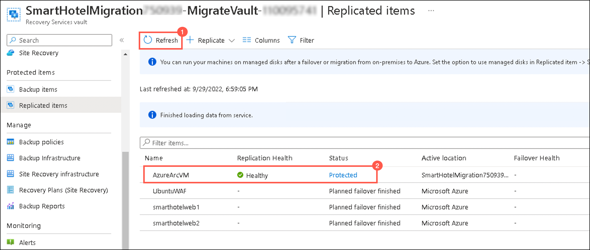

## HOL3: Exercise 2: Configure ASR for on-premises infrastructure

In this exercise, you will deploy disaster recovery of on-premises Hyper-V VM to Azure. The Azure Site Recovery service contributes to your disaster-recovery strategy by managing and orchestrating replication, failover, and failback of on-premises machines. As part of the registration process, you will deploy the Azure Site Recovery Provider on your Hyper-V host.

### Task 1: Configure ASR to on-premises infrastructure

1. In the **search resources, services and docs bar**, type **Recovery services vaults** and select it from suggestions, as shown below:
   
    
    
1. Under Recovery services vaults, click on **SmartHotelMigration<inject key="DeploymentID" enableCopy="false" />-MigrateVault-_xxxx_** which we have configured in the previous HOL1 task.  

    

1. Select **Site Recovery Infrastructure** under **Manage** on the left side of the panel.

    

1. Under Site Recovery Infrastructure page, select **Hyper-V hosts (1)** and then make sure that the status of the server is **Connected (2)**.

      

1. Go back to your **Recovery service vault page**, click on **Replicated Items (1)** under **Protected Items** and then click on **+Replicate (2)** and select **Hyper-V machines to Azure (3)** from the drop-down list.

     
   
1. Under **Source environment** tab, select the **SmartHotelMigration<inject key="DeploymentID" enableCopy="false" />-HyperVSite (1)**  and then click on **Next (2)**.
 
     
   
1. Under **Target environment** tab, fill the following details:

   - Post-failover resource group: **SmartHotelRG (1)**
   
   - Storage account: **select the one available in the drop-down list (2)**  
   
   - Virtual network: **SmartHotelVNet (3)**

   - Subnet: **SmartHotel (4)**
   
   - Leave other values as default and click on **Next (5)**
   
        
    
1. Under **Virtual machine selection** tab, **check for AzureArcVM (1)** and click on **Next (2)**.

    

1. Under **Replication settings** tab, select **Windows (1)** as OS type for AzureArcVM and then click on **Next (2)**.

    
     
1. Under **Replication policy** tab, select **defaultSmartHotelMigration<inject key="DeploymentID" enableCopy="false" />-HyperVSite-policy (1)** from the drop-down and click on **Next (2)**.  

    
   
1. Under **Review** tab, click on **Enable Replication**.

1. The process of replication might take 15-20 minutes to get completed. Once the Replication is successfully completed, the status of the replicated AzureArcVM will now become **Protected (2)**.

   > **Note:** You might have to refresh **(1)** a couple of times.

    
   
**Summary:** In this exercise, you explored on how to set up Azure and on-premises prerequisites and create a Recovery Services vault for Site Recovery. Then you see how to set up the source and target replication environments and create a replication policy so that at the end you can enable replication for a server.

