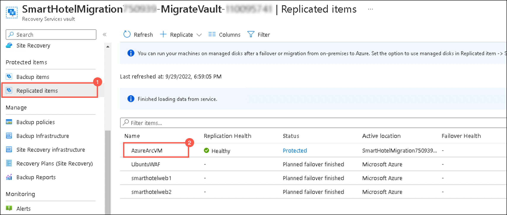
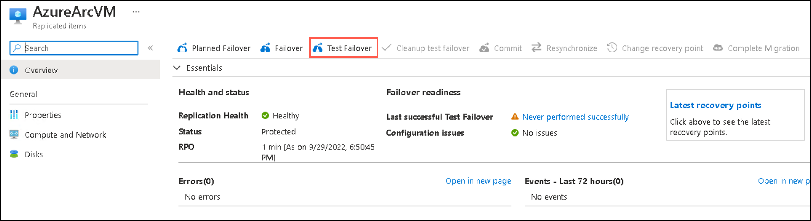
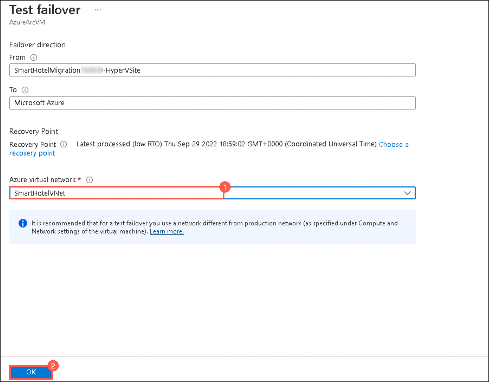
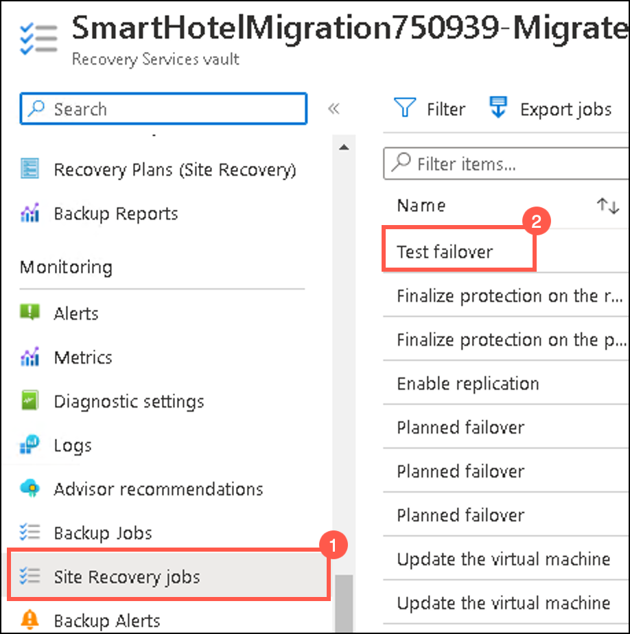
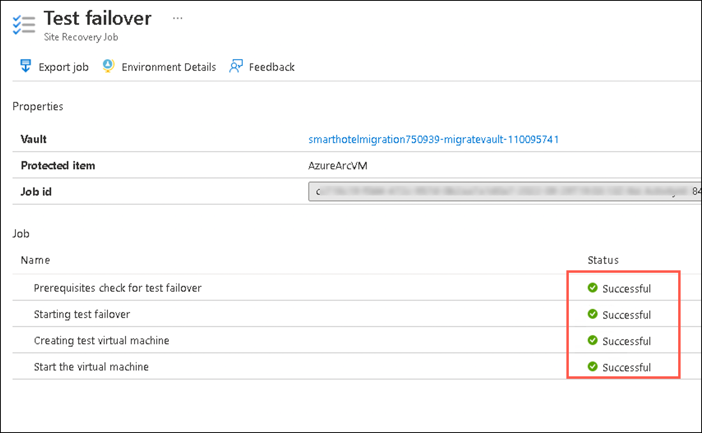
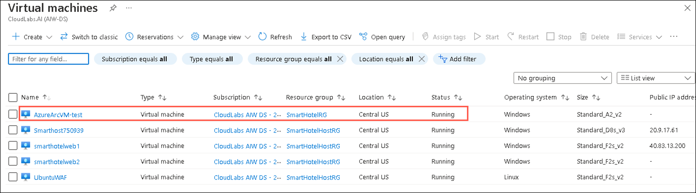
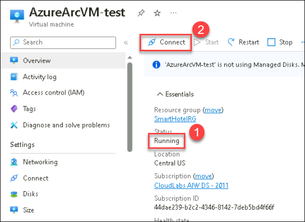

## HOL3: Exercise 3: Setup test failover

### Estimated time: 15 minutes

In this exercise, you will deploy a Test Failover to the replicated Virtual Machine which allows you to test the sanity of the virtualized workload without interrupting your production workload or ongoing replication.

## Lab objectives

In this exercise, you will complete the following task:

- Task 1: Setup test failover

### Task 1: Setup test failover

1. On the **Recovery Service Vault page**, click on **Replicated Items (1)** under **Protected Items** and select **AzureArcVM (2)** that you replicated in the previous exercise.     
     
   
1. On the **AzureArcVM** page, click on **Test Failover**.  

     
   
1. On the **Test failover page**, select the Azure virtual network: **SmartHotelVNet (1)** and click on **Ok (2)**.

     
    
1. Go back to the Replicated items page and select **Site Recovery Jobs (1)** under **Monitoring** from the left-hand side panel and click on **Test Failover (2)** to view the job status. 

     

1. Wait for 10-15 minutes, for the job status of the test failover to get completed successfully.

     
  
1. In the **search resources, services and docs bar**, type **Virtual Machines** and select it from suggestions.

1. Under **Virtual Machines** page, select the **AzureArcVM-test** which is automatically created after test failover.

     
  
1. On the **AzureArcVM-test page**, verify that the status of the VM is in **Running state (1)** and click on **Connect (2).** Then select the **Native RDP** option and connect to the VM through RDP.    

     
    
   > **Note:** Please make sure you run the **validation steps** for this task before moving to the next exercise as there are few dependencies. **Not** running the validation after performing this task will result in **validation failure** as the status of the Virtual Machine will be changed from **Protected** to **Failover completed** as you will be performing cleanup test failover to set up the failover in the next exercise.

### Summary 

In this exercise, you learnt how to validate the replication and disaster recovery strategy by testing a failover, that too without any data loss or downtime.

Click on **Next** from the lower right corner to move on to the next page.
