## HOL3: Exercise 4: Failover the infrastructure to Azure Cloud

In this exercise, you will deploy the Failover from on-premises to Azure. After setting up replication to Azure for on-premises machines, when your on-premises site goes down, you fail those machines over to Azure. After failover, Azure VMs are created from replicated data.

1. In the **search resources, services and docs bar**, type **Recovery service vaults** and select it from suggestions, as shown below:
   
   
    
1. Under Recovery service vaults, click on **SmartHotelMigration<inject key="DeploymentID" enableCopy="false" />-MigrateVault-_xxxx_**.  

    
    
1. On the **Recovery Service Vault page**, click on **Replicated Items (1)** under **Protected Items** and select **AzureArcVM (2)**.     

    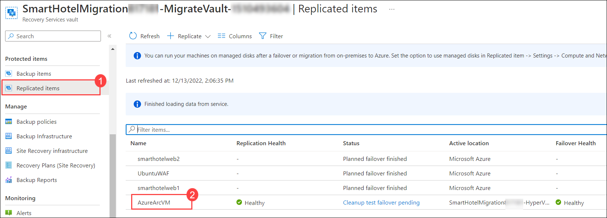 
    
1. On the **AzureArcVM** page, click on **Cleanup test Failover**.   

   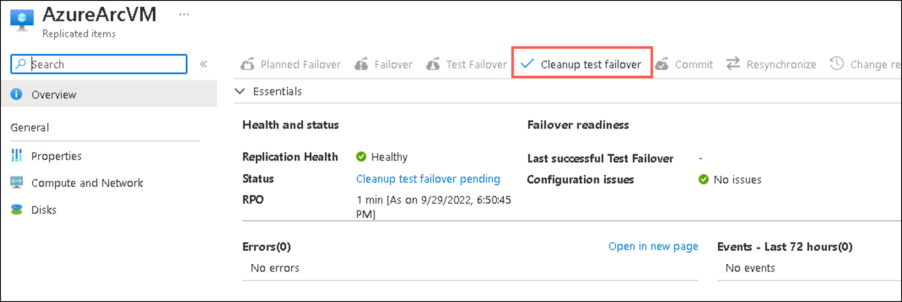 
   
1. On the Test failover cleanup page, enter `Test failover ok.` under **Notes (1)** and make sure to **(2) check the box: Testing is complete. Delete test failover virtual machine(s)** and then click on **OK (3)**.

   > **Note:** Wait for the cleanup test failover to get completed successfully.
   
   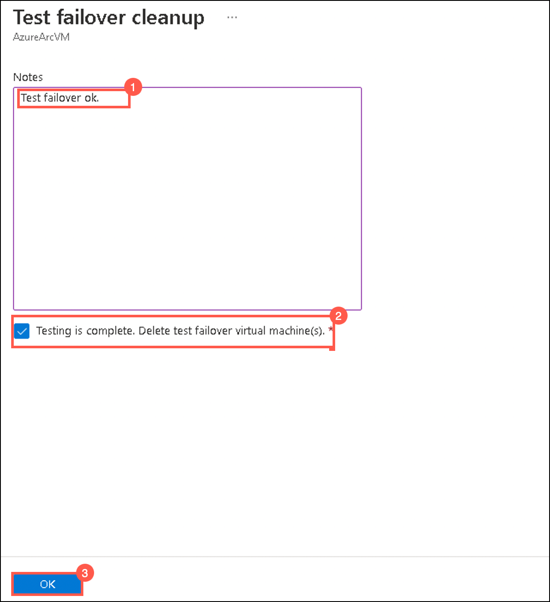 
   
1. On the **AzureArcVM** page, click on **Failover**.

   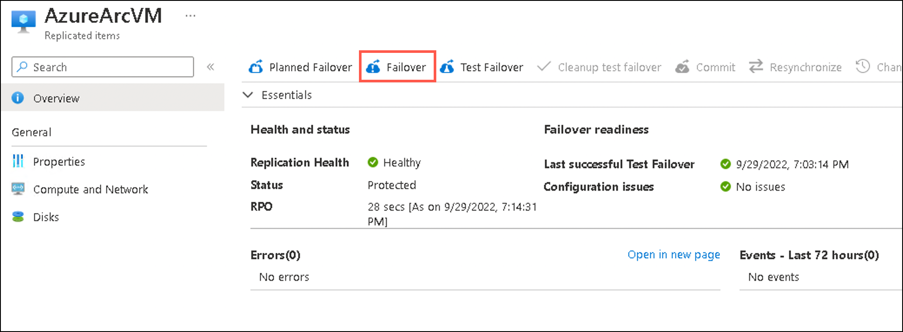 
   
1. On the **Failover** page, review the settings and click on **Ok**.  

   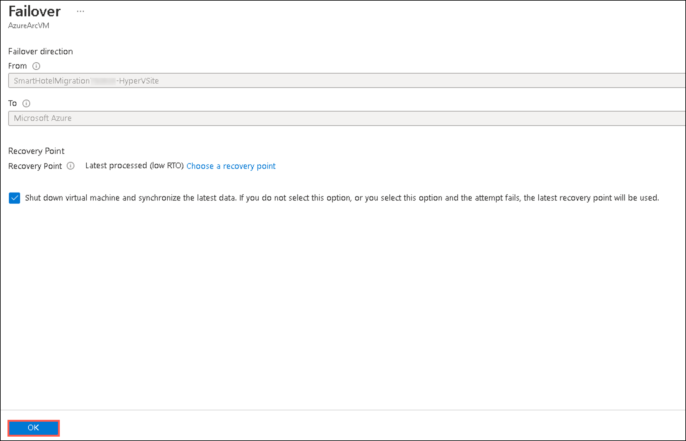 
   
1. Go back to the Replicated items page and select **Site Recovery Jobs (1)** under **Monitoring** from the left-hand side panel and click on **Failover (2)** to view the job status.      

   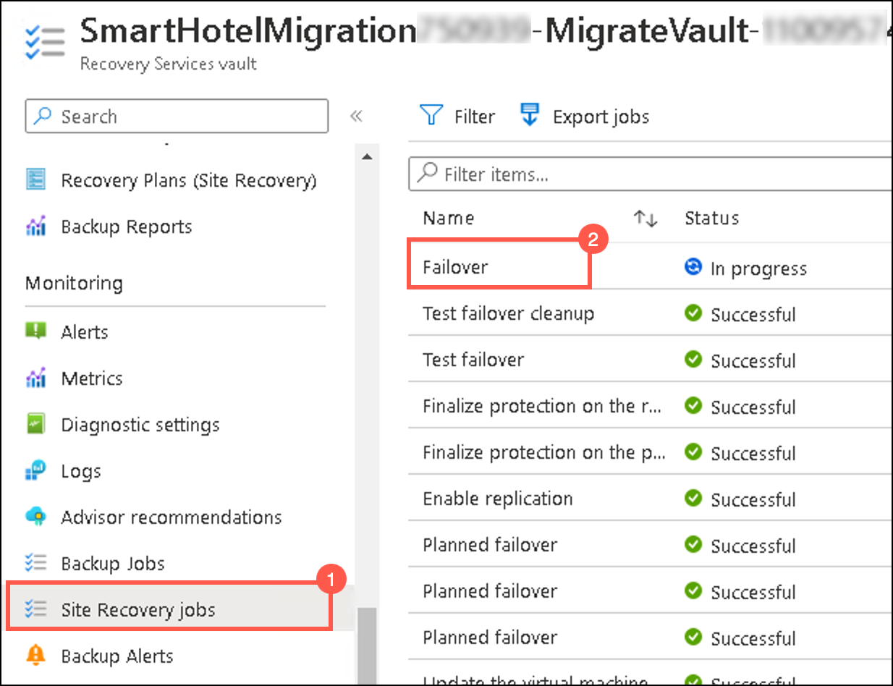 
   
1. Wait for 10-15 minutes, for the job status of the failover to get completed successfully.

    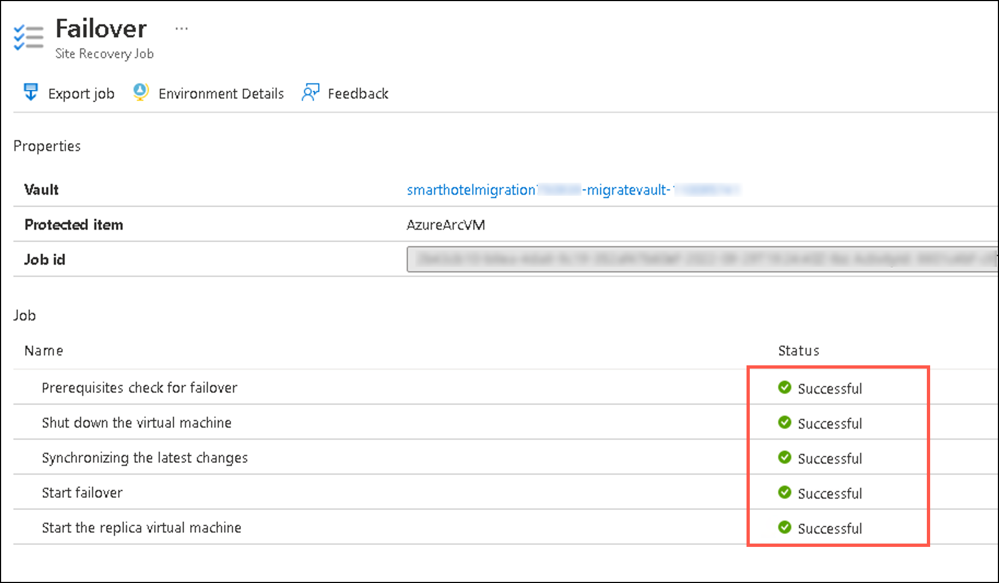    
   
1. After the Failover is completed successfully, move back to the Replicated items page and verify that the **active location** of the **replicated AzureArcVM** is now changed to **Microsoft Azure**.

   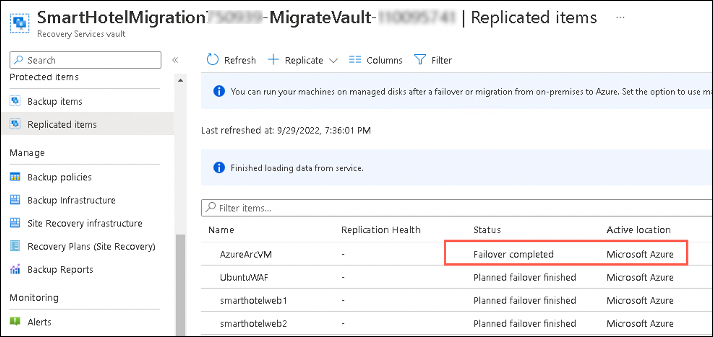  
   
   > **Note:** If you want to switch to a different recovery point to use for the failover, use **Change recovery point**.   
  
   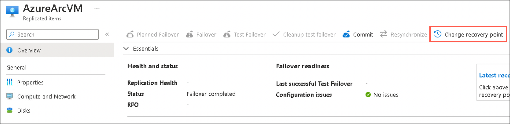 
   
1. On the **replicated AzureArcVM** page, click on **Commit** to commit the failover (The Commit action deletes all the recovery points available with the service). 

   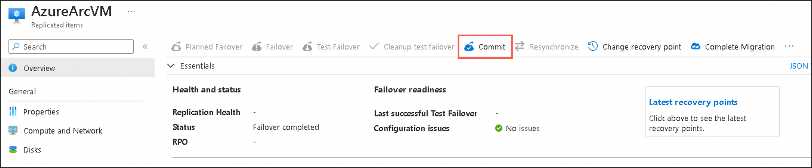
   
1. On the **Commit** page, click on **Ok**.   

   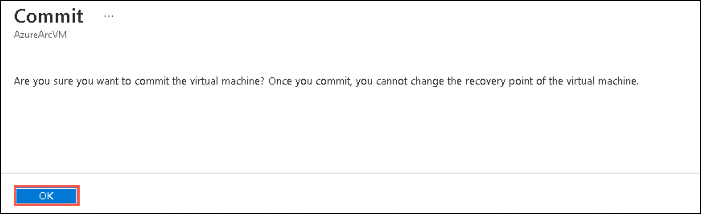 
   
1. After the Failover is **committed successfully**, go to the **search resources, services and docs bar**, type **Virtual Machines** and select it from suggestions.   

1. Under **Virtual Machines** page, select the **AzureArcVM** which is automatically created from replicated data after a Failover.

    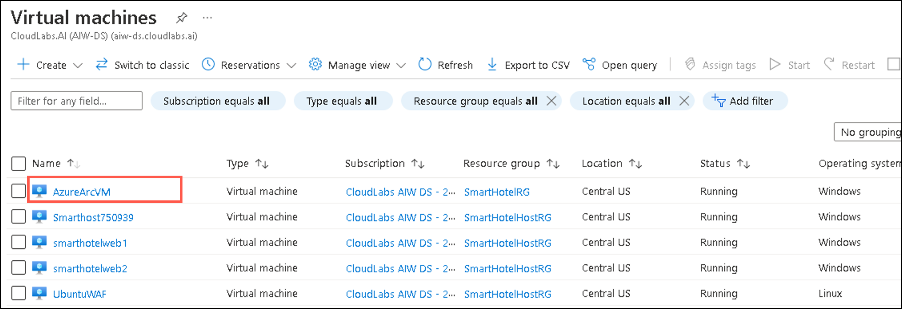 
   
1. On the **AzureArcVM** page, verify that the status of the VM is in **Running state**. 

    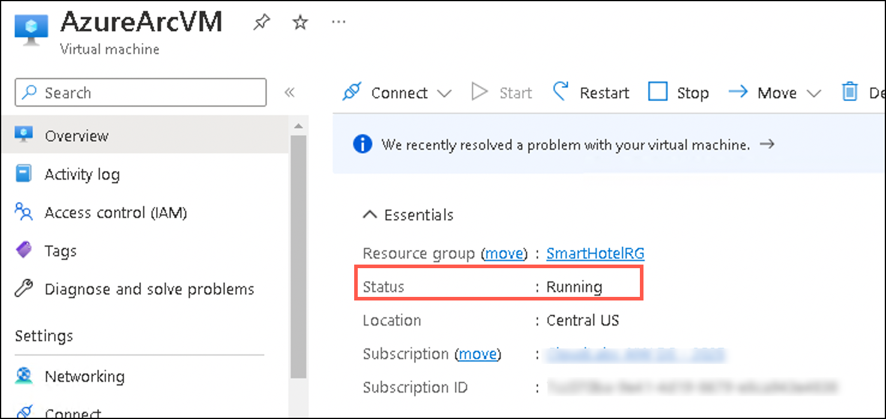  

     > **Congratulations** on completing the task! Now, it's time to validate it. Here are the steps:
     > - Navigate to the Lab Validation Page, from the upper right corner in the lab guide section.
     > - Hit the Validate button for the corresponding task. If you receive a success message, you can proceed to the next task. 
     > - If not, carefully read the error message and retry the step, following the instructions in the lab guide.
     > - If you need any assistance, please contact us at labs-support@spektrasystems.com. We are available 24/7 to help

**Summary:** In this exercise, you explored how to fail over on-premises physical servers that are replicating to Azure with Azure Site Recovery. After you've failed over, you fail back from Azure to your on-premises site when it's available.
