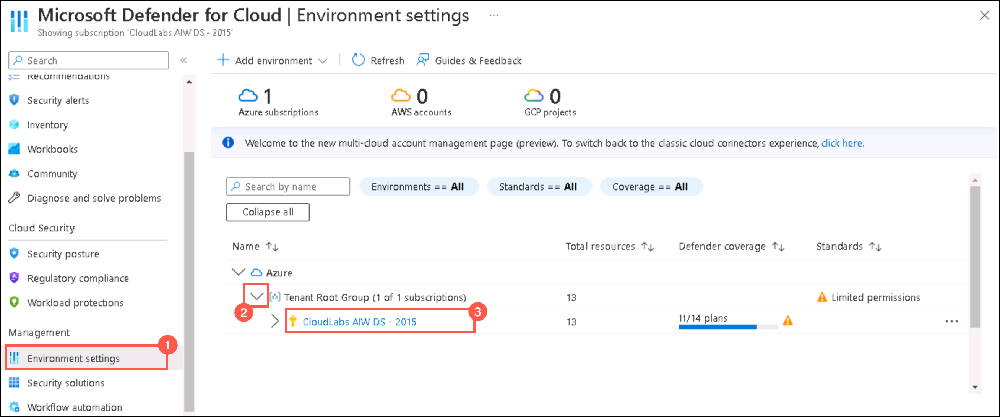
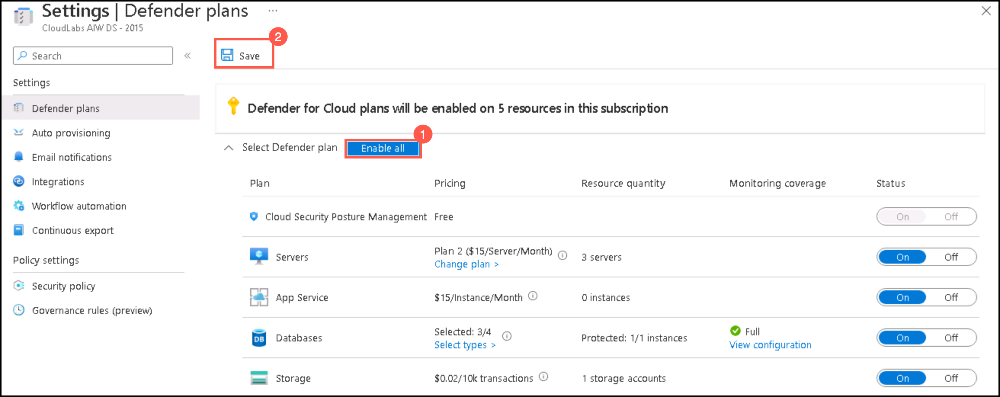
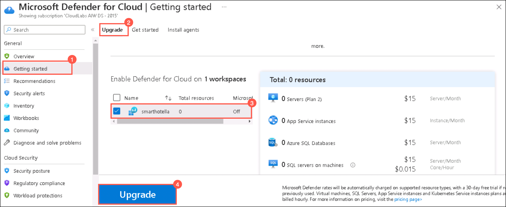
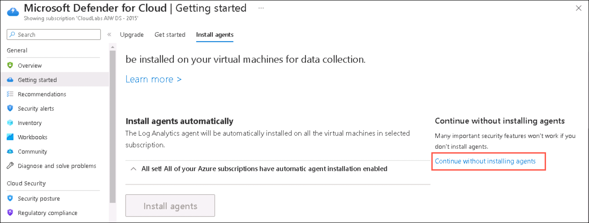
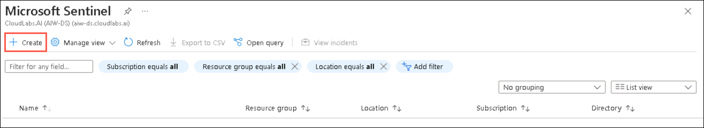
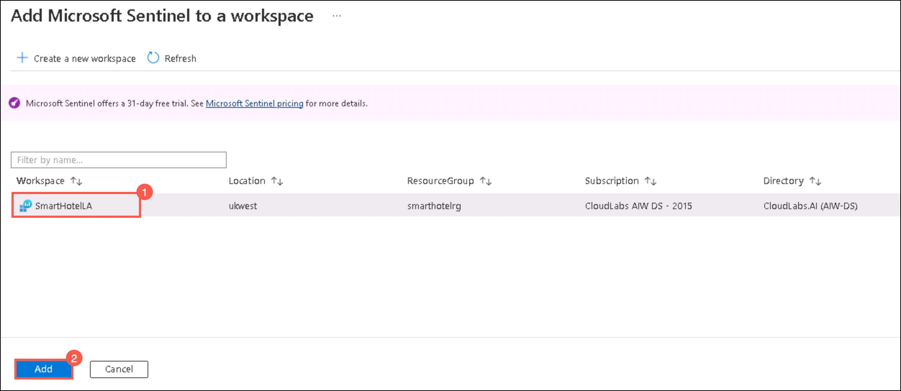

### HOL3: Exercise 5: Enable Microsoft Defender for Cloud, Microsoft Sentinel, and Azure Monitor, and setup Log analytics for each source.

### Task 1:Enable Microsoft Defender for Cloud

1. If you are not logged in already, click on Azure portal shortcut that is available on the desktop and log in with below Azure credentials.
    * Azure Username/Email: <inject key="AzureAdUserEmail"></inject> 
    * Azure Password: <inject key="AzureAdUserPassword"></inject>

1. In the **search resources, services and docs bar**, type **Microsoft Defender for Cloud** and select it from suggestions, as shown below:

    
    
1. On the **Microsoft Defender for Cloud** page, click on **Environment settings (1)** and click the **down arrow (2)** of the Tenant Root Group and click on **your subscription (3)**.

     
     
1. On the **Defender plans** page, click **Enable all button (1)** and then click on **Save (2)**.    

    
    
 > **Note:** It might take upto 24 hours for all the changes to get reflected in your subscription successfully.

1. Go back to the **Getting started (1)** page Microsoft Defender for Cloud, under the **Upgrade (2)** tab select **SmartHotelLA (3)** workspace and click on **Upgrade (4)**.

    

1. On the **Install Agents** tab, click **Continue without Installing Agents**.

    

### Task 2: Enable Microsoft Sentinel

1. In the **search resources, services and docs bar**, type **Microsoft Sentinel** and select it from suggestions, as shown below:

    
    
1. On the **Microsoft Sentinel** page, click on **+Create**.    

    
    
1. On the **Add Microsoft Sentinel to a Workspace** page, select the **SmartHotelLA** workspace and click **Add**.    

    
    
1.   

    
    
