## HOL3: Exercise 5: Enable Microsoft Defender for Cloud, Microsoft Sentinel, and Azure Monitor, and setup Log analytics for each source

In this HOL, you will learn how to enable the enhanced security features by enabling the Defender for Cloud plans through the Azure portal. The Defender plans show you the monitoring coverage for each Defender plan. You will be enabling the same for Microsoft Sentinel and Azure Monitor. Also, you will setup Log Analytics workspace to collect logs and data of the resources and it's information will be stored in a workspace.

> **Note:** 
> - Microsoft Defender for Cloud, Azure Sentinel and Monitor Insights can take several hours to surface post the completion of a scan.
> - At this point of the workshop, only a limited number of data visualizations may be populated. (So the result in the screenshots below may vary)
> - The screenshots and information below, has been provided so that you can conceptualise the type of graphs and output that can be gleaned from a fully populated environment.

### Task 1: Enable Microsoft Defender for Cloud

1. If you are not logged in already, click on Azure portal shortcut that is available on the desktop and log in with below Azure credentials.
    * Azure Username/Email: <inject key="AzureAdUserEmail"></inject> 
    * Azure Password: <inject key="AzureAdUserPassword"></inject>

1. In the **search resources, services and docs bar**, type **Microsoft Defender for Cloud** and select it from suggestions, as shown below:

    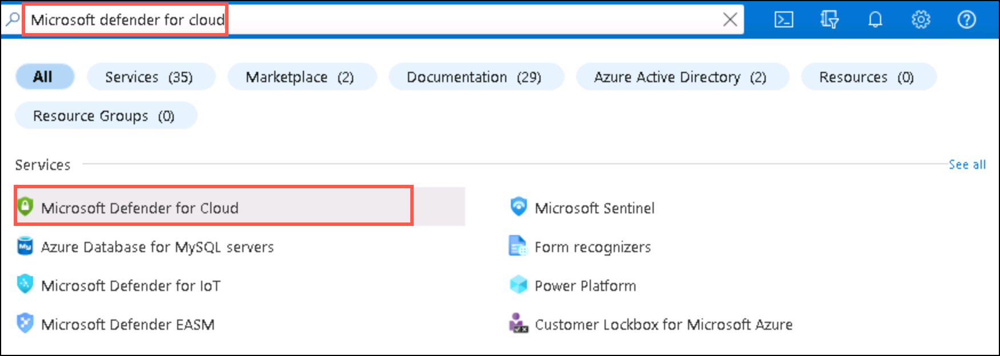
    
    > **Note:** If you are prompted with new upgrade pop-up, click on Skip.
    
1. On the **Microsoft Defender for Cloud** page, click on **Environment settings (1)** and click on the **down arrow (2)** of your subscription name and click on **AzureMigrateWS<inject key="DeploymentID" enableCopy="false" /> (3)**.

    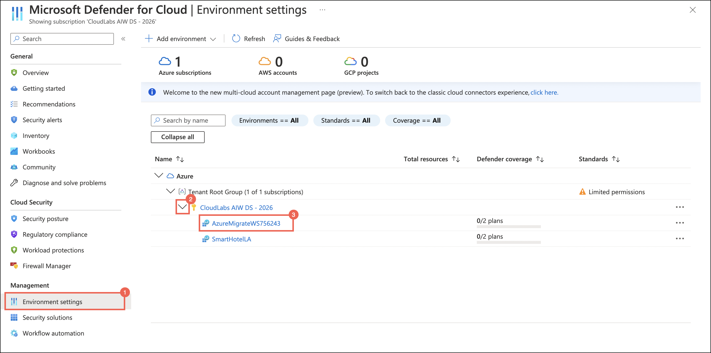 
     
1. On the **Defender plans** page, switch the plan blade **On for Servers (1)** and then click on **Save (2)**.    

    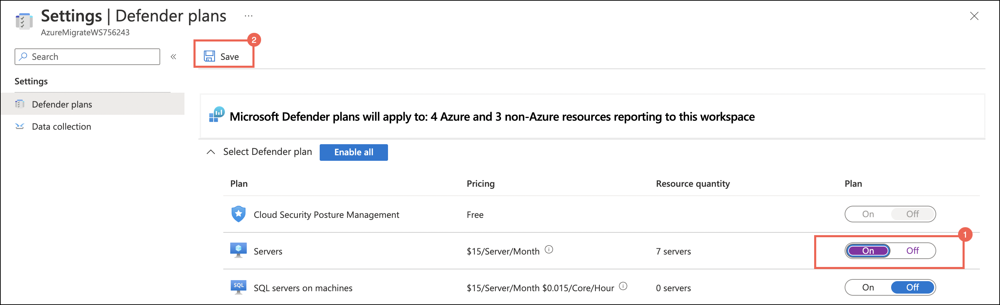
    
1. Go back to the **Getting started (1)** page Microsoft Defender for Cloud, under the **Upgrade tab (2)** select **AzureMigrateWS<inject key="DeploymentID" enableCopy="false" /> (3)** workspace and click on **Upgrade (4)**.

    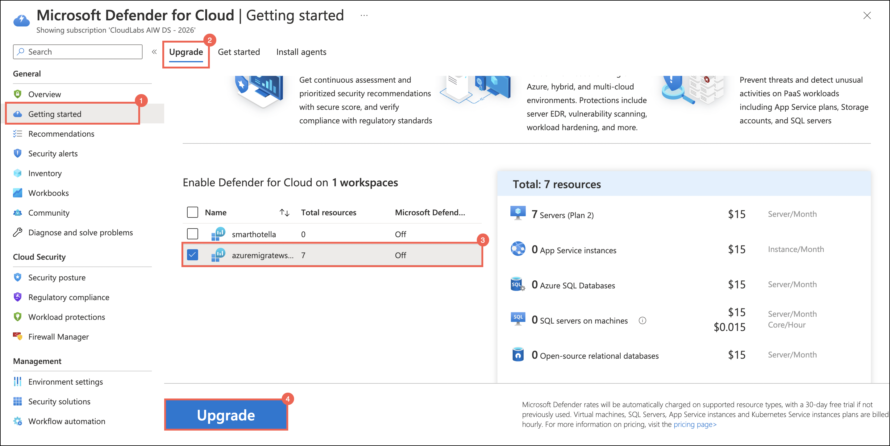

1. On the **Install Agents** tab, click on **Continue without Installing Agents**.

    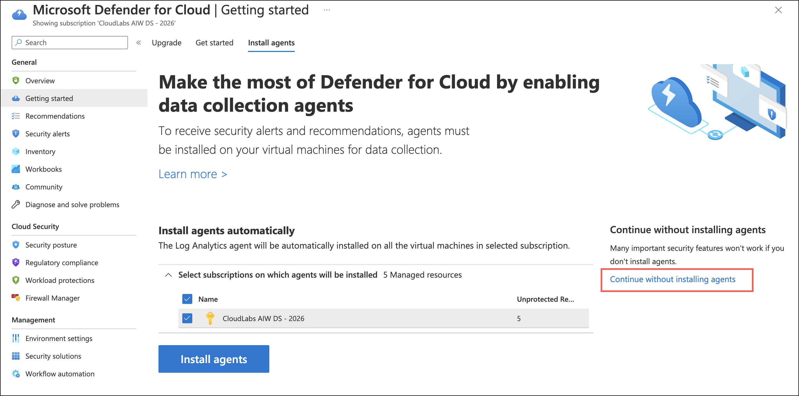
    
     > **Note:** It might take up to 24-48 hours for all the changes to get reflected in your subscription successfully.
   

1. The **Microsoft Defender for Cloud Overview page** offers a consolidated perspective for security experts. This section combines various independent cloud security components, such as **Secure Score, Regulatory Compliance, and Workloads Protection**, and provides detailed insights on the security posture on a distinct dashboard.

    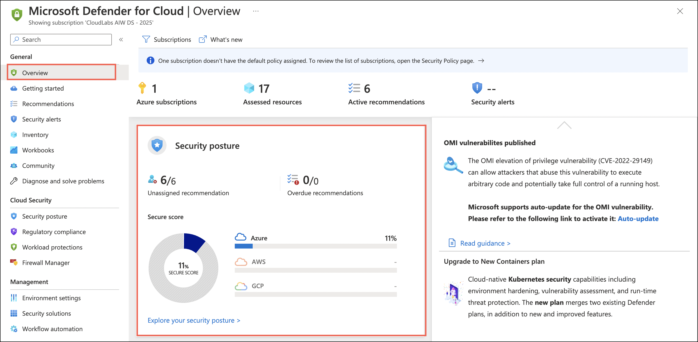

1. On the **Recommendations page** under _General_, pay attention to the first part of the page. It includes the current Secure Score, progress on the Recommendations status (both completed security controls and recommendations), and Resource health (by severity).
    
    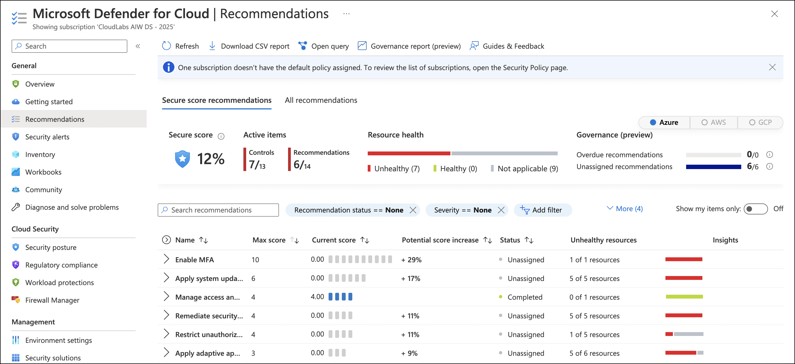
   
   
1. On the **Security alerts page** under _General_, you can see the alerts that describe details of the affected resources, suggested remediation steps, and in some cases an option to trigger a logic app in response. (The Remediation steps contain the remediation logic where you can remediate the selected resource/s. To simplify remediation and improve your environment's security and increase your secure score, many recommendations include a Fix option. Fix helps you quickly remediate a recommendation on multiple resources.)

  
### Task 2: Enable Microsoft Sentinel

1. In the **search resources, services and docs bar**, type **Microsoft Sentinel** and select it from suggestions, as shown below:

    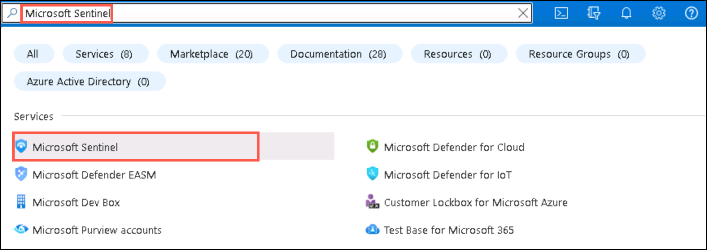
    
1. On the **Microsoft Sentinel** page, click on **+Create**.    

    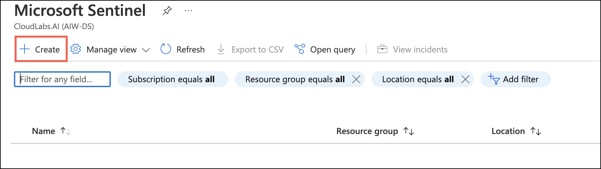
    
    
1. On the **Add Microsoft Sentinel to a Workspace** page, select the **AzureMigrateWS<inject key="DeploymentID" enableCopy="false" /> (1)** workspace and click on **Add (2)**. If prompted, Microsoft Sentinel free trial activated, click on Ok.   

    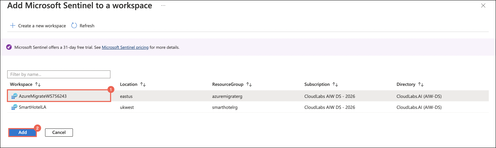
    
    > **Note:** If you are prompted with Microsoft Sentinel free trial activated pop-up, click on ok.
    
1. On the **News and guides (1)** window, go to **Get started (2)** tab review the content and from left pane under **Configuration**, select **Data connectors**.   

    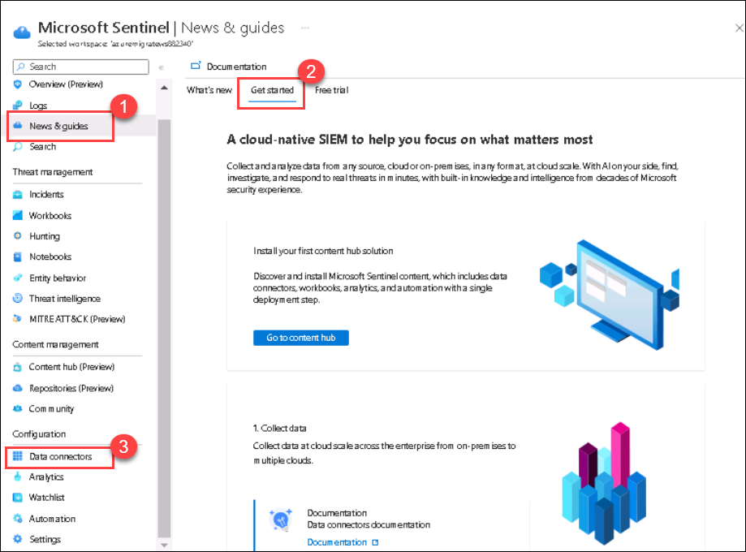
    
1. You will now be directed to the **Data Connectors** page. Microsoft Sentinel comes with many connectors for Microsoft solutions that are available out of the box and provide real-time integration. For non-Microsoft solutions, Microsoft Sentinel provides built-in interfaces to the larger security and application ecosystems.

    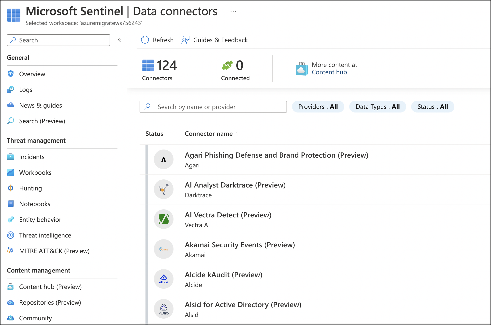

1. From the left pane, select **Analytics** present under _Configuration_. You can create custom analytics rules to help discover threats and anomalous behaviours in your environment. (Analytics rules search for specific events or sets of events across your environment, alert you when certain event thresholds or conditions are reached, generate incidents for your SOC to triage and investigate, and respond to threats with automated tracking and remediation processes.) 

    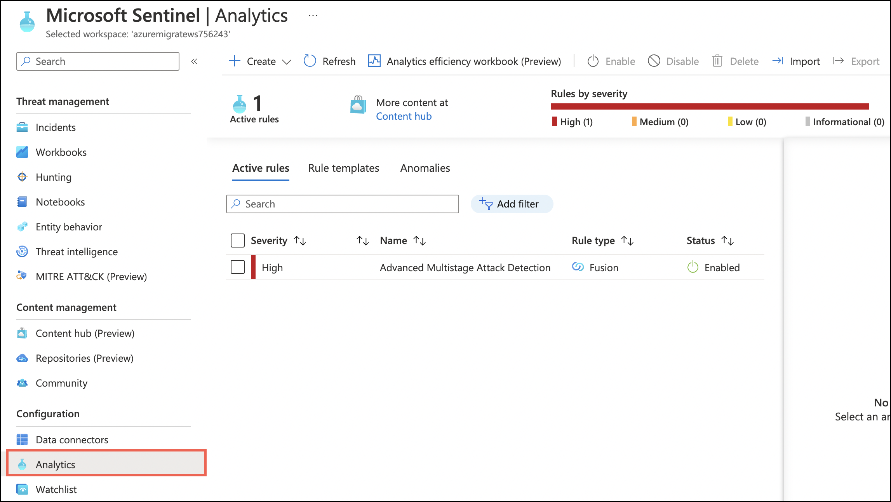

### Task 3:  Enable Azure Monitor

1. In the **search resources, services and docs bar**, type **Azure Monitor** and select it from suggestions, as shown below:

    
    
2. From the left pane, select **Log Analytics Workspaces (1)** present under Insights (You will see your subscription and all the workspaces in it, listed here) and click on **AzureMigrateWS<inject key="DeploymentID" enableCopy="false" /> (2)** workspace under azuremigraterg.

    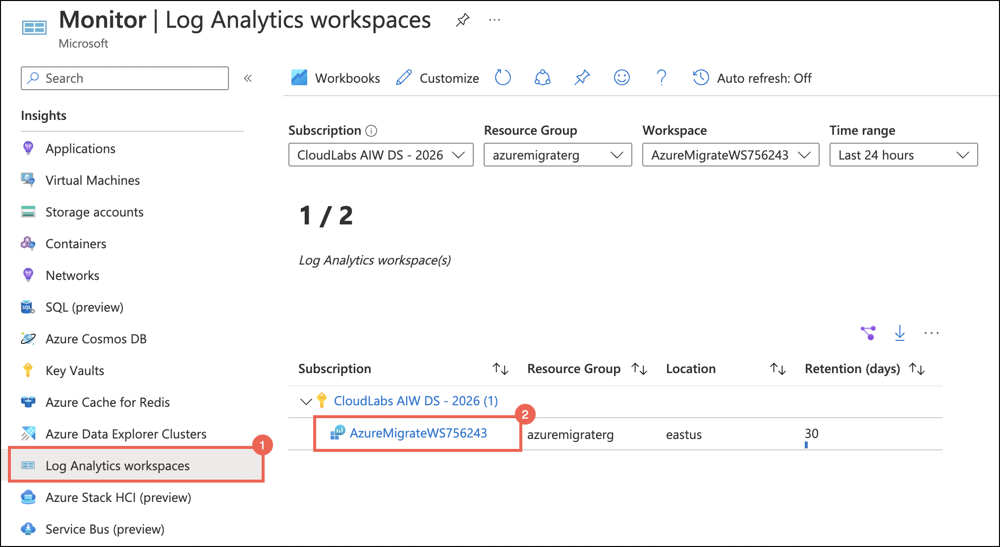

3. On the **Overview tab**, you can see:

- The monthly ingestion volume of the workspace
- How many machines sent heartbeats, meaning - machines that are connected to this workspace (in the selected time range)
- Machines that haven't sent heartbeats in the last hour (in the selected time range)
- The data retention period set
- The daily cap set, and how much data was already ingested on the recent day
- Ingestion anomalies - a list of identified spikes and dips in ingestion to these tables
    
    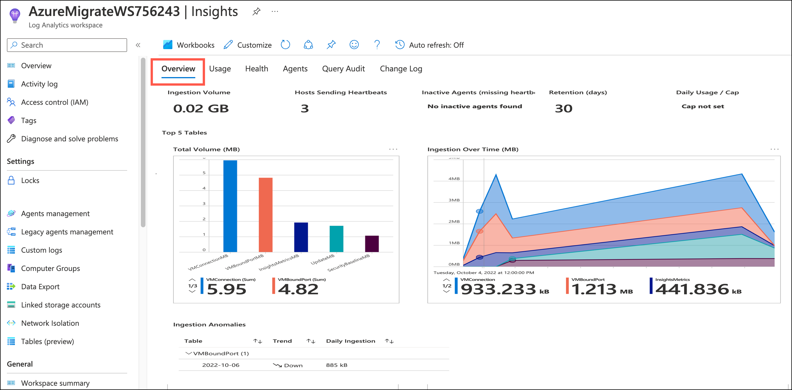
    
4. On the **Usage tab**, you can see ingestion data of by tables, and defaults to the 5 most ingested tables in the selected time range.

- How much data was ingested to it (during the selected time range)
- The percentage this table takes, from the entire ingestion volume (during the selected time range). That helps identify the tables that affect your ingestion the most.
- When was the last update of usage statistics regarding each table - we normally expect usage stats to refresh hourly.
   
    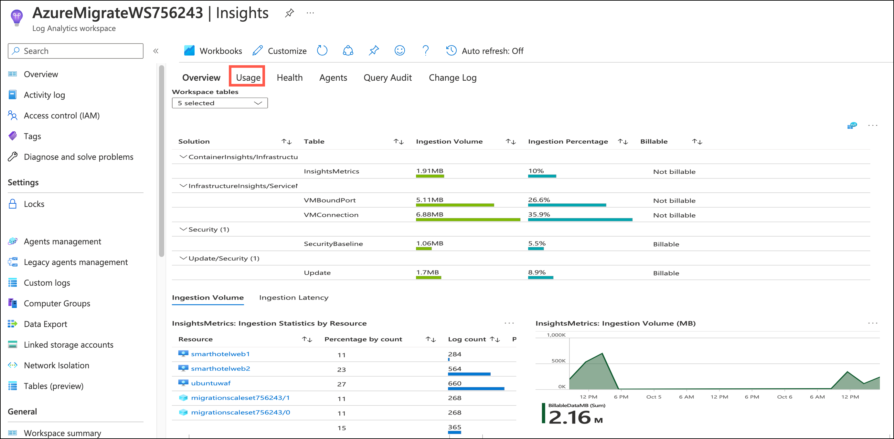  
    
5. On the **Health tab**, you can see the workspace health state and when it was last reported, as well as operational errors and warnings.
        
    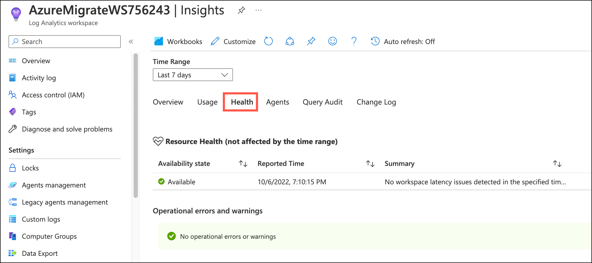 
    
6. On the **Agents tab**, you can see  :

- Operation errors and warnings - these are errors and warning related specifically to agents. 
- Workspace agents - these are the agents that sent logs to the workspace during the selected time range. You can see the agent's types and health state. 
- Agents activity - this grid shows information on either all agents, healthy or unhealthy agents. 
    
    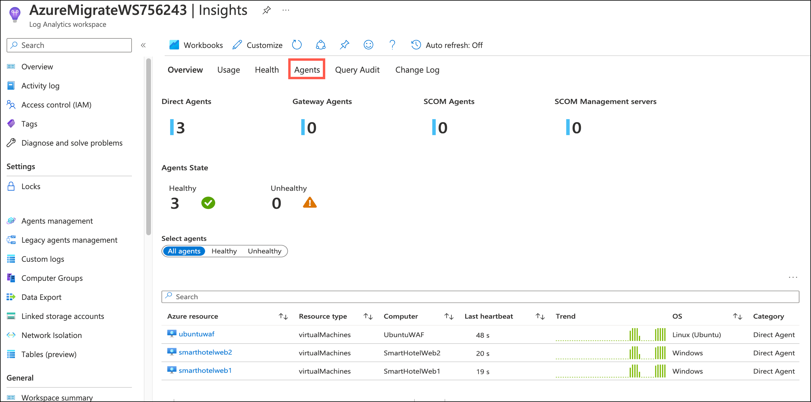  
    
    
7. From the left pane, select **Virtual Machines (1)** present under Insights and then click on **Configure Insights (2)**.

    
   
8. You will see your subscription and all the resource groups in it, listed here. Expand the resource group and enable VM insights for the VM you want to monitor. Click on **Enable** on that respective VMs.

    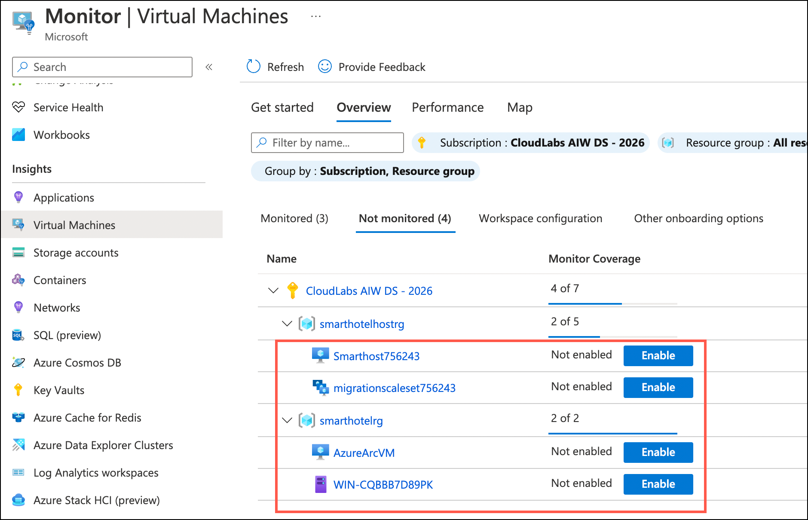
   
9. On the **Get more visibility into the health and performance of your virtual machine** window, click on **Enable**. This will initiate the deployment of VM insights.   

    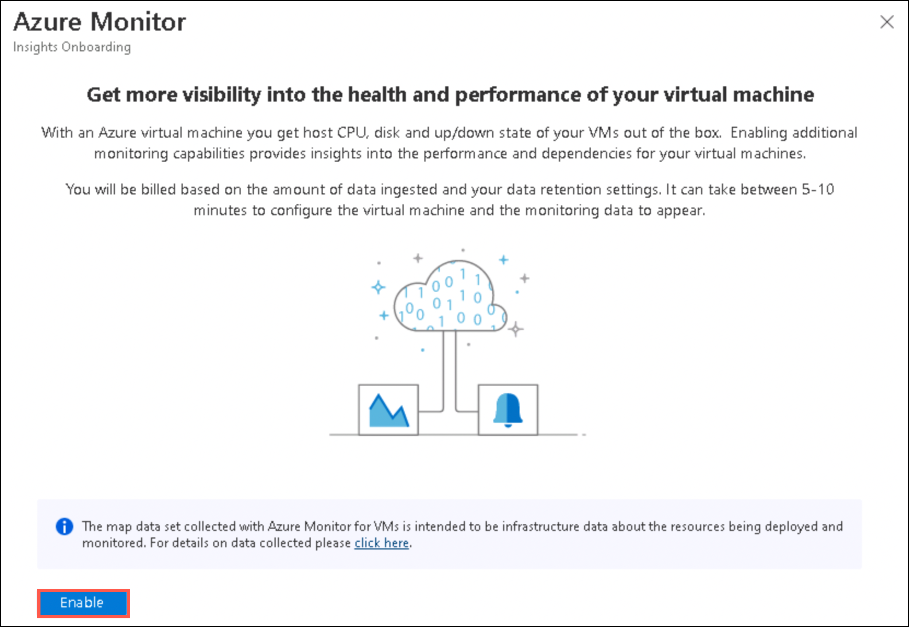

10. On the **Monitoring configuration** page, click on **Cancel**.

    > **Note:** In this task we won't be configuring VM insights.

    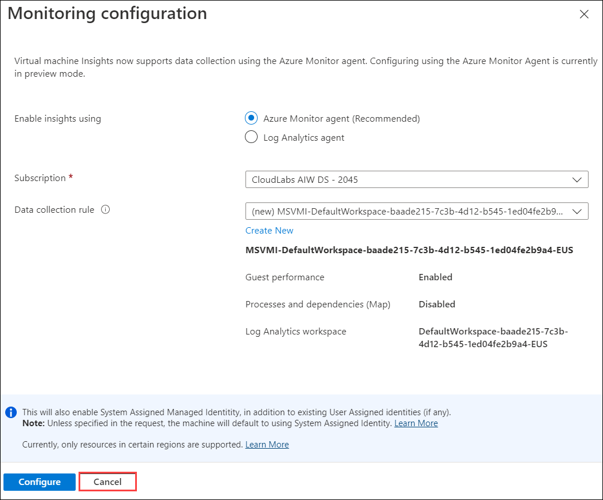

11. VM insights include a set of performance charts that target several key performance indicators (KPIs) to help you determine how well a virtual machine is performing. To view that, open the **Virtual Machines** tab present in the left pane and click on **Performance**.

12. From the left pane, select **Applications** present under Insights. It is one of the powerful tools which can help to diagnose, monitor, and analyze your application. It can help in identifying anomalies and monitoring the performances of applications deployed anywhere irrespective of their technology. Azure application insights can monitor the application deployed on Azure as well as it can monitor the application which is deployed on-premises.
  
    
**Summary:** In this exercise, you explored what is Microsoft Defender and how to enable it for Cloud and Microsoft Sentinel. You also learnt about Monitoring which helps you maximize the availability and performance of your applications and services. Then you explored how Azure Monitor Logs stores the data that it collects in the Log Analytics workspaces.
