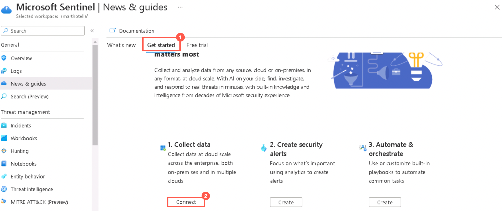
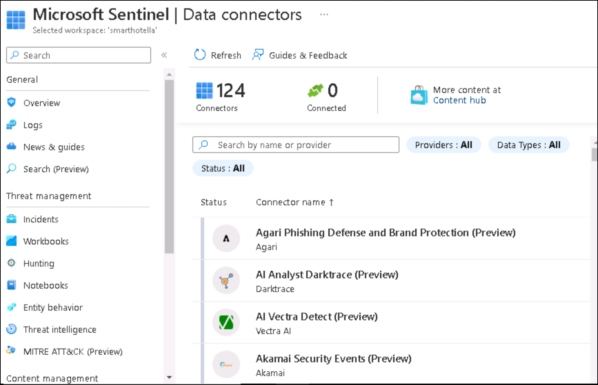
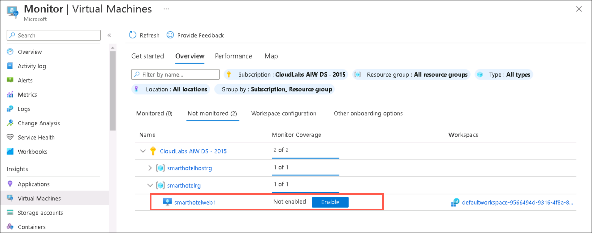
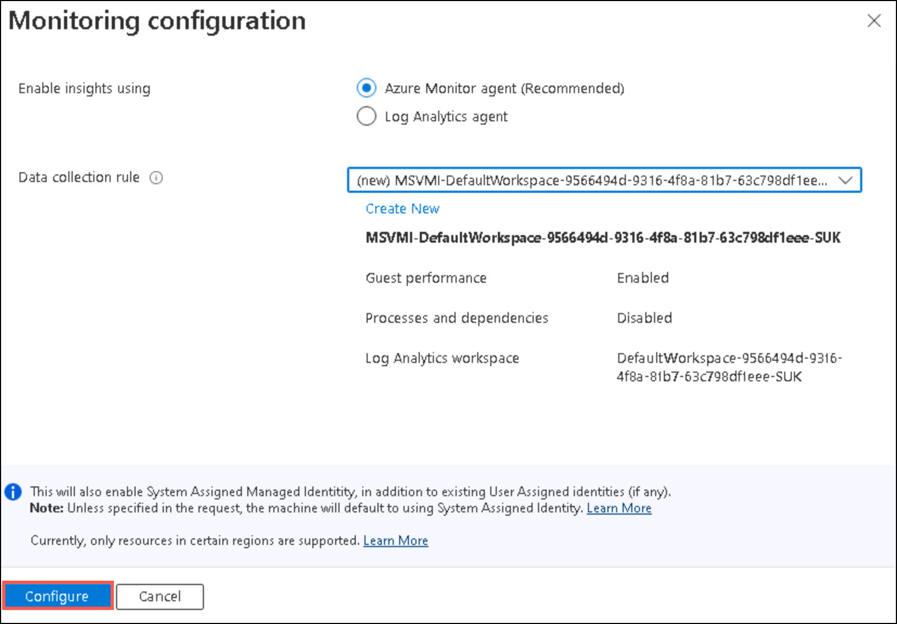

### HOL3: Exercise 5: Enable Microsoft Defender for Cloud, Microsoft Sentinel, and Azure Monitor, and setup Log analytics for each source.

### Task 1:Enable Microsoft Defender for Cloud

1. If you are not logged in already, click on Azure portal shortcut that is available on the desktop and log in with below Azure credentials.
    * Azure Username/Email: <inject key="AzureAdUserEmail"></inject> 
    * Azure Password: <inject key="AzureAdUserPassword"></inject>

1. In the **search resources, services and docs bar**, type **Microsoft Defender for Cloud** and select it from suggestions, as shown below:

    
    
1. On the **Microsoft Defender for Cloud** page, click on **Environment settings (1)** and click the **down arrow (2)** of the Tenant Root Group and click on **your subscription (3)**.

     
     
1. On the **Defender plans** page, click **Enable all button (1)** and then click on **Save (2)**.    

    
    
 > **Note:** It might take upto 24 hours for all the changes to get reflected in your subscription successfully.

1. Go back to the **Getting started (1)** page Microsoft Defender for Cloud, under the **Upgrade (2)** tab select **SmartHotelLA (3)** workspace and click on **Upgrade (4)**.

    

1. On the **Install Agents** tab, click **Continue without Installing Agents**.

    

1. The **Microsoft Defender for Cloud Overview page** offers a consolidated perspective for security experts. This section combines various independent cloud security components, such as **Secure Score, Regulatory Compliance, and Workloads Protection**, and provides detailed insights on the security posture on a distinct dashboard.

1. On the **Recommendations page** under _General_, pay attention to the first part of the page. It includes the current Secure Score, progress on the Recommendations status(both completed security controls and recommendations), and Resource health (by severity).

1. On the **Security alerts page** under _General_, you can see the alerts that describe details of the affected resources, suggested remediation steps, and in some cases an option to trigger a logic app in response. (The Remediation steps contain the remediation logic where you can remediate the selected resource/s. To simplify remediation and improve your environment's security and increase your secure score, many recommendations include a Fix option. Fix helps you quickly remediate a recommendation on multiple resources.)

### Task 2: Enable Microsoft Sentinel

1. In the **search resources, services and docs bar**, type **Microsoft Sentinel** and select it from suggestions, as shown below:

    
    
1. On the **Microsoft Sentinel** page, click on **+Create**.    

    
    
1. On the **Add Microsoft Sentinel to a Workspace** page, select the **SmartHotelLA** workspace and click **Add**.    

    
    
1. On the **News and guides** window, go to **Get started (1)** tab and Click **Connect (2)** under _Collect data_.   

    
    
1. You will now be directed to the **Data Connectors** page. Microsoft Sentinel comes with many connectors for Microsoft solutions that are available out of the box and provide real-time integration. For non-Microsoft solutions, Microsoft Sentinel provides built-in interfaces to the larger security and application ecosystems.

    

1. From the left pane, select **Analytics** present under _Configuration_. You can create custom analytics rules to help discover threats and anomalous behaviors in your environment. (Analytics rules search for specific events or sets of events across your environment, alert you when certain event thresholds or conditions are reached, generate incidents for your SOC to triage and investigate, and respond to threats with automated tracking and remediation processes.) 

### Task 1:Enable Azure Monitor

1. In the **search resources, services and docs bar**, type **Azure Monitor** and select it from suggestions, as shown below:

    
    
1.  From the left pane, select **Log Analytics Workspaces (1)** present under Insights (It provides comprehensive monitoring of your workspaces through a unified view of your workspace usage, performance, health, agent, queries, and change log.)  

1. You will see your subscription and all the workspaces in it, listed here. Click on **SmartHotelLA** workspace.

1. On the **Overview tab** you can see:

- The monthly ingestion volume of the workspace
- How many machines sent heartbeats, meaning - machines that are connected to this workspace (in the selected time range)
- Machines that haven't sent heartbeats in the last hour (in the selected time range)
- The data retention period set
- The daily cap set, and how much data was already ingested on the recent day
- Ingestion anomalies - a list of identified spikes and dips in ingestion to these tables
    
1. From the left pane, select **Virtual Machines (1)** present under Insights and then click on **Configure Insights (2)**.

   
   
1. You will see your subscription and all the resource groups in it, listed here. Expand **smarthotelrg** resource group and enable VM insights for the VM. Click on **Enable**.

   
   
1. On the **Get more visibility into the health and performance of your virtual machines** window, click on **Enable**. This will initiate the deployment of VM insights.   

   

1. On the **Monitoring configuration** page, click **Configure**.

   

1. VM insights include a set of performance charts that target several key performance indicators (KPIs) to help you determine how well a virtual machine is performing. To view that, open the **Virtual Machines** tab present in the left pane and click on **Performance**.

1. From the left pane, select **Applications (1)** present under Insights. It is one of the powerful tools which can help to diagnose, monitor, and analyze your application. It can help in identifying anomalies and monitoring the performances of applications deployed anywhere irrespective of their technology. Azure application insights can monitor the application deployed on Azure as well as it can monitor the application which is deployed on-premises.
  
    
