# HOL 2: Migrate and modernize Linux & OSS DB workloads to Azure


In this Module, you will use Azure Migrate: Server Assessment to assess the on-premises environment. This will include selecting Azure Migrate tools, deploying the Azure Migrate appliance into the on-premises environment, creating a migration assessment, and using the Azure Migrate dependency visualization.

### Exercise 1: Discovery, Assess, and Plan: Evaluate your current environment

In this exercise, you will deploy the Azure Migrate appliance in the on-premises Hyper-V environment. This appliance communicates with the Hyper-V server to gather configuration and performance data about your on-premises VMs, and returns that data to your Azure Migrate project.

1. If you are not logged in already, click on Azure portal shortcut that is available on the desktop and log in with below Azure credentials.
    * Azure Username/Email: <inject key="AzureAdUserEmail"></inject> 
    * Azure Password: <inject key="AzureAdUserPassword"></inject>

2. Click on **Show Portal Menu (1)** bar and select **All services (2)** in the portal's left navigation.
 
    

3. In the search bar, search for **Azure Migrate** and select it from the suggestions to open the Azure Migrate Overview blade, as shown below. 
 
    

4. Under **Azure Migrate: Discovery and assessment**, select **Discover** to open the **Discover** blade.
 
    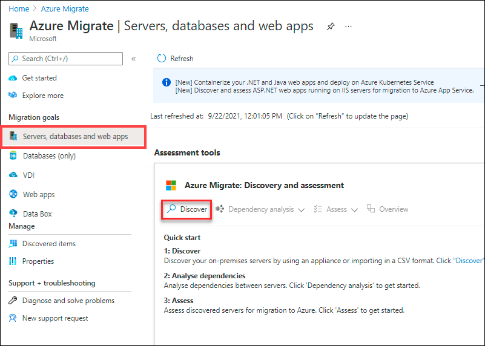
 
5. Under **Are your machines virtualized?**, select **Yes, with Hyper-V** from the **drop-down** menu.

    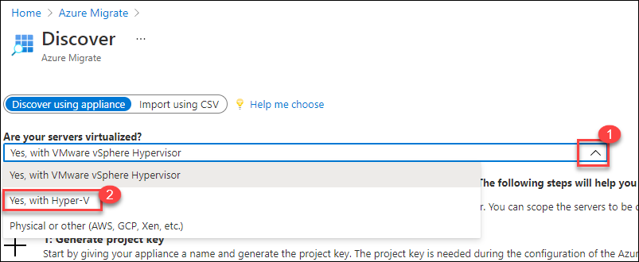

6.  In **1: Generate Azure Migrate project key**, provide below name for the **Azure Migrate appliance** that you will set up for discovery of Hyper-V VMs. Select **Generate key** to start the creation of the required Azure resources.

     ```
     SmartHotelApp2
     ```
    

7.  **Wait** for the key to be generated, then copy the **Azure Migrate project key** to your clipboard.

    

8.  Read through the instructions on how to download, deploy and configure the Azure Migrate appliance then close the 'Discover machines' blade by clicking on cross button **X** (do **not** download the .VHD file or .ZIP file, the .VHD has already been downloaded for you). 
 
    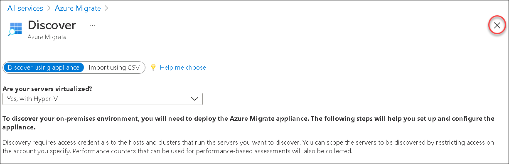

9. Go to **Start** button in the VM, search for **Hyper-V Manager** there and select it. 

   > You can also open the **Hyper-v manager** by clicking on the icon that is present in the taskbar. 

     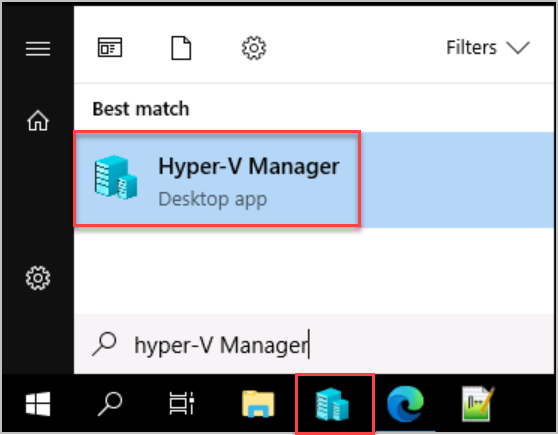

10. In Hyper-V Manager, select **SMARTHOST<inject key="DeploymentID" enableCopy="false" />**. You should now see the AzureMigrateAppliance VM and four VMs that comprise the on-premises SmartHotel application.

     
     
11. In Hyper-V Manager, select the **AzureMigrateAppliance** VM, then select **Start** on the right if not already running.

   

12. In Hyper-V Manager, select the **AzureMigrateAppliance** VM, then select **Connect** on the right.

    

13. Log into the VM with the **Administrator password**: **<inject key="SmartHotelHost Admin Password" />** (the login screen may pick up your local keyboard mapping, use the 'eyeball' icon to check).

14. Launch the **Azure Migrate appliance configuration Manager wizard** using the shortcut available on the desktop (wait for a minute or two, the browser will open showing the Azure Migrate appliance configuration wizard)

    
    
    >**Note**: If you receive a prompt asking for credentials after launching the **Azure Migrate appliance configuration wizard** using the shortcut available on the desktop, please follow the instructions from [here](https://github.com/CloudLabsAI-Azure/Know-Before-You-Go/blob/main/AIW-KBYG/AIW-Infrastructure-Migration.md#1-exercise1---task3---step3) to connect to Azure Migrate appliance configuration wizard.

15. On opening of the appliance configuration wizard, if a pop-up with the license terms appears, accept the terms by selecting **I agree**.

    

16 Under **Set up prerequisites**, the following two steps to verify Internet connectivity and time synchronization should pass automatically.

   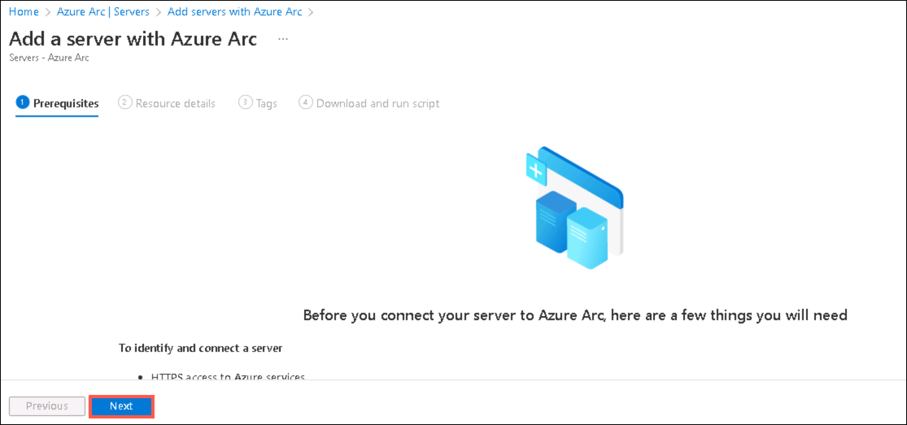

17. **Wait** while the wizard installs the latest Azure Migrate updates. If prompted for credentials, enter user name **Administrator** and password **<inject key="SmartHotelHost Admin Password" />**. Once the Azure Migrate updates are completed, you may see a pop-up if the management app restart is required, and if so, select **Refresh** to restart the app.  

   

18. At the next phase of the wizard, **Check latest updates and register appliance**, paste the **Azure Migrate project key (1)** that you copied from the Azure portal earlier and select **Verify (2)** to verify the Azure Migrate project key. 
   
    > If you do not have the key, go to **Server Assessment > Discover > Manage existing appliances**, select the appliance name you provided at the time of key generation and copy the corresponding key.)

    

19. Wait for the **Appliance auto-update status** to complete and select **Login**. 

   
   
   > Now, follow the below instructions to complete the login process.
    
   1. At first, you will be presented with a **Continue with Azure login** pop-up . On the **Continue with Azure login** pop-up dialog, click on **Copy code & Login**.
   
   
  
   2. This will open an Azure login prompt in a new browser tab (if it doesn't appear, make sure the pop-up blocker in the browser is disabled) paste the **code (1)** and click on **Next (2)**. You will then be asked for your Azure portal credentials to complete the login process.

   

20. Log in using the below Azure credentials and select **Continue** on the **Are you trying to sign in to Microsoft Azure PowerShell?** window to complete the login process. Once you have logged in, return to the Azure Migrate Appliance tab and the appliance registration will start automatically and displays below message once the registration is successful.
    
    * Azure Username/Email: <inject key="AzureAdUserEmail"></inject> 
    * Azure Password: <inject key="AzureAdUserPassword"></inject> 

   

   Once the registration has completed, you can proceed to the next panel, **Manage credentials and discovery sources**.

21. In **Step 1: Provide Hyper-V host credentials for discovery of Hyper-V VMs** under **2. Manage credentials and discovery sources**, select **Add credentials**.

    


22. Specify the following details on the **Add credentails** blade for the Hyper-V host/cluster that the appliance will use to discover VMs and select **Save**.
 
      1. Friendly name : Enter **hostlogin** 
      2. Username: <inject key="SmartHotelHost Admin Username" />
      3. Password: <inject key="SmartHotelHost Admin Password" />

    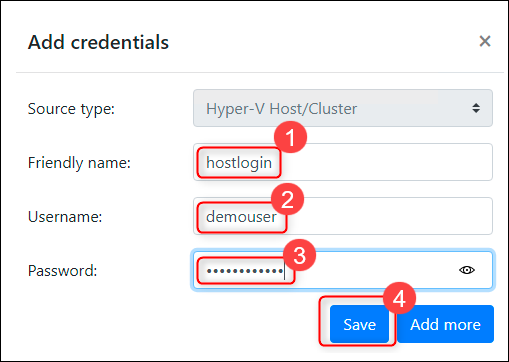

     > **Note**: The Azure Migrate appliance may not have picked up your local keyboard mapping. Select the 'eyeball' in the password box to check the password was entered correctly.

23. In **Step 2: Provide Hyper-V host/cluster details**, select **Add discovery source** to specify the Hyper-V host/cluster IP address/FQDN and the friendly name for credentials to connect to the host/cluster.

    

24. On the **Add discovery source** blade, provide the following details:
     
      1. Select **Add single item**
      1. IP Address / FQDN:  Enter **SmartHost<inject key="DeploymentID" enableCopy="false" />** .
      1. Friendly name: Select **hostlogin** from the dropdwon and 
      1. select **Save**.

      

    > **Note:** You can either **Add single item** at a time or **Add multiple items** in one go. There is also an option to provide Hyper-V host/cluster details through **Import CSV**.

25. The appliance will validate the connection to the Hyper-V hosts/clusters added and show the **Validation status** in the table against each host/cluster

    

    > **Note:** When adding discovery sources:
    > -  For successfully validated hosts/clusters, you can view more details by selecting their IP address/FQDN.
    > -  If validation fails for a host, review the error by selecting the Validation failed in the Status column of the table. Fix the issue and validate again.
    > -  To remove hosts or clusters, select **Delete**.
    > -  You can't remove a specific host from a cluster. You can only remove the entire cluster.
    > -  You can add a cluster, even if there are issues with specific hosts in the cluster.

26. In **Step 3: provide server credentials to perform software inventory and agentless dependency analysis**, **Disable the slider (1)** and select **Start discovery (2)** to kick off VM discovery from the successfully validated hosts/clusters.

     > **Note:** The discovery process can take upto 10 minutes. 
   
    

27. Wait for the Azure Migrate status to show **Discovery has been successfully initiated**. This will take several minutes. After the discovery has been successfully initiated, you can check the discovery status against each host/cluster in the table..

26. Return to the **JumpVM** then to **Azure Migrate** blade in the Azure portal.  Select **Servers, databases and web apps (1)**, then select **Refresh (2)**.  Under **Azure Migrate: Servers, databases and web apps** you should see a **count (3)** of the number of servers discovered so far. If discovery is still in progress, select **Refresh** periodically until 5 discovered servers are shown. This may take several minutes.

    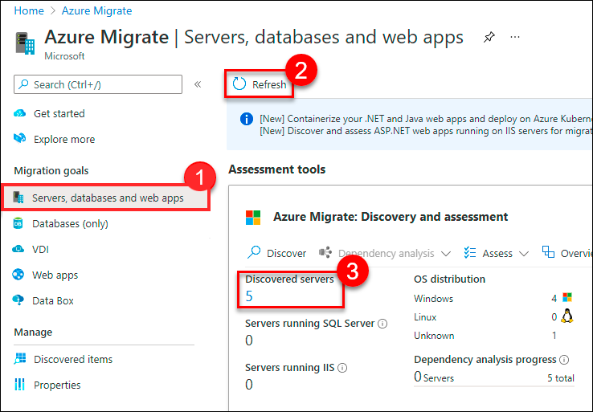 

    **Wait for the discovery process to complete before proceeding to the next Task**.


### Exercise 2: Set up your environment on Azure to migrate servers

### Task 1: Create a migration assessment

In this task, you will use Azure Migrate to create a migration assessment for the SmartHotel application, using the data gathered during the discovery phase.

1. Select **Assess** under **Azure Migrate: Discovery and assessment** and click on **Azure VM** to start a new migration assessment.

   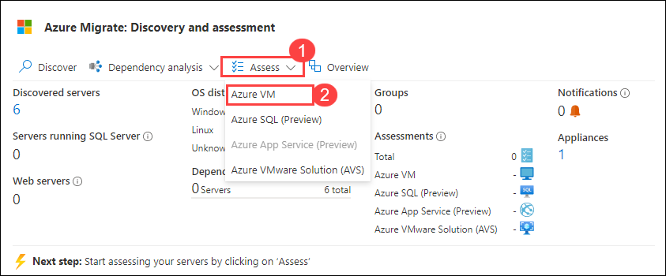

2. On the Assess servers blade, ensure the Assessment type to be **Azure VM** and Discovery Source to be **Servers discovered from Migrate Appliance**. Under **Assessment settings**, select **Edit**.

   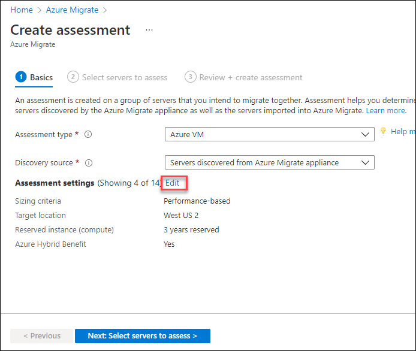

3. The **Assessment settings** blade allows you to tailor many of the settings used when making a migration assessment report. Take a few moments to explore the wide range of assessment properties. Hover over the information icons to see more details on each setting. Choose any settings you like, then select **Save**. (You have to make a change for the Save button to be enabled; if you don't want to make any changes, just close the blade.)

   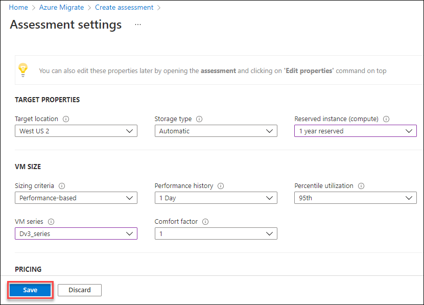

4. Select **Next** to move to the **Select servers to assess** tab and enter the following information:
     
     1. Assessment name: Enter **SmartHotelAssessment** 
     1. Select or create a group: Choose **Create New** and enter the 
     1. Group name: Enter **Linux VMs**.
     1. Add machines to the Group:  Select **UbuntuVM** from dropdown.
     1. Select the **UbuntuVM** VMs and
     1.  Click on **Next**.

   

    **Note:** There is no need to include the **smarthotelSQL1** or **AzureMigrateAppliance** VMs in the assessment, since they will not be migrated to Azure. (The SQL Server will be migrated to the SQL Database service and the Azure Migrate Appliance is only used for migration assessment.)

5. Click on **Create assessment** to create the assessment. 

   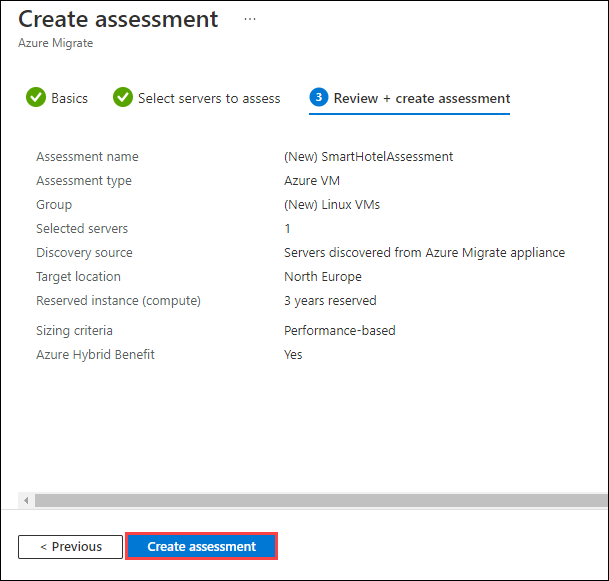

6. On the **Servers, databases and web apps** blade, select **Refresh** periodically until the number of assessments shown is **1** (This may take few minutes). Once the assessments count is updated, click on **1** that is next to **Total** under **Assessments**.  

    ")
    
7. Select **Assessments** under **Azure Migrate: Discovery and assessment** to see a list of assessments. Then select the actual assessment.

   ")

### Task 2: Configure dependency visualization

When migrating a workload to Azure, it is important to understand all workload dependencies. A broken dependency could mean that the application doesn't run properly in Azure, perhaps in hard-to-detect ways. Some dependencies, such as those between application tiers, are obvious. Other dependencies, such as DNS lookups, Kerberos ticket validation or certificate revocation checks, are not.

In this task, you will configure the Azure Migrate dependency visualization feature. This requires you to first create a Log Analytics workspace, and then to deploy agents on the to-be-migrated VMs.

1. Return to the **Azure Migrate** blade in the Azure Portal, select **Servers, databases and web apps (1)**. Under **Discovery and assessment** select **Groups (2)**,

    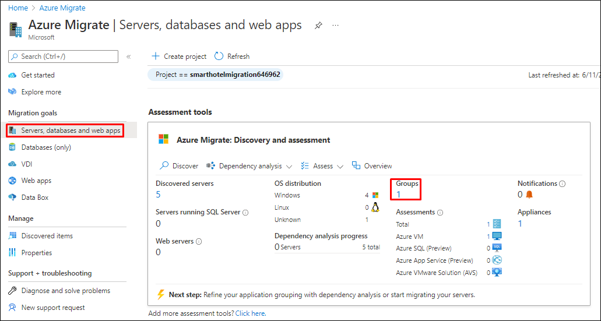   

2. Select the **Linux VMs** group to see the group details. 

      

3. Note that each VM has their **Dependencies** status as **Requires agent installation**. Select **Requires agent installation** for the **UbuntuVM** VM.

   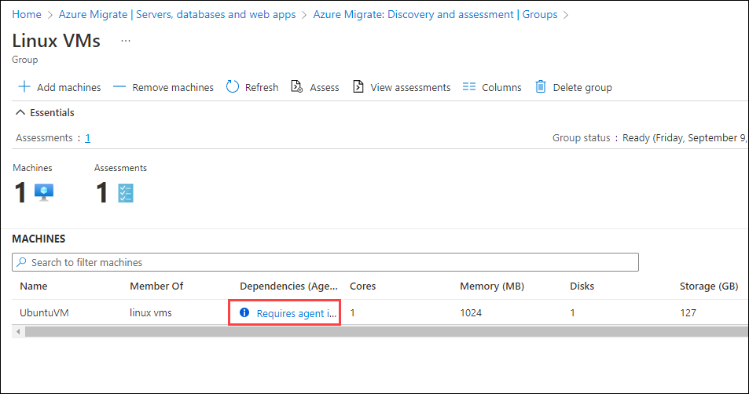

4. On the **Dependencies** blade, select **Configure Log Analytics workspace**.

   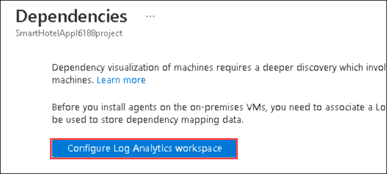

5. On the **Configure Log Analytics workspace** blade, provide the below information and select **Configure**.

   - Log Analytics workspace: Click on **Create new** and enter **AzureMigrateWS<inject key="DeploymentID" enableCopy="false" />**
   - Log Analytics workspace location: Select **East US** from the dropdown.

  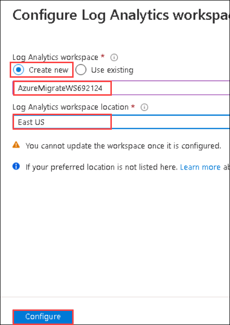

6. Wait for the workspace to be deployed. Once it is deployed, navigate to **AzureMigrateWS<inject key="DeploymentID" enableCopy="false" />** by clicking on it.

   

7. Select **Agents management** under **Settings** from the left hand side menu. Make a note of the **Workspace ID** and **Primary Key** (for example by using Notepad).

   

8. You will now deploy the Linux versions of the Microsoft Monitoring Agent and Dependency Agent on the **UbuntuVM** VM. To do so, you will first connect to the UbuntuWAF remotely using an SSH session.

9. Open a command prompt using the desktop shortcut.  

    > **Note**: The SmartHotelHost runs Windows Server 2019 with the Windows Subsystem for Linux enabled. This allows the command prompt to be used as an SSH client. More info of supported Linux on Azure can be found here: https://Azure.com/Linux. 

10. Enter the following command to connect to the **UbuntuWAF** VM running in Hyper-V on the SmartHotelHost:

    ```bash
    ssh demouser@192.168.0.7
    ```

11. Enter 'yes' when prompted whether to connect. Use the password **<inject key="SmartHotelHost Admin Password" />**.

    

12. Enter the following command, followed by the password **<inject key="SmartHotelHost Admin Password" />** when prompted:
  
    ```
    sudo -s
    ```

    > This gives the terminal session elevated privileges.

13. Enter the following command, substituting \<Workspace ID\> and \<Workspace Key\> with the values copied previously. Answer **Yes** when prompted to restart services during package upgrades without asking.  

    ```
    wget https://raw.githubusercontent.com/Microsoft/OMS-Agent-for-Linux/master/installer/scripts/onboard_agent.sh && sh onboard_agent.sh -w <Workspace ID> -s <Workspace Key>
    ```

14. Enter the following command, substituting \<Workspace ID\> with the value copied earlier:

    ```s
    /opt/microsoft/omsagent/bin/service_control restart <Workspace ID>
    ```

15. Enter the following command. This downloads a script that will install the Dependency Agent.

    ```s
    wget --content-disposition https://aka.ms/dependencyagentlinux -O InstallDependencyAgent-Linux64.bin
    ```

16. Install the dependency agent by running the script download in the previous step.

    ```s
    sh InstallDependencyAgent-Linux64.bin -s
    ```

    
    

17. Return to the Azure Portal and refresh the Azure Migrate **SmartHotel VMs** VM group blade. The 3 VMs on which the dependency agent was installed should now show their status as **Installed**. (If not, refresh the page **using the browser refresh button**, not the refresh button in the blade.  It may take up to **5 minutes** after installation for the status to be updated.)

   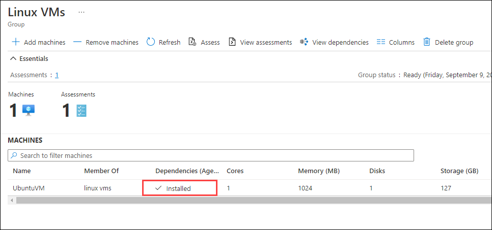
   
   >**Note**: If you notice that the dependency agent status is showing as **Requires Agent Installation** instead of Installed even after installing dependency agents in all the three VMs, please follow the steps from [here](https://github.com/CloudLabsAI-Azure/Know-Before-You-Go/blob/main/AIW-KBYG/AIW-Infrastructure-Migration.md#4-exercise1---task6---step1) to confirm dependency agent installation in VMs using Log Analytics workspace.
 
18. Select **View dependencies**.

   
   
19. Take a few minutes to explore the dependencies view. Expand each server to show the processes running on that server. Select a process to see process information. See which connections each server makes.

    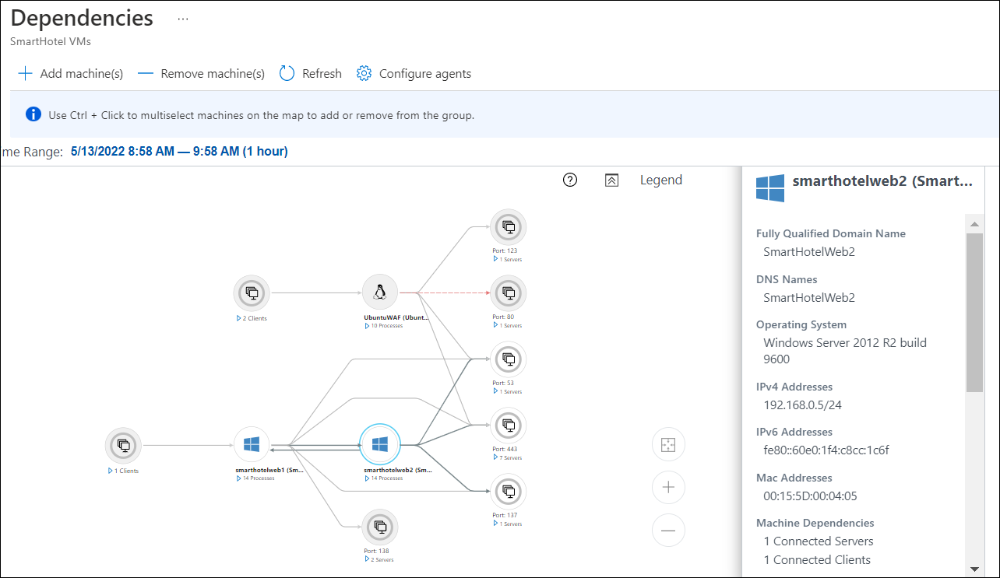
 
#### Task summary 

In this task you configured the Azure Migrate dependency visualization feature, by creating a Log Analytics workspace and deploying the Azure Monitoring Agent and Dependency Agent on Linux on-premises machine.

## Exercise 3: Migrating your apps and your data, leveraging Microsoft services and tools like Azure Migrate, the Azure Hybrid Benefit, and other tools and programs. 

### Task 1: Create a Storage Account

In this task you will create a new Azure Storage Account that will be used by Migration and for storage of your virtual machine data during migration.

> **Note:** This lab focuses on the technical tools required for workload migration. In a real-world scenario, more consideration should go into the long-term plan prior to migrating assets. The landing zone required to host VMs should also include considerations for network traffic, access control, resource organization, and governance. For example, the CAF Migration Blueprint and CAF Foundation Blueprint can be used to deploy a pre-defined landing zone, and demonstrate the potential of an Infrastructure as Code (IaC) approach to infrastructure resource management. For more information, see [Azure Landing Zones](https://docs.microsoft.com/azure/cloud-adoption-framework/ready/landing-zone/) and [Cloud Adoption Framework Azure Migration landing zone Blueprint sample](https://docs.microsoft.com/azure/governance/blueprints/samples/caf-migrate-landing-zone/).

1. In the Azure portal's left navigation, select **+ Create a resource**, then search for and select **Storage account**, followed by **Create**.

    

2. In the **Create storage account** blade, on the **Basics** tab, use the following values:

   - Subscription: **Select your Azure subscription**.
  
   - Resource group: **AzureMigrateRG**
  
   - Storage account name: **migrationstorage<inject key="DeploymentID" enableCopy="false" />**

   - Location: Select **<inject key="Region" enableCopy="false" />** from the dropdown.
    
   - Performance: **Standard**
  
   - Redundancy: **Locally-redundant storage (LRS)**

    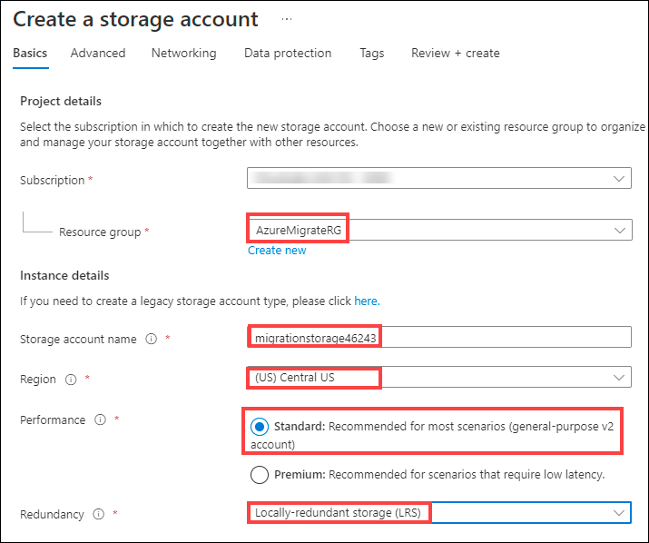

3. Select **Review + create**, then select **Create**.

4. Once the storage account is deployed, click on **Go to resource** to open it.

5. Select **Data protection** under **Data management** from the left-hand side menu of storage account.

   

6. Now, uncheck the box next to **Enable soft delete for blobs** and **Enable soft delete for containers** to disable the soft delete on blobs and container as the soft delete enabled storage account is **not supported** for enabling replication on Virtual Machines. Click on **Save**.

   > (You will enable replication on Virtual Machines in Task4 of this Exercise)

   


#### Task summary 

In this task you created a new Azure Storage Account that will be used by Migration and modernization.

### Task 2: Register the Hyper-V Host with Migration and modernization

In this task, you will register your Hyper-V host(LabVM) with the Migration and modernization service. This service uses Azure Site Recovery as the underlying migration engine. As part of the registration process, you will deploy the Azure Site Recovery Provider on your Hyper-V host.

1. Return to the **Azure Migrate | Servers, databases and web apps** blade in the Azure Portal, and select **Servers, databases and web apps (1)** under **Migration goals** on the left. Under **Migration Tools**, select **Discover (2)**.

   **Note:** You may need to add the migration tool yourself by following the link below the **Migration Tools** section, selecting **Migration and modernization**, then selecting **Add tool(s)**.
   
    

2. In the **Discover** panel, provide the following details:
   - Under **Are your machines virtualized**, select **Yes, with Hyper-V**.
   - Under **Target region** the region is automatically selected as same the Resource Group's region.
   - Check the **confirmation** checkbox and select **Create resources** to begin the deployment of the Azure Site Recovery resource used by Migration and modernization for Hyper-V migrations.

   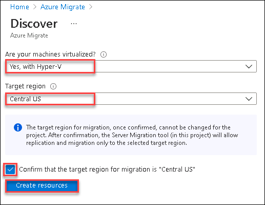

   Once deployment is complete, the 'Discover machines' panel should be updated with additional instructions.
  
3. Click on the **Download** link for the Hyper-V replication provider software installer to download the Azure Site Recovery provider installer.

   

4. Return to the **Discover** page in your browser and select the blue **Download** button and download the registration key file.

   


5. Open the **AzureSiteRecoveryProvider.exe** installer you downloaded a moment ago. On the **Microsoft Update** tab, select **Off** and select **Next**. Accept the default installation location and select **Install**.

   

6. When the installation has completed select **Register**. Browse to the location of the key file you downloaded. When the key is loaded select **Next**.

   

7. Select **Connect directly to Azure Site Recovery without a proxy server** and select **Next**. The registration of the Hyper-V host with Azure Site Recovery will begin.

8. Wait for registration to complete (this may take several minutes). Then select **Finish**.

   

9. Return to the Azure Migrate browser window. **Refresh** your browser, then re-open the **Discover machines** panel by selecting **Discover** under **Migration and modernization** and selecting **Yes, with Hyper-V** for **Are your machines virtualized?**.

10. Select **Finalize registration**, which should now be enabled.

    

11. Azure Migrate will now complete the registration with the Hyper-V host. **Wait** for the registration to complete. This may take several minutes.

    

12. Once the registration is complete, close the **Discover machines** panel using **X** button.

    

13. The **Migration and modernization** panel should now show 5 discovered servers..

    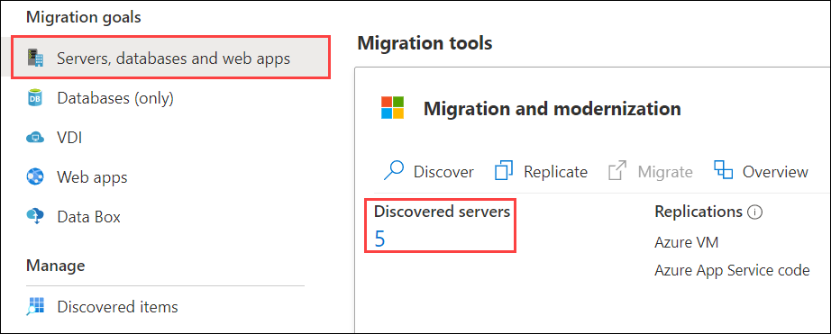

#### Task summary 

In this task you registered your Hyper-V host with the Azure Migrate Server Migration service.

### Task 3: Enable Replication from Hyper-V to Azure Migrate

In this task, you will configure and enable the replication of your on-premises virtual machines from Hyper-V to the Azure Migrate Server Migration service.

1. Under **Migration and modernization**, select **Replicate**. This opens the **Replicate** wizard.

   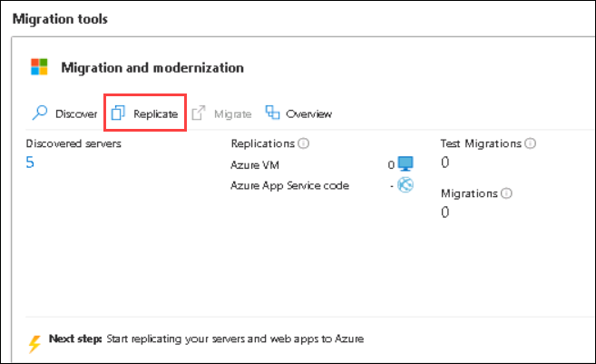
   
1. Under **Specific Intent** page, provide the below details:

    -  What do you want to migrate? : Select **Servers or Virtual machines (VM)** **(1)**
    -  Where do you want to migrate to? : Select **Azure VM** **(2)**
    -  Click on **Continue (3)**

    

2. In the **Source settings** tab, under **Are your machines virtualized?**, select **Yes, with Hyper-V** from the drop-down. Then select **Next**.

   

3. In the **Virtual machines** tab, under **Import migration settings from an assessment**, select **Yes, apply migration settings from an Azure Migrate assessment**. Select the **SmartHotel VMs** VM group and the **SmartHotelAssessment** migration assessment.

   

4. The **Virtual machines** tab should now show the virtual machines included in the assessment. Select the **UbuntuWAF**, **smarthotelweb1**, and **smarthotelweb2** virtual machines, then select **Next**.

   

5. On the **Target settings** tab, select the below information,
   - Select your subscription and the existing **SmartHotelRG (1)** resource group. 
   - **Replication storage account**: Select the **migrationstorage<inject key="DeploymentID" enableCopy="false" /> (2)** storage account.
   - **Virtual Network**: Select **SmartHotelVNet (3)**. 
   - **Subnet**: Select **SmartHotel (4)**. 
   - Select **Next (5)**.
 
 
   

 > **Note:** For simplicity, in this lab you will not configure the migrated VMs for high availability, since each application tier is implemented using a single VM.

6. On the **Compute** tab, select the below configuration,
   - Select the **Standard_F2s_v2** VM size for each virtual machine. 
   - Select the **Windows** operating system for the **smarthotelweb1**, **smarthotelweb2** virtual machines.
   - Select the **Linux** operating system for the **UbuntuWAF** virtual machine. 
   - Select **Next**. 


   
    

7. In the **Disks** tab, review the settings but do not make any changes. Select **Next: Tags**, then select **Replicate** to start the server replication.

8. In the **Azure Migrate - Servers, databases and web apps** blade, under **Migration and modernization**, select the **Overview** button.

    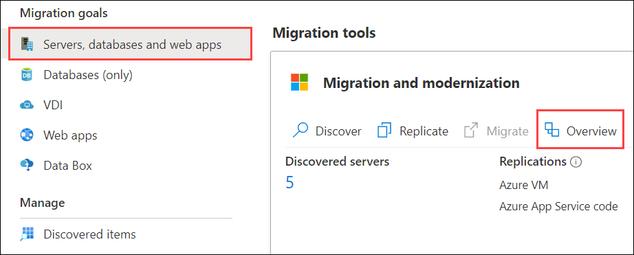
    
9. Confirm that the 3 machines are replicating.

   

10. Select **Replicating Machines** under **Manage** on the left.  Select **Refresh** occasionally and wait until all three machines have a **Protected** status, which shows the initial replication is complete. This will take 5-10 minutes.

    

   > **Note**: Please make sure to run the **validation steps** for this task before moving to next tasks as there are few dependencies. **Not** running the validation after performing this task will result in **validation failure**  as the status of the Virtual Machine will be changed from **Protected** to **Planned  failover** when you migrate the servers in Task6.

#### Task summary 

In this task you enabled replication from the Hyper-V host to Azure Migrate, and configured the replicated VM size in Azure.

### Task 4: Configure Networking

In this task you will modify the settings for each replicated VM to use a static private IP address that matches the on-premises IP addresses for that machine.

1. Still using the **Migration and modernization - Replicating machines** blade, select the **smarthotelweb1** virtual machine. This opens a detailed migration and replication blade for this machine. Take a moment to study this information.

   

2. Select **Compute and Network** under **General** on the left, then select **Edit**.

   

3. Confirm that the VM is configured to use the **F2s_v2** VM size.

4. Under **Network Interfaces**, select **InternalNATSwitch** to open the network interface settings.

   

5. Change the **Private IP address** to **192.168.0.4**.

   

6. Select **OK** to close the network interface settings blade, then **Save** the **smarthotelweb1** settings.

7. Repeat these steps to configure the private IP address for the other VMs.
 
   - For **smarthotelweb2** use private IP address **192.168.0.5**
  
   - For **UbuntuWAF** use private IP address **192.168.0.8**

#### Task summary 

In this task you modified the settings for each replicated VM to use a static private IP address that matches the on-premises IP addresses for that machine

> **Note**: Azure Migrate makes a "best guess" at the VM settings, but you have full control over the settings of migrated items. In this case, setting a static private IP address ensures the virtual machines in Azure retain the same IPs they had on-premises, which avoids having to reconfigure the VMs during migration (for example, by editing web.config files).


### Task 5: Server migration

In this task you will perform a migration of the UbuntuWAF, smarthotelweb1, and smarthotelweb2 machines to Azure.

> **Note**: In a real-world scenario, you would perform a test migration before the final migration. To save time, you will skip the test migration in this lab. The test migration process is very similar to the final migration.

1. Return to the **Migration and modernization** overview blade. Under **Step 3: Migrate**, select **Migrate**.

   

2. On the **Migrate** blade, select **yes** for **Shutdown machines before migration to minimum data loss** and select the 3 virtual machines then select **Migrate** to start the migration process.

   

   > **Note**: You can optionally choose whether the on-premises virtual machines should be automatically shut down before migration to minimize data loss. Either setting will work for this lab.

3. The migration process will start.

   

4. To monitor progress, select **Jobs** under **Manage** on the left and review the status of the three **Planned failover** jobs.

   

5. **Wait** until all three **Planned failover** jobs show a **Status** of **Successful**. You should not need to refresh your browser. This could take up to 15 minutes.

   

6. Navigate to the **SmartHotelRG** resource group and check that the VM, network interface, and disk resources have been created for each of the virtual machines being migrated.

   

#### Task summary 

In this task you used Azure Migrate to create Azure VMs using the settings you have configured, and the data replicated from the Hyper-V machines. This migrated your on-premises VMs to Azure.


### Task 6: Configure the database connection

The application tier machine **smarthotelweb2** is configured to connect to the application database running on the **smarthotelsql** machine.

On the migrated VM **smarthotelweb2**, this configuration needs to be updated to use the Azure SQL Database instead.

> **Note**: You do not need to update any configuration files on **smarthotelweb1** or the **UbuntuWAF** VMs, since the migration has preserved the private IP addresses of all virtual machines they connect with.

1. From the Azure portal menu which is present at the top left, click on **All services**. Select **compute** from the left hand menu and select **Virtual machines**.

2. Click on **smarthotelweb2** VM, from the overview blade, and select **Connect**. Select **Bastion** from the available options and click on **Use Bastion**.

   **Note:** You may have to wait a few minutes and refresh to have the option to enter the credentials. 

3. Connect to the machine with the username **Administrator** and the password <inject key="SmartHotelHost Admin Password"></inject>. When prompted, **Allow** clipboard access.

   

4. In the **smarthotelweb2** remote desktop session, open File Explorer and navigate to the **C:\\inetpub\\SmartHotel.Registration.Wcf** folder. Double-select the **Web.config** file and open with Notepad.

5. Update the **DefaultConnection** setting to connect to your Azure SQL Database.

   You can find the connection string for the Azure SQL Database in the Azure portal. Navigate to the **SmartHotelRG** resource group, and then to the database **smarthoteldb** and  from the overview, select **Show database connection strings**.

   

    Copy the **ADO.NET** connection string, and paste into the web.config file on **smarthotelweb2**, replacing the existing connection string.  **Be careful not to overwrite the 'providerName' parameter which is specified after the connection string.**

    > **Note:** You may need to open the clipboard panel on the left-hand edge of the Bastion window, paste the connection string there, and then paste into the VM.

    Set the password in the connection string to **<inject key="SmartHotelHost Admin Password" />**.

    

6. **Save** the `web.config` file and exit your Bastion remote desktop session.

#### Task summary 

In this task, you updated the **smarthotelweb2** configuration to connect to the Azure SQL Database.

### Task 7: Configure the public IP address and test the SmartHotel application

In this task, you will associate an Application Gateway with Web Application Firewall (WAF) to replace the Ubuntu VM with the Azure managed service.

1. Navigate to the **SmartHotel-WAF** Application Gateway in the **SmartHotelRG** resource group

1. Select **Backend pools** under the Settings section, and select the **WebBackend** pool

    

1. Set the Target type to **Virtual machine** and the Target to the NIC of **smarthotelweb1**; select **Save** to update the backend pool

    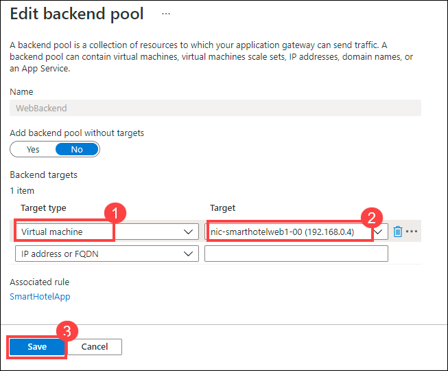

    > **Note:** This backend pool is already associated with the front-end IP address of the Application Gateway via the SmartHotelApp rule. The front-end IP, listener, rule, and backend pool were all created with the Application Gateway. This step now ties the migrated VM to the front end.

1. Navigate to the **SmartHotelRG** resource group, and then to the **SmartHoteldb<inject key="DeploymentID" enableCopy="false" />** database server to update the Firewall settings.
           
1. Under Security, select **Networking** then **Public access** tab. Now, set **Public network access** to **Selected networks** and **Save** your changes.

    
     
1. Now, on the **Public access** tab, click on **Add a virtual network rule** to add a virtual network so that the access to the database will be allowed from specific network.

    
   
1. On the **Create/Update** blade, enter the below information.

    - **Name**: **AllowaccesstoDB**
    - **Subscription**: Select your subscription from the dropdown.
    - **Virtual Network**: Select **SmartHotelVNet**. 
    - **Subnet**: Select **SmartHotel**.
    - Click on **Enable** and then **Ok**.

    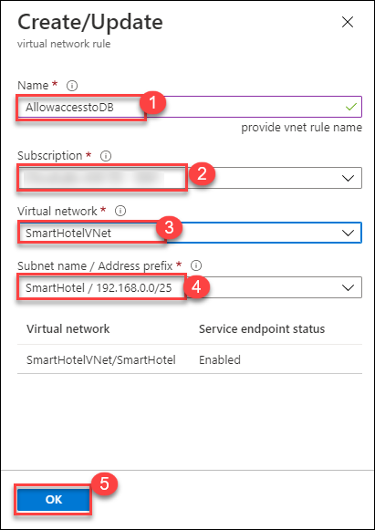
   
1. Navigate back to the **Public access** tab of **Networking** section. Set **Public network access** to **Disabled** and **Save** your changes.

    
   
1. Navigate back to the **SmartHotel-WAF** Application Gateway then **Frontend IP configurations** way in the Settings section, and note the IP address associated with the public IP address **appGwPublicFrontendIp**.

    

1. Open a new browser tab and paste the IP address into the address bar. Verify that the SmartHotel360 application is now available in Azure.

    
 
    > **Note**: 
      1. The Check-in and Check-out might differ for you when compared to the above screenshot.
      2. At this point the base Application Gateway service is providing access to the backend application. This validates that the application is working and can be further protected by the WAF in following steps.

1. Select **Web application firewall** under the Settings section and change the Tier to **WAF V2**.  Also, change the Firewall status to **Enabled**, the Firewall mode to **Prevention**, and set the Max request body size (KB) to **32**.  Select **Save** to commit the changes.

    

1. Once the application gateway changes have been saved, go back to your web browser with the public IP address of the application gateway you used earlier and refresh the browser to have a page processed by the WAF.


#### Task summary 

In this task, you assigned a public IP address to the UbuntuWAF VM and verified that the SmartHotel application is now working in Azure.

### Exercise 4: Optimizing newly migrated workloads, and emphasizing commonalities across all stacks

#### Task 1: Using VM Scale Sets to drive business resiliency

1. If you are not logged in already, click on Azure portal shortcut that is available on the desktop and log in with below Azure credentials.
    * Azure Username/Email: <inject key="AzureAdUserEmail"></inject> 
    * Azure Password: <inject key="AzureAdUserPassword"></inject>

2. In the Azure portal's navigation pane, select **Resource groups**.

3. From the Resource groups blade, select the **SmartHotelHostRG** resource group.

4. Select **smarthotelweb1** VM to create image.

2. On the page for the VM, on the upper menu, select **Capture**.
   
   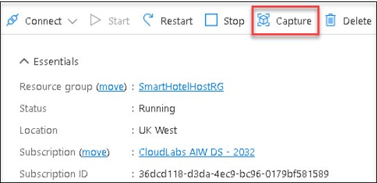

4. To create the image in a gallery, select **Yes, share it to a gallery as an image version**.

   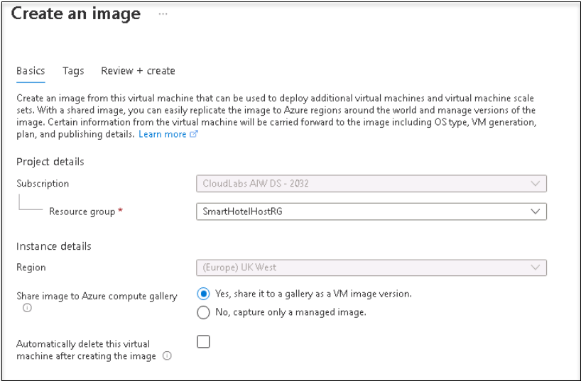

5. Create a new gallery by selecting **Create new**.

   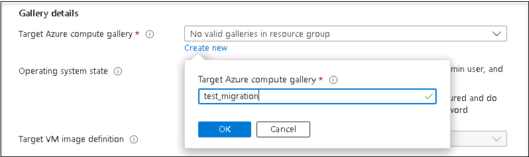

6. In Operating system state select **Specialized**.

7. Select an image definition and **create new** and provide a name and information for a new Image definition.

   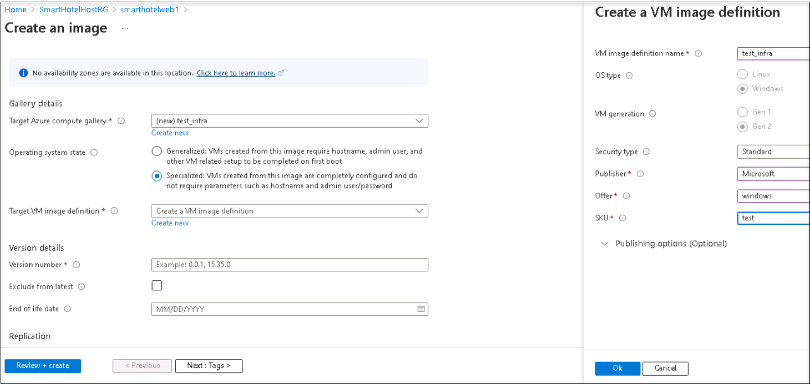

8. Enter an **image version** number. If this is the first version of this image, type **1.0.0**.

9. select **Review + create**.

10. After validation passes, select **Create** to create the image.

11. On the page for the image gallery, on the upper menu, select **+VMSS**.

   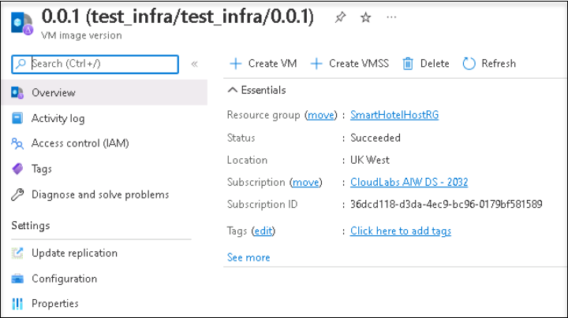

12. Enter the **Virtual Machine name scale set** name.

   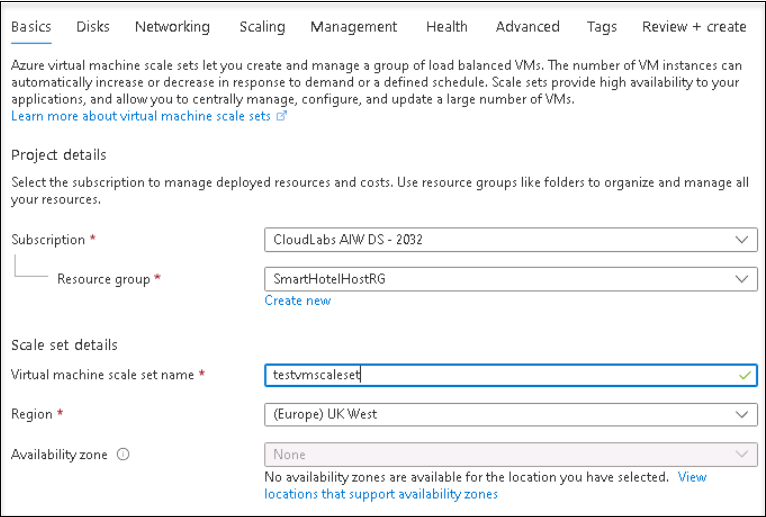

13. Select any **size**.

14. Select the License type as **Window server**.

   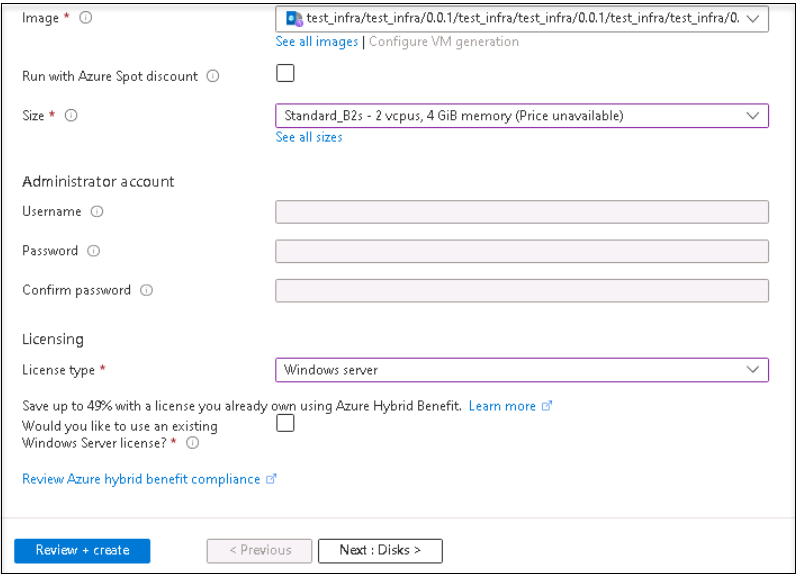

15. select **Review + create**.

#### Task 2: Azure auto manage

In this task, you will Enable Automanage on existing machines.

1. If you are not logged in already, click on Azure portal shortcut that is available on the desktop and log in with below Azure credentials.
    * Azure Username/Email: <inject key="AzureAdUserEmail"></inject> 
    * Azure Password: <inject key="AzureAdUserPassword"></inject>

2. In the search bar, search for and select Automanage – Azure machine best practices.

3. Select the Enable on existing VM.
   
   

4. Under Configuration profile, select your profile type: Azure Best Practices - Production or Azure Best Practices - Dev/Test or Custom profile.
   
   
   
   > Click View best practice profiles to see the differences between the environments.

   a. Select an environment on the dropdown: Dev/Test for testing, Production for production.
   
   b. Click the OK button.
   
   

5. On the Select machines blade:

   a. Filter the list by your Subscription and Resource group.
   
   b. Check the checkbox of each virtual machine you want to onboard.
   
   c. Click the Select button.
   
   

6. Click the Enable button.

