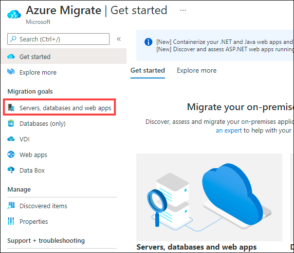
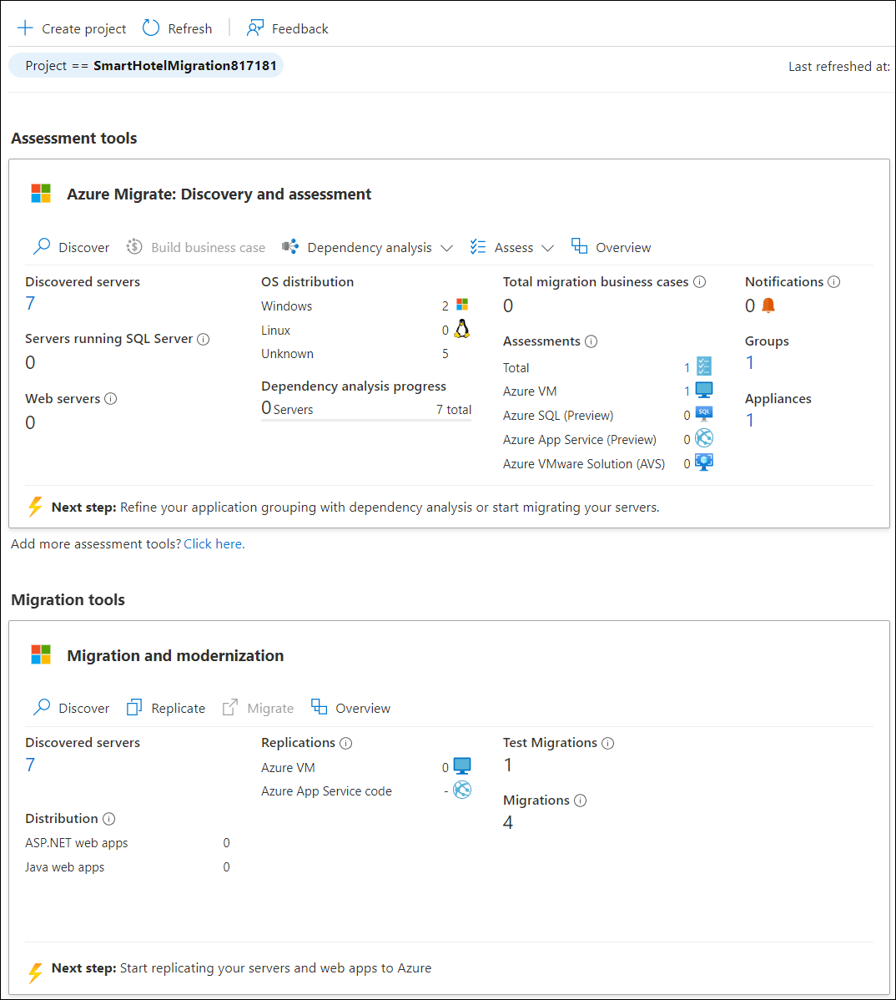
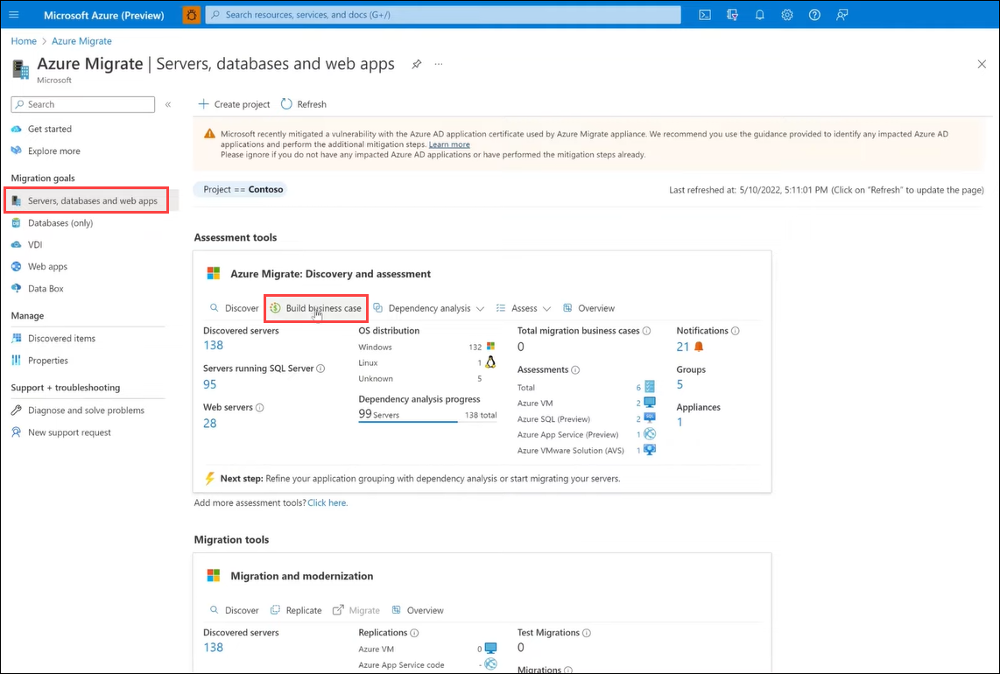
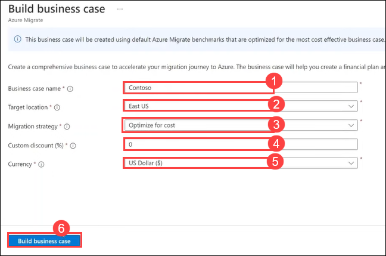
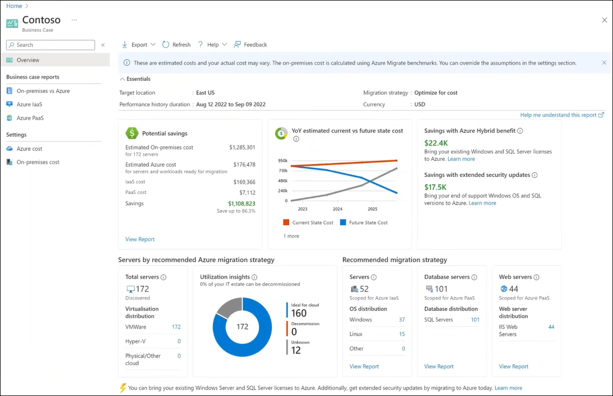
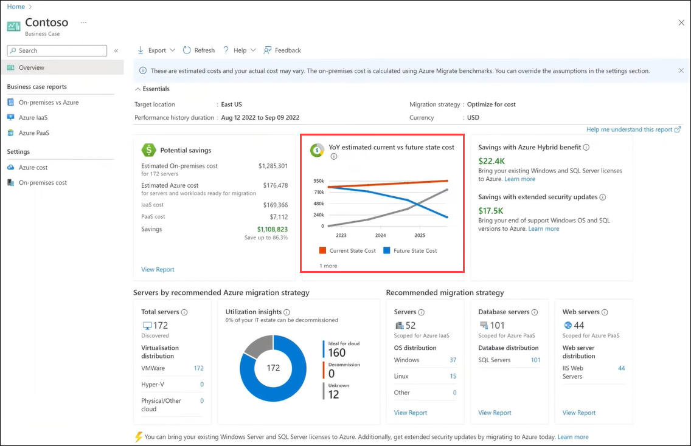
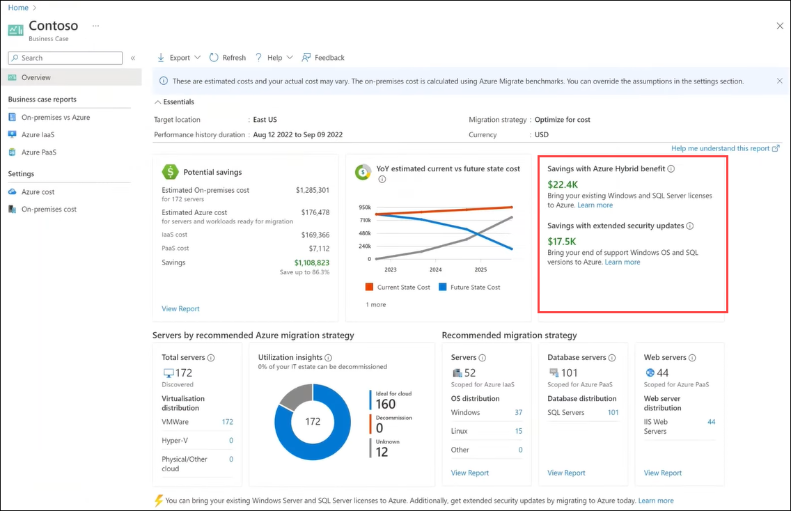
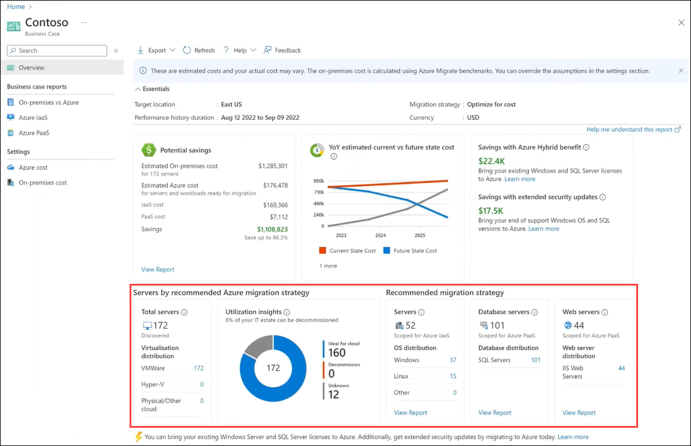
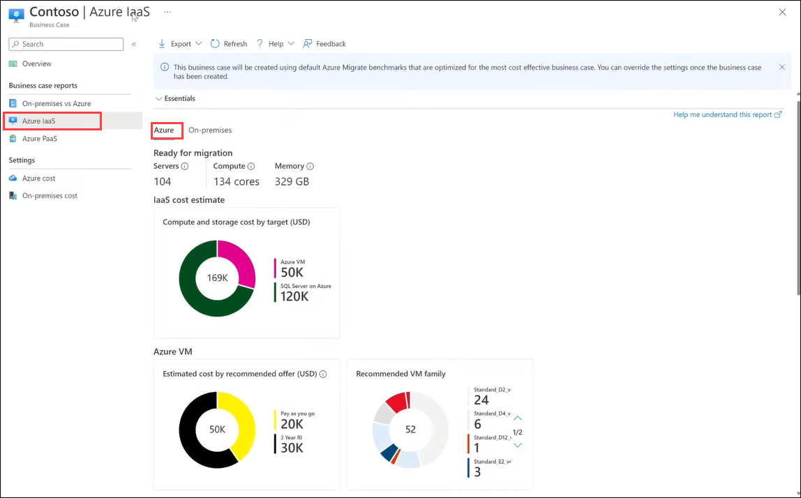
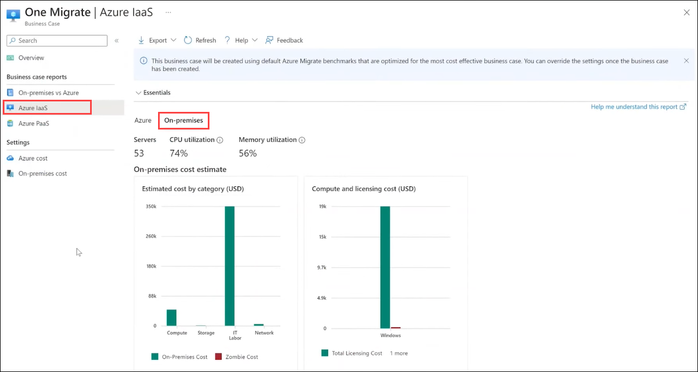

## HOL3: Exercise 7: Business case analysis capability (read-only)

In this task, you'll learn how to create a business case for Azure, using a free Azure Migrate feature during assessments that will help simplify your move to Azure.

Managing your on-premises data centres can present time-bound challenges such as expiring contracts, aging hardware, and end-of-support software. You may also be under pressure to address cash flow challenges, add capacity, and prevent security attacks while ensuring business continuity.

To understand if Azure really makes financial sense, we will start by creating a directional business case with Azure Migrate. This helps you understand what the best migration strategy is for your business and how to gradually move from a capital expenditure model to an operating expenditure model where you only pay for what you use.

**Business case analysis** is a comprehensive, easy-to-use tool that enables customers and partners to create directional business proposals to understand how azure can bring the most value to their business.

> Note: You don't need to perform this task as it is read-only exercise.

**Features:**

- Need **minimal inputs** to get started.

- Includes **migration strategy recommendation** including lift-and-shift to IaaS and modernize to PaaS.

- Highlights **on-premises TCO, ROI** and financial analysis, **resource utilization-based insights and quick wins**.

- Enables creating **what-if** scenarios with customizable settings and assumptions.

1. Login to the Azure portal with the below Azure credentials if you are not logged in already.

    * Azure Username/Email: <inject key="AzureAdUserEmail"></inject> 
    * Azure Password: <inject key="AzureAdUserPassword"></inject>

2. Click on the **Show Portal Menu (1)** bar and select **All services (2)** in the portal's left navigation.
 
    

3. In the search bar, search for **Azure Migrate** and select it from the suggestions to open the Azure Migrate Overview blade, as shown below. 
 
    

4. Under Migration goals select **Servers, databases and web apps**.

    

5. Now, you should see the **Azure Migrate: Discovery and assessment** and **Migration and modernization** panels for the current migration project, as shown below.

    .png)
    
    >**Note**: If you are not able to see the **Azure Migrate: Discovery and assessment** and **Migration and modernization** panels, please follow the below instructions to select the migration project.

     - Click on **Project** and select the existing project from the list. Create a new project if you do not have any projects created previously.

        
        
6. Under **Azure Migrate: Discovery and assessment**, select **Build business case** to open the **Build business case** blade. 

    >**Note**: Make sure you discovered your on-premises environment with the Azure Migrate agentless appliance, which collects configuration and resource utilization data for your servers and workloads.

     
    
7. On the **Build business case** blade, enter the following details:
   
   - **Business case name**: Enter **Contoso (1)**
   - **Target location**: Select any available region **(2)**
   - **Migration strategy**: Select **Optimize for cost (3)**
   - **Custom discount (%)**: Enter **0 (4)**
   - **Currency**: Select **US Dollar ($) (5)**
   - Click on **Build business case**

     
    
    
   
8. Once the build is succeeded, you can start reviewing the business case that was created from the above inputs and industry benchmarks.

     
   
9. On the **Potential savings** blade, observe the cost. It represents an estimated on-premises cost versus Azure TCO and the potential savings possible by getting rid of components that you'll no longer need. 

     
   
10. The **YoY estimated current vs future state cost** presents a year-over-year cost breakdown of the estimated current versus future state.

      
    
11. On the same business case overview page, you'll receive unique incentives such as Azure hybrid benefits and extended security update savings to help drive technical and workplace innovations.

     
    
12. Based on the rich data insights collected during the discovery process, on **Recommended migration strategy blade** you can observe how to effectively migrate to Azure, which underutilized servers to the right size, and which unused servers to potentially decommission.

     
   
13. Under **Business case reports**, click on **Azure Iaas**. You can dive deeper into detailed Azure Infrastructure as a Service and Platform as a Service reports. IaaS Reports will provide you with recommended right-sized targets and the most cost-effective offers based on your usage.

     

14. Click on **On-premises** tab. You can also identify the impact of underutilized servers and identify quick wins through software end-of-support, and for zombie servers.

      

15. Click on **Azure PaaS** from the left navigation pane under **Business case reports**. You'll find recommendations in the PaaS reports identifying quick wins and the ideal right-sized targets for your database and application workloads.

16. Given the importance of what-if scenarios and customizations in the planning process, use new settings to override default assumptions and build a business case for your migration strategy. We can present this business case to your stakeholders and obtain buy-ins and know that you've taken the steps to make the right decisions for your business.
     
17. Learn more about business case here: https://learn.microsoft.com/en-us/azure/cloud-adoption-framework/strategy/cloud-migration-business-case
