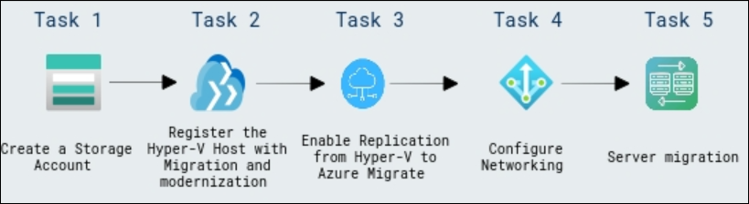
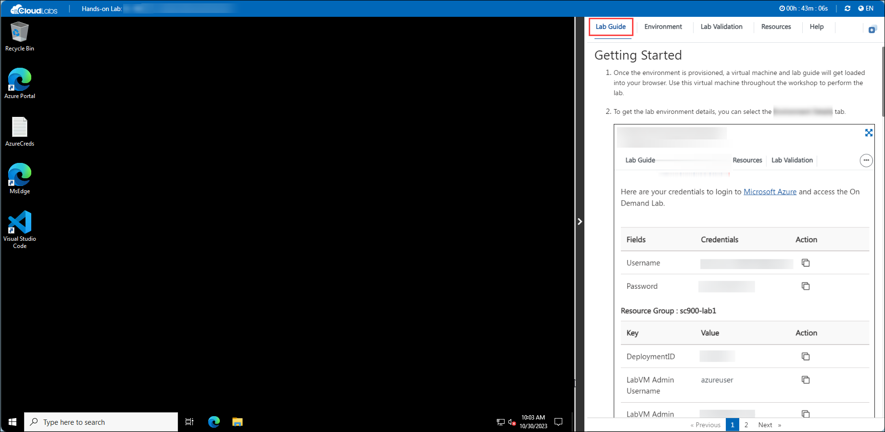

# Migrate Windows Server to Azure

### Overall Estimated Duration: 4 Hours

## Overview

**Azure Migrate** is a cloud migration service that simplifies the process of moving on-premises infrastructure, applications, and data to Azure. It provides tools for discovery, assessments, and right-sizing, ensuring a smooth and cost-effective migration. Azure Migrate supports various scenarios, including rehosting and modernization, and integrates with services like Azure Site Recovery and Azure Database Migration Service for a seamless migration experience.

In this hands-on lab, you will explore how Azure Migrate simplifies the migration of applications and data to Azure. You will learn to perform key pre-migration tasks, including discovery, assessments, and resource right-sizing. The lab covers configuring replication from on-premises Hyper-V hosts to Azure and executing server migrations, ensuring smooth operation through proper networking configurations. Additionally, you’ll gain valuable insights into Azure Networking and Security to support successful infrastructure migration.

## Objective 

This exercise focuses on enhancing your skills in migrating applications and data to Azure using Azure Migrate and related services. By completing this lab, you will learn:

- **Pre-migration steps with Azure Migrate:** Understand how to perform discovery, assessments, and right-sizing of on-premises resources for infrastructure, data, and applications.

- **Replication and migration:** Configure replication from on-premises Hyper-V hosts to Azure and migrate virtual machines using Azure Migrate Server Migration.

- **Networking configuration:** Modify replicated VM settings to ensure proper networking, including static private IP assignments for seamless integration.

- **Server Migration :** Select Azure VM as the destination, choose to shut down VMs before migration for minimal data loss, and monitor progress through the Jobs section. Verify the creation of VM, network interface, and disk resources in the target resource group after migration.

## Prerequisites

Participants should have:

- **Azure Migration Knowledge:** Understanding of Azure Migrate, server migration, and related tools for seamless cloud transition.

- **Hyper-V and VMware Administration:** Familiarity with Hyper-V and VMware environments for managing on-premises virtual machines.

- **Networking and Security Basics:** Knowledge of networking concepts, static IP addressing, and security configurations for VM migrations.
   
## Architecture

In this hands-on lab, you will follow a structured workflow to migrate applications and data to Azure using Azure Migrate: Server Migration. The process begins with creating a storage account and registering your on-premises Hyper-V host with the Migration and Modernization service, leveraging Azure Site Recovery as the migration engine. You will then enable replication of virtual machines to Azure, configure networking for seamless integration, and perform server migrations. Additionally, you will explore Azure Networking and Security best practices, gaining a comprehensive understanding of the tools and services that support successful migration to Azure.

## Architecture Diagram

  

## Explanation of Components

The architecture for this lab involves the following key components:

- **Azure Migrate**: Simplifies migration with pre-migration assessments, right-sizing, and VM replication to Azure.  

- **Migration and Modernization Service**: Uses Azure Site Recovery to automate and streamline infrastructure migration to Azure.  

- **Azure Networking**: Ensures secure, scalable network designs for seamless connectivity during and after migration.  

- **Azure Site Recovery**: Provides reliable replication and failover of workloads to Azure with minimal downtime.  

## Getting Started with the Lab

Welcome to Migrate Windows Server to Azure workshop! We've prepared a seamless environment for you to explore and learn about Azure services. Let's begin by making the most of this experience:

## Accessing Your Lab Environment
 
Once you're ready to dive in, your virtual machine and **Lab Guide** will be right at your fingertips within your web browser.

   

### Virtual Machine & Lab Guide
 
Your virtual machine is your workhorse throughout the workshop. The lab guide is your roadmap to success.
 
## Exploring Your Lab Resources
 
To get a better understanding of your lab resources and credentials, navigate to the **Environment** tab.

   
 
## Utilizing the Split Window Feature
 
For convenience, you can open the lab guide in a separate window by selecting the **Split Window** button from the Top right corner.
 
   

## Managing Your Virtual Machine
 
Feel free to start, stop, or restart your virtual machine as needed from the **Resources** tab. Your experience is in your hands!
 
  

## Lab Guide Zoom In/Zoom Out

To adjust the zoom level for the environment page, click the **A↕ : 100%** icon located next to the timer in the lab environment.

   
   
## Let's Get Started with Azure Portal
 
1. On your virtual machine, click on the **Azure Portal** icon as shown below:
 
    
 
2. You'll see the **Sign into Microsoft Azure** tab. Here, enter your credentials:
 
   - **Email/Username:** <inject key="AzureAdUserEmail"></inject>
 
      
 
3. Now enter the following password and click on Sign in.
 
   - **Password:** <inject key="AzureAdUserPassword"></inject>
 
      

4. If you see the pop-up Action Required, click **Ask Later**.

   

   > **NOTE:** Do not enable MFA, select **Ask Later**.

5. If you see the pop-up **Stay Signed in?**, click **No**.

   

6. If you see the pop-up **You have free Azure Advisor recommendations!**, close the window to continue the lab.

7. If a **Welcome to Microsoft Azure** popup window appears, click **Cancel** to skip the tour.

   

8. Now you will see the Azure Portal Dashboard, click on **Resource groups** from the Navigate panel to see the resource groups.

     
   
9. Confirm you have all resource groups present as shown below.

     
   
 
## Support Contact
 
The CloudLabs support team is available 24/7, 365 days a year, via email and live chat to ensure seamless assistance at any time. We offer dedicated support channels tailored specifically for both learners and instructors, ensuring that all your needs are promptly and efficiently addressed.

Learner Support Contacts:
- Email Support: cloudlabs-support@spektrasystems.com
- Live Chat Support: https://cloudlabs.ai/labs-support

Now, click on the **Next** from the lower right corner to move to the next page.

   

### Happy Learning!!
