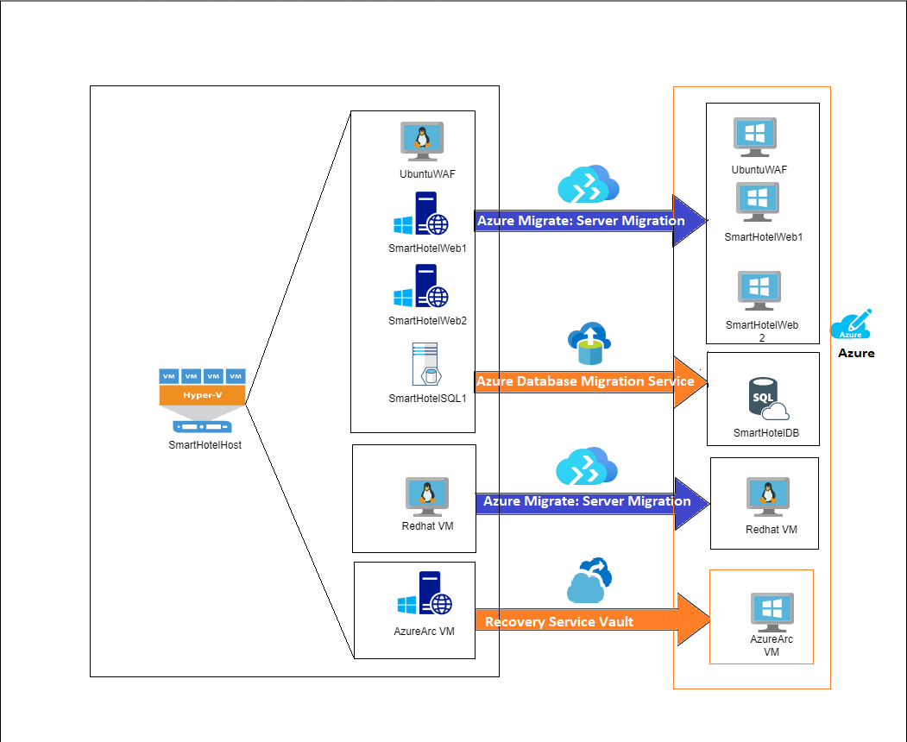
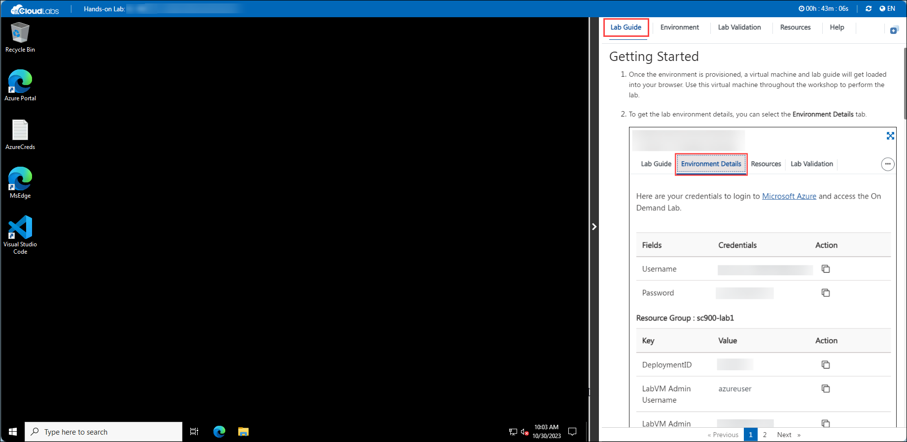
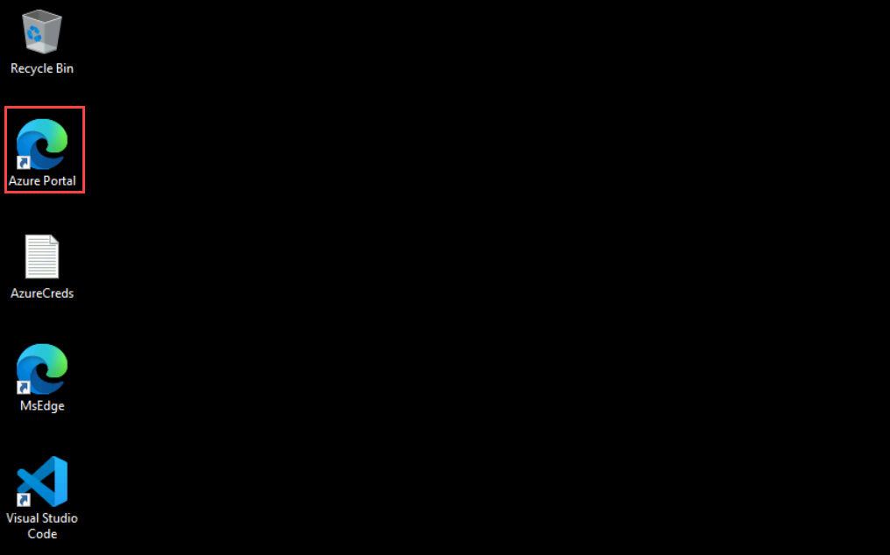

# Azure Migrate

## Overall Estimated Duration: 8 hours  

## Overview 

In this hands-on lab, you'll migrate and modernize workloads to Azure. You'll start by evaluating and migrating Windows and SQL Server workloads using Azure Migrate and Azure Site Recovery. Next, you'll replicate and migrate a Red Hat VM and OSS DB workloads, enabling Azure AD-based login and connecting to Azure Automanage. Finally, you'll manage a Windows machine with Azure Arc, using Azure Site Recovery for disaster recovery, including test failovers and failovers to Azure VMs.

## Objective

- **Evaluate and Plan Migration:** Assess your current environment using Azure Migrate, create migration assessments, and configure dependency visualization to ensure a smooth transition.

- **Set Up Azure Environment:** Prepare Azure for migration by creating storage accounts, registering Hyper-V hosts, enabling replication, and configuring networking.

- **Migrate Workloads:** Use Azure Migrate and Azure Site Recovery to migrate Windows, SQL Server, Linux, and OSS DB workloads, ensuring minimal downtime and leveraging Azure's scalability.

- **Optimize Workloads:** Enhance the performance and resilience of migrated workloads using VM Scale Sets, Azure Automanage, and Azure Active Directory for Linux.

- **Disaster Recovery and Security:** Implement disaster recovery plans with Azure Site Recovery, conduct test failovers, and enable failovers to Azure VMs. Enhance security with Microsoft Defender for Cloud, Microsoft Sentinel, and Azure Monitor.

To seamlessly migrate and modernize on-premises infrastructure to Azure, enhancing performance, scalability, and security while optimizing costs and leveraging advanced cloud services for innovation and agility.

- **Evaluate and Plan Migration:** Assess your current environment using Azure Migrate, create migration assessments, and configure dependency visualization to ensure a smooth transition.

- **Set Up Azure Environment:** Prepare Azure for migration by creating storage accounts, registering Hyper-V hosts, enabling replication, and configuring networking.

- **Migrate Workloads:** Use Azure Migrate and Azure Site Recovery to migrate Windows, SQL Server, Linux, and OSS DB workloads, ensuring minimal downtime and leveraging Azure's scalability.

- **Optimize Workloads:** Enhance the performance and resilience of migrated workloads using VM Scale Sets, Azure Automanage, and Azure Active Directory for Linux.

- **Disaster Recovery and Security:** Implement disaster recovery plans with Azure Site Recovery, conduct test failovers, and enable failovers to Azure VMs. Enhance security with Microsoft Defender for Cloud, Microsoft Sentinel, and Azure Monitor.

- **Governance and Business Analysis:** Apply Azure governance practices and perform business case analysis to ensure compliance and optimize resource management.

## Architecture

This diagram shows the process of migrating an on-premises SQL Server database to Azure SQL Managed Instance (SQL MI). It involves setting up SQL MI, assessing the database for compatibility issues, migrating data using Azure Data Migration Service (DMS), configuring a secure virtual network, deploying the web application to Azure, and enabling advanced SQL MI features for optimized performance and security.

## Architecture Diagram

## Explanation of Components

- **Visual Studio**: Used to deploy and publish the customer’s web application to Azure. It supports continuous development and integration practices, enabling developers to push updates to the cloud-hosted web app that interacts with SQL MI.

- **SQL Server Configuration Manager**: A vital tool for managing SQL Server services, network configurations, and server-specific settings. It is primarily used to control the behavior of SQL Server instances and related services.

- **Microsoft SQL Server Management Studio**: A comprehensive tool for managing SQL Server infrastructure. It provides a user-friendly interface for connecting, querying, configuring, and managing SQL Server databases both on-premises and in the cloud.

- **Azure Migrate: Server Migration:** Used for migrating the UbuntuWAF, SmartHotelWeb1, SmartHotelWeb2, and Redhat VM to Azure. This service facilitates the lift-and-shift of VMs to Azure.

- **Recovery Services Vault:** Utilized for migrating the AzureArc VM, likely using Azure Site Recovery for VM replication and failover.

- **Azure Arc:** It enables you to manage servers, Kubernetes clusters, and applications across data centres, edge, and multi-cloud environments from Azure.

- **Azure Database Migration Service (DMS):** A service used to migrate on-premises databases (like SQL Server) to cloud-based Azure SQL databases.

- **Storage account:** Azure Storage Account offers scalable, secure storage for backups, VM snapshots, and application data. It integrates with services like Recovery Services Vault for disaster recovery and long-term data retention in the cloud.

- **Azure**: Represents the Microsoft Azure cloud platform, where the on-premises resources have been migrated and are now managed.

## Getting Started with Lab
 
Welcome to the **Migrate Windows Server to Azure** workshop! We've prepared a seamless environment for you to explore and learn about Azure services. Let's begin by making the most of this experience:
 
## Accessing Your Lab Environment
 
Once you're ready to dive in, your virtual machine and lab guide will be right at your fingertips within your web browser.
 

### Virtual Machine & Lab Guide
 
Your virtual machine is your workhorse throughout the workshop. The lab guide is your roadmap to success.
 
## Exploring Your Lab Resources
 
To get a better understanding of your lab resources and credentials, navigate to the **Environment Details** tab.
 
.png)
 
## Utilizing the Split Window Feature
 
For convenience, you can open the lab guide in a separate window by selecting the **Split Window** button from the top right corner.
 
.png)
 
## Managing Your Virtual Machine
 
Feel free to start, stop, or restart your virtual machine as needed from the **Resources** tab. Your experience is in your hands!
 

## Let's Get Started with Azure Portal
 
1. On your virtual machine, click on the Azure Portal icon as shown below:
 
    

2. You'll see the **Sign into Microsoft Azure** tab. Here, enter your credentials:
 
   - **Email/Username:** <inject key="AzureAdUserEmail"></inject>
 
     
 
3. Next, provide your password:
 
   - **Password:** <inject key="AzureAdUserPassword"></inject>
 
   

4. If you see the pop-up Action Required, keep default and then click on Ask later. If you see the pop-up Help us protect your account, click on Skip for now(14 days until this is required), and then click on Next.

    

    > NOTE: Do not enable MFA, select Ask Later.

     

 
4. If prompted to stay signed in, you can click "No."
 
5. If a **Welcome to Microsoft Azure** pop-up window appears, simply click "Maybe Later" to skip the tour.
   
6. Now you will see the Azure Portal Dashboard, click on **Resource groups** from the Navigate panel to see the resource groups.

     
   
7. Confirm you have all resource groups present as shown below.

     

## Support Contact
 
The CloudLabs support team is available 24/7, 365 days a year, via email and live chat to ensure seamless assistance at any time. We offer dedicated support channels tailored specifically for both learners and instructors, ensuring that all your needs are promptly and efficiently addressed.

Learner Support Contacts:
- Email Support: cloudlabs-support@spektrasystems.com
- Live Chat Support: https://cloudlabs.ai/labs-support

Now, click on **Next** from the lower right corner to move on to the next page.
 
   .png)

### Happy Learning!!
