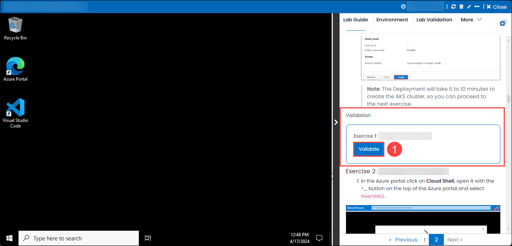
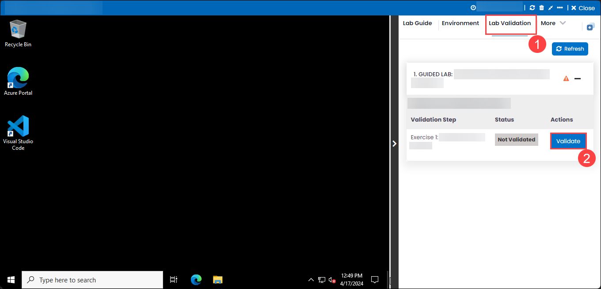

# Infrastructure Migration 

### Overall Estimated Duration: 8 Hours

## Overview

In this hands-on lab, you'll migrate and modernize workloads to Azure. You'll start by evaluating and migrating Windows and SQL Server workloads using Azure Migrate and Azure Site Recovery. Next, you'll replicate and migrate a Red Hat VM and OSS DB workloads, enabling Azure AD-based login and connecting to Azure Automanage. Finally, you'll manage a Windows machine with Azure Arc, using Azure Site Recovery for disaster recovery, including test failovers and failovers to Azure VMs.

### Key Features of Infrastructure Migration to Azure

- **Seamless Workload Migration:** Migrate Windows, SQL Server, Linux, and open-source database workloads using Azure Migrate and Azure Site Recovery (ASR). This ensures efficient and secure movement of applications and data from on-premises or other clouds to Azure.

- **Comprehensive Pre-Migration Setup:** Set up your Azure environment with appropriate networking, resource groups, and migration tools. Leverage built-in guidance to ensure your infrastructure is ready for server migration and modernization.

- **Holistic Application and Data Migration:** Use Azure Migrate: Server Migration and tools like the Azure Hybrid Benefit to transition apps and databases with minimal downtime. This includes end-to-end support for migrating application configurations, databases, and dependencies.

- **Optimization of Migrated Workloads:** Post-migration, optimize workloads for performance, cost, and security. Azure tools identify inefficiencies and enable scaling, resource rightsizing, and implementation of best practices across all stacks.

- **Modernization of Linux and OSS Databases:** Leverage Azure's tailored solutions to modernize Linux workloads and open-source databases. Azure ensures compatibility and provides support for scaling and optimizing these environments.

- **Hybrid Cloud Enablement with Azure Arc:** Extend Azure management capabilities to on-premises servers using Azure Arc-enabled server. This enables centralized monitoring, policy enforcement, and management for hybrid environments.

- **Advanced Disaster Recovery and Failover:** Configure Azure Site Recovery (ASR) to protect on-premises infrastructure. Perform test failovers and failover operations to Azure Cloud, ensuring business continuity in case of disasters.

- **Integrated Security and Monitoring:** Enable Microsoft Defender for Cloud, Microsoft Sentinel, and Azure Monitor to safeguard workloads post-migration. Integrate with Log Analytics for real-time insights and threat detection across your environment.

- **Business Case Analysis for Strategic Insights:** Conduct business case analysis to evaluate the financial and operational benefits of migration. Utilize Azure's reporting tools to assess cost savings, performance improvements, and ROI.

- **Unified Management and Automation:** Use Azure's centralized platform to manage all migrated workloads, automate processes, and apply consistent governance, security, and compliance across your infrastructure.

## Hands-on Labs Scenario

The following labs provide you with a quick and easy way to get started with Azure Migrate through on-premises environments that do not require any complex set-up or installations. 

For the purposes of these HOLs, let’s consider that SmartHotel is a large hotel company. 

Their IT systems run Windows, Linux, SQL Servers, and MySQL across on-premises data centers, distribution centers, and multiple public clouds. This poses operational challenges for SmartHotel. They’d like a consistent way to govern and operate across these disparate environments, ensure security across the entire organization, and enable innovation and developer agility, all while meeting regulatory and compliance requirements and being able to leverage the latest innovations of database technologies.

## Objective

- **Evaluate and Plan Migration:** Assess your current environment using Azure Migrate, create migration assessments, and configure dependency visualization to ensure a smooth transition.

- **Set Up Azure Environment:** Prepare Azure for migration by creating storage accounts, registering Hyper-V hosts, enabling replication, and configuring networking.

- **Migrate Workloads:** Use Azure Migrate and Azure Site Recovery to migrate Windows, SQL Server, Linux, and OSS DB workloads, ensuring minimal downtime and leveraging Azure's scalability.

- **Optimize Workloads:** Enhance the performance and resilience of migrated workloads using VM Scale Sets, Azure Automanage, and Azure Active Directory for Linux.

- **Disaster Recovery and Security:** Implement disaster recovery plans with Azure Site Recovery, conduct test failovers, and enable failovers to Azure VMs. Enhance security with Microsoft Defender for Cloud, Microsoft Sentinel, and Azure Monitor. 

- **Evaluate and Plan Migration:** Assess your current environment using Azure Migrate, create migration assessments, and configure dependency visualization to ensure a smooth transition.

- **Set Up Azure Environment:** Prepare Azure for migration by creating storage accounts, registering Hyper-V hosts, enabling replication, and configuring networking.

- **Migrate Workloads:** Use Azure Migrate and Azure Site Recovery to migrate Windows, SQL Server, Linux, and OSS DB workloads, ensuring minimal downtime and leveraging Azure's scalability.

- **Optimize Workloads:** Enhance the performance and resilience of migrated workloads using VM Scale Sets, Azure Automanage, and Azure Active Directory for Linux.

- **Disaster Recovery and Security:** Implement disaster recovery plans with Azure Site Recovery, conduct test failovers, and enable failovers to Azure VMs. Enhance security with Microsoft Defender for Cloud, Microsoft Sentinel, and Azure Monitor.

- **Governance and Business Analysis:** Apply Azure governance practices and perform business case analysis to ensure compliance and optimize resource management.

## Pre-requisites

- **Access to Azure Environment:** An active Azure subscription with necessary permissions to deploy and configure resources, including enabling Azure Migrate and Azure Site Recovery (ASR).  

- **Familiarity with Azure Services and Migration Tools:** Basic understanding of Azure concepts, resource management, and migration tools like Azure Migrate, Azure Hybrid Benefit, and ASR to ensure seamless migration.  

- **Technical Environment Preparation:** Prepared on-premises environment with necessary agents installed, server discovery enabled, and application compatibility assessed for migration readiness.  

## Architecture

The architecture diagram outlines a series of labs focused on migrating on-premises workloads to Azure and configuring hybrid cloud solutions. The labs begin with setting up an on-premises Hyper-V environment hosting multiple virtual machines, including Ubuntu, SQL Server, and RedHat VMs. Users utilize Azure Migrate: Server Migration to transfer VMs to Azure and Azure Database Migration Service for database migration. Additionally, the Recovery Services Vault is configured to ensure data recovery and backup for critical workloads. The labs conclude by onboarding hybrid resources like Azure Arc-enabled VMs, providing users with practical knowledge of Azure migration, hybrid cloud management, and backup solutions.

## Architecture Diagram

## Explanation of Components  

- **SmartHotelHost (Hyper-V)**: Represents the on-premises infrastructure hosting virtual machines (VMs) using Hyper-V, a Microsoft virtualization platform. It acts as the starting point for the migration process in the architecture.  

- **UbuntuWAF**: A virtual machine running Ubuntu, configured as a Web Application Firewall (WAF) for protecting web applications from common vulnerabilities and threats.  

- **SmartHotelWeb1 & SmartHotelWeb2**: Web server virtual machines hosting applications for the SmartHotel system. These are migrated to Azure as part of the server migration process.  

- **SmartHotelSQL1**: A virtual machine hosting a SQL Server database used by the SmartHotel application. Its database is migrated to Azure using the Azure Database Migration Service.  

- **Azure Migrate: Server Migration**: A service provided by Microsoft Azure for assessing and migrating on-premises virtual machines to Azure. It handles the lift-and-shift migration of SmartHotel VMs to the cloud.  

- **Azure Database Migration Service**: A managed service designed to migrate databases from on-premises environments (e.g., SQL Server) to Azure SQL Database or other Azure database services with minimal downtime.  

- **RedHat VM**: A virtual machine running Red Hat Enterprise Linux, representing a critical workload in the on-premises environment, migrated to Azure using Azure Migrate: Server Migration.  

- **AzureArc VM**: A virtual machine onboarded to Azure Arc to enable hybrid management and governance, allowing Azure services to extend to on-premises or multi-cloud environments.  

- **Recovery Services Vault**: A feature in Azure that provides backup and disaster recovery capabilities to protect migrated workloads in the cloud, ensuring business continuity.  

- **Azure**: Represents the destination cloud platform where all the on-premises workloads are migrated. It includes infrastructure, platform, and recovery services used for hosting and managing the migrated workloads.

## Getting Started with the Lab

Ensure you have access to all required tools, account and carefully read each task and follow the steps in sequence. Refer to screenshots and tips provided for guidance throughout the lab.

## **Accessing Your Lab Environment**
 
Once you're ready to dive in, your virtual machine and **Lab Guide** will be right at your fingertips within your web browser.

   

### **Virtual Machine & Lab Guide**
 
Your virtual machine is your workhorse throughout the workshop. The lab guide is your roadmap to success.
 
## **Exploring Your Lab Resources**
 
To get a better understanding of your lab resources and credentials, navigate to the **Environment Details** tab.

   
 
## **Utilizing the Split Window Feature**
 
For convenience, you can open the lab guide in a separate window by selecting the **Split Window** button from the Top right corner.
 
   
 
## **Managing Your Virtual Machine**
 
Feel free to start, stop, or restart your virtual machine as needed from the **Resources** tab. Your experience is in your hands!
 
  
 
## Lab Validation

1. After completing the task, hit the **Validate** button under Validation tab integrated within your lab guide. If you receive a success message, you can proceed to the next task, if not, carefully read the error message and retry the step, following the instructions in the lab guide.

   

1. You can also validate the task by navigating to the **Lab Validation** tab, from the upper right corner in the lab guide section.

   

1. If you need any assistance, please contact us at cloudlabs-support@spektrasystems.com.

## Lab Duration Extension

1. To extend the duration of the lab, kindly click the **Hourglass** icon in the top right corner of the lab environment. 

    

    >**Note:** You will get the **Hourglass** icon when 10 minutes are remaining in the lab.

2. Click **OK** to extend your lab duration.
 
   

3. If you have not extended the duration prior to when the lab is about to end, a pop-up will appear, giving you the option to extend. Click **OK** to proceed.

## **Let's Get Started with Azure Portal**
 
1. On your virtual machine, click on the Azure Portal icon as shown below:
 
    
 
2. You'll see the **Sign into Microsoft Azure** tab. Here, enter your credentials:
 
   - **Email/Username:** <inject key="AzureAdUserEmail"></inject>
 
      
 
3. Next, provide your password:
 
   - **Password:** <inject key="AzureAdUserPassword"></inject>
 
      
 
4. If you see the pop-up **Stay Signed in?**, click **No**.

   

5. If you see the pop-up **You have free Azure Advisor recommendations!**, close the window to continue the lab.

6. If a **Welcome to Microsoft Azure** popup window appears, click **Cancel** to skip the tour.

7. Now you will see the Azure Portal Dashboard, click on **Resource groups** from the Navigate panel to see the resource groups.

     
   
8. Confirm you have all resource groups present as shown below.

     
   
9. Now, click on the **Next** from the lower right corner to move to the next page.

   

## Support Contact

The CloudLabs support team is available 24/7, 365 days a year, via email and live chat to ensure seamless assistance at any time. We offer dedicated support channels tailored specifically for both learners and instructors, ensuring that all your needs are promptly and efficiently addressed.

Learner Support Contacts:

- Email Support: cloudlabs-support@spektrasystems.com
- Live Chat Support: https://cloudlabs.ai/labs-support

Now, click on Next from the lower right corner to move on to the next page.

## Happy Learning!!