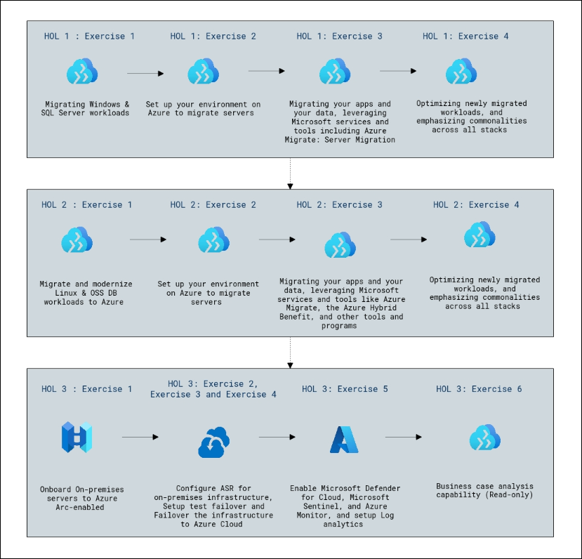
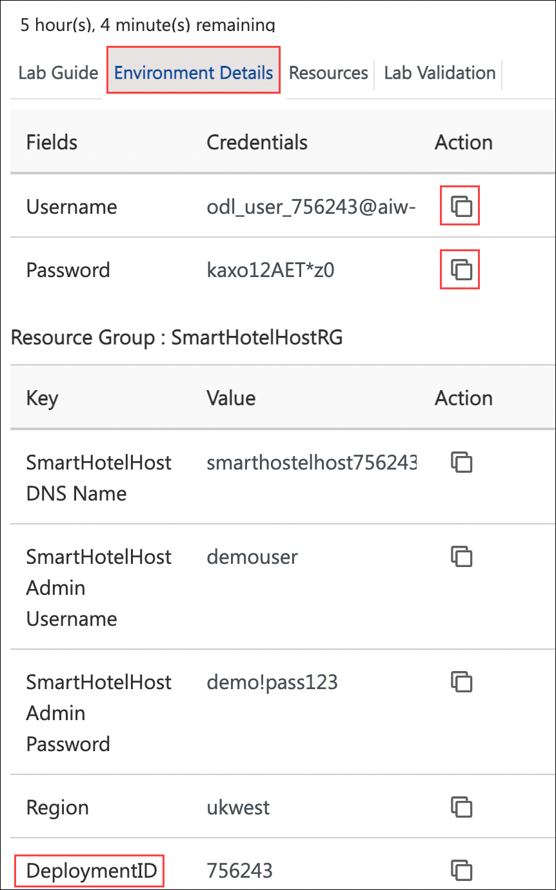
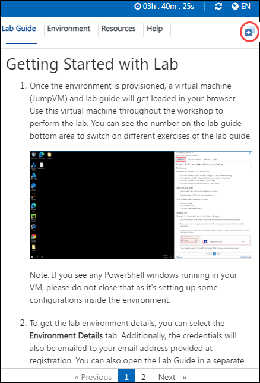

# Infrastructure Migration 

### Overall Estimated Duration: 7 Hours

## Overview

In this hands-on lab, you'll migrate and modernize workloads to Azure. You'll start by evaluating and migrating Windows and SQL Server workloads using Azure Migrate and Azure Site Recovery. Next, you'll replicate and migrate a Red Hat VM and OSS DB workloads, enabling Entra AD-based login and connecting to Azure Automanage. Finally, you'll manage a Windows machine with Azure Arc, using Azure Site Recovery for disaster recovery, including test failovers and failovers to Azure VMs.

### Key Features of Infrastructure Migration to Azure

- **Seamless Workload Migration:** Migrate Windows, SQL Server, Linux, and open-source database workloads using Azure Migrate and Azure Site Recovery (ASR). This ensures efficient and secure movement of applications and data from on-premises or other clouds to Azure.

- **Comprehensive Pre-Migration Setup:** Set up your Azure environment with appropriate networking, resource groups, and migration tools. Leverage built-in guidance to ensure your infrastructure is ready for server migration and modernization.

- **Holistic Application and Data Migration:** Use Azure Migrate: Server Migration and tools like the Azure Hybrid Benefit to transition apps and databases with minimal downtime. This includes end-to-end support for migrating application configurations, databases, and dependencies.

- **Optimization of Migrated Workloads:** Post-migration, optimize workloads for performance, cost, and security. Azure tools identify inefficiencies and enable scaling, resource rightsizing, and implementation of best practices across all stacks.

- **Modernization of Linux and OSS Databases:** Leverage Azure's tailored solutions to modernize Linux workloads and open-source databases. Azure ensures compatibility and provides support for scaling and optimizing these environments.

- **Hybrid Cloud Enablement with Azure Arc:** Extend Azure management capabilities to on-premises servers using Azure Arc-enabled server. This enables centralized monitoring, policy enforcement, and management for hybrid environments.

- **Advanced Disaster Recovery and Failover:** Configure Azure Site Recovery (ASR) to protect on-premises infrastructure. Perform test failovers and failover operations to Azure Cloud, ensuring business continuity in case of disasters.

- **Integrated Security and Monitoring:** Enable Microsoft Defender for Cloud, Microsoft Sentinel, and Azure Monitor to safeguard workloads post-migration. Integrate with Log Analytics for real-time insights and threat detection across your environment.

- **Business Case Analysis for Strategic Insights:** Conduct business case analysis to evaluate the financial and operational benefits of migration. Utilize Azure's reporting tools to assess cost savings, performance improvements, and ROI.

- **Unified Management and Automation:** Use Azure's centralized platform to manage all migrated workloads, automate processes, and apply consistent governance, security, and compliance across your infrastructure.

## Hands-on Labs Scenario

The following labs provide you with a quick and easy way to get started with Azure Migrate through on-premises environments that do not require any complex set-up or installations. 

For the purposes of these HOLs, let’s consider that SmartHotel is a large hotel company. 

Their IT systems run Windows, Linux, SQL Servers, and MySQL across on-premises data centers, distribution centers, and multiple public clouds. This poses operational challenges for SmartHotel. They’d like a consistent way to govern and operate across these disparate environments, ensure security across the entire organization, and enable innovation and developer agility, all while meeting regulatory and compliance requirements and being able to leverage the latest innovations of database technologies.

## Objective

- **Evaluate and Plan Migration:** Assess your current environment using Azure Migrate, create migration assessments, and configure dependency visualization to ensure a smooth transition.

- **Set Up Azure Environment:** Prepare Azure for migration by creating storage accounts, registering Hyper-V hosts, enabling replication, and configuring networking.

- **Migrate Workloads:** Use Azure Migrate and Azure Site Recovery to migrate Windows, SQL Server, Linux, and OSS DB workloads, ensuring minimal downtime and leveraging Azure's scalability.

- **Optimize Workloads:** Enhance the performance and resilience of migrated workloads using VM Scale Sets, Azure Automanage, and Azure Active Directory SSH Login for Linux.

- **Disaster Recovery and Security:** Implement disaster recovery plans with Azure Site Recovery, conduct test failovers, and enable failovers to Azure VMs. Enhance security with Microsoft Defender for Cloud, Microsoft Sentinel, and Azure Monitor. 

- **Evaluate and Plan Migration:** Assess your current environment using Azure Migrate, create migration assessments, and configure dependency visualization to ensure a smooth transition.

- **Set Up Azure Environment:** Prepare Azure for migration by creating storage accounts, registering Hyper-V hosts, enabling replication, and configuring networking.

- **Migrate Workloads:** Use Azure Migrate and Azure Site Recovery to migrate Windows, SQL Server, Linux, and OSS DB workloads, ensuring minimal downtime and leveraging Azure's scalability.

- **Optimize Workloads:** Enhance the performance and resilience of migrated workloads using VM Scale Sets, Azure Automanage, and Azure Active Directory SSH Login for Linux.

- **Disaster Recovery and Security:** Implement disaster recovery plans with Azure Site Recovery, conduct test failovers, and enable failovers to Azure VMs. Enhance security with Microsoft Defender for Cloud, Microsoft Sentinel, and Azure Monitor.

- **Governance and Business Analysis:** Apply Azure governance practices and perform business case analysis to ensure compliance and optimize resource management.

## Pre-requisites

- **Access to Azure Environment:** An active Azure subscription with necessary permissions to deploy and configure resources, including enabling Azure Migrate and Azure Site Recovery (ASR).  

- **Familiarity with Azure Services and Migration Tools:** Basic understanding of Azure concepts, resource management, and migration tools like Azure Migrate, Azure Hybrid Benefit, and ASR to ensure seamless migration.  

- **Technical Environment Preparation:** Prepared on-premises environment with necessary agents installed, server discovery enabled, and application compatibility assessed for migration readiness.  

## Architecture

The architecture diagram outlines a series of labs focused on migrating workloads to Azure, configuring Azure services, and leveraging Microsoft tools for optimization and monitoring. The labs begin with migrating Windows, SQL Server, Linux, and OSS database workloads, setting up environments for migration, and utilizing tools like Azure Migrate and the Azure Hybrid Benefit to transition applications and data. Users then onboard on-premises servers to Azure Arc-enabled, configure Azure Site Recovery (ASR) for failover, and migrate infrastructure to Azure. The sequence continues with enabling Microsoft Defender for Cloud, Sentinel, and Azure Monitor while setting up log analytics for security and monitoring, culminating in a business case analysis capability, offering a comprehensive understanding of Azure migration, optimization, and security operations.

## Architecture Diagram

## Explanation of Components  

- **Azure Migrate**: A centralized hub for discovering, assessing, and migrating on-premises servers, applications, and databases to Azure. It simplifies migration planning and execution by providing tools for workload analysis, cost estimation, and seamless migration.  

- **Azure Arc**: Enables on-premises servers and other non-Azure resources to integrate with Azure's management tools, allowing organizations to manage, secure, and govern resources across hybrid environments through a unified Azure interface.  

- **Azure Site Recovery (ASR)**: A disaster recovery solution that replicates on-premises servers to Azure, enabling failover and failback of workloads to ensure business continuity during outages or system failures.  

- **Microsoft Defender for Cloud**: A security management tool that provides visibility and protection for workloads running in Azure, on-premises, and other cloud platforms. It helps detect threats, manage security posture, and ensure compliance.  

- **Microsoft Sentinel**: A cloud-native security information and event management (SIEM) and security orchestration automated response (SOAR) solution that aggregates security data, detects threats, and enables incident response through playbooks and analytics.  

- **Azure Monitor**: A service that collects, analyzes, and acts on telemetry data from Azure resources, on-premises environments, and other clouds, providing insights into the performance and health of applications and infrastructure.  

- **Log Analytics**: A tool within Azure Monitor that enables querying and analyzing log data from Azure resources to gain insights, troubleshoot issues, and improve operational efficiency.  

- **Azure Hybrid Benefit**: A licensing benefit that helps organizations reduce costs when migrating workloads to Azure by allowing them to use existing on-premises licenses for Windows Server and SQL Server in the cloud.  

- **Business Case Analysis**: A read-only capability designed to help organizations assess the financial and operational benefits of migrating workloads to Azure, providing insights into cost optimization and ROI.  

## Getting Started with the Lab

Ensure you have access to all required tools, account and carefully read each task and follow the steps in sequence. Refer to screenshots and tips provided for guidance throughout the lab.

## **Accessing Your Lab Environment**
 
Once you're ready to dive in, your virtual machine and **Lab Guide** will be right at your fingertips within your web browser.

   

### **Virtual Machine & Lab Guide**
 
Your virtual machine is your workhorse throughout the workshop. The lab guide is your roadmap to success.
 
## **Exploring Your Lab Resources**
 
To get a better understanding of your lab resources and credentials, navigate to the **Environment Details** tab.

   
 
## **Utilizing the Split Window Feature**
 
For convenience, you can open the lab guide in a separate window by selecting the **Split Window** button from the Top right corner.
 
   
 
## **Managing Your Virtual Machine**
 
Feel free to start, stop, or restart your virtual machine as needed from the **Resources** tab. Your experience is in your hands!
 
  

## **Let's Get Started with Azure Portal**
 
1. On your virtual machine, click on the Azure Portal icon as shown below:
 
    
 
2. You'll see the **Sign into Microsoft Azure** tab. Here, enter your credentials:
 
   - **Email/Username:** <inject key="AzureAdUserEmail"></inject>
 
      
 
3. Next, provide your password:
 
   - **Password:** <inject key="AzureAdUserPassword"></inject>
 
      
 
4. If you see the pop-up **Stay Signed in?**, click **No**.

   

5. If you see the pop-up **You have free Entra ADvisor recommendations!**, close the window to continue the lab.

6. If a **Welcome to Microsoft Azure** popup window appears, click **Cancel** to skip the tour.

7. Now you will see the Azure Portal Dashboard, click on **Resource groups** from the Navigate panel to see the resource groups.

     
   
8. Confirm you have all resource groups present as shown below.

     
   
9. Now, click on the **Next** from the lower right corner to move to the next page.

   

## Support Contact

The CloudLabs support team is available 24/7, 365 days a year, via email and live chat to ensure seamless assistance at any time. We offer dedicated support channels tailored specifically for both learners and instructors, ensuring that all your needs are promptly and efficiently addressed.

Learner Support Contacts:

- Email Support: cloudlabs-support@spektrasystems.com
- Live Chat Support: https://cloudlabs.ai/labs-support

Now, click on Next from the lower right corner to move on to the next page.

## Happy Learning!!
