# Lab: Migrate Windows Servers from Hyper-V to Azure

## Overview

In this lab, you will learn how to migrate on-premises virtual machines to Azure using Azure Migrate: Server Migration. The tasks include creating a storage account for migration data, registering the Hyper-V host with Azure Migrate, enabling replication from Hyper-V to Azure Migrate, configuring networking with static IPs for replicated VMs, and performing the migration of virtual machines to Azure. By completing these tasks, you will gain practical experience in setting up and executing a migration strategy, ensuring a seamless transition from on-premises environments to the Azure cloud.

## Lab objectives

In this exercise, you will complete the following tasks:

- Task 1: Create a Storage Account

- Task 2: Register the Hyper-V Host with Migration and modernization

- Task 3: Enable Replication from Hyper-V to Azure Migrate

- Task 4: Configure Networking

- Task 5: Server migration

## Exercise 1: Migrating your apps and your data, leveraging Microsoft services and tools including Azure Migrate: Server Migration

In this Guided Lab, you will learn about Azure migration and how all pre-migration steps such as discovery, assessments, and right-sizing of on-premises resources are included for infrastructure, data, and applications. Azure Migrate provides a simplified migration, modernization, and optimization service for Azure.

### Task 1: Create a Storage Account

In this task, you will create a new Azure Storage Account that will be used by Migration and for storage of your virtual machine data during migration.

> **Note:** This lab focuses on the technical tools required for workload migration. In a real-world scenario, more consideration should go into the long-term plan prior to migrating assets. The landing zone required to host VMs should also include considerations for network traffic, access control, resource organization, and governance. For example, the CAF Migration Blueprint and CAF Foundation Blueprint can be used to deploy a pre-defined landing zone and demonstrate the potential of an Infrastructure as Code (IaC) approach to infrastructure resource management. For more information, see [Azure Landing Zones](https://docs.microsoft.com/azure/cloud-adoption-framework/ready/landing-zone/) and [Cloud Adoption Framework Azure Migration landing zone Blueprint sample](https://docs.microsoft.com/azure/governance/blueprints/samples/caf-migrate-landing-zone/).

1. In the Azure portal's left navigation, select **+ Create a resource**, then search for and select **Storage account**, followed by **Create**.

     

2. In the **Create storage account** blade, on the **Basics** tab, use the following values:

   - Subscription: **Select your Azure subscription (1)**.
  
   - Resource group: **AzureMigrateRG (2)**
  
   - Storage account name: **migrationstorage<inject key="DeploymentID" enableCopy="false" /> (3)**

   - Location: Select **<inject key="Region" enableCopy="false" /> (4)** from the dropdown.
    
   - Performance: **Standard (5)**
  
   - Redundancy: **Locally-redundant storage (LRS) (6)**

     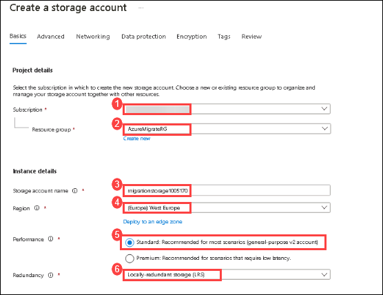

3. Select **Review**, then select **Create**.

4. Once the storage account is deployed, click on **Go to resource** to open it.

5. Select **Data protection** under **Data management** from the left-hand side menu of storage account.

     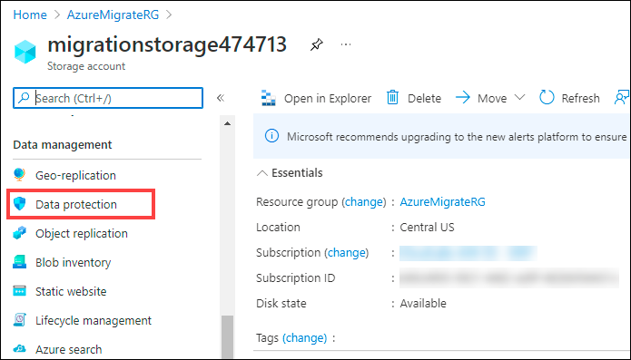

6. Now, uncheck the box next to **Enable soft delete for blobs** and **Enable soft delete for containers** to disable the soft delete on blobs and containers as the soft delete enabled storage account is **not supported** for enabling replication on Virtual Machines. Click on **Save**.

     

#### Task summary 

In this task, you created a new Azure Storage Account that will be used for Migration and modernization.

### Task 2: Register the Hyper-V Host with Migration and modernization

In this task, you will register your Hyper-V host(LabVM) with the Migration and Modernization service. This service uses Azure Site Recovery as the underlying migration engine. As part of the registration process, you will deploy the Azure Site Recovery Provider on your Hyper-V host.

1. If you are not logged in already, click on the Azure portal shortcut that is available on the desktop and log in with below Azure credentials.
    
    * Azure Username/Email: <inject key="AzureAdUserEmail"></inject> 
    
    * Azure Password: <inject key="AzureAdUserPassword"></inject>

2. Click on **Show Portal Menu (1)** bar and select **All services (2)** in the portal's left navigation.
 
     

3. In the search bar, search for **Azure Migrate** and select it from the suggestions to open the Azure Migrate Overview blade, as shown below. 
 
     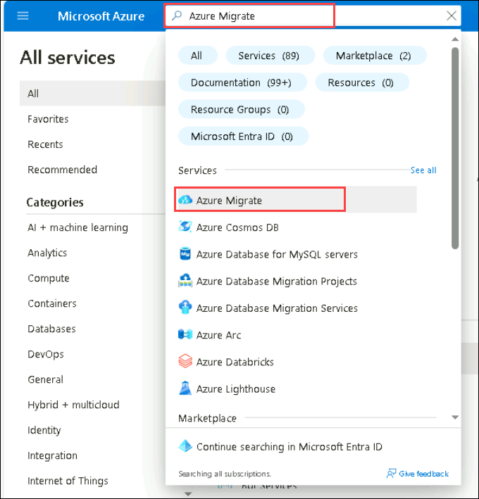

4. Select **Servers, databases and web apps (1)** under **Migration goals** on the left. Under **Migration Tools**, select **Discover (2)**.

   > **Note:** You may need to add the migration tool yourself by following the link below the **Migration Tools** section, selecting **Migration and modernization**, then selecting **Add tool(s)**.
   
     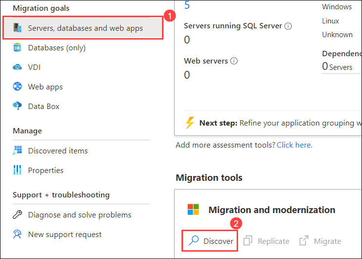

5. In the **Discover** panel, provide the following details:

   - Under **Where do you want to migrate to?**, select **Azure VM (1)**

   - Under **Are your machines virtualized**, select **Yes, with Hyper-V (2)**.

   - Under **Target region (3)** make sure to select the **<inject key="Region" enableCopy="false" />** region.

   - Check the **confirmation (4)** checkbox and select **Create resources (5)** to begin the deployment of the Azure Site Recovery resource used by Migration and modernization for Hyper-V migrations.

     

     > **Note:** Once deployment is complete, the 'Discover machines' panel should be updated with additional instructions.
  
6. Click on the **Download** link for the Hyper-V replication provider software installer to download the Azure Site Recovery provider installer.

     

7. Return to the **Discover** page in your browser select the blue **Download** button and download the registration key file.

     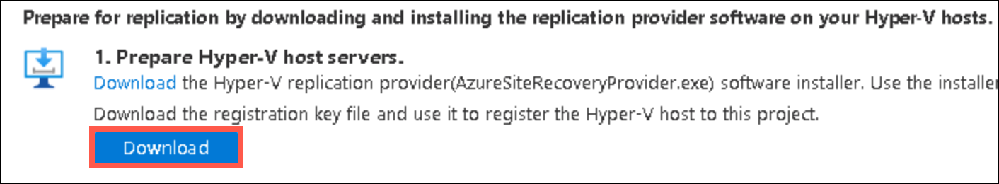

8. Open the **AzureSiteRecoveryProvider.exe** installer you downloaded a moment ago. On the **Microsoft Update** tab, select **Off** and select **Next**. Accept the default installation location and select **Install**.

    > **Note:** If you are prompted with a pop-up like the latest version of the Provider is installed on this server. Would you like to proceed to registration? select **Yes**. (You can directly jump to the next step in that case.)
  
     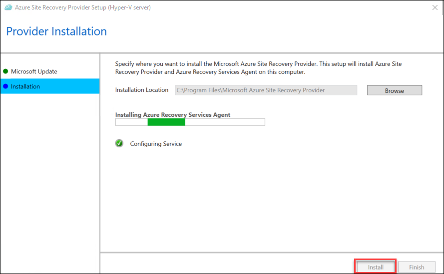

9. When the installation has completed select **Register**. Browse to the location of the key file you downloaded. When the key is loaded select **Next**.

     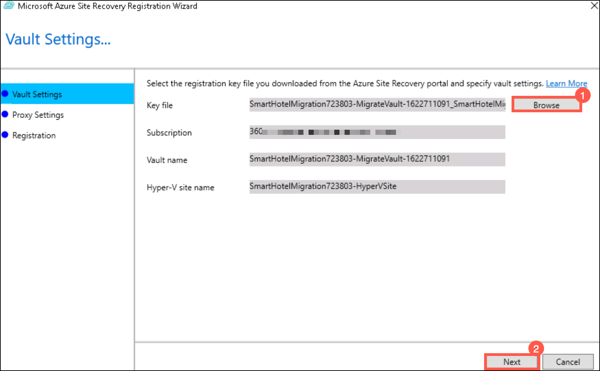

10. Select **Connect directly to Azure Site Recovery without a proxy server (1)** and select **Next (2)**. The registration of the Hyper-V host with Azure Site Recovery will begin.

     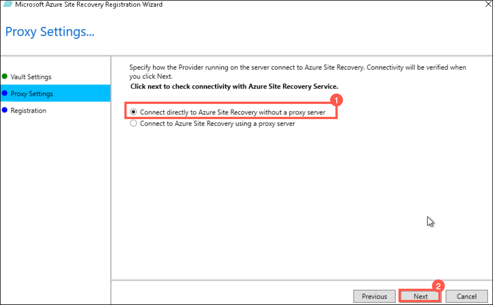

11. Wait for registration to complete (this may take several minutes). Then select **Finish**.

     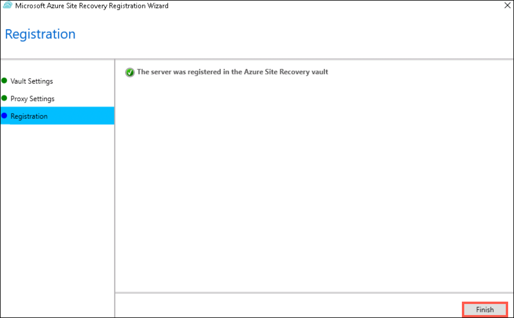

12. Return to the Azure Migrate browser window. **Refresh** your browser, then re-open the **Discover machines** panel by selecting **Discover** under **Migration and modernization** and selecting **Azure VM** for **Where do you want to migrate to?** and **Yes, with Hyper-V** for **Are your machines virtualized?**.

     

13. Select **Finalize registration**, which should now be enabled.

14. Azure Migrate will now complete the registration with the Hyper-V host. **Wait** for the registration to complete. This may take several minutes.

     

15. Once the registration is complete, close the **Discover machines** panel using **X** button.

     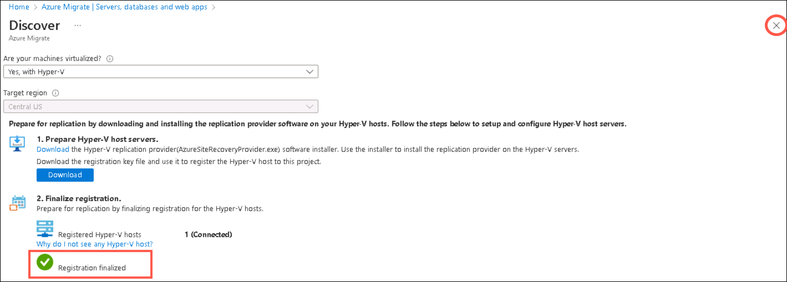

16. The **Migration and modernization** panel should now show 7 discovered servers.

     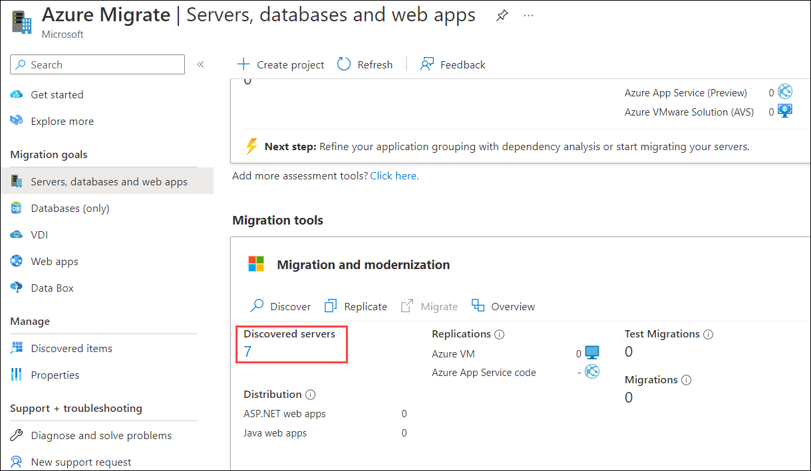

    > **Congratulations** on completing the task! Now, it's time to validate it. Here are the steps:
    > - Hit the Validate button for the corresponding task. If you receive a success message, you can proceed to the next task.
    > - If not, carefully read the error message and retry the step, following the instructions in the lab guide.
    > - If you need any assistance, please contact us at cloudlabs-support@spektrasystems.com. We are available 24/7 to help you out.
    
<validation step="f6909507-90ed-4ead-9cdd-5fa96933c27e" />
     
#### Task summary 

In this task, you registered your Hyper-V host with the Azure Migrate Server Migration service.

### Task 3: Enable Replication from Hyper-V to Azure Migrate

In this task, you will configure and enable the replication of your on-premises virtual machines from Hyper-V to the Azure Migrate Server Migration service.

1. Under the **Migration and modernization**, select **Replicate**. This opens the **Replicate** wizard.

     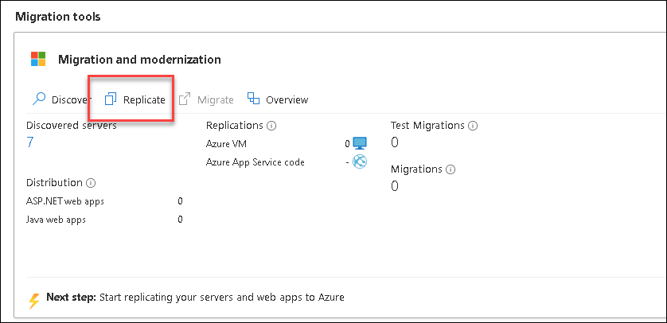
   
2. Under the **Specific intent** page, provide the below details:

     -  What do you want to migrate? : Select **Servers or Virtual machines (VM)** **(1)**
    
     -  Where do you want to migrate to? : Select **Azure VM** **(2)**
  
     -  Are your machines virtualized? : Select **Yes, with Hyper-V (3)**
    
     -  Click on **Continue (4)**

        .png)

    >**Note**: If you get any error kindly refresh the screen periodically or Please try signing in to the Azure portal using incognito mode.

3. In the **Virtual machines** tab, under **Import migration settings from an assessment**, select **No, I'll specify the migration settings manually**.

     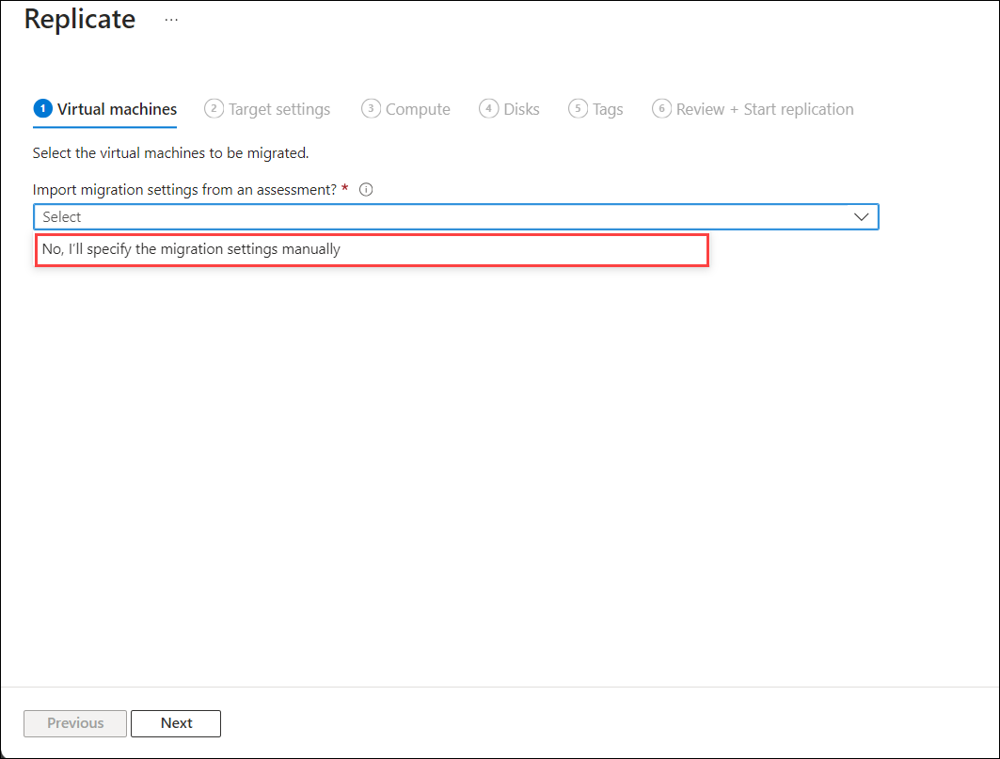

4. The **Virtual machines** Tab. Select the **smarthotelweb1**, and **smarthotelweb2** virtual machines, then select **Next**.

     
      

5. On the **Target settings** tab, select the below information:

    - Select your subscription and the existing **SmartHotelHostRG (1)** resource group. 

    - **Replication storage account**: Enter the storage account here from the drop-down which you create in task 1 **(2)**. 

    - **Virtual Network**: Select **SmartHotelVNet (3)**. 

    - **Subnet**: Select **SmartHotel (4)**. 

    - Leave other values as default and select **Next (5)**.
   
     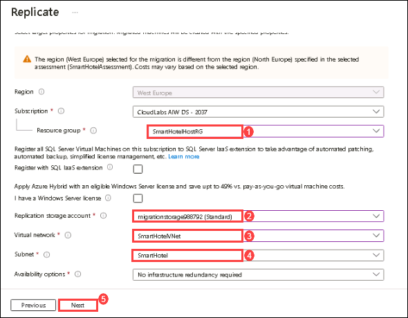

    > **Note:** For simplicity, in this lab you will not configure the migrated VMs for high availability, since each application tier is implemented using a single VM.

6. On the **Compute** tab, select the below configuration,

    - Select the **Standard_F2s_v2** VM size for each virtual machine. 

    - Select the **Windows** operating system for the **smarthotelweb1**, **smarthotelweb2** virtual machines.

    - Select **Next**. 

     
    
7. In the **Disks** tab, review the settings but do not make any changes. Select **Next: Tags**, then select **Replicate** to start the server replication.

8. In the **Azure Migrate - Servers, databases and web apps** blade, under **Migration and modernization**, select the **Overview** button.

     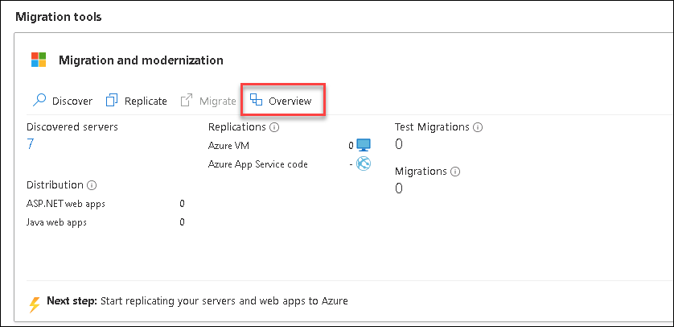
      
    
9. Confirm that the 2 machines are replicating.

     
      
10. Select **Replications (1)** under **Migration** on the left.  Select **Refresh (2)** occasionally and wait until all two machines have a **Protected (3)** status, which shows the initial replication is complete. This will take 5-10 minutes. 

      .png "Key file registration")
    
   > **Note**: Please make sure you run the **validation steps** for this task before moving to the next tasks as there are few dependencies. **Not** running the validation after performing this task will result in **validation failure** as the status of the Virtual Machine will be changed from **Protected** to **Planned failover** when you migrate the servers in Task5.

> **Congratulations** on completing the task! Now, it's time to validate it. Here are the steps:
    > - Hit the Validate button for the corresponding task. If you receive a success message, you can proceed to the next task.
    > - If not, carefully read the error message and retry the step, following the instructions in the lab guide.
   > - If you need any assistance, please contact us at cloudlabs-support@spektrasystems.com. We are available 24/7 to help you out.
    
<validation step="73379d43-ce72-4e43-9e4b-0ebd5bb8ec9f" />

#### Task summary 

In this task, you enabled replication from the Hyper-V host to Azure Migrate and configured the replicated VM size in Azure.

### Task 4: Configure Networking

In this task, you will modify the settings for each replicated VM to use a static private IP address that matches the on-premises IP addresses for that machine.

1. Still using the **Migration and modernization - Replicating machines** blade, select the **smarthotelweb1** virtual machine. This opens a detailed migration and replication blade for this machine. Take a moment to study this information.

    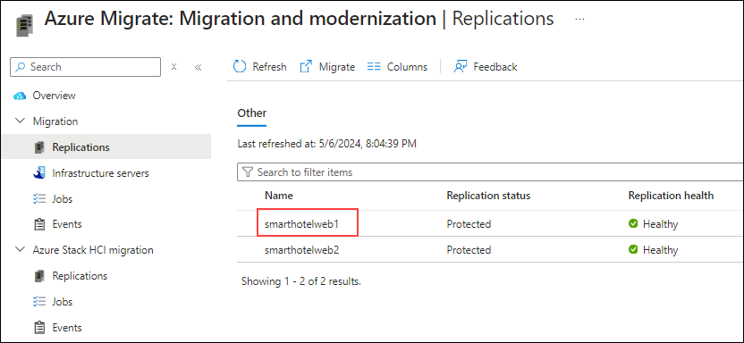

2. Select **Compute and Network (1)** under **General** on the left, then select **Edit (2)**.

    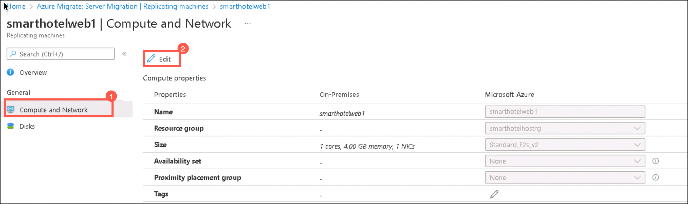

3. Confirm that the VM is configured to use the **F2s_v2** VM size.

4. Under **Network Interfaces**, select **InternalNATSwitch** to open the network interface settings.

    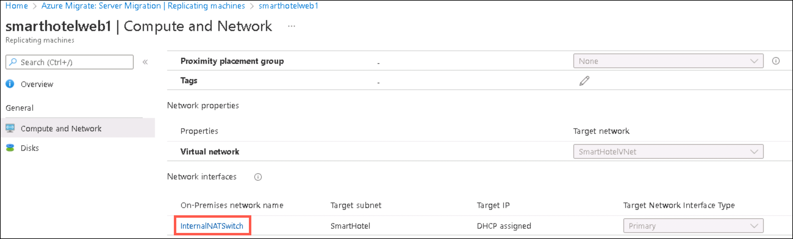

5. Change the **Private IP address** to **192.168.0.4**

    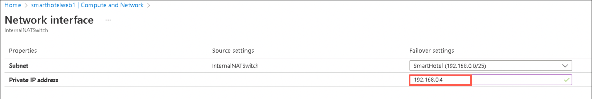

6. Select **OK** to close the network interface settings blade, then **Save** the **smarthotelweb1** settings.

7. Repeat these steps to configure the private IP address for the other VM.
 
   - For **smarthotelweb2** use private IP address **192.168.0.5**

#### Task summary 

In this task, you modified the settings for each replicated VM to use a static private IP address that matches the on-premises IP addresses for that machine

> **Note**: Azure Migrate makes a "best guess" at the VM settings, but you have full control over the settings of migrated items. In this case, setting a static private IP address ensures the virtual machines in Azure retain the same IPs they had on-premises, which avoids having to reconfigure the VMs during migration (for example, by editing web.config files).

### Task 5: Server migration

In this task, you will perform a migration of the smarthotelweb1 and smarthotelweb2 machines to Azure.

> **Note**: In a real-world scenario, you would perform a test migration before the final migration. To save time, you will skip the test migration in this lab. The test migration process is very similar to the final migration.

1. Return to the **Migration and modernization** overview blade. Under **Step 3: Migrate**, select **Migrate**.

    

1. On the **Specify intent** tab, Select **Azure VM** under Where do you want to migrate to? and select **Continue**.

    

3. On the **Migrate** blade, select **yes (1)** for **Shutdown machines before migration to minimum data loss** and select the 2 virtual machines **(2)** then select **Migrate (3)** to start the migration process.

    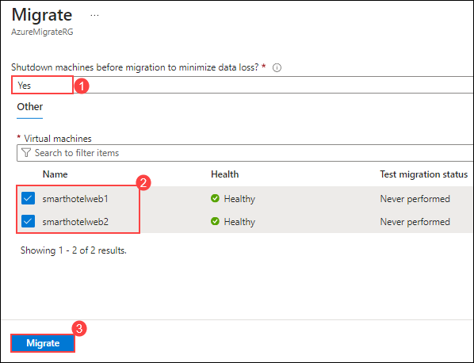

   > **Note**: You can optionally choose whether the on-premises virtual machines should be automatically shut down before migration to minimize data loss. Either setting will work for this lab.

4. The migration process will start.

    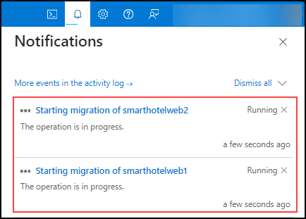

5. To monitor progress, select **Jobs (1)** under **Migration** on the left and review the status of the two **Planned failover (2)** jobs.

    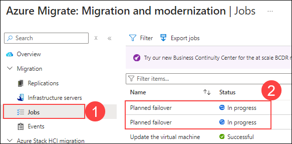

6. **Wait** until all two **Planned failover** jobs show **Status** to **Successful**. You should not need to refresh your browser. This could take up to 15 minutes.

    

7. Navigate to the **SmartHotelHostRG** resource group and check that the VM, network interface, and disk resources have been created for each of the virtual machines being migrated.

    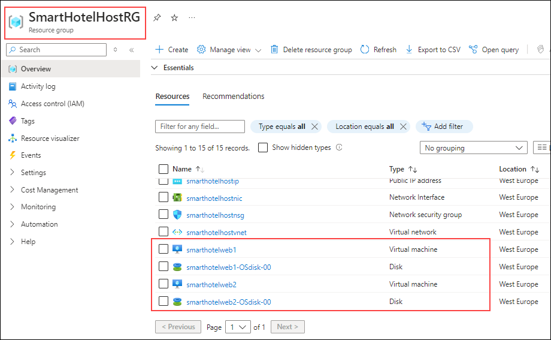

    > **Congratulations** on completing the task! Now, it's time to validate it. Here are the steps:
    > - Hit the Validate button for the corresponding task. If you receive a success message, you can proceed to the next task.
    > - If not, carefully read the error message and retry the step, following the instructions in the lab guide.
    > - If you need any assistance, please contact us at cloudlabs-support@spektrasystems.com. We are available 24/7 to help you out.
    
    <validation step="e4fc8753-2a84-4e27-8b12-cb43582a0e6c" />

#### Task summary 

In this task, you assigned a public IP address to the SmartHotel VM and verified that the application is now functioning in Azure.

### Task 6: Pointers around Azure Networking and Azure Network Security (Read only)

Design and implementation of Azure networking is one of the most critical steps in migrating your infrastructure as a service (IaaS) and platform as a service (PaaS) implementations in Azure.

#### Azure Networking Best Practises:

- Assign an address space that is not larger than a CIDR range of /16 for each virtual network. Virtual networks allow for the use of 65,536 IP addresses. Assigning a smaller prefix than /16, such as a /15, which has 131,072 addresses, will result in the excess IP addresses becoming unusable elsewhere. It is important not to waste IP addresses, even if they're in the private ranges defined by RFC 1918.

- The hub is an Azure virtual network that acts as a central point of connectivity. The spokes are virtual networks that connect to the hub virtual network by using peering. Shared services are deployed in the hub, while individual workloads are deployed as spokes.

- To provide isolation within a virtual network, you segment it into one or more subnets and give a portion of the virtual network's address space to each subnet.

- Azure adds a DNS server by default when you deploy a virtual network. You can use this server to rapidly build virtual networks and deploy resources.

- DNS servers in a virtual network can forward DNS queries to the recursive resolvers in Azure. This forwarding enables you to resolve host names within that virtual network.

- DNS forwarding allows VMs to see both your on-premises resources (via the domain controller) and Azure-provided host names (using the forwarder). You can access the recursive resolvers in Azure by using the virtual IP address 168.63.129.16.

- DNS forwarding also enables DNS resolution between virtual networks and allows on-premises machines to resolve host names provided by Azure.

- A VPN gateway is a specific type of virtual network gateway. It sends encrypted traffic between an Azure virtual network and an on-premises location over the public internet.

- A VPN gateway can also send encrypted traffic between virtual networks in Azure over the Microsoft network. Each virtual network can have only one VPN gateway.

#### Azure Network Security Best Practises:

- Azure Site Recovery enables disaster recovery and migration to Azure for on-premises Hyper-V virtual machines, VMware virtual machines, and physical servers. For all on-premises to Azure scenarios, replication data is sent to and stored in an Azure Storage account.

- Once VMs have been created after failover to Azure, NSGs can be used to limit network traffic to the virtual network and VMs. Site Recovery does not create NSGs as part of the failover operation.

- We can create the required Azure NSGs before initiating failover. You can then associate NSGs to failed over VMs automatically during failover, using automation scripts with Site Recovery's powerful recovery plans.

- Once the NSGs are created and configured, we can run a test failover to verify scripted NSG associations and post-failover VM connectivity.

### Task 7:  Migrating VMware VMs to Azure (Read only)

Azure Migrate is a free tool from Microsoft that allows VMware administrators to replicate their VMs from on-prem to Azure. It is an extremely powerful tool that even allows for pre-migration tests to run.

Azure Migrate has two migration options:

- Migration with an agent for replication, requires an agent to be installed on each VM that is to be migrated.
- Migration using agentless replication, requires an agentless format which requires no agent.

**Discovery/Assessment**:

 Discover up to 10,000 VMware VMs with a single Azure Migrate appliance for VMware. The appliance supports adding multiple vCenter Servers. You can add up to 10 vCenter Servers per appliance.
 

#### Agentless migration: 

- Agentless migration uses the Azure Migrate appliance. You can deploy the appliance as a VMware VM using an OVA template, imported into the vCenter Server, or using a PowerShell script.

- you can simultaneously replicate a maximum of 500 VMs across multiple vCenter Servers (discovered from one appliance) using a scale-out appliance.

- If you are interested in learning more about Agentless migration, you can [read more here](https://docs.microsoft.com/en-us/azure/migrate/tutorial-migrate-vmware).

#### Agent-based migration: 

- Agent-based migration does not use the Azure Migrate appliance. If you've set up an appliance for assessment, you can leave it in place, or remove it if you're done with assessment.

- you can scale out the replication appliance to replicate large numbers of VMs.

- If you are interested in learning more about Agent-based migration, you can [read more here](https://docs.microsoft.com/en-us/azure/migrate/tutorial-migrate-vmware-agent).

In the portal, you can select up to 10 machines at once for replication. To replicate more machines, add in batches of 10.

### Review:

In this exercise, you have completed the following:

- Successfully set up a storage account in Azure to support the migration process, ensuring proper storage management for the virtual machines.

- Registered the Hyper-V host with Azure Migration and Modernization services, utilizing Azure Site Recovery for a seamless migration process.

- Configured and enabled replication of on-premises virtual machines from Hyper-V to Azure Migrate, ensuring data consistency and availability during the migration.

- Adjusted the networking settings for the replicated virtual machines, including configuring static private IP addresses, to ensure seamless integration with Azure resources.

- Successfully migrated the UbuntuWAF, smarthotelweb1, and smarthotelweb2 machines to Azure, ensuring minimal downtime and a smooth transition to the cloud environment.

### Conclusion

Congratulations on completing the lab! Throughout this exercise, you have gained hands-on experience with Azure Migrate: Server Migration and the process of migrating Windows Servers from Hyper-V to Azure. From creating storage accounts for migration data to registering your Hyper-V host and configuring replication, you have developed a comprehensive understanding of migration processes in Azure.

By completing this lab, you successfully configured networking with static IPs for replicated VMs, performed migrations, and reviewed essential network and security best practices. These skills will empower you to efficiently manage and optimize the migration of on-premises virtual machines to Azure, ensuring a seamless transition to the cloud.

We hope this lab has provided valuable insights and practical experience to help you tackle real-world challenges in cloud migrations. Thank you for participating, and we look forward to your continued success in leveraging Azure Migrate for cloud-based transformations.

### You have successfully completed the lab.