# HOL 1: Migrating Windows & SQL Server workloads

Duration: 60 minutes

In this HOL, you will use Azure Migrate: Server Assessment to assess the on-premises environment. This will include selecting Azure Migrate tools, deploying the Azure Migrate appliance into the on-premises environment, creating a migration assessment, and using the Azure Migrate dependency visualization.

### Exercise 1: Discovery, Assess, and Plan: Evaluate your current environment

In this exercise, you will deploy the Azure Migrate appliance in the on-premises Hyper-V environment. This appliance communicates with the Hyper-V server to gather configuration and performance data about your on-premises VMs, and returns that data to your Azure Migrate project.

1. If you are not logged in already, click on Azure portal shortcut that is available on the desktop and log in with below Azure credentials.
    * Azure Username/Email: <inject key="AzureAdUserEmail"></inject> 
    * Azure Password: <inject key="AzureAdUserPassword"></inject>

2. Click on **Show Portal Menu (1)** bar and select **All services (2)** in the portal's left navigation.
 
    

3. In the search bar, search for **Azure Migrate** and select it from the suggestions to open the Azure Migrate Overview blade, as shown below. 
 
    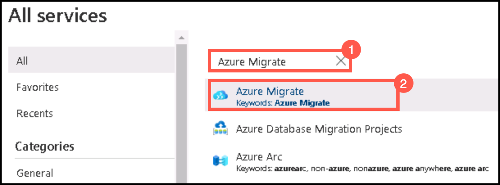

4. Under **Migration goals**, select **Servers, databases and web apps** and then under **Azure Migrate: Discovery and assessment**, select **Discover** to open the **Discover** blade.
 
    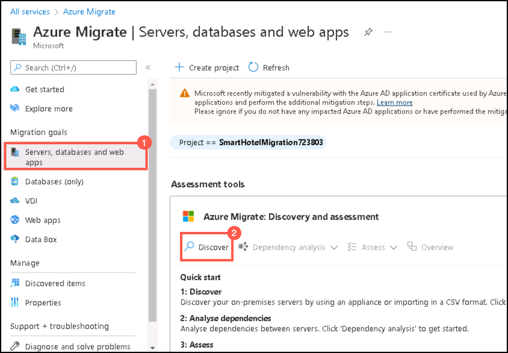
 
5. Under **Are your machines virtualized?**, select **Yes, with Hyper-V** from the **drop-down** menu.

    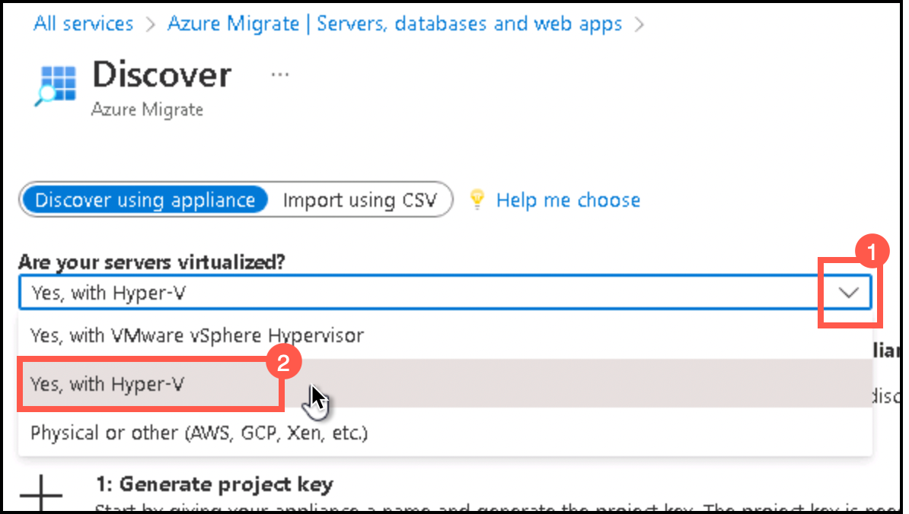

6.  In **1: Generate Azure Migrate project key**, provide below name for the **Azure Migrate appliance** that you will set up for discovery of Hyper-V VMs. Select **Generate key** to start the creation of the required Azure resources.

     ```
     SmartHotelAppl
     ```
    

7.  **Wait** for the key to be generated, then copy the **Azure Migrate project key** to your clipboard.

    

8.  Read through the instructions on how to download, deploy and configure the Azure Migrate appliance then close the 'Discover machines' blade by clicking on cross button **X** (do **not** download the .VHD file or .ZIP file, the .VHD has already been downloaded for you). 
 
    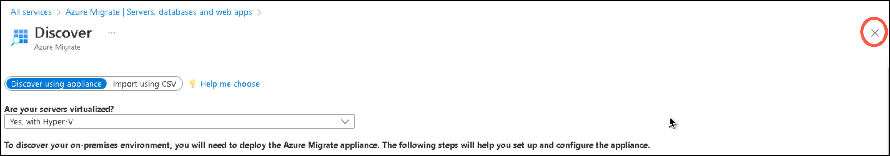

9. Go to **Start** button in the VM, search for **Hyper-V Manager** there and select it. 

   > You can also open the **Hyper-V manager** by clicking on the icon  that is present in the taskbar. 

    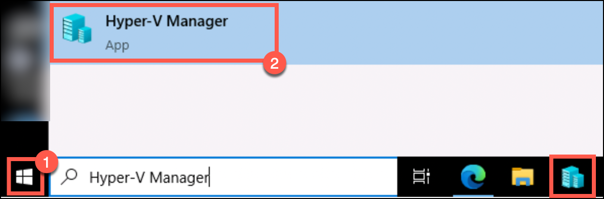

10. In Hyper-V Manager, select **SMARTHOST<inject key="DeploymentID" enableCopy="false" />**. You should now see the AzureMigrateAppliance VM and four VMs that comprise the on-premises SmartHotel application.

    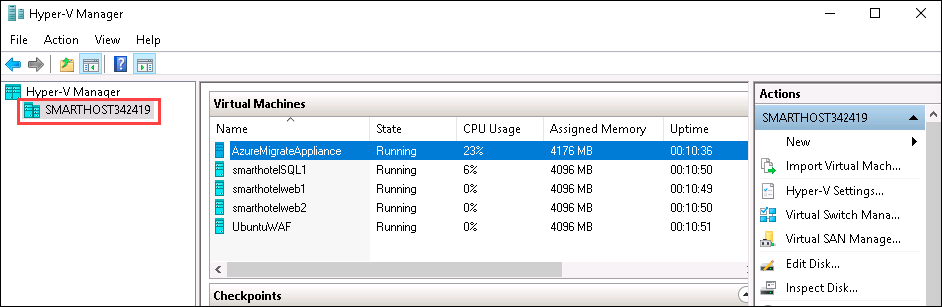
     
11. In Hyper-V Manager, select the **AzureMigrateAppliance** VM, then select **Start** on the right if not already running.

    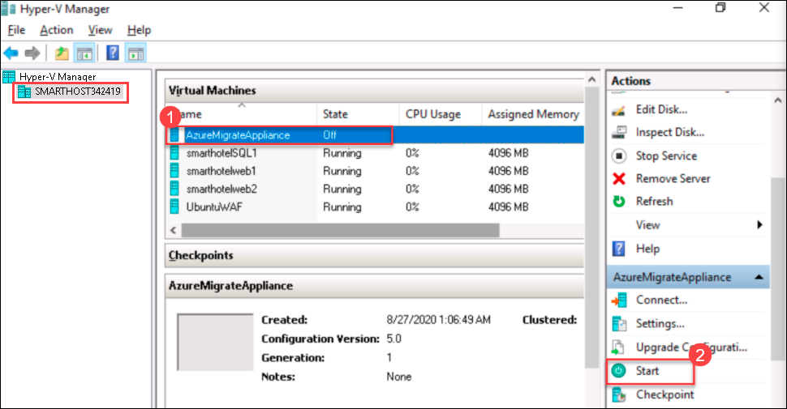

12. In Hyper-V Manager, select the **AzureMigrateAppliance** VM, then select **Connect** on the right.

    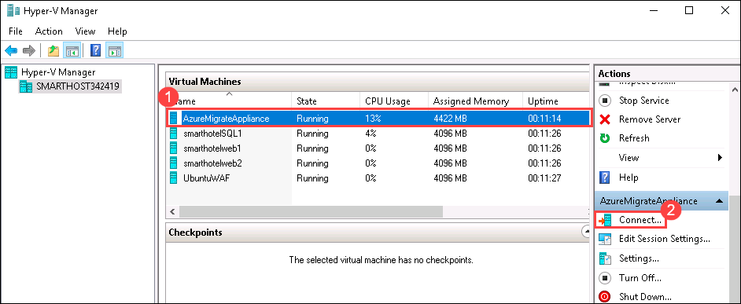

13. Under Connect to AzureMigrateAppliance, click **Connect** and then log into the VM with the **Administrator password**: **<inject key="SmartHotelHost Admin Password" />** (the login screen may pick up your local keyboard mapping, use the 'eyeball' icon to check).
 
    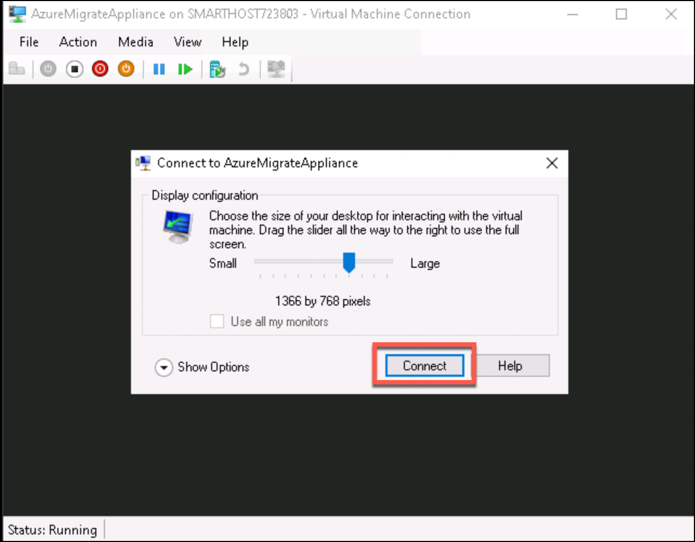

14. Launch the **Azure Migrate appliance configuration Manager wizard** using the shortcut available on the desktop (wait for a minute or two, the browser will open showing the Azure Migrate appliance configuration wizard)

    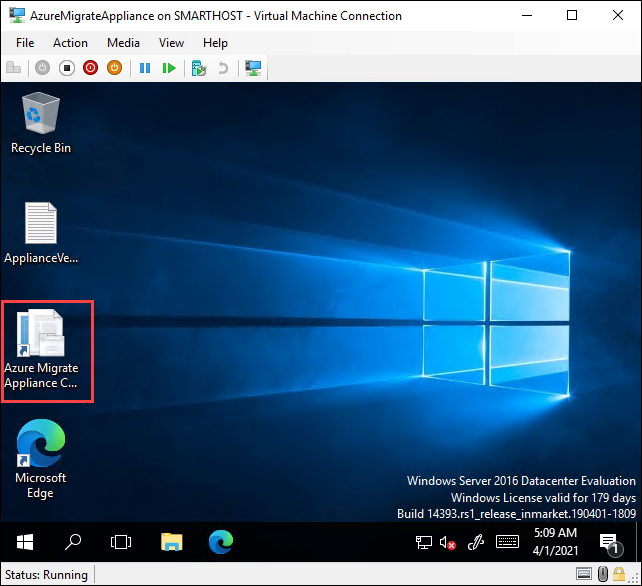
    
    >**Note**: If you receive a prompt asking for credentials after launching the **Azure Migrate appliance configuration wizard** using the shortcut available on the desktop, please follow the instructions from [here](https://github.com/CloudLabsAI-Azure/Know-Before-You-Go/blob/main/AIW-KBYG/AIW-Infrastructure-Migration.md#1-exercise1---task3---step3) to connect to Azure Migrate appliance configuration wizard.

15. On opening of the appliance configuration wizard, if a pop-up with the license terms appears, accept the terms by selecting **I agree**.

    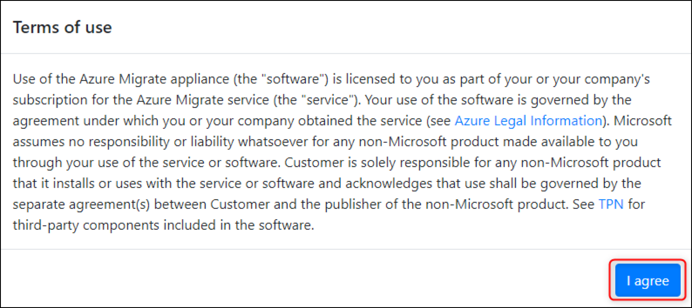

16. Under **Set up prerequisites**, the following two steps to verify Internet connectivity and time synchronization should pass automatically.

    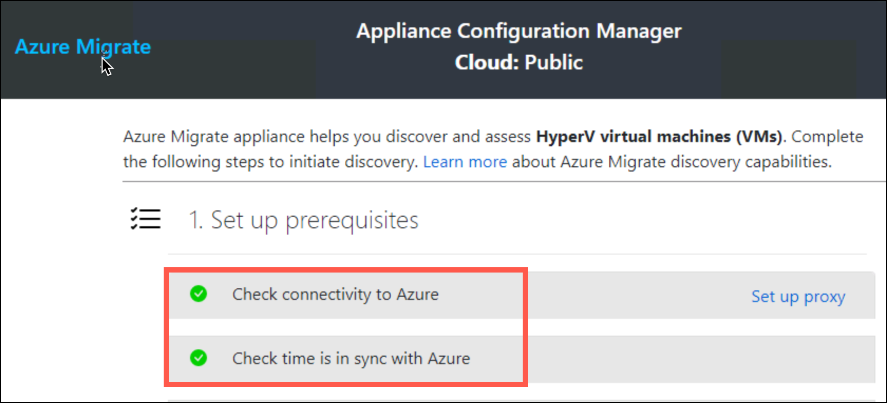

17. **Wait** while the wizard installs the latest Azure Migrate updates. If prompted for credentials, enter username **Administrator** and password **<inject key="SmartHotelHost Admin Password" />**. Once the Azure Migrate updates are completed, you may see a pop-up if the management app restart is required, and if so, select **Refresh** to restart the app.  

    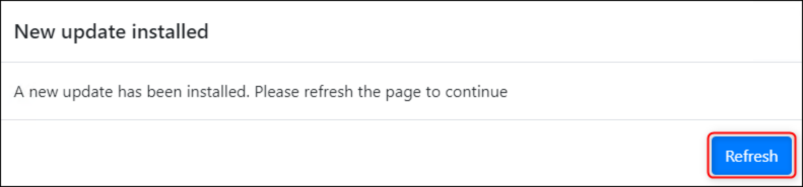

18. At the next phase of the wizard, **Check latest updates and register appliance**, paste the **Azure Migrate project key (1)** that you copied from the Azure portal earlier and select **Verify (2)** to verify the Azure Migrate project key. 
   
    > If you do not have the key, go to **Server Assessment > Discover > Manage existing appliances**, select the appliance name you provided at the time of key generation and copy the corresponding key.)

    

19. Wait for the **Appliance auto-update status** to complete and select **Login**. 

    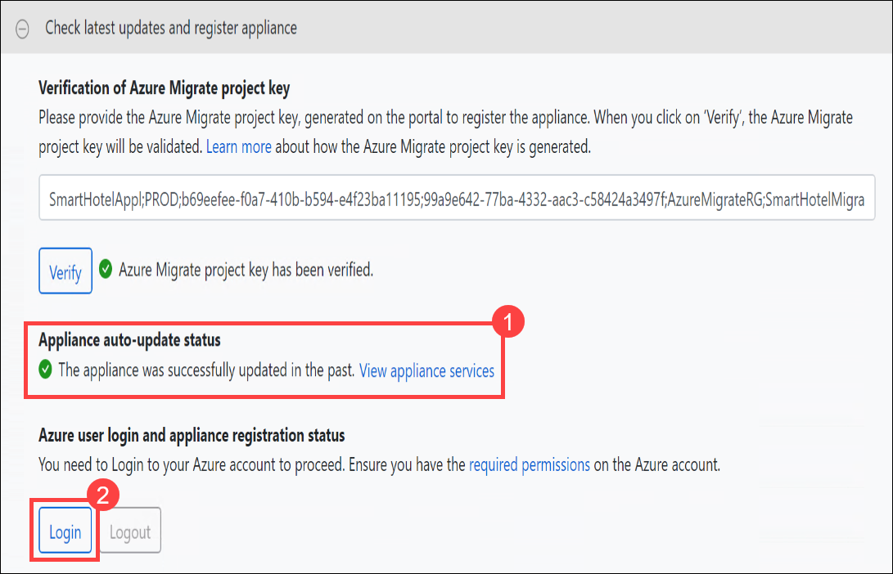
   
   > Now, follow the below instructions to complete the login process.
    
 1. At first, you will be presented with a **Continue with Azure login** pop-up. On the **Continue with Azure login** pop-up dialog, click on **Copy code & Login**.
   
    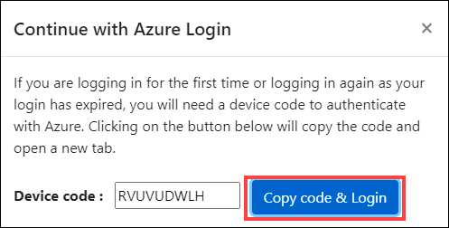
  
 2. This will open an Azure login prompt in a new browser tab (if it doesn't appear, make sure the pop-up blocker in the browser is disabled) paste the **code (1)** and click on **Next (2)**. You will then be asked for your Azure portal credentials to complete the login process.

    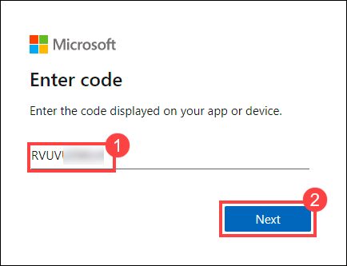

20. Log in using the below Azure credentials and select **Continue** on the **Are you trying to sign in to Microsoft Azure PowerShell?** window to complete the login process. Once you have logged in, return to the Azure Migrate Appliance tab and the appliance registration will start automatically and displays below message once the registration is successful.
    
    * Azure Username/Email: <inject key="AzureAdUserEmail"></inject> 
    * Azure Password: <inject key="AzureAdUserPassword"></inject> 

    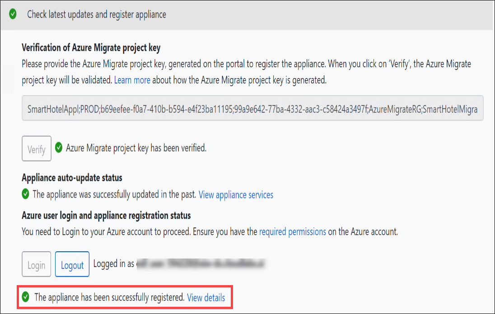

   Once the registration has completed, you can proceed to the next panel, **Manage credentials and discovery sources**.

21. In **Step 1: Provide Hyper-V host credentials for discovery of Hyper-V VMs** under **2. Manage credentials and discovery sources**, select **Add credentials**.

    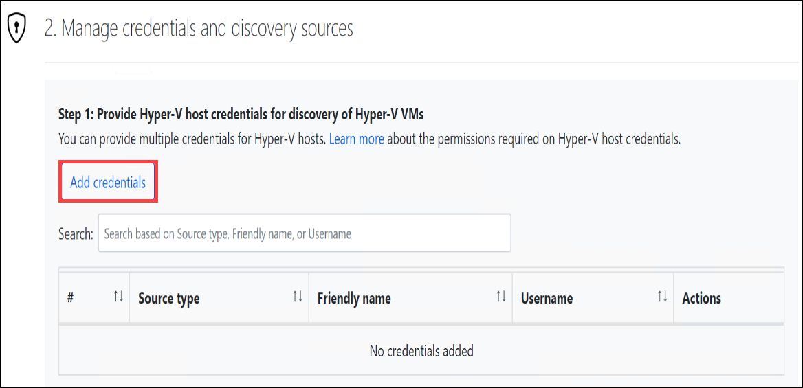


22. Specify the following details on the **Add credentials** blade for the Hyper-V host/cluster that the appliance will use to discover VMs and select **Save**.
 
      1. Friendly name: Enter **hostlogin** 
      2. Username: <inject key="SmartHotelHost Admin Username" />
      3. Password: <inject key="SmartHotelHost Admin Password" />

    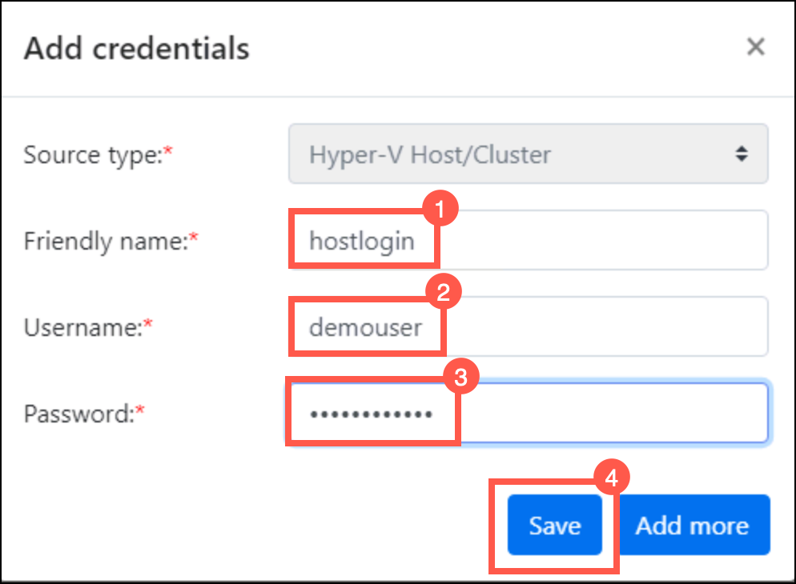

     > **Note**: The Azure Migrate appliance may not have picked up your local keyboard mapping. Select the 'eyeball' in the password box to check the password was entered correctly.

23. In **Step 2: Provide Hyper-V host/cluster details**, select **Add discovery source** to specify the Hyper-V host/cluster IP address/FQDN and the friendly name for credentials to connect to the host/cluster.

    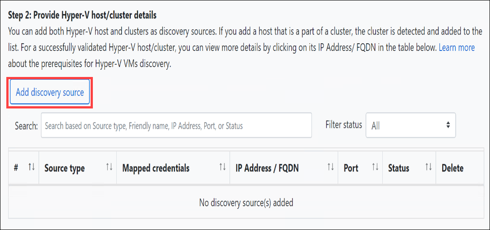

24. On the **Add discovery source** blade, provide the following details:
     
      1. Select **Add single item**
      1. IP Address / FQDN:  Enter **SmartHost<inject key="DeploymentID" enableCopy="false" />** .
      1. Friendly name: Select **hostlogin** from the dropdown and 
      1. select **Save**.

    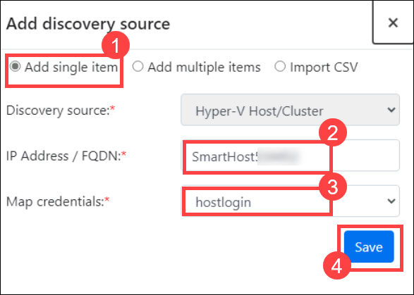

    > **Note:** You can either **Add single item** at a time or **Add multiple items** in one go. There is also an option to provide Hyper-V host/cluster details through **Import CSV**.

25. The appliance will validate the connection to the Hyper-V hosts/clusters added and show the **Validation status** in the table against each host/cluster

    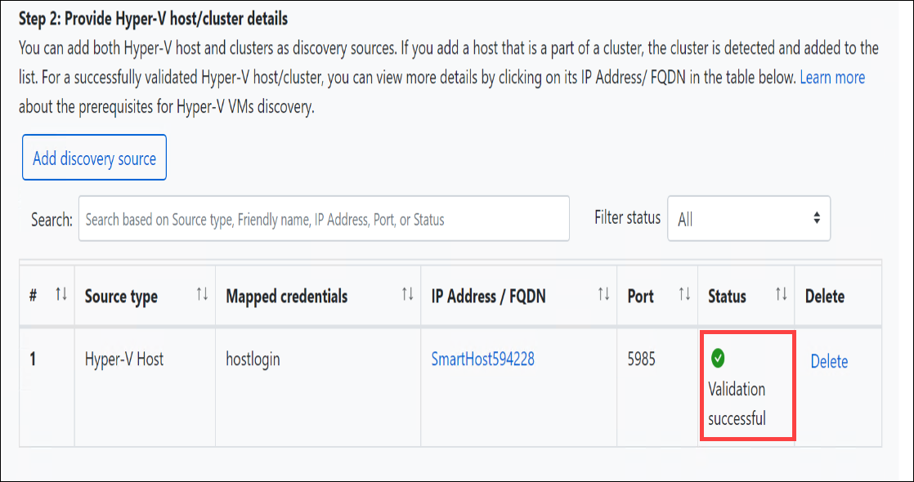

    > **Note:** When adding discovery sources:
    > - For successfully validated hosts/clusters, you can view more details by selecting their IP address/FQDN.
    > - If validation fails for a host, review the error by selecting the Validation failed in the Status column of the table. Fix the issue and validate again.
    > - To remove hosts or clusters, select **Delete**.
    > - You can't remove a specific host from a cluster. You can only remove the entire cluster.
    > - You can add a cluster, even if there are issues with specific hosts in the cluster.

26. In **Step 3: provide server credentials to perform software inventory and agentless dependency analysis**, **Disable the slider (1)** and select **Start discovery (2)** to kick off VM discovery from the successfully validated hosts/clusters.

     > **Note:** The discovery process can take up to 10 minutes. 
   
    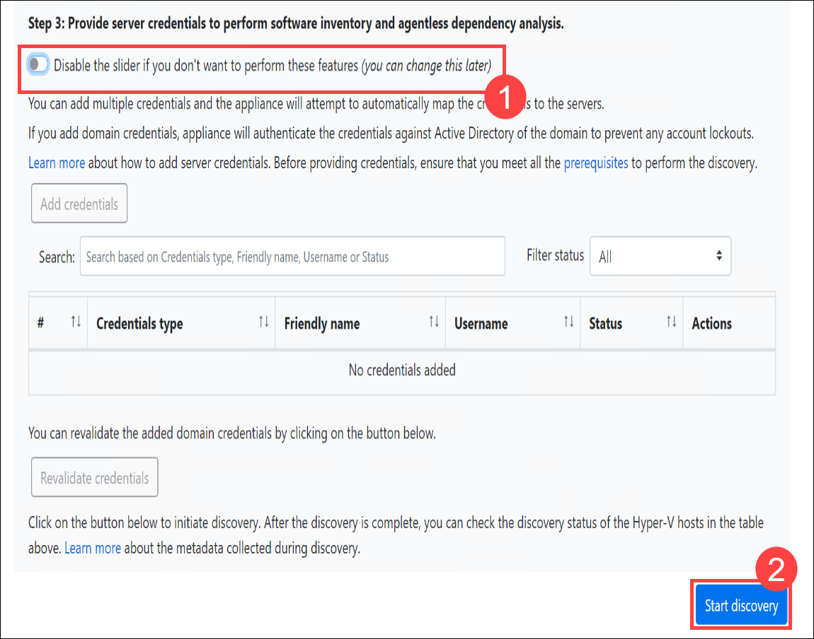

27. Wait for the Azure Migrate status to show **Discovery has been successfully initiated**. This will take several minutes. After the discovery has been successfully initiated, you can check the discovery status against each host/cluster in the table.

26. Return to the **JumpVM** then to **Azure Migrate** blade in the Azure portal.  Select **Servers, databases and web apps (1)**, then select **Refresh (2)**.  Under **Azure Migrate: Servers, databases and web apps** you should see a **count (3)** of the number of servers discovered so far. If discovery is still in progress, select **Refresh** periodically until 6 discovered servers are shown. This may take several minutes.

    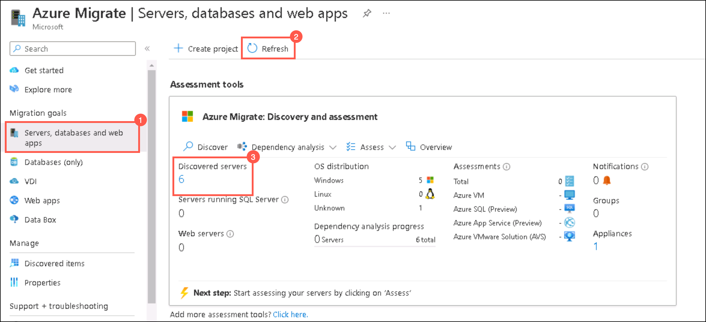 

    > Note:- **Wait for the discovery process to complete before proceeding to the next Task**.
