## HOL1: Exercise 3: Migrating your apps and your data, leveraging Microsoft services and tools including Azure Migrate: Server Migration

In this HOL, you will learn about Azure migration and how all pre-migration steps such as discovery, assessments, and right-sizing of on-premises resources are included for infrastructure, data, and applications. Azure Migrate provides a simplified migration, modernization, and optimization service for Azure.

### Task 1: Create a Storage Account

In this task, you will create a new Azure Storage Account that will be used by Migration and for storage of your virtual machine data during migration.

> **Note:** This lab focuses on the technical tools required for workload migration. In a real-world scenario, more consideration should go into the long-term plan before migrating assets. The landing zone required to host VMs should also include considerations for network traffic, access control, resource organization, and governance. For example, the CAF Migration Blueprint and CAF Foundation Blueprint can be used to deploy a pre-defined landing zone and demonstrate the potential of an Infrastructure as Code (IaC) approach to infrastructure resource management. For more information, see [Azure Landing Zones](https://docs.microsoft.com/azure/cloud-adoption-framework/ready/landing-zone/) and [Cloud Adoption Framework Azure Migration landing zone Blueprint sample](https://docs.microsoft.com/azure/governance/blueprints/samples/caf-migrate-landing-zone/).

1. In the Azure portal's left navigation, select **+ Create a resource**, then search for and select **Storage account**, followed by **Create**.

    

2. In the **Create storage account** blade, on the **Basics** tab, use the following values:

   - Subscription: **Select your Azure subscription (1)**.
  
   - Resource group: **AzureMigrateRG (2)**
  
   - Storage account name: **migrationstorage<inject key="DeploymentID" enableCopy="false" /> (3)**

   - Location: Select **<inject key="Region" enableCopy="false" /> (4)** from the dropdown.
    
   - Performance: **Standard (5)**
  
   - Redundancy: **Locally-redundant storage (LRS) (6)**

    

3. Select **Review**, then select **Create**.

4. Once the storage account is deployed, click on **Go to resource** to open it.

5. Select **Data protection** under **Data management** from the left-hand side menu of storage account.

   

6. Now, uncheck the box next to **Enable soft delete for blobs** and **Enable soft delete for containers** to disable the soft delete on blobs and containers as the soft delete enabled storage account is **not supported** for enabling replication on Virtual Machines. Click on **Save**.

   

#### Task summary 

In this task, you created a new Azure Storage Account that will be used for Migration and modernization.

### Task 2: Register the Hyper-V Host with Migration and modernization

In this task, you will register your Hyper-V host(LabVM) with the Migration and Modernization service. This service uses Azure Site Recovery as the underlying migration engine. As part of the registration process, you will deploy the Azure Site Recovery Provider on your Hyper-V host.

1. Return to the **Azure Migrate | Servers, databases and web apps** blade in the Azure Portal, and select **Servers, databases and web apps (1)** under **Migration goals** on the left. Under **Migration Tools**, select **Discover (2)**.

   **Note:** You may need to add the migration tool yourself by following the link below the **Migration Tools** section, selecting **Migration and modernization**, then selecting **Add tool(s)**.
   
     

2. In the **Discover** panel, provide the following details:
   - Under **Are your machines virtualized**, select **Yes, with Hyper-V (1)**.
   - Under **Target region (2)** make sure to select the **<inject key="Region"></inject>** region as same the Resource Group's region.
   - Check the **confirmation (3)** checkbox and select **Create resources (4)** to begin the deployment of the Azure Site Recovery resource used by Migration and modernization for Hyper-V migrations.

     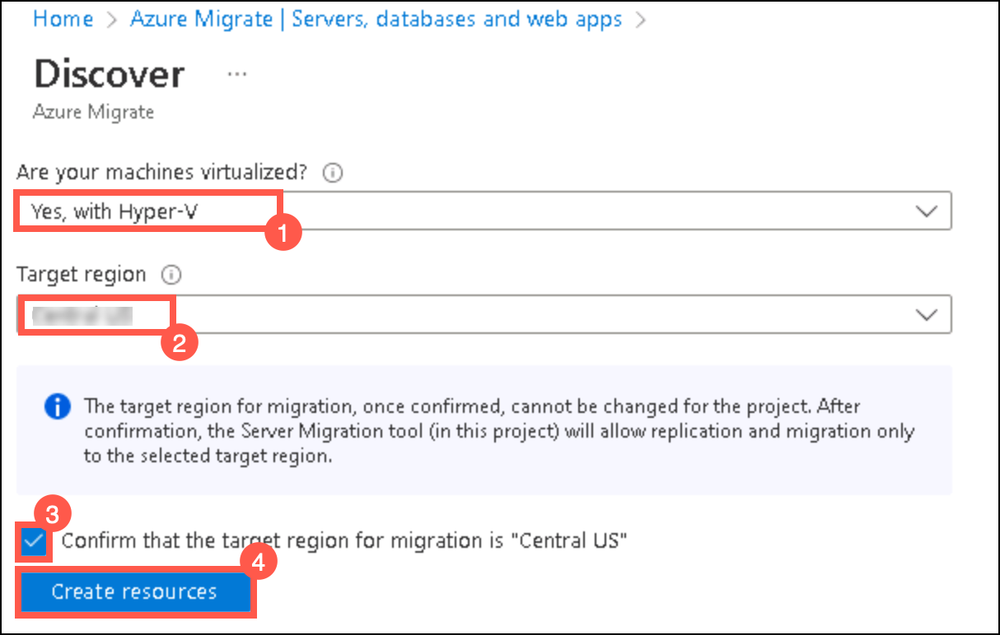

   Once deployment is complete, the 'Discover machines' panel should be updated with additional instructions.
  
3. Click on the **Download** link for the Hyper-V replication provider software installer to download the Azure Site Recovery provider installer.

     

4. Return to the **Discover** page in your browser, select the blue **Download** button and download the registration key file.

     

5. Open the **AzureSiteRecoveryProvider.exe** installer you downloaded a moment ago. On the **Microsoft Update** tab, select **Off** and select **Next**. Accept the default installation location and select **Install**.

    > **Note:** If you are prompted with a pop-up like the latest version of the Provider is installed on this server. Would you like to proceed to registration? select **Yes**. (You can directly jump to the next step in that case.)
  
     

6. When the installation has completed select **Register**. Browse to the location of the key file you downloaded. When the key is loaded select **Next**.

     

7. Select **Connect directly to Azure Site Recovery without a proxy server (1)** and select **Next (2)**. The registration of the Hyper-V host with Azure Site Recovery will begin.

     

8. Wait for registration to complete (this may take several minutes). Then select **Finish**.

     

9. Return to the Azure Migrate browser window. **Refresh** your browser, then re-open the **Discover machines** panel by selecting **Discover** under **Migration and modernization** and selecting **Yes, with Hyper-V** for **Are your machines virtualized?**.

10. Select **Finalize registration**, which should now be enabled.

     

11. Azure Migrate will now complete the registration with the Hyper-V host. **Wait** for the registration to complete. This may take several minutes.

     

12. Once the registration is complete, close the **Discover machines** panel using **X** button.

     

13. The **Migration and Modernization** panel should now show 7 discovered servers.

     

     > **Congratulations** on completing the task! Now, it's time to validate it. Here are the steps:
     > - Navigate to the Lab Validation Page, from the upper right corner in the lab guide section.
     > - Hit the Validate button for the corresponding task. If you receive a success message, you can proceed to the next task. 
     > - If not, carefully read the error message and retry the step, following the instructions in the lab guide.
     > - If you need any assistance, please contact us at labs-support@spektrasystems.com. We are available 24/7 to help

#### Task summary 

In this task, you registered your Hyper-V host with the Azure Migrate Server Migration service.

### Task 3: Enable Replication from Hyper-V to Azure Migrate

In this task, you will configure and enable the replication of your on-premises virtual machines from Hyper-V to the Azure Migrate Server Migration service.

1. Under **Migration and modernization**, select **Replicate**. This opens the **Replicate** wizard.

     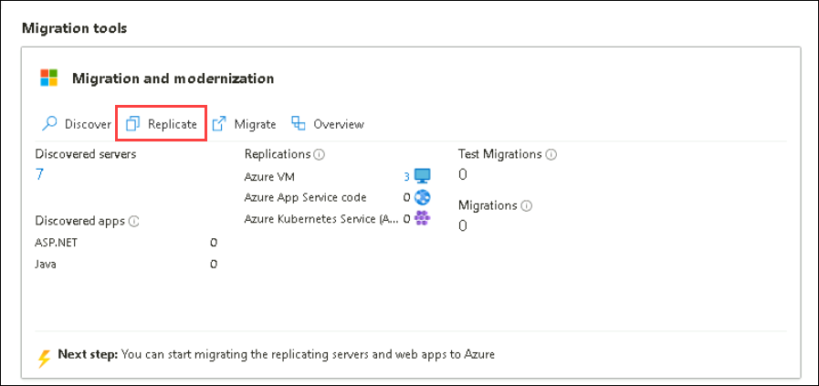
   
2. Under the **Specific Intent** page, provide the below details:

    -  What do you want to migrate? : Select **Servers or Virtual machines (VM)** **(1)**
    -  Where do you want to migrate to? : Select **Azure VM** **(2)**
    -  Click on **Continue (3)**

     

3. In the **Basics settings** tab, under **Are your machines virtualized?**, select **Yes, with Hyper-V** from the drop-down. Then select **Next**.

     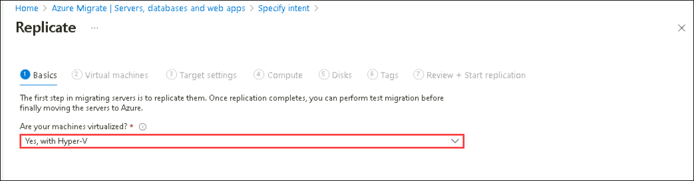

4. In the **Virtual machines** tab, under **Import migration settings from an assessment**, select **Yes, apply migration settings from an Azure Migrate assessment (1)**. Select the **SmartHotel VMs (2)** VM group and the **SmartHotelAssessment (3)** migration assessment.

     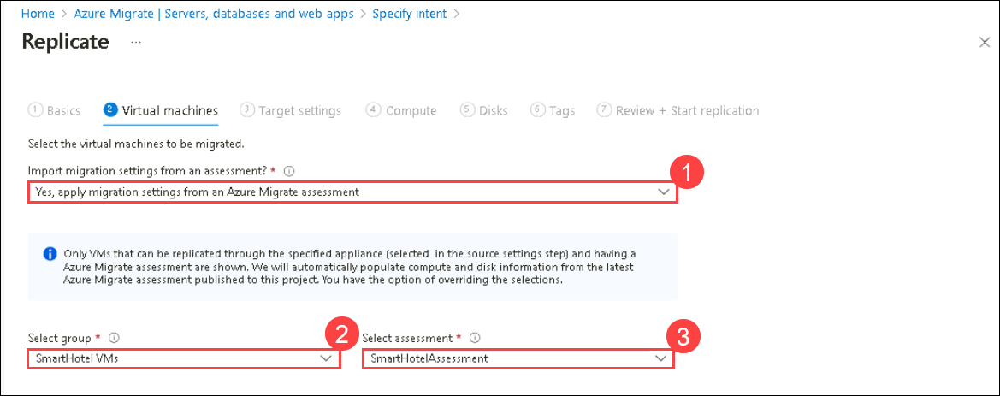

5. The **Virtual machines** tab should now show the virtual machines included in the assessment. Select the **UbuntuWAF**, **smarthotelweb1**, and **smarthotelweb2** virtual machines, then select **Next**.

     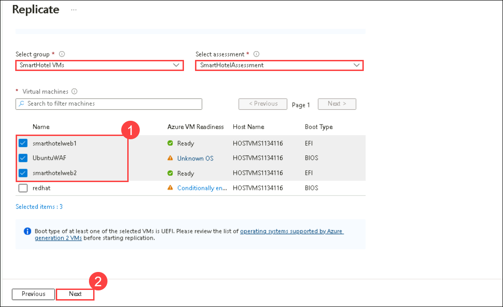

6. On the **Target settings** tab, select the below information,
   - Select your subscription and the existing **SmartHotelHostRG (1)** resource group. 
   - **Cache storage account**: Enter the storage account here from the drop-down which you create in task 1 **(2)**. 
   - **Virtual Network**: Select **SmartHotelVNet (3)**. 
   - **Subnet**: Select **SmartHotel (4)**. 
   - Leave other values as default and select **Next (5)**.
   
     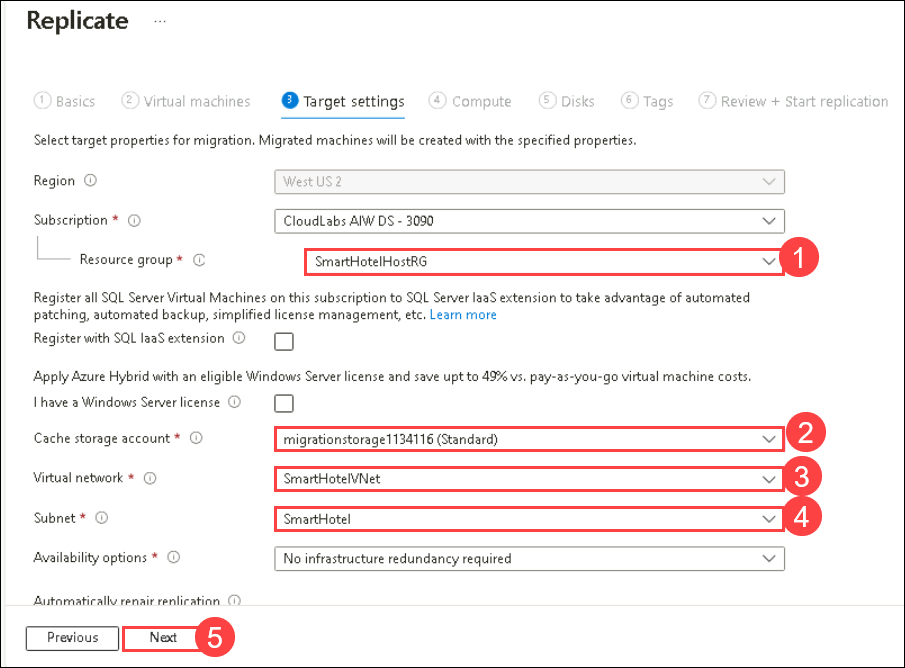

   > **Note:** For simplicity, in this lab you will not configure the migrated VMs for high availability, since each application tier is implemented using a single VM.

7. On the **Compute** tab, select the below configuration,
   - Select the **Standard_F2s_v2** VM size for each virtual machine. 
   - Select the **Windows** operating system for the **smarthotelweb1**, **smarthotelweb2** virtual machines.
   - Select the **Linux** operating system for the **UbuntuWAF** virtual machine. 
   - Select **Next**. 

   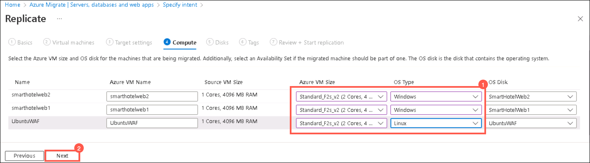
    
8. In the **Disks** tab, review the settings but do not make any changes. Select **Next: Tags**, then select **Replicate** to start the server replication.

9. In the **Azure Migrate - Servers, databases and web apps** blade, under **Migration and modernization**, select the **Overview** button.

     
    
10. Confirm that the 3 machines are replicating.

     

11. Select **Replicating Machines (1)** under **Manage** on the left.  Select **Refresh (2)** occasionally and wait until all three machines have a **Protected (3)** status, which shows the initial replication is complete. This will take 5-10 minutes.

     

    > **Note**: Please make sure you run the **validation steps** for this task before moving to the next tasks as there are few dependencies. **Not** running the validation after performing this task will result in **validation failure** as the status of the Virtual Machine will be changed from **Protected** to **Planned failover** when you migrate the servers in Task5.

     > **Congratulations** on completing the task! Now, it's time to validate it. Here are the steps:
     > - Navigate to the Lab Validation Page, from the upper right corner in the lab guide section.
     > - Hit the Validate button for the corresponding task. If you receive a success message, you can proceed to the next task. 
     > - If not, carefully read the error message and retry the step, following the instructions in the lab guide.
     > - If you need any assistance, please contact us at labs-support@spektrasystems.com. We are available 24/7 to help

#### Task summary 

In this task, you enabled replication from the Hyper-V host to Azure Migrate and configured the replicated VM size in Azure.

### Task 4: Configure Networking

In this task, you will modify the settings for each replicated VM to use a static private IP address that matches the on-premises IP addresses for that machine.

1. Still using the **Migration and modernization - Replicating machines** blade, select the **smarthotelweb1** virtual machine. This opens a detailed migration and replication blade for this machine. Take a moment to study this information.

    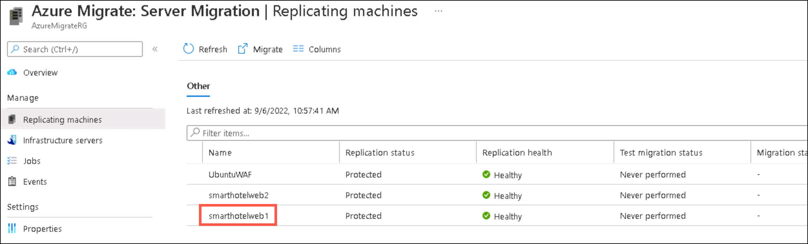

2. Select **Compute and Network (1)** under **General** on the left, then select **Edit (2)**.

    

3. Confirm that the VM is configured to use the **F2s_v2** VM size.

4. Under **Network Interfaces**, select **InternalNATSwitch** to open the network interface settings.

    

5. Change the **Private IP address** to **192.168.0.4**

    

6. Select **OK** to close the network interface settings blade, then **Save** the **smarthotelweb1** settings.

7. Repeat these steps to configure the private IP address for the other VMs.
 
   - For **smarthotelweb2** use private IP address **192.168.0.5**
  
   - For **UbuntuWAF** use private IP address **192.168.0.8**

#### Task summary 

In this task, you modified the settings for each replicated VM to use a static private IP address that matches the on-premises IP addresses for that machine

> **Note**: Azure Migrate makes a "best guess" at the VM settings, but you have full control over the settings of migrated items. In this case, setting a static private IP address ensures the virtual machines in Azure retain the same IPs they had on-premises, which avoids having to reconfigure the VMs during migration (for example, by editing web.config files).

### Task 5: Server migration

In this task, you will perform a migration of the UbuntuWAF, smarthotelweb1, and smarthotelweb2 machines to Azure.

> **Note**: In a real-world scenario, you would perform a test migration before the final migration. To save time, you will skip the test migration in this lab. The test migration process is very similar to the final migration.

1. Return to the **Migration and modernization** overview blade. Under **Step 3: Migrate**, select **Migrate**.

    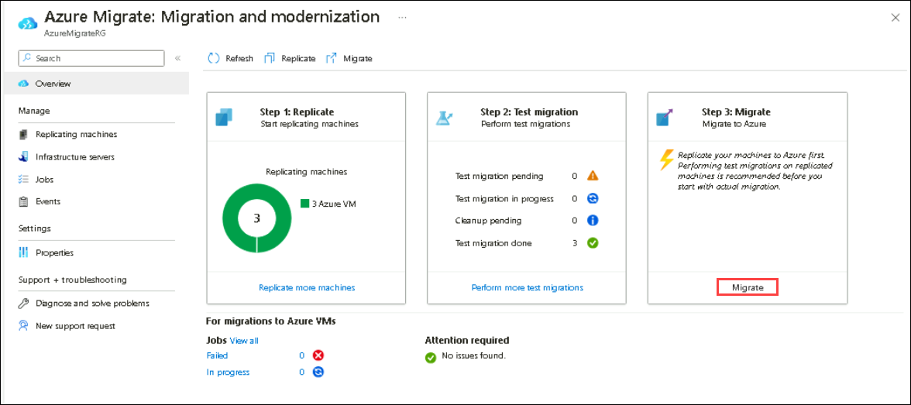

2. On the **Migrate** blade, select **yes (1)** for **Shutdown machines before migration to minimum data loss** and select the 3 virtual machines **(2)** then select **Migrate (3)** to start the migration process.

    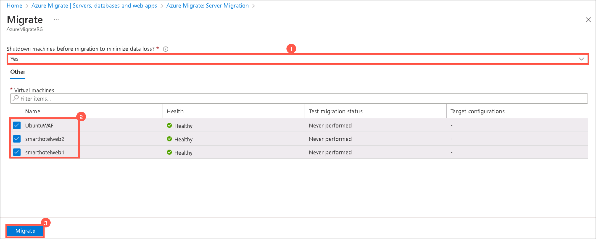

   > **Note**: You can optionally choose whether the on-premises virtual machines should be automatically shut down before migration to minimize data loss. Either setting will work for this lab.

3. The migration process will start.

    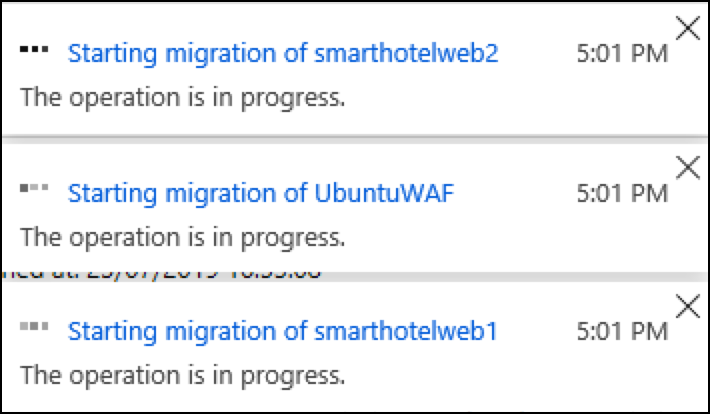

4. To monitor progress, select **Jobs (1)** under **Manage** on the left and review the status of the three **Planned failover (2)** jobs.

    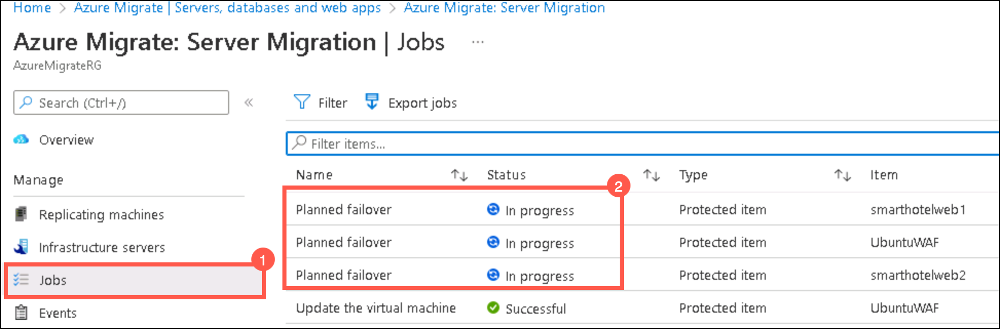

5. **Wait** until all three **Planned failover** jobs show a **Status** of **Successful**. You should not need to refresh your browser. This could take up to 15 minutes.

    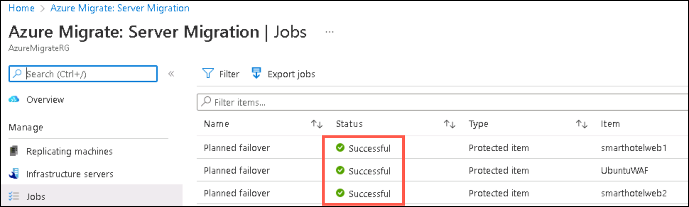

6. Navigate to the **SmartHotelHostRG** resource group and check that the VM, network interface, and disk resources have been created for each of the virtual machines being migrated.

    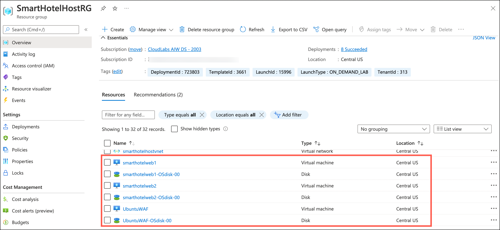

     > **Congratulations** on completing the task! Now, it's time to validate it. Here are the steps:
     > - Navigate to the Lab Validation Page, from the upper right corner in the lab guide section.
     > - Hit the Validate button for the corresponding task. If you receive a success message, you can proceed to the next task. 
     > - If not, carefully read the error message and retry the step, following the instructions in the lab guide.
     > - If you need any assistance, please contact us at labs-support@spektrasystems.com. We are available 24/7 to help

#### Task summary 

In this task, you used Azure Migrate to create Azure VMs using the settings you have configured, and the data replicated from the Hyper-V machines. This migrated your on-premises VMs to Azure.

### Task 6: Configure the database connection

The application tier machine **smarthotelweb2** is configured to connect to the application database running on the **smarthotelsql** machine.

On the migrated VM **smarthotelweb2**, this configuration needs to be updated to use the Azure SQL Database instead.

> **Note**: You do not need to update any configuration files on **smarthotelweb1** or the **UbuntuWAF** VMs, since the migration has preserved the private IP addresses of all virtual machines they connect with.

1. From the Azure portal menu, which is present at the top left, click on **All services**. Select **compute** from the left-hand menu and select **Virtual machines**.

2. Click on **smarthotelweb2** VM, from the left-side pane, select **Bastion** under **Operations**.

   >**Note**: You may have to wait a few minutes and refresh to have the option to enter the credentials. 

3. Connect to the machine with the username **Administrator (1)** and the password **<inject key="SmartHotel Admin Password"></inject> (2)** and then click on **Connect (3)**. When prompted, **Allow** clipboard access.

    >**Note**: You might have to allow pop-ups to access the bastion session.

      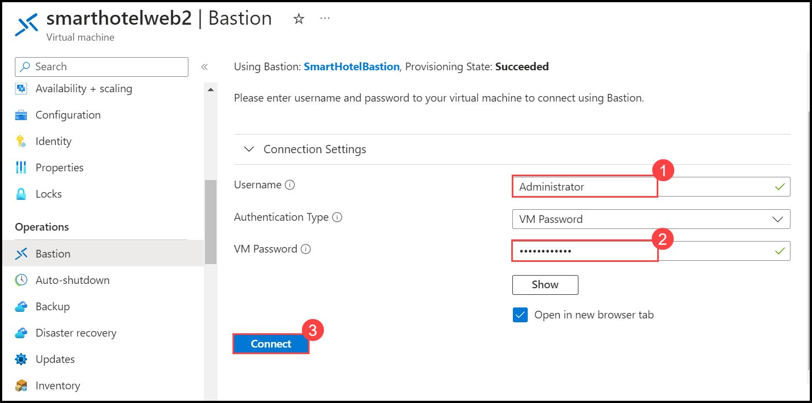

4. In the **smarthotelweb2** remote desktop session, open File Explorer and navigate to the **C:\\inetpub\\SmartHotel.Registration.Wcf** folder. Double-select the **Web.config** file and open it with Notepad.

5. Update the **DefaultConnection** setting to connect to your Azure SQL Database.

   You can find the connection string for the Azure SQL Database in the Azure portal. Navigate to the **SmartHotelRG** resource group, and then to the database **smarthoteldb** and from the overview, select **Show database connection strings**.

    

    Copy the **ADO.NET** connection string and paste it into the web.config file on **smarthotelweb2**, replacing the existing connection string.  **Be careful not to overwrite the 'providerName' parameter which is specified after the connection string.**

    > **Note**: You may need to open the clipboard panel on the left-hand edge of the Bastion window, paste the connection string there, and then paste it into the VM.

    Set the password in the connection string from {your_password} to **<inject key="SmartHotel Admin Password" />**.

    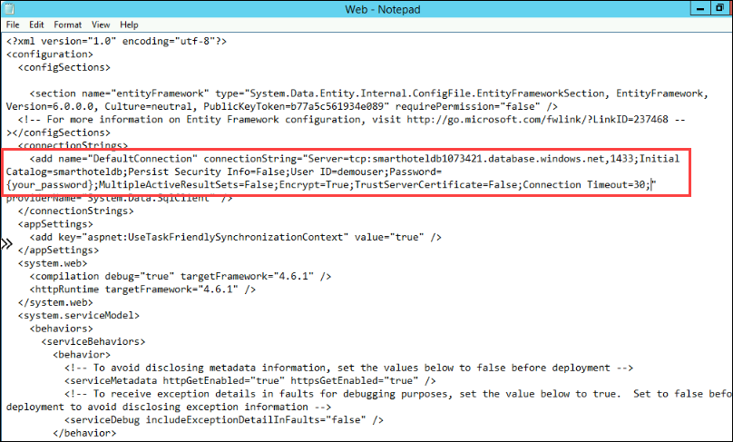

    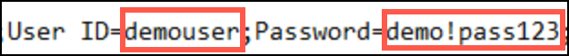

7. **Save** the `web.config` file and exit your Bastion remote desktop session.

#### Task summary 

In this task, you updated the **smarthotelweb2** configuration to connect to the Azure SQL Database.

### Task 7: Configure the public IP address and test the SmartHotel application

In this task, you will associate an Application Gateway with a Web Application Firewall (WAF) to replace the Ubuntu VM with the Azure-managed service.

1. Navigate to the **SmartHotel-WAF** Application Gateway in the **SmartHotelRG** resource group

1. Select **Backend pools (1)** under the Settings section, and select the **WebBackend (2)** pool

    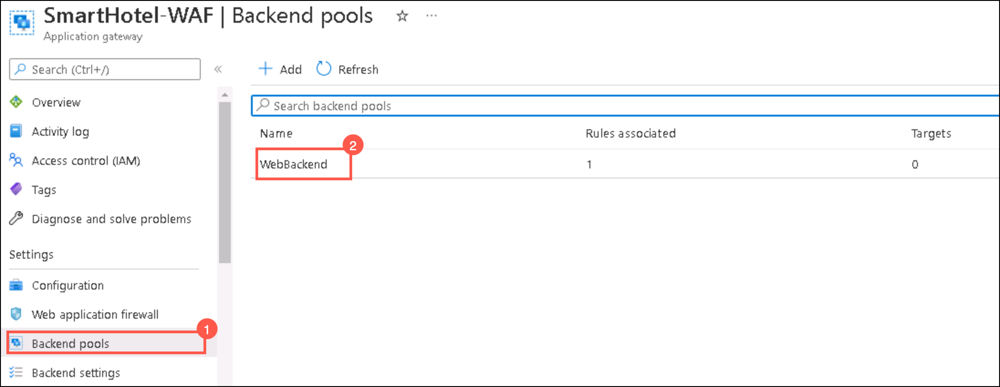

1. Set the Target type to **Virtual machine (1)** and the Target to the NIC of **smarthotelweb1 (2)**; select **Save (3)** to update the backend pool

    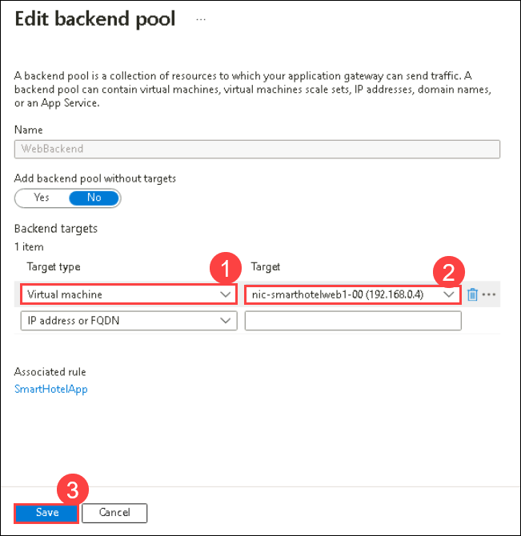

    > **Note**: This backend pool is already associated with the front-end IP address of the Application Gateway via the SmartHotelApp rule. The front-end IP, listener, rule, and backend pool were all created with the Application Gateway. This step now ties the migrated VM to the front end.

1. Navigate to the **SmartHotelRG** resource group, and then to the **SmartHoteldb<inject key="DeploymentID" enableCopy="false" />** database server to update the Firewall settings.
           
1. Under Security, select **Networking (1)** then **Public access (2)** tab. Now, set **Public network access** to **Selected networks (3)** and **Save (4)** your changes.

    
     
1. Now, on the **Public access** tab, click on **Add a virtual network rule** to add a virtual network so that access to the database will be allowed from a specific network.

    
   
1. On the **Create/Update** blade, enter the below information.

    - **Name**: **AllowaccesstoDB (1)**.
    - **Subscription**: Select your subscription from the dropdown **(2)**.
    - **Virtual Network**: Select **SmartHotelVNet (3)**. 
    - **Subnet**: Select **SmartHotel (4)**.
    - **Check** the **Ignore Missing Microsoft.sql Service Endpoint box (5)**.
    - Click **Ok (6)**.

    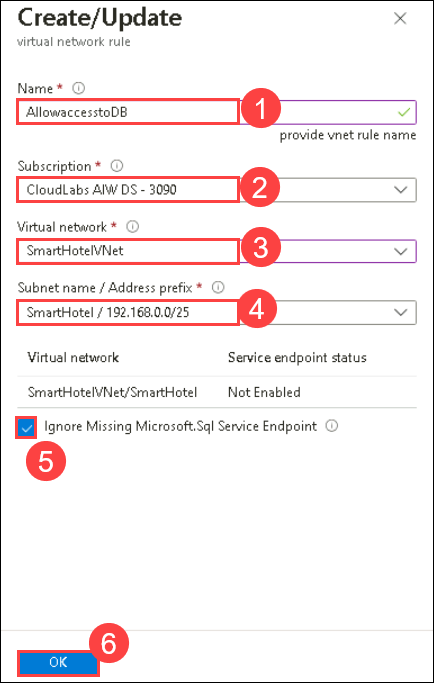
   
1. Navigate back to the **Public access (2)** tab of **Networking (1)** section. Set **Public network access** to **Disable (3)** and **Save (4)** your changes.

    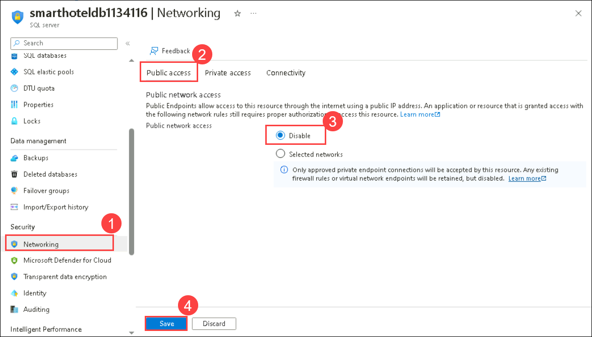
   
1. Navigate back to the **SmartHotel-WAF** Application Gateway then **Frontend IP configurations (1)** way in the Settings section and note the IP address associated with the public IP address **appGwPublicFrontendIp (2)**.

    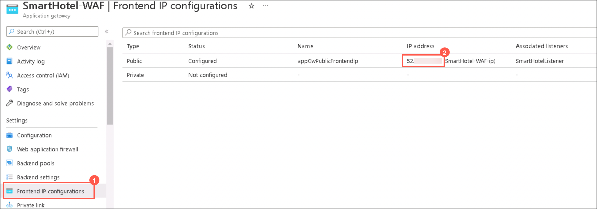

1. Open a new browser tab and paste the IP address into the address bar. Verify that the SmartHotel360 application is now available in Azure.

    
 
    > **Note**: 
      1. The Check-in and Check-out might differ for you when compared to the above screenshot.
      2. At this point the base Application Gateway service is providing access to the backend application. This validates that the application is working and can be further protected by the WAF in the following steps.

#### Task summary 

In this task, you assigned a public IP address to the UbuntuWAF VM and verified that the SmartHotel application is now working in Azure.

### Task 8: Pointers around Azure Networking and Azure Network Security (Read only)

Design and implementation of Azure networking is one of the most critical steps in migrating your infrastructure as a service (IaaS) and platform as a service (PaaS) implementations in Azure.

#### Azure Networking Best Practises:

- Assign an address space that is not larger than a CIDR range of /16 for each virtual network. Virtual networks allow for the use of 65,536 IP addresses. Assigning a smaller prefix than /16, such as a /15, which has 131,072 addresses, will result in the excess IP addresses becoming unusable elsewhere. It is important not to waste IP addresses, even if they're in the private ranges defined by RFC 1918.

- The hub is an Azure virtual network that acts as a central point of connectivity. The spokes are virtual networks that connect to the hub virtual network by using peering. Shared services are deployed in the hub, while individual workloads are deployed as spokes.

- To provide isolation within a virtual network, you segment it into one or more subnets and give a portion of the virtual network's address space to each subnet.

- Azure adds a DNS server by default when you deploy a virtual network. You can use this server to rapidly build virtual networks and deploy resources.

- DNS servers in a virtual network can forward DNS queries to the recursive resolvers in Azure. This forwarding enables you to resolve host names within that virtual network.

- DNS forwarding allows VMs to see both your on-premises resources (via the domain controller) and Azure-provided host names (using the forwarder). You can access the recursive resolvers in Azure by using the virtual IP address 168.63.129.16.

- DNS forwarding also enables DNS resolution between virtual networks and allows on-premises machines to resolve host names provided by Azure.

- A VPN gateway is a specific type of virtual network gateway. It sends encrypted traffic between an Azure virtual network and an on-premises location over the public internet.

- A VPN gateway can also send encrypted traffic between virtual networks in Azure over the Microsoft network. Each virtual network can have only one VPN gateway.

#### Azure Network Security Best Practises:

- Azure Site Recovery enables disaster recovery and migration to Azure for on-premises Hyper-V virtual machines, VMware virtual machines, and physical servers. For all on-premises to Azure scenarios, replication data is sent to and stored in an Azure Storage account.

- Once VMs have been created after failover to Azure, NSGs can be used to limit network traffic to the virtual network and VMs. Site Recovery does not create NSGs as part of the failover operation.

- We can create the required Azure NSGs before initiating failover. You can then associate NSGs to failed over VMs automatically during failover, using automation scripts with Site Recovery's powerful recovery plans.

- Once the NSGs are created and configured, we can run a test failover to verify scripted NSG associations and post-failover VM connectivity.

### Task 9:  Migrating VMware VMs to Azure (Read only)

Azure Migrate is a free tool from Microsoft that allows VMware administrators to replicate their VMs from on-prem to Azure. It is an extremely powerful tool that even allows for pre-migration tests to run.

Azure Migrate has two migration options:

- Migration with a replication agent, requires an agent to be installed on each VM that is to be migrated.
- Migration using agentless replication, requires an agentless format which requires no agent.

**Discovery/Assessment**:

 Discover up to 10,000 VMware VMs with a single Azure Migrate appliance for VMware. The appliance supports adding multiple vCenter Servers. You can add up to 10 vCenter Servers per appliance.

#### Agentless migration: 

- Agentless migration uses the Azure Migrate appliance. You can deploy the appliance as a VMware VM using an OVA template, imported into the vCenter Server, or using a PowerShell script.

- you can simultaneously replicate a maximum of 500 VMs across multiple vCenter Servers (discovered from one appliance) using a scale-out appliance.

- If you are interested in learning more about Agentless migration, you can [read more here](https://docs.microsoft.com/en-us/azure/migrate/tutorial-migrate-vmware).

#### Agent-based migration: 

- Agent-based migration does not use the Azure Migrate appliance. If you've set up an appliance for assessment, you can leave it in place, or remove it if you're done with assessment.

- you can scale out the replication appliance to replicate large numbers of VMs.

- If you are interested in learning more about Agent-based migration, you can [read more here](https://docs.microsoft.com/en-us/azure/migrate/tutorial-migrate-vmware-agent).

In the portal, you can select up to 10 machines at once for replication. To replicate more machines, add in batches of 10.
