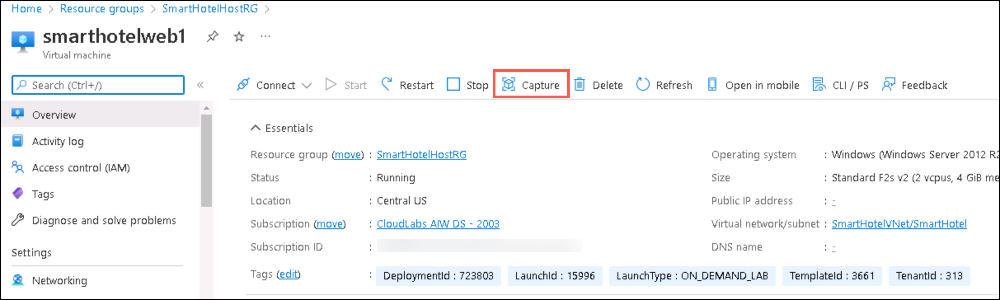
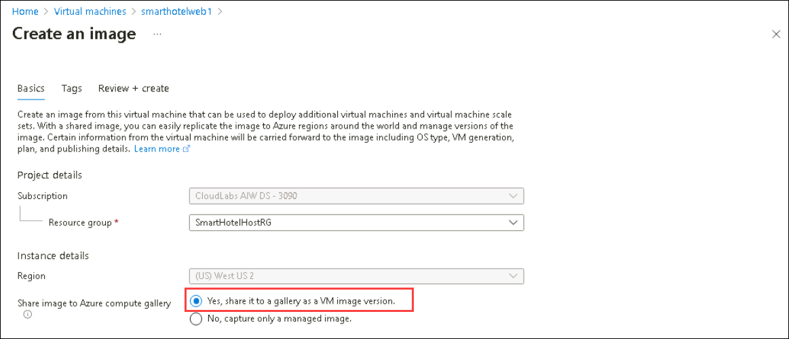
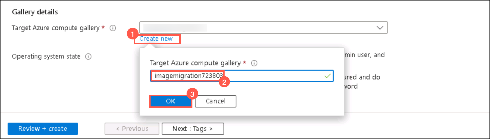
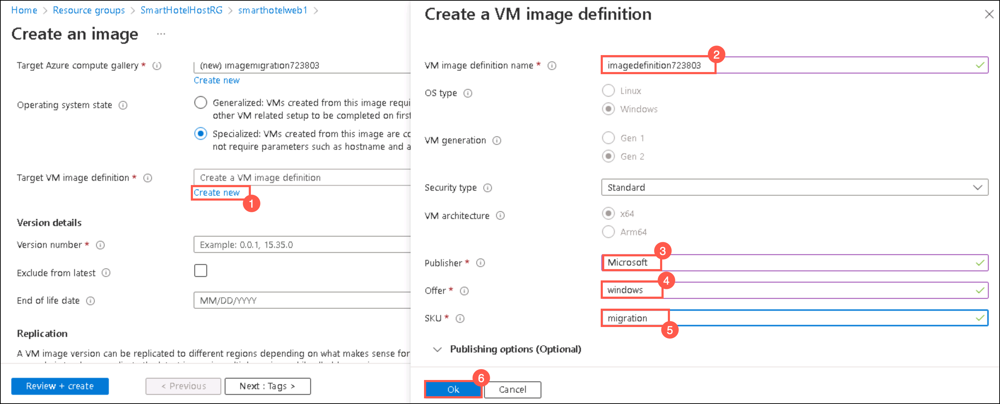
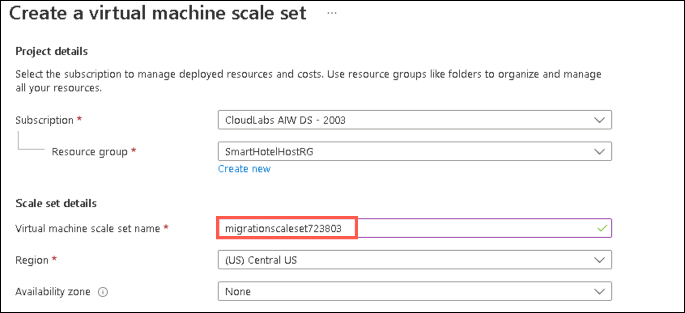
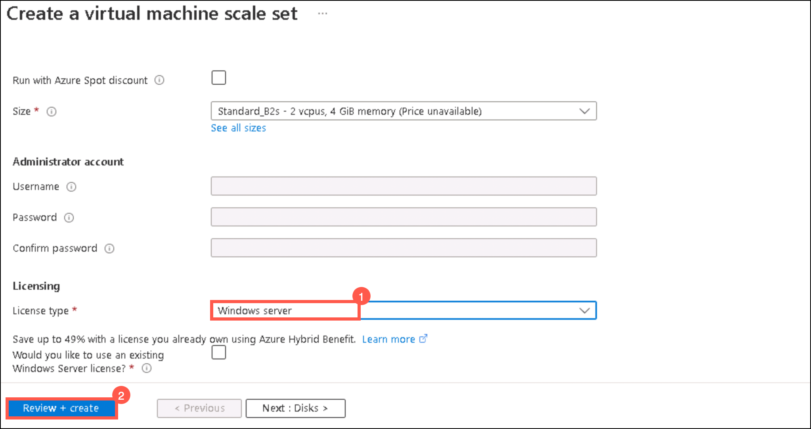
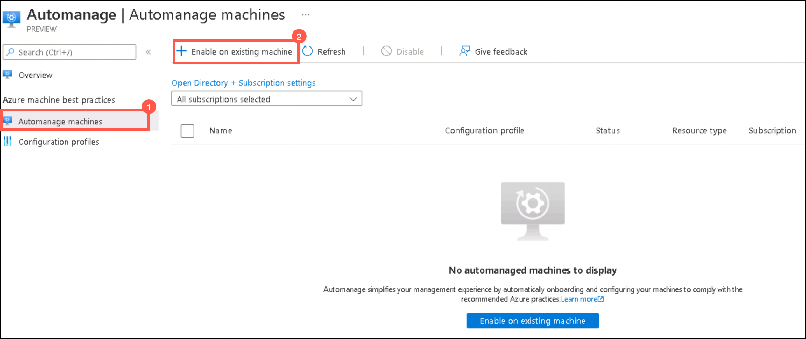
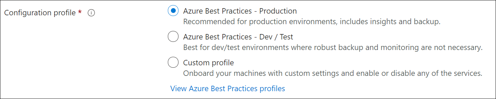
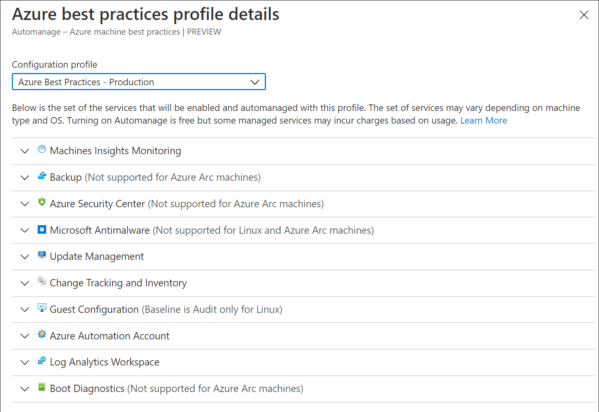
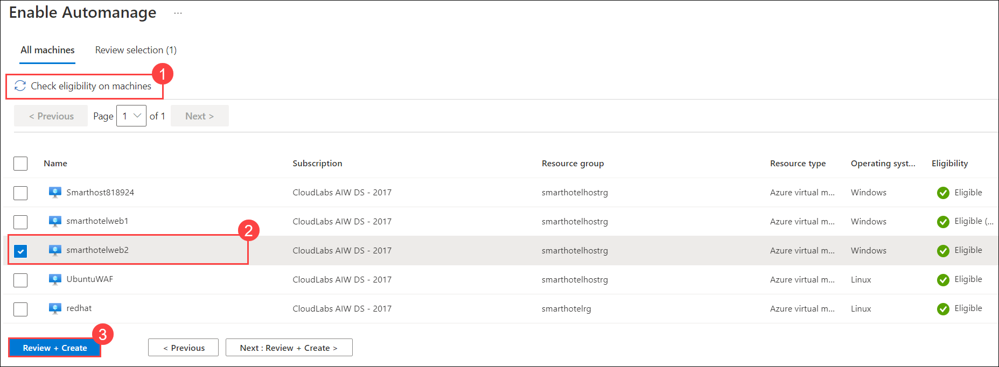

# Creating VM Scale sets from Azure VMs

### Task 1: Using VM Scale Sets to Drive Business Resiliency

1. If you are not logged in already, click on the Azure portal shortcut that is available on the desktop and log in with below Azure credentials.
    
    * Azure Username/Email: <inject key="AzureAdUserEmail"></inject> 
    
    * Azure Password: <inject key="AzureAdUserPassword"></inject>

2. In the Azure portal's navigation pane, select **Resource groups**.

3. From the Resource groups blade, select the **SmartHotelHostRG** resource group.

4. Select **smarthotelweb1** VM to create image.

2. On the page for the VM, on the upper menu, select **Capture**.
   
   

4. To create the image in a gallery, select **Yes, share it to a gallery as an image version** under **Instance details**.

   

5. In **Gallery details**, create a new gallery by selecting **Create new (1)** and enter **imagemigration<inject key="DeploymentID" enableCopy="false" /> (2)** and click **Ok (3)**.

   

6. In the Operating system state select **Specialized**.

7. Select an image definition and click **Create new (1)** and create a VM Image definition by providing the following details and then click **Ok (6)**: 
  
   - Image VM definition name: **imagedefinition<inject key="DeploymentID" enableCopy="false" /> (2)**

   - Publisher: **Microsoft (3)**
    
   - Offer: **windows (4)**
  
   - SKU: **migration (5)**

   

8. Enter an **image version** number. If this is the first version of this image, type **1.0.0**

9. Select **Review + create**.

10. After validation passes, select **Create** to create the image and wait for the image creation.

11. On the page for the image gallery, on the upper menu, select **+ Create VMSS**.

    

12. Under the Basics tab, enter the **Virtual Machine name scale set** name as **migrationscaleset<inject key="DeploymentID" enableCopy="false" />**

    

13. Select **Standard_D2s_v3** for the **size**.

14. Select the License type as **Window server**.

     

15. Select **Review + create** and then **Create**.

    <validation step="3435fc35-adbc-4789-885e-d2231cc767d4" />

 > **Congratulations** on completing the task! Now, it's time to validate it. Here are the steps:
    > - Navigate to the Lab Validation Page, from the upper right corner in the lab guide section.
    > - Hit the Validate button for the corresponding task. If you receive a success message, you can proceed to the next task. 
    > - If not, carefully read the error message and retry the step, following the instructions in the lab guide.
    > - If you need any assistance, please contact us at labs-support@spektrasystems.com. We are available 24/7 to help you out.

### Task 2: Azure auto manage

In this task, you will Enable Automanage on existing machines.

1. If you are not logged in already, click on the Azure portal shortcut that is available on the desktop and log in with below Azure credentials below.
    
    * Azure Username/Email: <inject key="AzureAdUserEmail"></inject> 
    
    * Azure Password: <inject key="AzureAdUserPassword"></inject>

2. In the search bar, search for and select **Automanage – Azure machine best practices**.

3. From the left side panel select **Automanage machines (1)** and click on **+Enable on existing VM (2)**.
   
   

4. Under **Configuration profile**, select your profile type: **Azure Best Practices - Production or Azure Best Practices - Dev/Test or Custom profile**.
   
   
   
   > Click **View best practice profiles** to see the differences between the environments.
    
   

5. On the **Select Machines** blade:

   a. Filter the list by your Subscription and Resource group and click on **Check eligibility on machines (1)**.
   
   b. **Check the checkbox of the virtual machine (2)** you want to onboard. (for example: let's enable automanage for smarthotelweb2.)
   
   c. Click the **Review + Create (3)** button.
   
   

6. Click **Create**.

  ## You Have successfully completed the Lab
