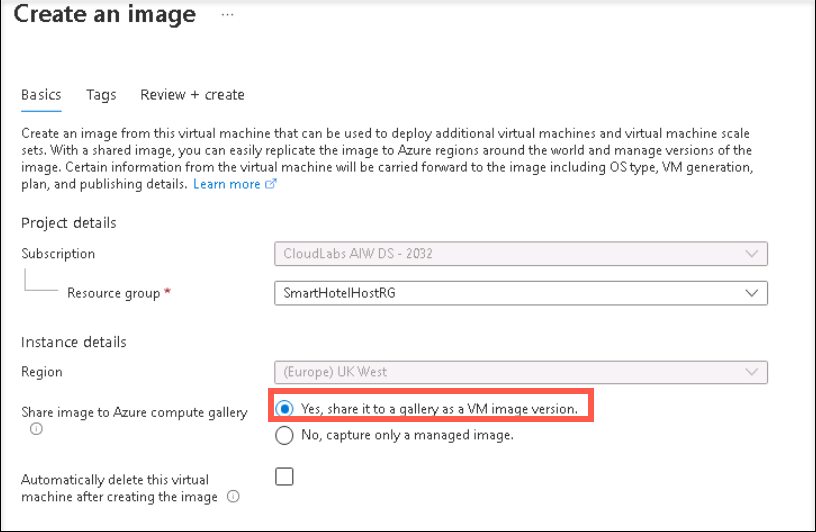

### HOL1: Exercise 4: Optimizing newly migrated workloads, and emphasizing commonalities across all stacks

#### Task 1: Using VM Scale Sets to drive business resiliency

1. If you are not logged in already, click on Azure portal shortcut that is available on the desktop and log in with below Azure credentials.
    * Azure Username/Email: <inject key="AzureAdUserEmail"></inject> 
    * Azure Password: <inject key="AzureAdUserPassword"></inject>

2. In the Azure portal's navigation pane, select **Resource groups**.

3. From the Resource groups blade, select the **SmartHotelHostRG** resource group.

4. Select **smarthotelweb1** VM to create image.

2. On the page for the VM, on the upper menu, select **Capture**.
   
   

4. To create the image in a gallery, select **Yes, share it to a gallery as an image version**.

   

5. Create a new gallery by selecting **Create new**.

   

6. In Operating system state select **Specialized**.

7. Select an image definition and **create new** and provide a name and information for a new Image definition.

   

8. Enter an **image version** number. If this is the first version of this image, type **1.0.0**.

9. select **Review + create**.

10. After validation passes, select **Create** to create the image.

11. On the page for the image gallery, on the upper menu, select **+VMSS**.

   

12. Enter the **Virtual Machine name scale set** name.

   

13. Select any **size**.

14. Select the License type as **Window server**.

   

15. select **Review + create**.

#### Task 2: Azure auto manage

In this task, you will Enable Automanage on existing machines.

1. If you are not logged in already, click on Azure portal shortcut that is available on the desktop and log in with below Azure credentials.
    * Azure Username/Email: <inject key="AzureAdUserEmail"></inject> 
    * Azure Password: <inject key="AzureAdUserPassword"></inject>

2. In the search bar, search for and select Automanage – Azure machine best practices.

3. Select the Enable on existing VM.
   
   

4. Under Configuration profile, select your profile type: Azure Best Practices - Production or Azure Best Practices - Dev/Test or Custom profile.
   
   
   
   > Click View best practice profiles to see the differences between the environments.

   a. Select an environment on the dropdown: Dev/Test for testing, Production for production.
   
   b. Click the OK button.
   
   

5. On the Select machines blade:

   a. Filter the list by your Subscription and Resource group.
   
   b. Check the checkbox of each virtual machine you want to onboard.
   
   c. Click the Select button.
   
   

6. Click the Enable button.

