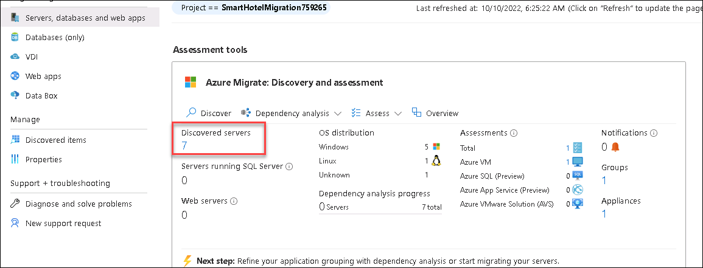

# HOL 2: Migrate and modernize Linux & OSS DB workloads to Azure

### Estimated time: 25 minutes

In this HOL, you will use Azure Migrate: Server Assessment to assess the on-premises environment. This will include selecting Azure Migrate tools, deploying the Azure Migrate appliance into the on-premises environment, creating a migration assessment, and using the Azure Migrate dependency visualization.

## Lab objectives

In this HOL, you will complete the following exercises:

- Exercise 1: Discovery, Assess, and Plan: Evaluate your current environment
- Exercise 2: Set up your environment on Azure to migrate servers
- Exercise 3: Migrating your apps and your data, leveraging Microsoft services and tools like Azure Migrate, the Azure Hybrid Benefit, and other tools and programs
- Exercise 4: Optimizing newly migrated workloads, and emphasizing commonalities across all stacks

### Exercise 1: Discovery, Assess, and Plan: Evaluate your current environment

In this exercise, you will review the already discovered server on your Azure Migrate project.

#### Task 1: Review the already discovered and Assessed environment in Azure migrate

In this task, you will review the environment discovered in Azure Migrate. After logging into the Azure portal, we'll go to All services and search for Azure Migrate. In the overview, you will see that seven servers have been discovered and we will focus on migrating and modernizing the Red Hat and Open Source Database (OSS DB) servers.

1. If you are not logged in already, click on the Azure portal shortcut that is available on the desktop and log in with below Azure credentials.
    * Azure Username/Email: <inject key="AzureAdUserEmail"></inject> 
    * Azure Password: <inject key="AzureAdUserPassword"></inject>

2. Click on **Show Portal Menu (1)** bar and select **All services (2)** in the portal's left navigation.
 
    

3. In the search bar, search for **Azure Migrate** and select it from the suggestions to open the Azure Migrate Overview blade, as shown below. 
 
    

4. Under **Azure Migrate: Discovery and assessment**, you'll see 7 discovered servers. We have already migrated 3 servers in the previous HOL and now we will be migrating and modernizing the Redhat and OSS DB in this HOL
 
    
 
#### Task 2: Review your on-prem Hyper-V Linux Server and OSS DB.

In this task you will review your on-premises Hyper-V Linux server and Open Source Database using Hyper-V Manager. Access the HOSTVMS option, select the Red Hat virtual machine, start it, connect it, and log in using the Administrator password. This sets the stage for migrating the server and OSS Database to Azure using Azure Migrate.
 
1. Go to **Start** button in the VM, search for **Hyper-V Manager** there and select it. 

   > You can also open the **Hyper-v manager** by clicking on the icon that is present in the taskbar. 

    
     
1. In Hyper-V Manager, select **HOSTVMS<inject key="DeploymentID" enableCopy="false" />**. You should now see the **redhat** VM and 6 other VMs that we are going to use in other HOLs.

    
     
1. In Hyper-V Manager, select the **redhat (1)**, then select **Start (2)** on the right if not already running.

    

1. In Hyper-V Manager, select the **redhat (1)**, then select **Connect (2)** on the right.

    

1. Log into the VM with the **Administrator password**: **<inject key="SmartHotel Admin Password" />** (the login screen may pick up your local keyboard mapping, use the 'eyeball' icon to check).

1. You should be able to log in to your on-prem Redhat server hosted on Hyper-V. 

    

1. In the next exercise you will be migrating the Redhat server, and the OSS Database hosted in the Redhat VM to the Azure with the help of Azure Migrate.  
    
### Task summary 

In this exercise, you explored how Assessments work to migrate your on-premises servers to Azure virtual machines. You learnt how to assess your on-premises servers Hyper-V environment, and physical servers for migration to Azure VMs.

Click on **Next** from the lower right corner to move on to the next page.
