## HOL2: Exercise 3: Migrating your applications and data using Microsoft services and tools, such as Azure Migrate, the Azure Hybrid Benefit, and additional programs

### Estimated time: 50 minutes

In this exercise you will review the registered Hyper-V host, LabVM, using Azure Site Recovery as the migration engine. The Azure Site Recovery Provider was deployed in a previous hands-on lab. Next, configure and enable replication of on-premises virtual machines from Hyper-V to Azure Migrate Server Migration service. Modify settings for replicated virtual machines to align with on-premises IP addresses. Finally, execute the migration of the Red Hat virtual machine to Azure for a seamless transition to the cloud environment.

## Lab objectives

In this exercise, you will complete the following tasks:

- Task 1: Register the Hyper-V Host with Migration and modernization
- Task 2: Enable Replication from Hyper-V to Azure Migrate
- Task 3: Configure Networking
- Task 4: Server migration

### Task 1: Register the Hyper-V Host with Migration and modernization

In this task, you will review the already registered Hyper-V host(LabVM) with the Migration and modernization service. This service uses Azure Site Recovery as the underlying migration engine. As part of the registration process, we have already deployed the Azure Site Recovery Provider on your Hyper-V host in HOL1 and we will be using the same here as well.

1. Return to the **Azure Migrate** blade in the Azure Portal, and select **Servers, databases and web apps** under **Migration goals** on the left. 

2. Under Migration and Modernization, you should be able to see 7 discovered servers. Now click on the **Discovered servers** to view all the servers that have been discovered with the help of Azure Migrate. 

    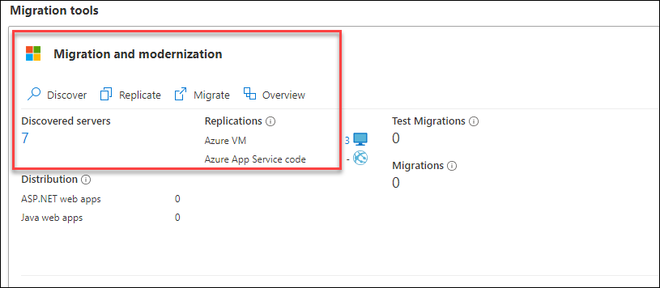

3. In the discovered list, you'll see the **redhat**, we will be replicating this redhat VM in the next task with the help of Azure Migrate.

    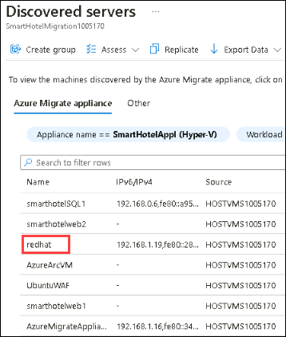

#### Task summary 

In this task, you get an overview of your registered Hyper-V host with the Azure Migrate Server Migration service.

### Task 2: Enable Replication from Hyper-V to Azure Migrate

In this task, you will configure and enable the replication of your on-premises virtual machine from Hyper-V to the Azure Migrate Server Migration service.

1. Return to the Azure Migrate | Servers, databases and web apps blade and under **Migration and modernization**, select **Replicate**. This opens the **Replicate** wizard.

    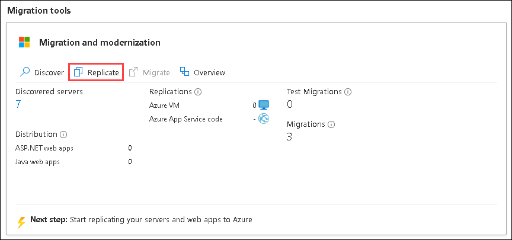
   
2. Under the **Specific Intent** page, provide the below details:

    -  What do you want to migrate? : Select **Servers or Virtual machines (VM)** **(1)**
    -  Where do you want to migrate to? : Select **Azure VM** **(2)**
    - Are your machines virtualized? : Select **Yes, with Hyper-V (3)**
    -  Click on **Continue (4)**

        .png)

4. In the **Virtual machines** tab, under **Import migration settings from an assessment**, select **Yes, apply migration settings from an Azure Migrate assessment (1)**. Select the **SmartHotel VMs (2)** VM group and the **SmartHotelAssessment (3)** migration assessment.

    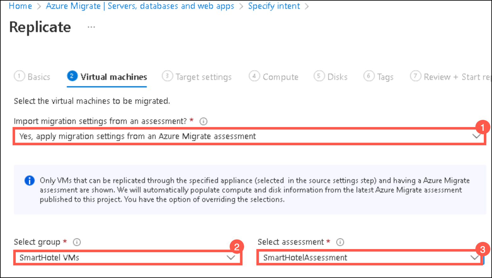

5. The **Virtual machines** tab should now show the virtual machines included in the assessment. Select the **redhat (1)** virtual machine, then select **Next (2)**.

    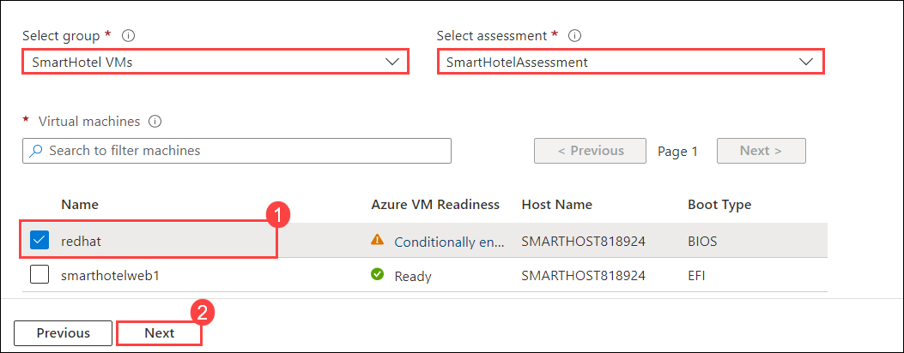

6. On the **Target settings** tab, select the below information,
   - Select your subscription and the existing **SmartHotelRG (1)** resource group. 
   - **Cache storage account**: Select the storage account that has been created in the previous HOL1 **(2)**.
   - **Virtual Network**: Select **SmartHotelVNet (3)**. 
   - **Subnet**: Select **SmartHotel (4)**. 
   - Select **Next (5)**.
 
        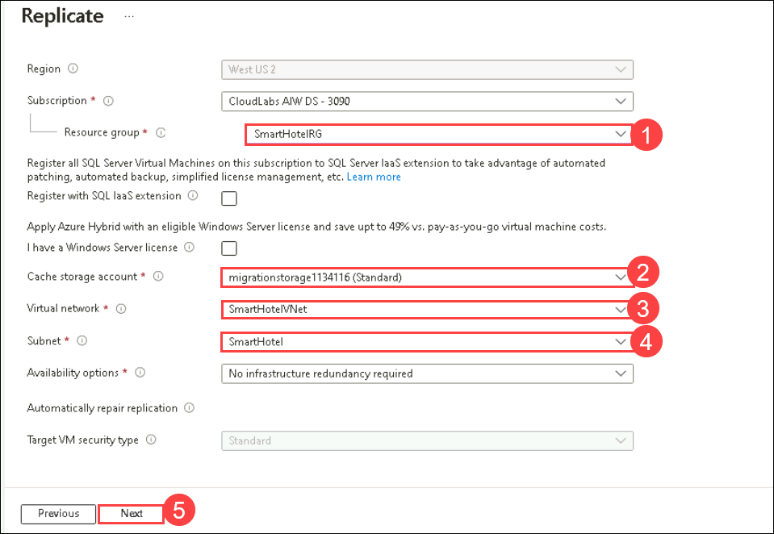

   > **Note:** For simplicity, in this lab you will not configure the migrated VM for high availability, since each application tier is implemented using a single VM.

7. On the **Compute** tab, select the below configuration,
   - Select the **Standard_F2s_v2** VM size for each virtual machine. 
   - Select the **Linux** operating system for the **redhat** virtual machine. 
   - Select **Next**

        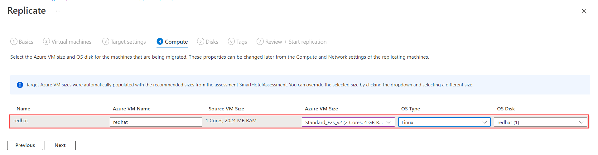
    
8. In the **Disks** tab, review the settings but do not make any changes. Select **Next: Tags**, then select **Replicate** to start the server replication.

9. In the **Azure Migrate - Servers, databases and web apps** blade, under **Migration and modernization**, select the **Overview** button.

    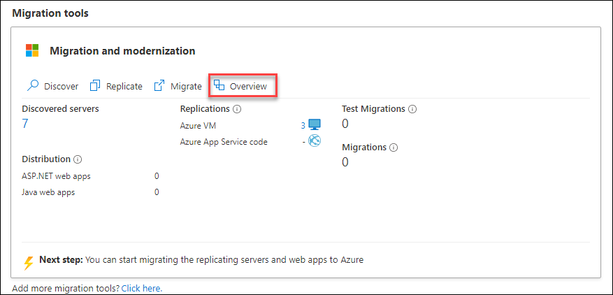
    
10. Confirm that the **1** machine is replicating.

    .png "Replication summary")

11. Select **Replications (1)** under **Migration** on the left. Select **Refresh (2)** occasionally and wait until the redhat machine has a **Protected (3)** status, which shows the initial replication is complete. This will take 5-10 minutes.

    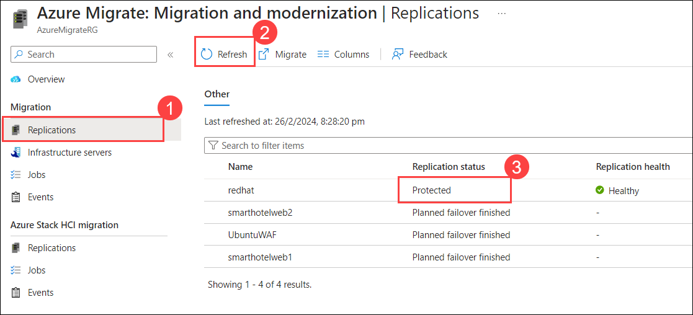

#### Task summary 

In this task, you enabled replication from the Hyper-V host to Azure Migrate and configured the replicated VM size in Azure.

### Task 3: Configure Networking

In this task, you will modify the settings for each replicated VM to use a static private IP address that matches the on-premises IP addresses for that machine.

1. Still using the **Migration and modernization - Replications** blade, select the **redhat** virtual machine. This opens a detailed migration and replication blade for this machine. Take a moment to study this information.

    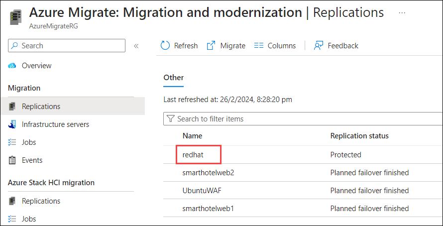

2. Select **Compute and Network (1)** under **General** on the left, then select **Edit (2)**.

    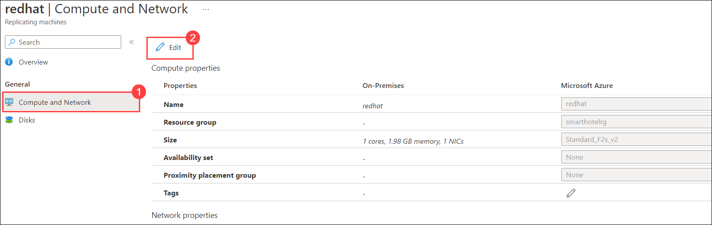

3. Confirm that the VM is configured to use the **F2s_v2** VM size.

4. Under **Network Interfaces**, select **AzureMigrateSwitch** to open the network interface settings.

    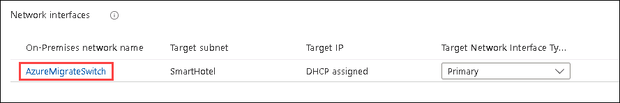

5. Change the **Private IP address** to **192.168.0.19**

    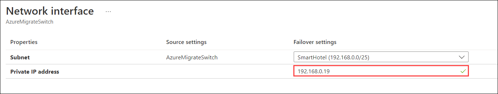

6. Select **OK** to close the network interface settings blade, then **Save** the **redhat** settings to configure the private IP address for the VM.

#### Task summary 

In this task, you modified the settings for each replicated VM to use a static private IP address that matches the on-premises IP addresses for that machine

> **Note**: Azure Migrate makes a "best guess" at the VM settings, but you have full control over the settings of migrated items. In this case, setting a static private IP address ensures the virtual machine in Azure retains the same IPs they had on-premises, which avoids having to reconfigure the VM during migration (for example, by editing web.config files).

### Task 4: Server migration

In this task, you will perform a migration of the Redhat virtual machine to Azure.

> **Note**: In a real-world scenario, you would perform a test migration before the final migration. To save time, you will skip the test migration in this lab. The test migration process is very similar to the final migration.

1. Return to the **Migration and modernization** overview blade. Under **Step 3: Migrate**, select **Migrate more servers**.

    .png "Replication summary")

1. On the **Specify Intent** blade, select **Azure VM (1)** for **Where do you want to migrate to?** and click on **Continue (2)**

    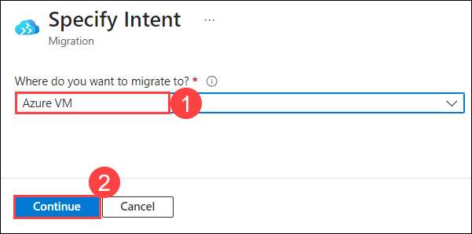

2. On the **Migrate** blade, select **yes (1)** for **Shutdown machines before migration to minimum data loss** and select the **redhat (2)** virtual machine then select **Migrate (3)** to start the migration process.

    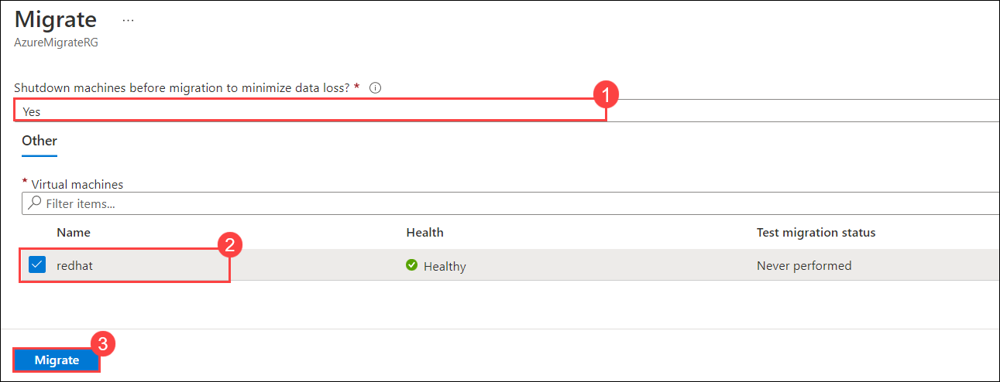

   > **Note**: You can optionally choose whether the on-premises virtual machine should be automatically shut down before migration to minimize data loss. Either setting will work for this lab.

3. The migration process will start.

    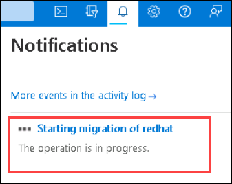

4. To monitor progress, select **Jobs (1)** under **Manage** on the left and review the status of the redhat **Planned failover (2)** job.

    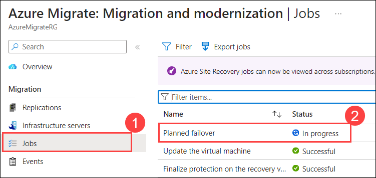

5. **Wait** until the **Planned failover** jobs show a **Status** of **Successful**. You should not need to refresh your browser. This could take up to 15 minutes.

    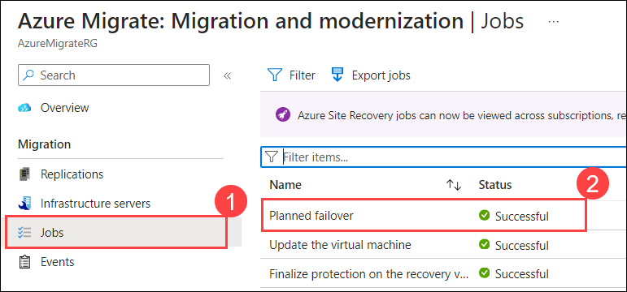

6. Navigate to the **SmartHotelRG** resource group and check that the VM, network interface, and disk resource have been created for the Redhat virtual machine being migrated.

    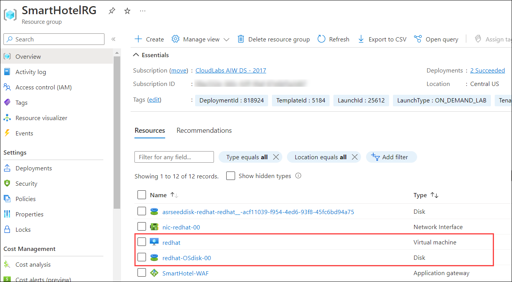

### Summary 

In this exercise, you reviewed the registered Hyper-V host, LabVM, with the Migration and Modernization Service, using Azure Site Recovery for migration. The Azure Site Recovery Provider was previously deployed on the Hyper-V host. You configured and enabled replication of the on-premises virtual machine to the Azure Migrate Server Migration service, adjusting settings for each replicated VM to use static private IP addresses matching their on-premises counterparts. Finally, you migrated the Red Hat virtual machine to Azure, ensuring a seamless transition to the cloud.

Click on **Next** from the lower right corner to move on to the next page.
