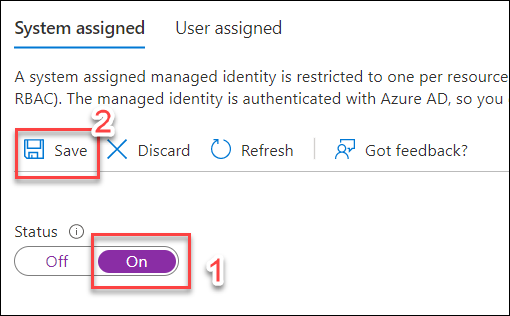
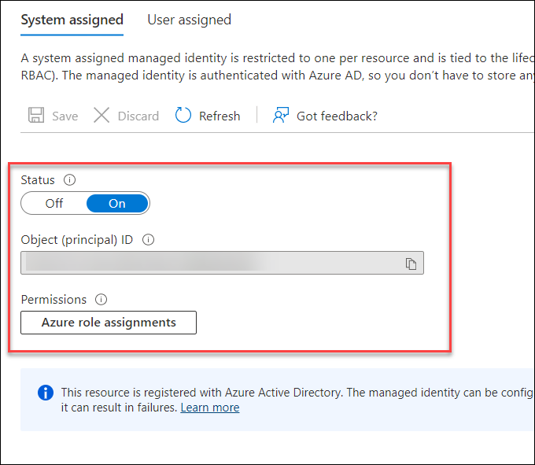
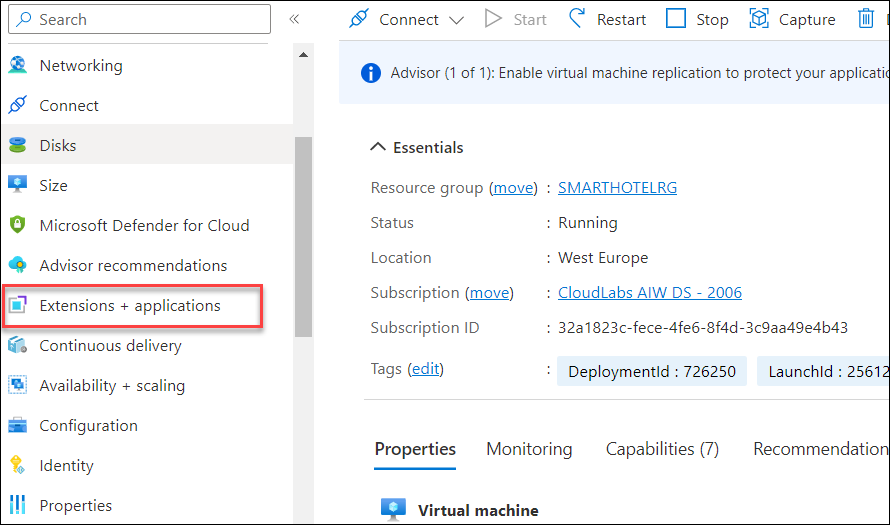
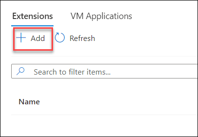
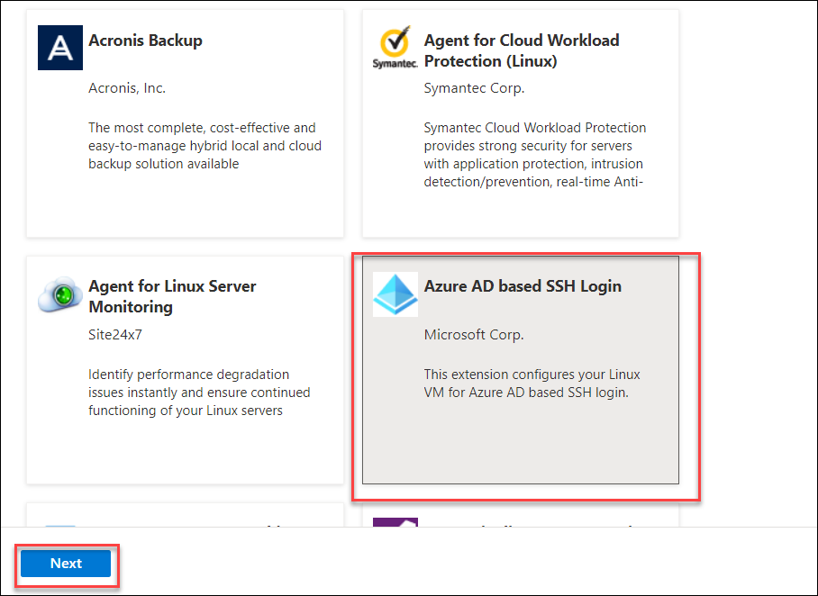
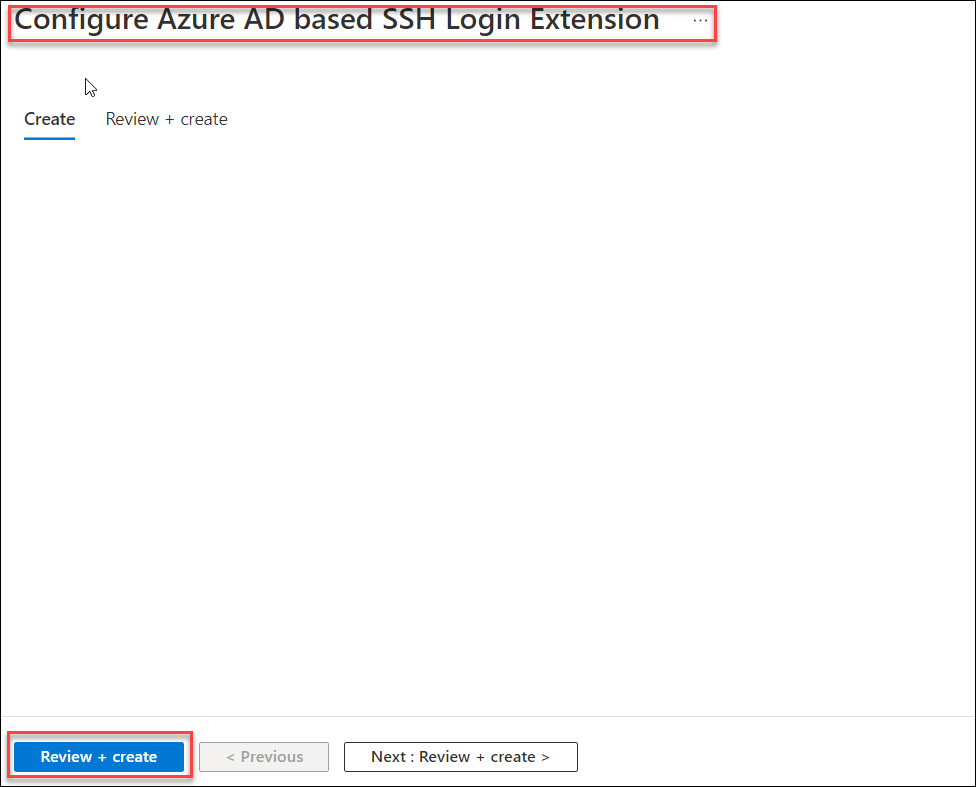
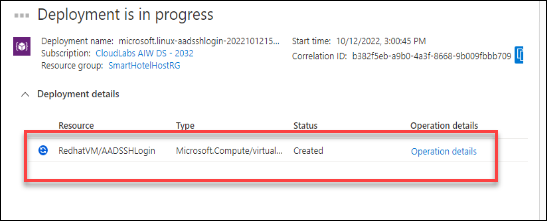
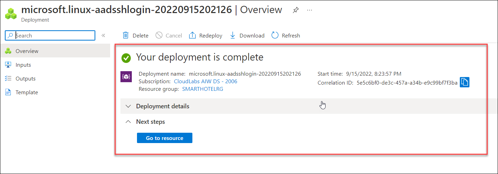
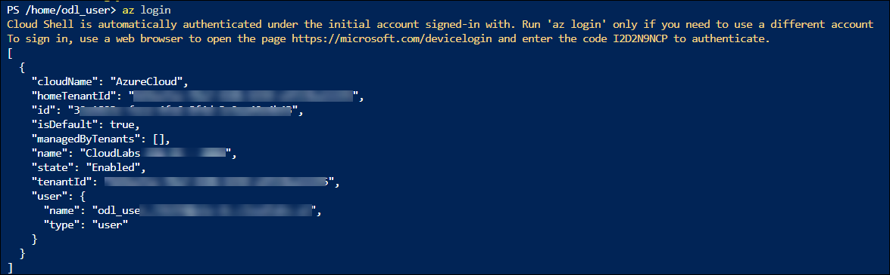
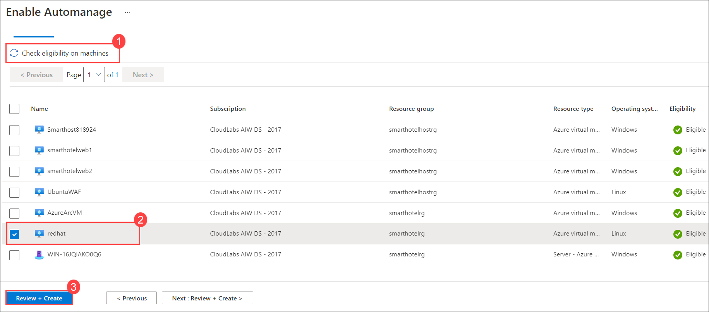

## HOL2: Exercise 4: Optimizing newly migrated workloads, and emphasizing commonalities across all stacks

#### Task 1: Getting started with Azure Active Directory for Linux 

In this task, you will be enabling the AAD authentication using a VM extension and enabling Managed identity. 

1. In the Azure portal `https://portal.azure.com`, Navigate to your newly migrated **redhat** VM and select it.
    
    
    
2. Now from the left side menu, select the **Identity**.

    

3. Under Identity, Under System assigned tab, Click on the **On (1)** button under Status tag and click on **Save (2)** button to turn on the identity. It will take some time to complete the process and there have some Service principal is getting created behind the process.

     > **Note**: If prompted with Enable system assigned managed identity pop-up, click on Yes.

      
      
      
4. Now, Navigate to **Extension + application** from the left side menu.
   
    

5. In the Extension page, click on **+Add** button to add an extension that will help you to connect to your machine using your AAD account.

    

6. Once you are on **Install an extension** page, search for **Azrure AD based SSH Login** extension and select it and click on **Next** button.

    

7. You will be redirected to the **Configure Azure AD based SSH Login extension** page, now click on **Review + create** and then **create** button. It should start the installation of the extension into your Red hat VM.

    
    
    

8. Once you have the extension installed, please move to the next task.

    

#### Task 2: Leveraging SSH to connect and authenticate Linux Servers on Azure 

To improve the security of Linux virtual machines in Azure, you can integrate with Azure Active Directory (Azure AD) authentication. You can now use Azure AD as a core authentication platform and a certificate authority to SSH into a Linux VM by using Azure AD and OpenSSH certificate-based authentication. This functionality allows organizations to manage access to VMs with Azure role-based access control (RBAC) and Conditional Access policies.

In this task we are using Azure CloudShell to configure a Linux VM and log in with Azure AD by using OpenSSH certificate-based authentication.

1. In the Azure portal `https://portal.azure.com`, select the Azure Cloud Shell icon from the top menu.

   

2. In the Cloud Shell window that opens at the bottom of your browser window, select **PowerShell**.

   

3. If prompted about not having a storage account mounted, click on **Show advanced settings**. Select Create new under Storage account and provide values as below: 
  
      - **Resource Group**: Select **Use existing** then select **SmartHotelRG**
      - **Storage account** : **storage<inject key="DeploymentID" enableCopy="false" />**
      - **File Share** : **blob**

   

4. After a moment, a message is displayed that you have successfully requested a Cloud Shell, and you are presented with a PS Azure prompt.

   
   
5. At the prompt, login to the azure by entering the following PowerShell command.

     ```
     az login
     ```
  
    > **Note:** Copy the login URL and enter the unique code in the browser. After that pick your account and click on **Continue** under Are you trying to sign in to Microsoft Azure CLI?
  
     
   
6. Run the following commands to connect to the VM by using the name and resource group of the VM:

      ```
      az ssh vm -n redhat -g SmartHotelRG
      ```
  

#### Task 3: Azure auto manage

In this task, you will Enable Automanage on existing machines.

1. If you are not logged in already, click on Azure portal shortcut that is available on the desktop and log in with below Azure credentials.
    * Azure Username/Email: <inject key="AzureAdUserEmail"></inject> 
    * Azure Password: <inject key="AzureAdUserPassword"></inject>

2. In the search bar, search for and select **Automanage – Azure machine best practices**.

3. Under **Automanage machines (1)**, select the **+Enable on existing VM (2)**.
   
   

4. Under **Configuration profile**, select your profile type: **Azure Best Practices - Production or Azure Best Practices - Dev/Test or Custom profile**.
   
   
   
   > **Note:** Click View best practice profiles to see the differences between the environments.
    
   

5. On the Select **machines blade**:

   a. Filter the list by your Subscription and Resource group and click on **Check eligibility on machines (2)**.
   
   b. Check the checkbox of **redhat (1)** virtual machine.
   
   c. Click the **Review+Create (3)** button.
   
   

6. Click on **Create**.

7. Once the Configuration profile assignment completed successfully, it will take around 20-30 minutes to get the Status as Conformant.
