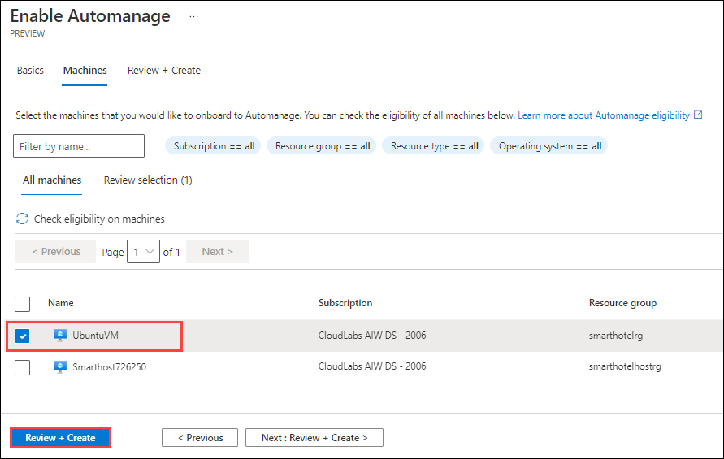

### Exercise 4: Optimizing newly migrated workloads, and emphasizing commonalities across all stacks

#### Task 1: Getting started with Azure Active Directory for Linux 

Microsoft Azure offers Active Directory Domain Services (Domain as a service) to help you provide domain join, group policy, LDAP and Kerberos/NTLM authentication services without the complexity of managing your own domain controller.

1. Search for domain services in the Azure portal and select **Azure AD Domain Services**.
   
   

2. Click on **create** and fill in the following details:

 * Resource group: **SmartHotelRG**
 * DNS domain name: **LOB-migration.in**
 * Region: Leave the default value
 * SKU: **Standard**

  

3. Click on **Next**, on the Networking pane leave all the values to default and click **Next**.

   

4. On the **Administration** tab leave all the values to default and click **Next**.

   

5. Make sure you have selceted **All** in the **Synchronization** tab and select **Next**.

   

6. Leave all other values to default and click on **Review + create**.

 - **Note**: the process of creating the ADDS takes some time, wait patiently until the process completes.

   

7. The following message should appear after the ADDS provisioning has completed.

8. Configure the hosts file to make sure the hostname is correctly configured for the management domain.

  ```
  sudo vi /etc/hosts
  ```
9. On the hosts file, add the server name and the domain as shown below:

  ```
  172.0.0.1 UbntuVM.LOB-migration.in UbuntuVM
  ```
10. Install the required packages by running the command in the following screenshot.

 - **Note**: When you are asked to provide the “Configuring Kerberos Authentication”, enter your domain (custom) in capitals.

   ```
   sudo apt-get update
   sudo apt-get install krb5-user samba sssd sssd-tools libnss-sss libpam-sss ntp ntpdate realmd adcli
   ```
11. Configure Network Time Protocol (NTP). In your experience with local domains, you know that time is a critical factor when it comes to authentication. To sync the time with the domain, add the domain NTP hostname to the  **/etc/ntp.conf** file and add `server LOB-migration.in`

   ```
   sudo vi /etc/ntp.conf
   ```
12. To ensure that the VM is synchronized with the managed domain, the following steps are necessary:

   ```
   sudo systemctl stop ntp
   sudo ntpdate LOB-migration.in
   sudo systemctl start ntp
   ```
13. Join VM to the managed domain. Start by discovering the managed domain name in ALL UPPERCASE.

   ```
   sudo realm discover LOB-MIGRATION.IN
   ```
 
#### Task 2: Leveraging SSH to connect and authenticate Linux Servers on Azure 

To improve the security of Linux virtual machines in Azure, you can integrate with Azure Active Directory (Azure AD) authentication. You can now use Azure AD as a core authentication platform and a certificate authority to SSH into a Linux VM by using Azure AD and OpenSSH certificate-based authentication. This functionality allows organizations to manage access to VMs with Azure role-based access control (RBAC) and Conditional Access policies.

In this task we are using Azure CloudShell to configure a Linux VM and log in with Azure AD by using OpenSSH certificate-based authentication.

1. In the Azure portal `https://portal.azure.com`, select the Azure Cloud Shell icon from the top menu.

   

2. In the Cloud Shell window that opens at the bottom of your browser window, select **PowerShell**.

   

3. If prompted about not having a storage account mounted, click on **Show advanced settings**. Select Create new under Storage account and provide values as below: 
  
      - **Resource Group**: Select **Use existing** then select **SmartHotelRG**
      - **Storage account** : **storage<inject key="Suffix" enableCopy="false"/>**
      - **File Share** : **blob**

   

4. After a moment, a message is displayed that you have successfully requested a Cloud Shell, and you are presented with a PS Azure prompt.

   
   
5. At the prompt, login to the azure by entering the following PowerShell command.

  ```
  Az login
  ```
  
 - **Note:** Copy the login URL and enter the unique code in the browser.
  
6. Run the following commands to connect to the VM by using the name and resource group of the VM:

  ```
  az ssh vm -n UbuntuVM -g SmartHotelRG
  ```
  

#### Task 3: Azure auto manage

In this task, you will Enable Automanage on existing machines.

1. If you are not logged in already, click on Azure portal shortcut that is available on the desktop and log in with below Azure credentials.
    * Azure Username/Email: <inject key="AzureAdUserEmail"></inject> 
    * Azure Password: <inject key="AzureAdUserPassword"></inject>

2. In the search bar, search for and select **Automanage – Azure machine best practice**s.

3. Under **Automanage machines**, select the **+Enable on existing VM**.
   
   

4. Under **Configuration profile**, select your profile type: **Azure Best Practices - Production or Azure Best Practices - Dev/Test or Custom profile**.
   
   
   
   > Click View best practice profiles to see the differences between the environments.
    
   

5. On the Select **machines blade**:

   a. Filter the list by your Subscription and Resource group.
   
   b. Check the checkbox of **UbuntuVM** virtual machine 
   
   c. Click the **Review+Create** button.
   
   

6. Click **Create**.

