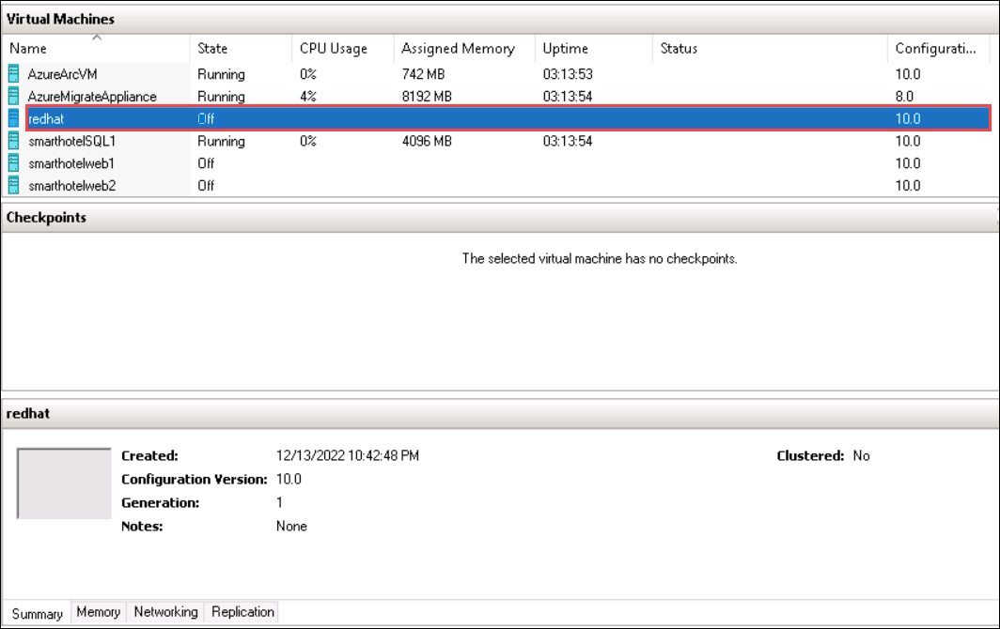
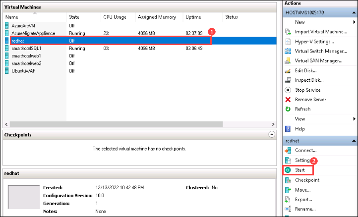
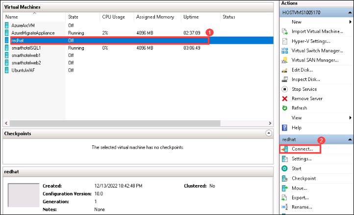
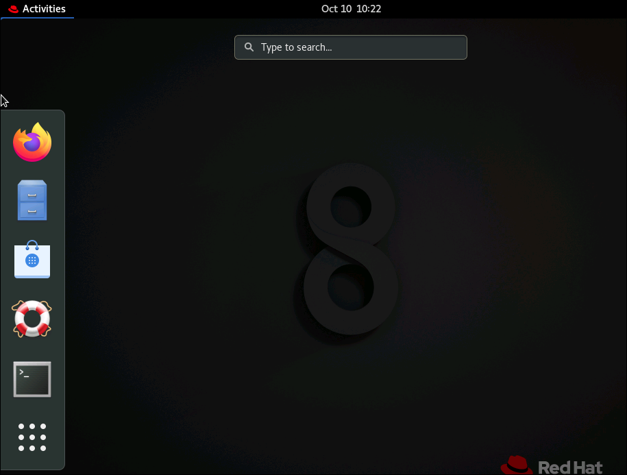
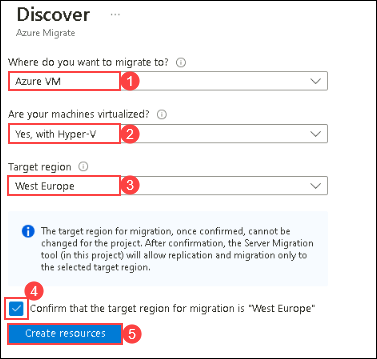
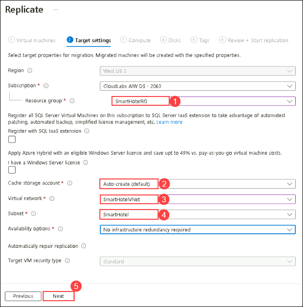
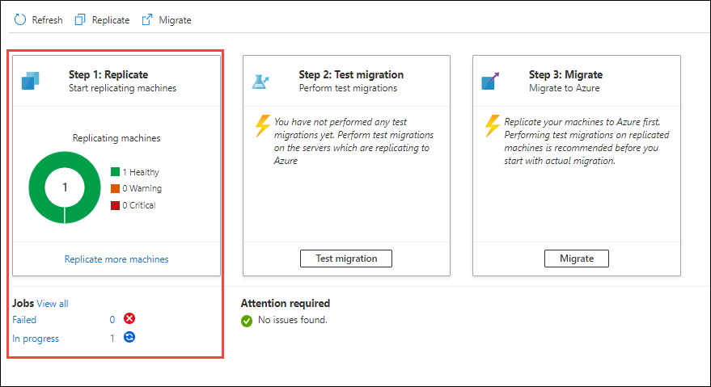

## Lab 01: Migrate Linux Servers from Hyper-V to Azure

#### Duration: 45 minutes

### Exercise 1: Migrating your apps and your data, leveraging Microsoft services and tools like Azure Migrate, the Azure Hybrid Benefit, and other tools and programs

### Task 1: Review your on-prem Hyper-V Linux Server and OSS DB
 
1. Go to **Start** button in the VM, search for **Hyper-V Manager** there and select it. 

    > You can also open the **Hyper-v manager** by clicking on the icon that is present in the taskbar. 

    
     
1. In Hyper-V Manager, select **HOSTVMS<inject key="DeploymentID" enableCopy="false" />**. You should now see the **redhat** VM and 6 other VMs that we are going to use in other HOLs.

    
     
1. In Hyper-V Manager, select the **redhat (1)**, then select **Start (2)** on the right if not already running.

    

1. In Hyper-V Manager, select the **redhat (1)**, then select **Connect (2)** on the right.

    

1. Log into the VM with the **Administrator password**: **<inject key="SmartHotel Admin Password" />** (the login screen may pick up your local keyboard mapping, use the 'eyeball' icon to check).

1. You should be able to log in to your on-prem Redhat server hosted on Hyper-V. 

    

1. In the next task you will be migrating the Redhat server, and the OSS Database hosted in the Red Hat VM to the Azure with the help of Azure Migrate.

### Task 2: Register the Hyper-V Host with Migration and modernization

In this task, you will register your Hyper-V host(LabVM) with the Migration and Modernization service. This service uses Azure Site Recovery as the underlying migration engine. As part of the registration process, you will deploy the Azure Site Recovery Provider on your Hyper-V host.

1. If you are not logged in already, click on the Azure portal shortcut that is available on the desktop and log in with below Azure credentials.
    
    * Azure Username/Email: <inject key="AzureAdUserEmail"></inject> 
    
    * Azure Password: <inject key="AzureAdUserPassword"></inject>

2. Click on **Show Portal Menu (1)** bar and select **All services (2)** in the portal's left navigation.
 
    

3. In the search bar, search for **Azure Migrate** and select it from the suggestions to open the Azure Migrate Overview blade, as shown below. 
 
    

1. Return to the **Azure Migrate | Servers, databases and web apps** blade in the Azure Portal, and select **Servers, databases and web apps (1)** under **Migration goals** on the left. Under **Migration Tools**, select **Discover (2)**.

   > **Note:** You may need to add the migration tool yourself by following the link below the **Migration Tools** section, selecting **Migration and modernization**, then selecting **Add tool(s)**.
   
     

2. In the **Discover** panel, provide the following details:

   - Under **Where do you want to migrate to?**, select **Azure VM (1)**

   - Under **Are your machines virtualized**, select **Yes, with Hyper-V (2)**.

   - Under **Target region (3)** make sure to select the **<inject key="Region"></inject>** region as same the Resource Group's region.

   - Check the **confirmation (4)** checkbox and select **Create resources (5)** to begin the deployment of the Azure Site Recovery resource used by Migration and modernization for Hyper-V migrations.

     

   Once deployment is complete, the 'Discover machines' panel should be updated with additional instructions.
  
4. Click on the **Download** link for the Hyper-V replication provider software installer to download the Azure Site Recovery provider installer.

     

5. Return to the **Discover** page in your browser select the blue **Download** button and download the registration key file.

     

6. Open the **AzureSiteRecoveryProvider.exe** installer you downloaded a moment ago. On the **Microsoft Update** tab, select **Off** and select **Next**. Accept the default installation location and select **Install**.

    > **Note:** If you are prompted with a pop-up like the latest version of the Provider is installed on this server. Would you like to proceed to registration? select **Yes**. (You can directly jump to the next step in that case.)
  
     

7. When the installation has completed select **Register**. Browse to the location of the key file you downloaded. When the key is loaded select **Next**.

     

8. Select **Connect directly to Azure Site Recovery without a proxy server (1)** and select **Next (2)**. The registration of the Hyper-V host with Azure Site Recovery will begin.

     

9. Wait for registration to complete (this may take several minutes). Then select **Finish**.

     

10. Return to the Azure Migrate browser window. **Refresh** your browser, then re-open the **Discover machines** panel by selecting **Discover** under **Migration and modernization** and selecting **Yes, with Hyper-V** for **Are your machines virtualized?**.

11. Select **Finalize registration**, which should now be enabled.

     

12. Azure Migrate will now complete the registration with the Hyper-V host. **Wait** for the registration to complete. This may take several minutes.

     

13. Once the registration is complete, close the **Discover machines** panel using **X** button.

     

14. The **Migration and Modernization** panel should now show 7 discovered servers.

     

#### Task summary 

In this task, you get an overview of your registered Hyper-V host with the Azure Migrate Server Migration service.

### Task 3: Enable Replication from Hyper-V to Azure Migrate

In this task, you will configure and enable the replication of your on-premises virtual machine from Hyper-V to the Azure Migrate Server Migration service.

1. Return to the Azure Migrate | Servers, databases and web apps blade and under **Migration and modernization**, select **Replicate**. This opens the **Replicate** wizard.

    
   
2. Under the **Specific Intent** page, provide the below details:

    -  What do you want to migrate? : Select **Servers or Virtual machines (VM)** **(1)**
    
    -  Where do you want to migrate to? : Select **Azure VM** **(2)**
    
    -  Are your machines virtualized? : Select **Yes, with Hyper-V (3)** from the drop-down. Click on **Continue (4)**

       

3. In the **Virtual machines** tab, under **Import migration settings from an assessment**, select **No, I'll specify the migration settings manually (1)** and The **Virtual machines** tab should now show the virtual machines included in the assessment. Select the **redhat (1)** virtual machine, then select **Next (2)**.

     .png "Replicate - Virtual machines")

5. On the **Target settings** tab, select the below information,

   - Select your subscription and the existing **SmartHotelRG (1)** resource group. 

   - **Cache storage account**: Select **Auto-create** **(2)**.

   - **Virtual Network**: Select **SmartHotelVNet (3)**. 

   - **Subnet**: Select **SmartHotel (4)**. 

   - Select **Next (5)**.
 
     

     >**Note:** For simplicity, in this lab you will not configure the migrated VM for high availability, since each application tier is implemented using a single VM.

7. On the **Compute** tab, select the below configuration,

   - Select the **Standard_F2s_v2** VM size for each virtual machine. 

   - Select the **Linux** operating system for the **redhat** virtual machine. 

   - Select **Next**. 

     
    
9. In the **Disks** tab, review the settings but do not make any changes. Select **Next: Tags**, then select **Replicate** to start the server replication.

10. In the **Azure Migrate - Servers, databases and web apps** blade, under **Migration and modernization**, select the **Overview** button.

    
    
11. Confirm that the 1 machine is replicating.

    

12. Select **Replication (1)** under **Manage** on the left. Select **Refresh (2)** occasionally and wait until the RedHat machine has a **Protected (3)** status, which shows the initial replication is complete. This will take 5-10 minutes.

    .png "Replication status")

#### Task summary 

In this task, you enabled replication from the Hyper-V host to Azure Migrate and configured the replicated VM size in Azure.

### Task 4: Configure Networking

In this task, you will modify the settings for each replicated VM to use a static private IP address that matches the on-premises IP addresses for that machine.

1. Still using the **Migration and modernization - Replication** blade, select the **redhat** virtual machine. This opens a detailed migration and replication blade for this machine. Take a moment to study this information.

    .png "Replicating machines")

2. Select **Compute and Network (1)** under **General** on the left, then select **Edit (2)**.

    

3. Confirm that the VM is configured to use the **F2s_v2** VM size.

4. Under **Network Interfaces**, select **AzureMigrateSwitch** to open the network interface settings.

    

5. Change the **Private IP address** to **192.168.0.19**

    

6. Select **OK** to close the network interface settings blade, then **Save** the **redhat** settings to configure the private IP address for the VM.

#### Task summary 

In this task, you modified the settings for each replicated VM to use a static private IP address that matches the on-premises IP addresses for that machine

> **Note**: Azure Migrate makes a "best guess" at the VM settings, but you have full control over the settings of migrated items. In this case, setting a static private IP address ensures the virtual machine in Azure retains the same IPs they had on-premises, which avoids having to reconfigure the VM during migration (for example, by editing web.config files).

### Task 5: Server migration

In this task, you will perform a migration of the Redhat virtual machine to Azure.

> **Note**: In a real-world scenario, you would perform a test migration before the final migration. To save time, you will skip the test migration in this lab. The test migration process is very similar to the final migration.

1. Return to the **Migration and modernization** overview blade. Under **Step 3: Migrate**, select **Migrate more servers**.

    .png "Replication summary")

1. Select **Azure VM** under **Where do you want to migrate to?** and select **Continue (2)**.

    .png "Migrate - VM selection")

2. On the **Migrate** blade, select **yes (1)** for **Shutdown machines before migration to minimum data loss** and select the **redhat (2)** virtual machine then select **Migrate (3)** to start the migration process.

    

   > **Note**: You can optionally choose whether the on-premises virtual machine should be automatically shut down before migration to minimize data loss. Either setting will work for this lab.

3. The migration process will start.

    

4. To monitor progress, select **Jobs (1)** under **Manage** on the left and review the status of the redhat **Planned failover (2)** job.

    .png "Migration jobs")

5. **Wait** until the **Planned failover** jobs show a **Status** of **Successful**. You should not need to refresh your browser. This could take up to 15 minutes.

    .png "Migration status")

6. Navigate to the **SmartHotelRG** resource group and check that the VM, network interface, and disk resource have been created for the virtual machine being migrated.

    

#### Task summary 

In this task, you used Azure Migrate to create Azure VM using the settings you have configured, and the data replicated from the Hyper-V machine. This migrated your on-premises VM to Azure.
