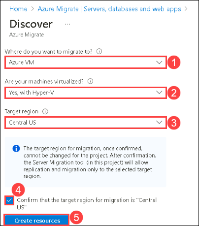
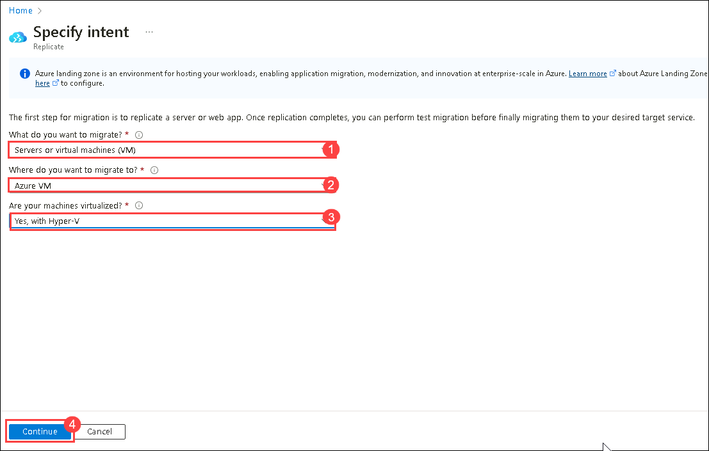
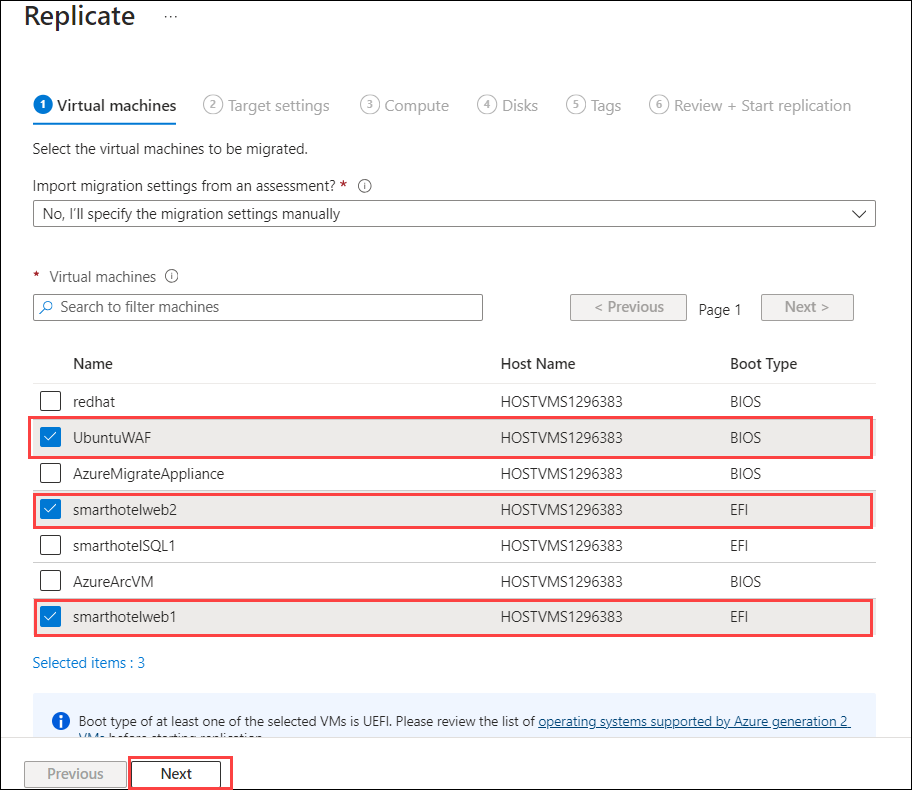
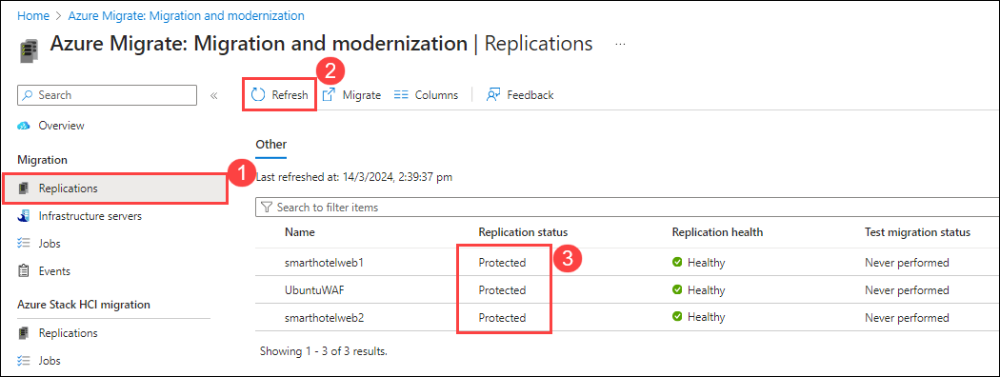
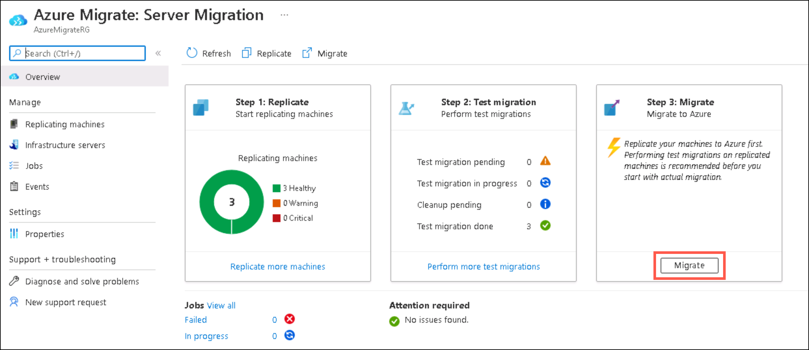
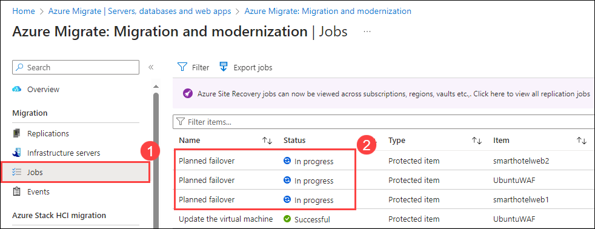

# Migrate Windows Servers from Hyper-V to Azure

## Migrating your apps and your data, leveraging Microsoft services and tools including Azure Migrate: Server Migration

In this Guided Lab, you will learn about Azure migration and how all pre-migration steps such as discovery, assessments, and right-sizing of on-premises resources are included for infrastructure, data, and applications. Azure Migrate provides a simplified migration, modernization, and optimization service for Azure.

### Task 1: Create a Storage Account

In this task, you will create a new Azure Storage Account that will be used by Migration and for storage of your virtual machine data during migration.

> **Note:** This lab focuses on the technical tools required for workload migration. In a real-world scenario, more consideration should go into the long-term plan prior to migrating assets. The landing zone required to host VMs should also include considerations for network traffic, access control, resource organization, and governance. For example, the CAF Migration Blueprint and CAF Foundation Blueprint can be used to deploy a pre-defined landing zone and demonstrate the potential of an Infrastructure as Code (IaC) approach to infrastructure resource management. For more information, see [Azure Landing Zones](https://docs.microsoft.com/azure/cloud-adoption-framework/ready/landing-zone/) and [Cloud Adoption Framework Azure Migration landing zone Blueprint sample](https://docs.microsoft.com/azure/governance/blueprints/samples/caf-migrate-landing-zone/).

1. In the Azure portal's left navigation, select **+ Create a resource**, then search for and select **Storage account**, followed by **Create**.

    

2. In the **Create storage account** blade, on the **Basics** tab, use the following values:

   - Subscription: **Select your Azure subscription (1)**.
  
   - Resource group: **AzureMigrateRG (2)**
  
   - Storage account name: **migrationstorage<inject key="DeploymentID" enableCopy="false" /> (3)**

   - Location: Select **<inject key="Region" enableCopy="false" /> (4)** from the dropdown.
    
   - Performance: **Standard (5)**
  
   - Redundancy: **Locally-redundant storage (LRS) (6)**

    

3. Select **Review**, then select **Create**.

4. Once the storage account is deployed, click on **Go to resource** to open it.

5. Select **Data protection** under **Data management** from the left-hand side menu of storage account.

   

6. Now, uncheck the box next to **Enable soft delete for blobs** and **Enable soft delete for containers** to disable the soft delete on blobs and containers as the soft delete enabled storage account is **not supported** for enabling replication on Virtual Machines. Click on **Save**.

   

#### Task summary 

In this task, you created a new Azure Storage Account that will be used for Migration and modernization.

### Task 2: Register the Hyper-V Host with Migration and modernization

In this task, you will register your Hyper-V host(LabVM) with the Migration and Modernization service. This service uses Azure Site Recovery as the underlying migration engine. As part of the registration process, you will deploy the Azure Site Recovery Provider on your Hyper-V host.

1. Return to the **Azure Migrate | Servers, databases and web apps** blade in the Azure Portal, and select **Servers, databases and web apps (1)** under **Migration goals** on the left. Under **Migration Tools**, select **Discover (2)**.

   **Note:** You may need to add the migration tool yourself by following the link below the **Migration Tools** section, selecting **Migration and modernization**, then selecting **Add tool(s)**.
   
     

2. In the **Discover** panel, provide the following details:

   - Under **Where do you want to migrate to?**, select **Azure VM (1)**

   - Under **Are your machines virtualized**, select **Yes, with Hyper-V (2)**.

   - Under **Target region (3)** make sure to select the **<inject key="Region"></inject>** region as same the Resource Group's region.

   - Check the **confirmation (4)** checkbox and select **Create resources (5)** to begin the deployment of the Azure Site Recovery resource used by Migration and modernization for Hyper-V migrations.

     

   Once deployment is complete, the 'Discover machines' panel should be updated with additional instructions.
  
4. Click on the **Download** link for the Hyper-V replication provider software installer to download the Azure Site Recovery provider installer.

     

5. Return to the **Discover** page in your browser select the blue **Download** button and download the registration key file.

     

6. Open the **AzureSiteRecoveryProvider.exe** installer you downloaded a moment ago. On the **Microsoft Update** tab, select **Off** and select **Next**. Accept the default installation location and select **Install**.

    > **Note:** If you are prompted with a pop-up like the latest version of the Provider is installed on this server. Would you like to proceed to registration? select **Yes**. (You can directly jump to the next step in that case.)
  
     

7. When the installation has completed select **Register**. Browse to the location of the key file you downloaded. When the key is loaded select **Next**.

     

8. Select **Connect directly to Azure Site Recovery without a proxy server (1)** and select **Next (2)**. The registration of the Hyper-V host with Azure Site Recovery will begin.

     

9. Wait for registration to complete (this may take several minutes). Then select **Finish**.

     

10. Return to the Azure Migrate browser window. **Refresh** your browser, then re-open the **Discover machines** panel by selecting **Discover** under **Migration and modernization** and selecting **Yes, with Hyper-V** for **Are your machines virtualized?**.

11. Select **Finalize registration**, which should now be enabled.

     

12. Azure Migrate will now complete the registration with the Hyper-V host. **Wait** for the registration to complete. This may take several minutes.

     

13. Once the registration is complete, close the **Discover machines** panel using **X** button.

     

14. The **Migration and Modernization** panel should now show 7 discovered servers.

     

#### Task summary 

In this task, you registered your Hyper-V host with the Azure Migrate Server Migration service.

### Task 3: Enable Replication from Hyper-V to Azure Migrate

In this task, you will configure and enable the replication of your on-premises virtual machines from Hyper-V to the Azure Migrate Server Migration service.

1. Under the **Migration and modernization**, select **Replicate**. This opens the **Replicate** wizard.

     
   
2. Under the **Specific Intent** page, provide the below details:

    -  What do you want to migrate? : Select **Servers or Virtual machines (VM)** **(1)**
    
    -  Where do you want to migrate to? : Select **Azure VM** **(2)**
    
    -  Are your machines virtualized? : Select **Yes, with Hyper-V (3)** from the drop-down. Click on **Continue (4)**

     

3. In the **Virtual machines** tab, under **Import migration settings from an assessment**, select **No, I'll specify the migration settings manually (1)**.

     

4. The **Virtual machines** Tab . Select the **UbuntuWAF**, **smarthotelweb1**, and **smarthotelweb2** virtual machines, then select **Next**.

     

5. On the **Target settings** tab, select the below information,

   - Select your subscription and the existing **SmartHotelHostRG (1)** resource group. 

   - **Replication storage account**: Enter the storage account here from the drop-down which you create in task 1 **(2)**. 

   - **Virtual Network**: Select **SmartHotelVNet (3)**. 

   - **Subnet**: Select **SmartHotel (4)**. 

   - Leave other values as default and select **Next (5)**.
   
     

   > **Note:** For simplicity, in this lab you will not configure the migrated VMs for high availability, since each application tier is implemented using a single VM.

7. On the **Compute** tab, select the below configuration,

   - Select the **Standard_F2s_v2** VM size for each virtual machine. 

   - Select the **Windows** operating system for the **smarthotelweb1**, **smarthotelweb2** virtual machines.

   - Select the **Linux** operating system for the **UbuntuWAF** virtual machine. 

   - Select **Next**. 

   
    

9. In the **Disks** tab, review the settings but do not make any changes. Select **Next: Tags**, then select **Replicate** to start the server replication.

10. In the **Azure Migrate - Servers, databases and web apps** blade, under **Migration and modernization**, select the **Overview** button.

     
    
11. Confirm that the 3 machines are replicating.

     

12. Select **Replications (1)** under **Migration** on the left.  Select **Refresh (2)** occasionally and wait until all three machines have a **Protected (3)** status, which shows the initial replication is complete. This will take 5-10 minutes.

     

#### Task summary 

In this task, you enabled replication from the Hyper-V host to Azure Migrate and configured the replicated VM size in Azure.

### Task 4: Configure Networking

In this task, you will modify the settings for each replicated VM to use a static private IP address that matches the on-premises IP addresses for that machine.

1. Still using the **Migration and modernization - Replicating** blade, select the **smarthotelweb1** virtual machine. This opens a detailed migration and replication blade for this machine. Take a moment to study this information.

    

2. Select **Compute and Network (1)** under **General** on the left, then select **Edit (2)**.

    

3. Confirm that the VM is configured to use the **F2s_v2** VM size.

4. Under **Network Interfaces**, select **InternalNATSwitch** to open the network interface settings.

    

5. Change the **Private IP address** to **192.168.0.4**

    

6. Select **OK** to close the network interface settings blade, then **Save** the **smarthotelweb1** settings.

7. Repeat these steps to configure the private IP address for the other VMs.
 
   - For **smarthotelweb2** use private IP address **192.168.0.5**
  
   - For **UbuntuWAF** use private IP address **192.168.0.8**

#### Task summary 

In this task, you modified the settings for each replicated VM to use a static private IP address that matches the on-premises IP addresses for that machine

> **Note**: Azure Migrate makes a "best guess" at the VM settings, but you have full control over the settings of migrated items. In this case, setting a static private IP address ensures the virtual machines in Azure retain the same IPs they had on-premises, which avoids having to reconfigure the VMs during migration (for example, by editing web.config files).

### Task 5: Server migration

In this task, you will perform a migration of the UbuntuWAF, smarthotelweb1, and smarthotelweb2 machines to Azure.

> **Note**: In a real-world scenario, you would perform a test migration before the final migration. To save time, you will skip the test migration in this lab. The test migration process is very similar to the final migration.

1. Return to the **Migration and modernization** overview blade. Under **Step 3: Migrate**, select **Migrate**.

    

2. On the **Specify intent** tab, Select **Azure VM** under Where do you want to migrate to? and select **Continue**.

    .png "Replication summary")

3. On the **Migrate** blade, select **yes (1)** for **Shutdown machines before migration to minimum data loss** and select the 3 virtual machines **(2)** then select **Migrate (3)** to start the migration process.

    

   > **Note**: You can optionally choose whether the on-premises virtual machines should be automatically shut down before migration to minimize data loss. Either setting will work for this lab.

4. The migration process will start.

    

5. To monitor progress, select **Jobs (1)** under **Migration** on the left and review the status of the three **Planned failover (2)** jobs.

    

6. **Wait** until all three **Planned failover** jobs show a **Status** of **Successful**. You should not need to refresh your browser. This could take up to 15 minutes.

    

7. Navigate to the **SmartHotelHostRG** resource group and check that the VM, network interface, and disk resources have been created for each of the virtual machines being migrated.

    

### Proceed to next 
