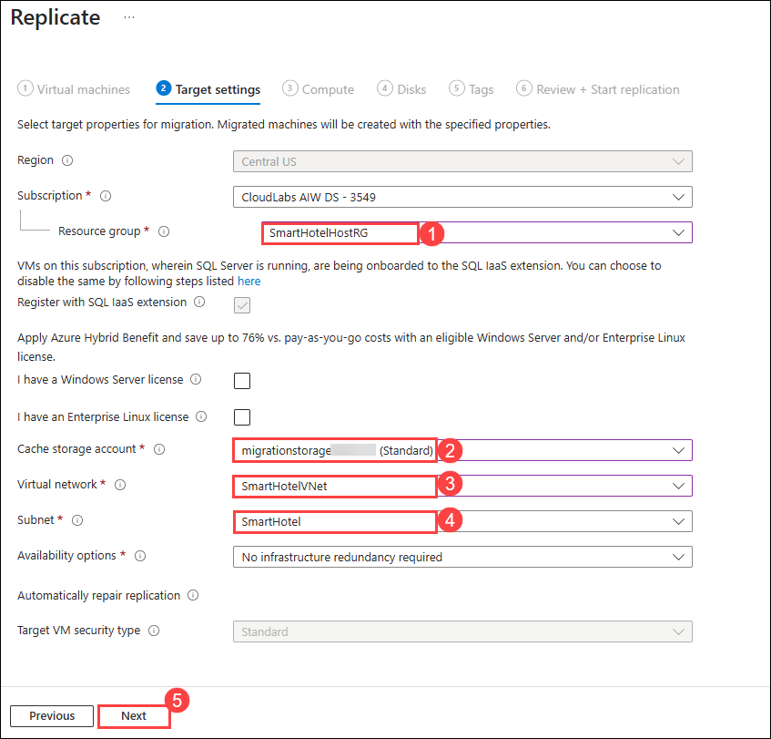

# Lab 01: Migrate Windows Servers from Hyper-V to Azure

Duration: 4 Hours

## Exercise 1: Migrating your apps and your data, leveraging Microsoft services and tools, including Azure Migrate: Server Migration

In this Guided Lab, you will learn about Azure migration and how all pre-migration steps, such as discovery, assessments, and right-sizing of on-premises resources, are included for infrastructure, data, and applications. Azure Migrate provides a simplified migration, modernization, and optimization service for Azure.

### Task 1: Create a Storage Account

In this task, you will create a new Azure Storage Account that will be used by Migration and for the storage of your virtual machine data during migration.

> **Note:** This lab focuses on the technical tools required for workload migration. In a real-world scenario, more consideration should go into the long-term plan prior to migrating assets. The landing zone required to host VMs should also include considerations for network traffic, access control, resource organization, and governance. For example, the CAF Migration Blueprint and CAF Foundation Blueprint can be used to deploy a pre-defined landing zone and demonstrate the potential of an Infrastructure as Code (IaC) approach to infrastructure resource management. For more information, see [Azure Landing Zones](https://docs.microsoft.com/azure/cloud-adoption-framework/ready/landing-zone/) and [Cloud Adoption Framework Azure Migration landing zone Blueprint sample](https://docs.microsoft.com/azure/governance/blueprints/samples/caf-migrate-landing-zone/).

1. In the Azure portal's left navigation, select **+ Create a resource**, then search for and select **Storage account**, followed by **Create**.

    .png)

2. In the **Create storage account** blade, on the **Basics** tab, enter or select the following values and click on **Review + create (7)**.

   - Subscription: **Select your Azure subscription (1)**.
  
   - Resource group: **AzureMigrateRG (2)**
  
   - Storage account name: **migrationstorage<inject key="DeploymentID" enableCopy="false" /> (3)**

   - Location: Select **<inject key="Region" enableCopy="false" /> (4)** from the dropdown.
    
   - Performance: **Standard (5)**
  
   - Redundancy: **Locally-redundant storage (LRS) (6)**

     .png)

3. Review the configuration, then select **Create**.

    .png)

4. Once the storage account is deployed, click on **Go to resource** to open it.

5. Go to the **Data management (1)** section and select **Data protection (1)**. To meet the requirement for enabling replication on Virtual Machines (which does **not** support soft delete-enabled storage accounts), uncheck the boxes for **Enable soft delete for blobs (2)** and **Enable soft delete for containers (2)**. Once done, click **Save (3)** to apply the changes.

   .png)

1. Navigate to the **Data management** section and select **Object replication (1)**. Click on **Advanced settings (2)**, then check the box labelled **Allow cross-tenant replication (3)**. Finally, click **OK (4)** to confirm your changes.

    .png)

#### Task summary 

In this task, you created a new Azure Storage Account that will be used for Migration and modernization.

### Task 2: Register the Hyper-V Host with Migration and modernization

In this task, you will register your Hyper-V host(LabVM) with the Migration and Modernization service. This service uses Azure Site Recovery as the underlying migration engine. As part of the registration process, you will deploy the Azure Site Recovery Provider on your Hyper-V host.

1. Click on **Show Portal Menu (1)** bar and select **All services (2)** in the portal's left navigation.
 
    

3. In the search bar, search for **Azure Migrate** and select it from the suggestions to open the Azure Migrate Overview blade, as shown below. 
 
    

1. Select **Servers, databases and web apps (1)** under **Migration goals** on the left. Under **Migration Tools**, select **Discover (2)**.

   > **Note:** You may need to add the migration tool yourself by following the link below the **Migration Tools** section, selecting **Migration and modernization**, then selecting **Add tool(s)**.
   
     .png)

1. In the **Discover** panel, provide the following details:

   - Under **Where do you want to migrate to?**, select **Azure VM (1)**

   - Under **Are your machines virtualized**, select **Yes, with Hyper-V (2)**.

   - Under **Target region (3)** make sure to select the **<inject key="Region" enableCopy="false" />** region.

   - Check the **Confirmation (4)** checkbox and select **Create resources (5)** to begin the deployment of the Azure Site Recovery resource used by Migration and modernization for Hyper-V migrations.

     .png)

     > **Note:** Once deployment is complete, the 'Discover machines' panel should be updated with additional instructions.
  
1. Click on the **Download** link for the Hyper-V replication provider software installer to download the Azure Site Recovery provider installer.

     .png)

1. Return to the **Discover** page in your browser, select the blue **Download** button and download the registration key file.

     

1. Open the **AzureSiteRecoveryProvider.exe** installer you downloaded a moment ago. On the **Microsoft Update** tab, select **Off** and select **Next**. Accept the default installation location and select **Install**.

    > **Note:** If you are prompted with a pop-up, like the latest version of the Provider is installed on this server. Would you like to proceed to registration? select **Yes**. (You can directly jump to the next step in that case.)
  
     

1. When the installation has completed, select **Register**. Browse to the location of the key file you downloaded. When the key is loaded, select **Next**.

     

1. Select **Connect directly to Azure Site Recovery without a proxy server (1)** and select **Next (2)**. The registration of the Hyper-V host with Azure Site Recovery will begin.

     

1. Wait for registration to complete (this may take several minutes). Then select **Finish**.

     

1. Return to the Azure Migrate browser window. **Refresh** your browser, then re-open the **Discover machines** panel by selecting **Discover** under **Migration and modernization**. Perform the following steps:

   - **Where do you want to migrate to?:** Select **Azure Vm (1)**

   - **Are your machines virtualized?:** Select **Yes, with Hyper-V (2)**.

   - Finally, click on **Finalize Registration (3)**, which should now be enabled. 

     .png)

1. Azure Migrate will now complete the registration with the Hyper-V host. **Wait** for the registration to complete. This may take several minutes.

     

1. Once the registration is complete, close the **Discover machines** panel using **X** button.

     

1. The **Migration and modernization** panel should now show 7 discovered servers.

     .png)

    > **Congratulations** on completing the task! Now, it's time to validate it. Here are the steps:
    > - Click on the validate button.
    > - If you receive a success message, congratulations — the lab has been completed successfully!
    > - If you receive an error message, review it carefully and retry the step by following the lab guide instructions.
    > - If you need any assistance, please contact us at labs-support@spektrasystems.com. We are available 24/7 to help you out.
    
    <validation step="a6405ea6-b97d-4e45-8cf8-c8997009392d" />
   

#### Task summary 

In this task, you registered your Hyper-V host with the Azure Migrate Server Migration service.

### Task 3: Enable Replication from Hyper-V to Azure Migrate

In this task, you will configure and enable the replication of your on-premises virtual machines from Hyper-V to the Azure Migrate Server Migration service.

1. Under the **Migration and modernization**, select **Replicate**. This opens the **Replicate** wizard.

     
   
2. Under the **Specific intent** page, provide the following details:

    -  What do you want to migrate? : Select **Servers or Virtual machines (VM)** **(1)**
    
    -  Where do you want to migrate to? : Select **Azure VM** **(2)**
  
    -  Are your machines virtualized? : Select **Yes, with Hyper-V (3)**
    
    -  Click on **Continue (4)**

       .png)

       >**Note:** If you get any error kindly refresh the screen periodically or Please try signing in to the Azure portal using incognito mode.

1. In the **Virtual machines** tab, under **Import migration settings from an assessment**, select **No, I'll specify the migration settings manually**.

     .png)

1. The **Virtual machines** Tab. Select the **smarthotelweb1**, and **smarthotelweb2** virtual machines, then select **Next**.

     .png "Replicate - Virtual machines")

1. On the **Target settings** tab, select the following information:

    - Select your subscription and the existing **SmartHotelHostRG (1)** resource group. 

    - **Cache storage account:** Enter the storage account here from the drop-down which you create in task 1 **(2)**. 

    - **Virtual Network:** Select **SmartHotelVNet (3)**. 

    - **Subnet:** Select **SmartHotel (4)**. 

    - Leave other values as default and select **Next (5)**.
   
      

      > **Note:** For simplicity, in this lab, you will not configure the migrated VMs for high availability, since each application tier is implemented using a single VM.

1. On the **Compute** tab, select the configuration below:

    - Select **Standard** as the **VM Security Type**.

    - Select the **Standard_F2s_v2** VM size for each virtual machine. 

    - Select the OS Type as **Windows** operating system for the **smarthotelweb1**, **smarthotelweb2** virtual machines.

    - Select **Next**. 

      .png)
    
1. In the **Disks** tab, review the configuration settings without making any changes. Click **Next: Tags**, and then select **Replicate** to begin the server replication process.

    .png)

1. In the **Azure Migrate - Servers, databases and web apps** blade, under **Migration and modernization**, select the **Overview** button.

     
    
1. Confirm that the 2 machines are replicating.

     .png)

1. Select **Replications (1)** under **Migration** on the left.  Select **Refresh (2)** occasionally and wait until all three machines have a **Protected (3)** status, which shows the initial replication is complete. This will take 5-10 minutes.

     .png "Replication status")

   > **Note:** Please make sure you run the **validation steps** for this task before moving to the next tasks as there are a few dependencies. **Not** running the validation after performing this task will result in **validation failure** as the status of the Virtual Machine will be changed from **Protected** to **Planned failover** when you migrate the servers in Task 5.

    > **Congratulations** on completing the task! Now, it's time to validate it. Here are the steps:
    > - Click on the validate button.
    > - If you receive a success message, congratulations — the lab has been completed successfully!
    > - If you receive an error message, review it carefully and retry the step by following the lab guide instructions.
    > - If you need any assistance, please contact us at labs-support@spektrasystems.com. We are available 24/7 to help you out.
    
    <validation step="216eebdd-a59b-4f61-a316-af714d0c342e" />

#### Task summary 

In this task, you enabled replication from the Hyper-V host to Azure Migrate and configured the replicated VM size in Azure.

### Task 4: Server migration

In this task, you will perform a migration of the UbuntuWAF, smarthotelweb1, and smarthotelweb2 machines to Azure.

> **Note:** In a real-world scenario, you would perform a test migration before the final migration. To save time, you will skip the test migration in this lab. The test migration process is very similar to the final migration.

1. Return to the **Migration and modernization** overview blade. Under **Step 3: Migrate**, select **Migrate**.

   .png)

1. On the **Specify intent** tab, Select **Azure VM** under Where do you want to migrate to? and select **Continue**.

    .png "Replication summary")

3. On the **Migrate** blade, select the 2 virtual machines **(1)** then select **Migrate (2)** to start the migration process.

    .png)

   > **Note:** You can optionally choose whether the on-premises virtual machines should be automatically shut down before migration to minimize data loss. Either setting will work for this lab.

4. The migration process will start.

    .png "Migration started notifications")

5. To monitor progress, select **Jobs (1)** under **Migration** on the left and review the status of the two **Planned failover (2)** jobs.

    .png "Migration jobs")

6. **Wait** until all two **Planned failover** jobs show **Status** to **Successful**. You should not need to refresh your browser. This could take up to 15 minutes.

    .png "Migration status")

7. Navigate to the **SmartHotelHostRG** resource group and check that the VM, network interface, and disk resources have been created for each of the virtual machines being migrated.

    .png "Migrated resources")

    > **Congratulations** on completing the task! Now, it's time to validate it. Here are the steps:
    > - Click on the validate button.
    > - If you receive a success message, congratulations — the lab has been completed successfully!
    > - If you receive an error message, review it carefully and retry the step by following the lab guide instructions.
    > - If you need any assistance, please contact us at labs-support@spektrasystems.com. We are available 24/7 to help you out.
    
    <validation step="e9fd6a73-9493-4184-b9c0-7bd0a4d4fce2" />

### Task 5: Pointers around Azure Networking and Azure Network Security (Read only)

Design and implementation of Azure networking is one of the most critical steps in migrating your infrastructure as a service (IaaS) and platform as a service (PaaS) implementations in Azure.

#### Azure Networking Best Practices:

- Assign an address space that is not larger than a CIDR range of /16 for each virtual network. Virtual networks allow for the use of 65,536 IP addresses. Assigning a smaller prefix than /16, such as a /15, which has 131,072 addresses, will result in the excess IP addresses becoming unusable elsewhere. It is important not to waste IP addresses, even if they're in the private ranges defined by RFC 1918.

- The hub is an Azure virtual network that acts as a central point of connectivity. The spokes are virtual networks that connect to the hub virtual network by using peering. Shared services are deployed in the hub, while individual workloads are deployed as spokes.

- To provide isolation within a virtual network, you segment it into one or more subnets and give a portion of the virtual network's address space to each subnet.

- Azure adds a DNS server by default when you deploy a virtual network. You can use this server to rapidly build virtual networks and deploy resources.

- DNS servers in a virtual network can forward DNS queries to the recursive resolvers in Azure. This forwarding enables you to resolve host names within that virtual network.

- DNS forwarding allows VMs to see both your on-premises resources (via the domain controller) and Azure-provided host names (using the forwarder). You can access the recursive resolvers in Azure by using the virtual IP address 168.63.129.16.

- DNS forwarding also enables DNS resolution between virtual networks and allows on-premises machines to resolve host names provided by Azure.

- A VPN gateway is a specific type of virtual network gateway. It sends encrypted traffic between an Azure virtual network and an on-premises location over the public internet.

- A VPN gateway can also send encrypted traffic between virtual networks in Azure over the Microsoft network. Each virtual network can have only one VPN gateway.

#### Azure Network Security Best Practices:

- Azure Site Recovery enables disaster recovery and migration to Azure for on-premises Hyper-V virtual machines, VMware virtual machines, and physical servers. For all on-premises to Azure scenarios, replication data is sent to and stored in an Azure Storage account.

- Once VMs have been created after failover to Azure, NSGs can be used to limit network traffic to the virtual network and VMs. Site Recovery does not create NSGs as part of the failover operation.

- We can create the required Azure NSGs before initiating failover. You can then associate NSGs to failed over VMs automatically during failover, using automation scripts with Site Recovery's powerful recovery plans.

- Once the NSGs are created and configured, we can run a test failover to verify scripted NSG associations and post-failover VM connectivity.

### Task 6:  Migrating VMware VMs to Azure (Read only)

Azure Migrate is a free tool from Microsoft that allows VMware administrators to replicate their VMs from on-prem to Azure. It is an extremely powerful tool that even allows for pre-migration tests to run.

Azure Migrate has two migration options:

- Migration with an agent for replication requires an agent to be installed on each VM that is to be migrated.

- Migration using agentless replication requires an agentless format, which requires no agent.

**Discovery/Assessment:**

 Discover up to 10,000 VMware VMs with a single Azure Migrate appliance for VMware. The appliance supports adding multiple vCenter Servers. You can add up to 10 vCenter Servers per appliance.
 
#### Agentless migration: 

- Agentless migration uses the Azure Migrate appliance. You can deploy the appliance as a VMware VM using an OVA template, imported into the vCenter Server, or using a PowerShell script.

- You can simultaneously replicate a maximum of 500 VMs across multiple vCenter Servers (discovered from one appliance) using a scale-out appliance.

- If you are interested in learning more about Agentless migration, you can [read more here](https://docs.microsoft.com/en-us/azure/migrate/tutorial-migrate-vmware).

#### Agent-based migration: 

- Agent-based migration does not use the Azure Migrate appliance. If you've set up an appliance for assessment, you can leave it in place or remove it if you're done with assessment.

- You can scale out the replication appliance to replicate large numbers of VMs.

- If you are interested in learning more about Agent-based migration, you can [read more here](https://docs.microsoft.com/en-us/azure/migrate/tutorial-migrate-vmware-agent).

In the portal, you can select up to 10 machines at once for replication. To replicate more machines, add in batches of 10.

### Summary 

In this lab, you learned how to migrate Windows Servers from Hyper-V to Azure using Azure Migrate: Server Migration. You created a storage account for migration data, registered your Hyper-V host with Azure Migrate, and configured replication for virtual machines. You set up networking with static IPs for replicated VMs, performed a migration, and reviewed network and security best practices. The lab provided essential knowledge on discovery, replication, and migration to Azure.

### You have successfully completed the lab.
